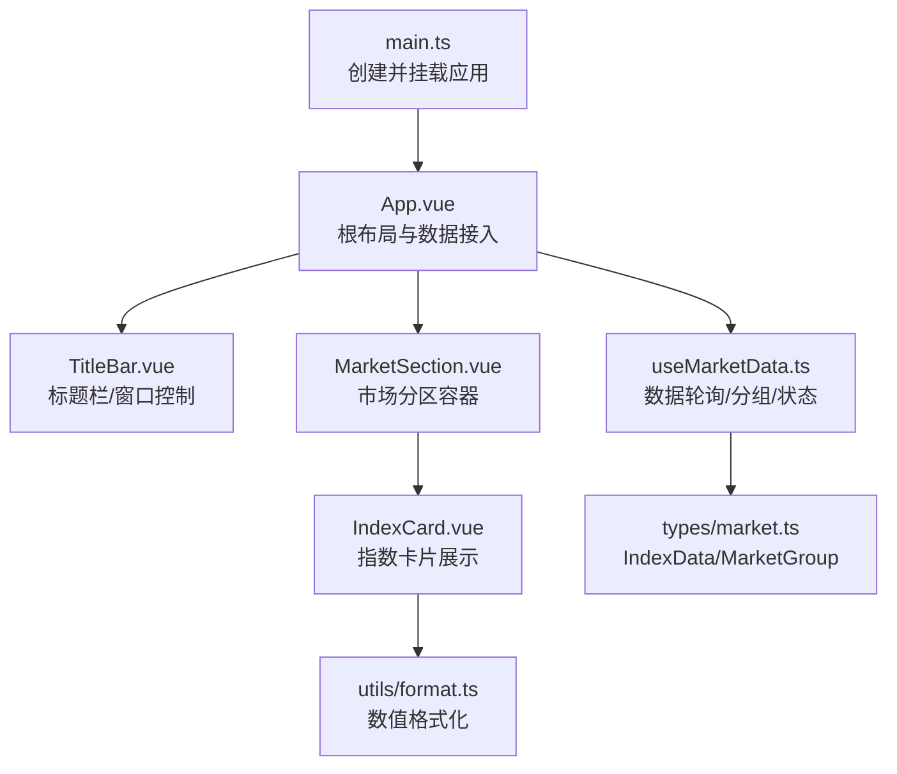
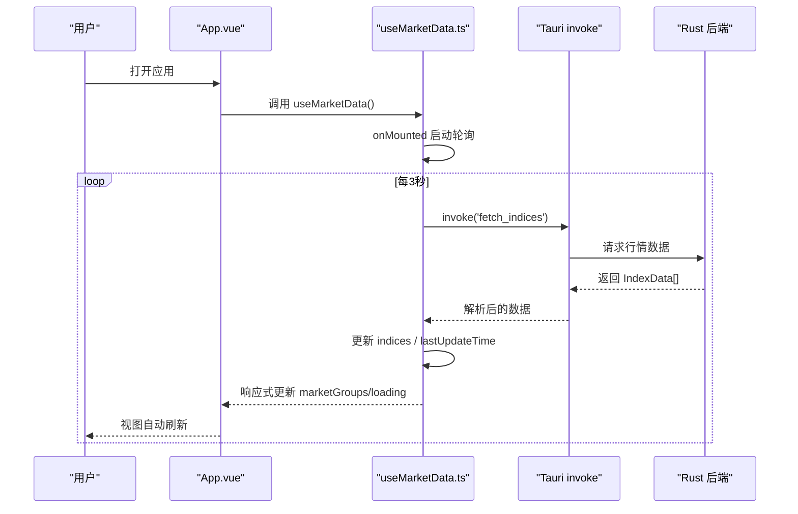
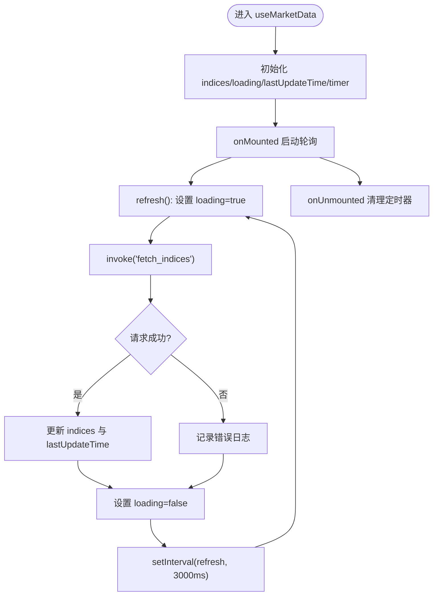
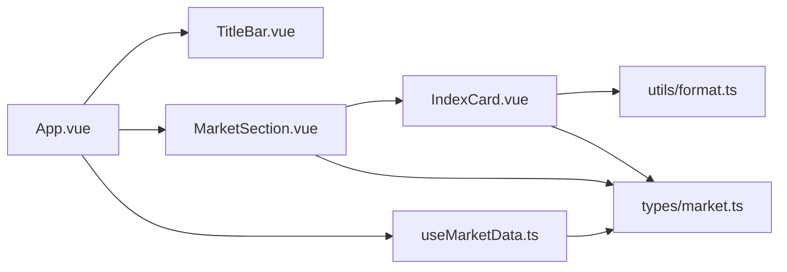

# 前端开发

<cite>
**本文引用的文件**
- [src/App.vue](file://src/App.vue)
- [src/components/TitleBar.vue](file://src/components/TitleBar.vue)
- [src/components/MarketSection.vue](file://src/components/MarketSection.vue)
- [src/components/IndexCard.vue](file://src/components/IndexCard.vue)
- [src/composables/useMarketData.ts](file://src/composables/useMarketData.ts)
- [src/types/market.ts](file://src/types/market.ts)
- [src/utils/format.ts](file://src/utils/format.ts)
- [src/main.ts](file://src/main.ts)
- [vite.config.ts](file://vite.config.ts)
- [tsconfig.json](file://tsconfig.json)
- [ARCHITECTURE.md](file://ARCHITECTURE.md)
</cite>

## 目录
1. [简介](#简介)
2. [项目结构](#项目结构)
3. [核心组件与职责](#核心组件与职责)
4. [架构总览](#架构总览)
5. [详细组件分析](#详细组件分析)
6. [依赖关系分析](#依赖关系分析)
7. [性能考量](#性能考量)
8. [故障排查指南](#故障排查指南)
9. [结论](#结论)
10. [附录](#附录)

## 简介
本文件为 hq-kanban-app 的前端开发文档，聚焦基于 Vue 3 Composition API 的组件化架构、数据轮询与状态管理、TypeScript 类型体系、工具函数库使用与扩展、响应式设计与样式系统集成方案。应用通过 Tauri 调用 Rust 后端获取全球主要股指行情（A 股、港股、美股），每 3 秒自动轮询刷新，并以暗色主题看板风格呈现。

## 项目结构
前端源码位于 src 目录下，采用按功能域划分的目录组织：
- components：页面级与展示型组件
- composables：可复用的组合式逻辑（如 useMarketData）
- types：全局 TypeScript 类型定义
- utils：通用工具函数（格式化等）
- main.ts：Vue 应用入口
- vite.config.ts：Vite 构建与开发服务器配置
- tsconfig.json：TypeScript 编译选项

图表来源
- [src/main.ts:1-6](file://src/main.ts#L1-L6)
- [src/App.vue:1-36](file://src/App.vue#L1-L36)
- [src/components/TitleBar.vue:1-63](file://src/components/TitleBar.vue#L1-L63)
- [src/components/MarketSection.vue:1-19](file://src/components/MarketSection.vue#L1-L19)
- [src/components/IndexCard.vue:1-71](file://src/components/IndexCard.vue#L1-L71)
- [src/composables/useMarketData.ts:1-66](file://src/composables/useMarketData.ts#L1-L66)
- [src/types/market.ts:1-22](file://src/types/market.ts#L1-L22)
- [src/utils/format.ts:1-33](file://src/utils/format.ts#L1-L33)

章节来源
- [ARCHITECTURE.md:58-102](file://ARCHITECTURE.md#L58-L102)
- [vite.config.ts:1-32](file://vite.config.ts#L1-L32)
- [tsconfig.json:1-24](file://tsconfig.json#L1-L24)

## 核心组件与职责
- App.vue：根布局，集成 TitleBar 与 MarketSection，接入 useMarketData 提供的全局状态（市场分组、加载态、最后更新时间、刷新方法）。
- TitleBar.vue：自定义无边框标题栏，支持拖动、最小化、关闭；显示最后更新时间和加载指示器；触发刷新事件。
- MarketSection.vue：按市场分组渲染标题与三列网格，遍历 IndexCard。
- IndexCard.vue：单个指数卡片，计算涨跌趋势并渲染价格、涨跌额、涨跌幅、成交量与成交额。
- useMarketData.ts：封装数据轮询、错误处理、状态管理与市场分组逻辑。
- types/market.ts：定义 IndexData 与 MarketGroup 类型契约。
- utils/format.ts：价格、涨跌、涨跌幅、成交量、成交额的格式化函数。

章节来源
- [src/App.vue:1-36](file://src/App.vue#L1-L36)
- [src/components/TitleBar.vue:1-63](file://src/components/TitleBar.vue#L1-L63)
- [src/components/MarketSection.vue:1-19](file://src/components/MarketSection.vue#L1-L19)
- [src/components/IndexCard.vue:1-71](file://src/components/IndexCard.vue#L1-L71)
- [src/composables/useMarketData.ts:1-66](file://src/composables/useMarketData.ts#L1-L66)
- [src/types/market.ts:1-22](file://src/types/market.ts#L1-L22)
- [src/utils/format.ts:1-33](file://src/utils/format.ts#L1-L33)

## 架构总览
前端通过 Vue 3 Composition API 组织视图与逻辑，使用 Tauri invoke 调用 Rust 后端命令 fetch_indices，获取行情数据后以 computed 进行市场分组，再由组件树渲染。

图表来源
- [src/composables/useMarketData.ts:1-66](file://src/composables/useMarketData.ts#L1-L66)
- [ARCHITECTURE.md:106-154](file://ARCHITECTURE.md#L106-L154)

## 详细组件分析

### 根组件 App.vue
- 组织结构：引入 TitleBar 与 MarketSection，并通过 useMarketData 获取 marketGroups、loading、lastUpdateTime、refresh。
- 布局策略：全屏深色背景，纵向 Flex 布局；标题栏固定高度，主内容区可滚动。
- 空状态处理：当所有分组无数据且非加载中时，显示“暂无数据”提示。
- 数据绑定：将 lastUpdateTime、loading 作为 props 传递给 TitleBar；监听 refresh 事件触发数据刷新。

章节来源
- [src/App.vue:1-36](file://src/App.vue#L1-L36)

### 标题栏 TitleBar.vue
- 功能：实现窗口拖动、最小化、关闭；显示最后更新时间与加载脉动指示器；提供手动刷新按钮。
- 事件与属性：接收 lastUpdateTime、loading 属性；通过 emit('refresh') 通知父组件刷新。
- 交互细节：双击不触发拖动；按钮点击阻止冒泡避免误触拖动。

章节来源
- [src/components/TitleBar.vue:1-63](file://src/components/TitleBar.vue#L1-L63)

### 市场分区 MarketSection.vue
- 职责：渲染市场分区标题与分隔线，使用三列网格布局展示该市场的指数卡片。
- 数据流：接收 MarketGroup 对象，遍历 indices 渲染 IndexCard。

章节来源
- [src/components/MarketSection.vue:1-19](file://src/components/MarketSection.vue#L1-L19)

### 指数卡片 IndexCard.vue
- 趋势计算：根据 change 字段计算 up/down/flat 三种趋势。
- 样式映射：依据趋势动态设置文字颜色、背景色与左侧边框色，形成红涨绿跌的视觉反馈。
- 数据展示：名称、当前价格、涨跌额、涨跌幅、成交量、成交额；数值通过 format.* 工具函数统一格式化。

章节来源
- [src/components/IndexCard.vue:1-71](file://src/components/IndexCard.vue#L1-L71)
- [src/utils/format.ts:1-33](file://src/utils/format.ts#L1-L33)

### 组合式函数 useMarketData.ts
- 数据轮询机制：
  - 使用 setInterval 每 3 秒执行一次 refresh。
  - onMounted 立即执行一次 refresh 并启动定时器；onUnmounted 清理定时器防止内存泄漏。
- 状态管理：
  - indices：原始指数数组
  - loading：请求中标志
  - lastUpdateTime：最后更新时间字符串
  - marketGroups：computed 根据 market 字段分组为 A 股、港股、美股
- 错误处理：
  - 捕获异常并记录日志，不影响后续轮询。
- IPC 通信：
  - 通过 @tauri-apps/api/core 的 invoke 调用 Rust 命令 fetch_indices。

图表来源
- [src/composables/useMarketData.ts:1-66](file://src/composables/useMarketData.ts#L1-L66)

章节来源
- [src/composables/useMarketData.ts:1-66](file://src/composables/useMarketData.ts#L1-L66)

### TypeScript 类型定义体系
- IndexData：描述单条指数数据，包含代码、名称、价格、昨收、开盘、最高、最低、涨跌额、涨跌幅、成交量、成交额、市场标识、更新时间。
- MarketGroup：描述市场分组，包含 key、label 与 indices 列表。
- 设计思路：前后端共享一致的字段语义，便于序列化/反序列化和 UI 渲染；market 字段限定为 'a' | 'hk' | 'us'，确保分组逻辑的类型安全。

章节来源
- [src/types/market.ts:1-22](file://src/types/market.ts#L1-L22)

### 工具函数库使用方法与扩展
- 已提供：
  - formatPrice：保留两位小数
  - formatChange：带正负号的涨跌额
  - formatChangePct：带正负号与百分号的涨跌幅
  - formatVolume：万/亿单位换算
  - formatAmount：万/亿单位换算
- 使用方式：在 IndexCard 中直接导入并使用，保证数值展示一致性。
- 扩展建议：
  - 新增格式化规则时，遵循单一职责原则，保持函数纯函数特性。
  - 对复杂格式（如时间、货币）可新增独立模块并按需引入。
  - 建议在类型层面约束输入输出，避免运行时错误。

章节来源
- [src/utils/format.ts:1-33](file://src/utils/format.ts#L1-L33)
- [src/components/IndexCard.vue:1-71](file://src/components/IndexCard.vue#L1-L71)

### 组件使用示例与最佳实践
- 在 App.vue 中通过 useMarketData 获取状态与方法，并将 marketGroups 传入 MarketSection；TitleBar 通过 props 与事件与父组件通信。
- 最佳实践：
  - 使用 computed 派生视图所需的数据结构（如 marketGroups），减少模板中的复杂逻辑。
  - 在组合式函数中集中管理副作用（定时器、IPC 调用），保持组件纯净。
  - 使用 TypeScript 严格模式，确保类型安全与更好的 IDE 体验。
  - 对异步操作添加 loading 状态，提升用户体验。
  - 在组件卸载时清理资源（如定时器），避免内存泄漏。

章节来源
- [src/App.vue:1-36](file://src/App.vue#L1-L36)
- [src/composables/useMarketData.ts:1-66](file://src/composables/useMarketData.ts#L1-L66)

### 响应式设计实现与样式系统集成方案
- 框架与工具：
  - Tailwind CSS v4 通过 @tailwindcss/vite 插件集成到 Vite。
  - 全局样式文件 styles.css 被 main.ts 引入。
- 布局与响应式：
  - 使用 Flexbox 与 Grid 构建自适应布局；MarketSection 内采用 grid-cols-3 三列网格。
  - 通过 Tailwind 原子类实现间距、对齐、颜色、尺寸等样式。
- 主题与配色：
  - 暗色主题：bg-gray-900 + text-white。
  - 涨跌配色：上涨红色、下跌绿色、平盘灰色；配合左侧彩色边框与极淡背景色增强可读性。
- 可维护性：
  - 样式集中在 Tailwind 原子类，避免重复 CSS。
  - 如需定制主题或新增断点，可在 Tailwind 配置中扩展。

章节来源
- [vite.config.ts:1-32](file://vite.config.ts#L1-L32)
- [src/main.ts:1-6](file://src/main.ts#L1-L6)
- [src/components/MarketSection.vue:1-19](file://src/components/MarketSection.vue#L1-L19)
- [ARCHITECTURE.md:300-331](file://ARCHITECTURE.md#L300-L331)

## 依赖关系分析
- 组件依赖：
  - App.vue 依赖 TitleBar.vue、MarketSection.vue 与 useMarketData.ts。
  - MarketSection.vue 依赖 IndexCard.vue。
  - IndexCard.vue 依赖 format.* 工具函数。
- 类型依赖：
  - 组件与 composable 均引用 types/market.ts 中的 IndexData 与 MarketGroup。
- 外部依赖：
  - @tauri-apps/api/core：用于 invoke 调用后端命令。
  - Vue 3 响应式系统：ref、computed、生命周期钩子。
  - Tailwind CSS：样式原子化。

图表来源
- [src/App.vue:1-36](file://src/App.vue#L1-L36)
- [src/components/TitleBar.vue:1-63](file://src/components/TitleBar.vue#L1-L63)
- [src/components/MarketSection.vue:1-19](file://src/components/MarketSection.vue#L1-L19)
- [src/components/IndexCard.vue:1-71](file://src/components/IndexCard.vue#L1-L71)
- [src/composables/useMarketData.ts:1-66](file://src/composables/useMarketData.ts#L1-L66)
- [src/types/market.ts:1-22](file://src/types/market.ts#L1-L22)
- [src/utils/format.ts:1-33](file://src/utils/format.ts#L1-L33)

章节来源
- [ARCHITECTURE.md:106-154](file://ARCHITECTURE.md#L106-L154)

## 性能考量
- 轮询频率：3 秒间隔平衡实时性与服务器压力，适合非高频交易场景。
- 响应式优化：使用 computed 派生 marketGroups，避免在模板中进行复杂过滤。
- 资源清理：组件卸载时清除定时器，防止后台持续请求与内存泄漏。
- 网络层：通过 Rust 后端发起 HTTP 请求，规避浏览器 CORS 限制与 GBK 编码问题，提高稳定性。
- 构建优化：Vite 启用 HMR，开发体验良好；生产构建前执行类型检查，降低运行时错误风险。

[本节为通用指导，无需具体文件引用]

## 故障排查指南
- 数据未更新：
  - 检查 useMarketData 的轮询是否启动与清理正确。
  - 确认 Tauri 命令 fetch_indices 已注册并可调用。
- 请求失败：
  - 查看控制台错误日志；确认后端网络可达与编码转换正常。
  - 关注 loading 状态是否正确切换。
- 界面不刷新：
  - 确认 marketGroups 为 computed 且依赖 indices 变化。
  - 检查组件 props 传递是否正确。
- 样式异常：
  - 确认 Tailwind 插件已正确引入并在 Vite 中启用。
  - 检查全局样式文件是否被 main.ts 引入。

章节来源
- [src/composables/useMarketData.ts:1-66](file://src/composables/useMarketData.ts#L1-L66)
- [ARCHITECTURE.md:106-154](file://ARCHITECTURE.md#L106-L154)

## 结论
本项目采用 Vue 3 Composition API 与 Tauri 结合，实现了轻量、跨平台的桌面行情看板。通过清晰的组件分层、可复用的组合式函数与严格的 TypeScript 类型体系，保证了代码的可维护性与扩展性。Tailwind CSS 提供了高效的样式解决方案，配合暗色主题与红涨绿跌配色，提升了信息传达效率。未来可考虑增加更多市场、优化轮询策略与错误重试机制，进一步提升用户体验。

[本节为总结性内容，无需具体文件引用]

## 附录
- 开发与构建脚本：
  - dev：启动 Vite 开发服务器（端口固定 1420）。
  - build：执行类型检查与构建。
  - preview：预览构建产物。
  - tauri：调用 Tauri CLI 进行开发与打包。
- 类型检查：
  - 使用 vue-tsc 进行模板类型检查，确保类型安全。
- 环境变量：
  - TAURI_DEV_HOST：用于指定 Tauri 开发时的主机地址。

章节来源
- [package.json:1-26](file://package.json#L1-L26)
- [vite.config.ts:1-32](file://vite.config.ts#L1-L32)
- [tsconfig.json:1-24](file://tsconfig.json#L1-L24)