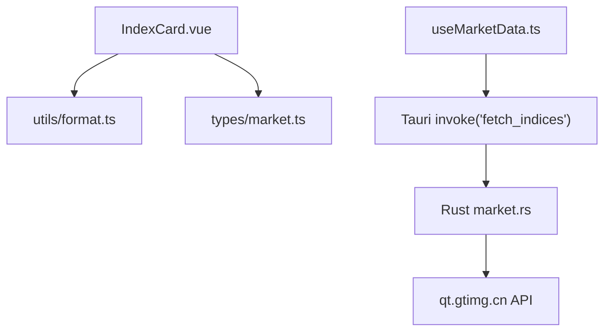
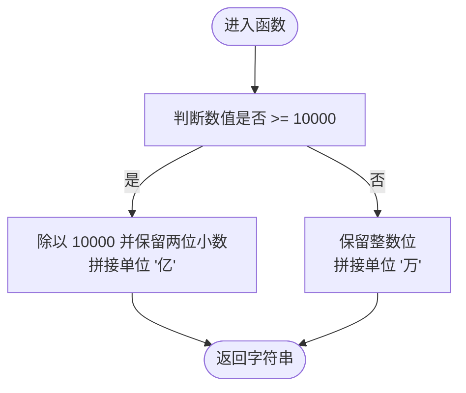
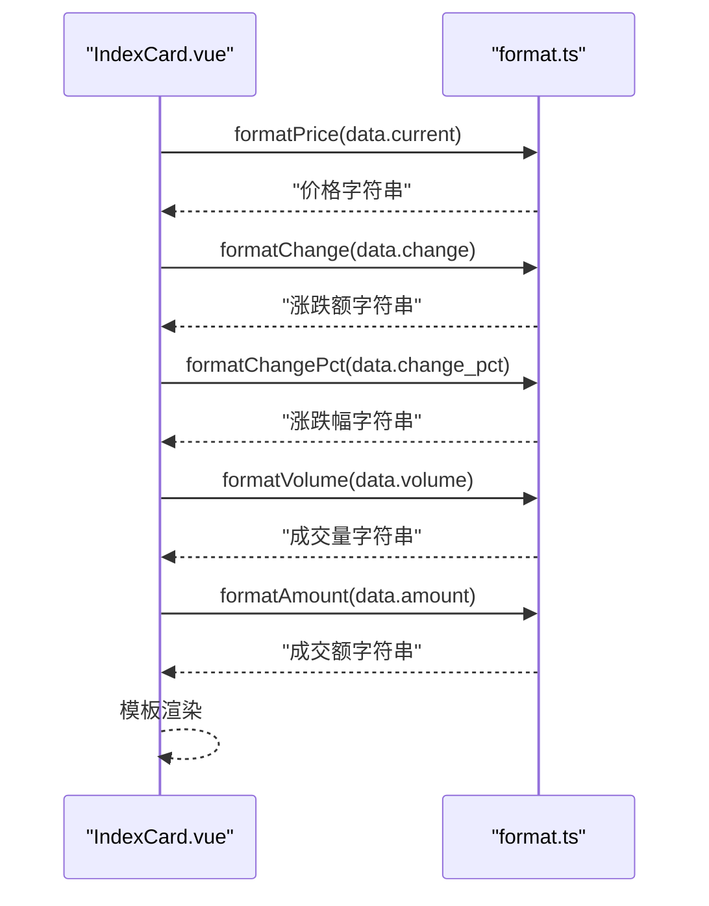
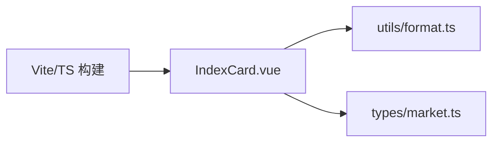

# 工具函数

<cite>
**本文引用的文件**
- [src/utils/format.ts](file://src/utils/format.ts)
- [src/components/IndexCard.vue](file://src/components/IndexCard.vue)
- [src/types/market.ts](file://src/types/market.ts)
- [ARCHITECTURE.md](file://ARCHITECTURE.md)
- [package.json](file://package.json)
</cite>

## 目录
1. [简介](#简介)
2. [项目结构](#项目结构)
3. [核心组件](#核心组件)
4. [架构总览](#架构总览)
5. [详细组件分析](#详细组件分析)
6. [依赖关系分析](#依赖关系分析)
7. [性能考虑](#性能考虑)
8. [故障排查指南](#故障排查指南)
9. [结论](#结论)
10. [附录](#附录)

## 简介
本文件为 hq-kanban-app 的工具函数库使用文档，聚焦于 src/utils/format.ts 中提供的格式化能力：数字格式化处理、价格显示优化与涨跌幅计算展示。文档将说明设计原则与命名规范、提供参数说明与使用示例路径、解释在 Vue 组件中的引入与使用方法，并给出扩展自定义规则的建议、性能考量与最佳实践。

## 项目结构
本项目采用前端（Vue 3 + TypeScript）+ 后端（Rust/Tauri）的架构。工具函数位于 src/utils/format.ts，被 UI 组件按需引入并使用，用于统一数值展示格式。

图表来源
- [src/components/IndexCard.vue:1-71](file://src/components/IndexCard.vue#L1-L71)
- [src/utils/format.ts:1-33](file://src/utils/format.ts#L1-L33)
- [src/types/market.ts:1-22](file://src/types/market.ts#L1-L22)
- [ARCHITECTURE.md:106-147](file://ARCHITECTURE.md#L106-L147)

章节来源
- [ARCHITECTURE.md:58-102](file://ARCHITECTURE.md#L58-L102)
- [package.json:1-26](file://package.json#L1-L26)

## 核心组件
工具函数模块提供以下导出函数，覆盖行情看板常见展示场景：
- formatPrice：价格保留两位小数
- formatChange：涨跌额带正负号
- formatChangePct：涨跌幅带正负号与百分号
- formatVolume：成交量单位换算（万/亿）
- formatAmount：成交额单位换算（万/亿）

这些函数均为纯函数，输入为 number，输出为 string，便于在模板中直接插值渲染。

章节来源
- [src/utils/format.ts:1-33](file://src/utils/format.ts#L1-L33)

## 架构总览
工具函数作为无副作用的展示层辅助，被 IndexCard 组件引入并在模板中使用，确保数据到视图的一致性与可维护性。数据流从后端 Rust 拉取行情，经 Tauri IPC 返回前端，再由 composable 分组后传入组件，最终通过工具函数完成格式化展示。

```mermaid
sequenceDiagram
participant Comp as "IndexCard.vue"
participant Util as "format.ts"
participant Types as "market.ts"
Comp->>Types : 接收 IndexData 对象
Comp->>Util : formatPrice(current)
Comp->>Util : formatChange(change)
Comp->>Util : formatChangePct(change_pct)
Comp->>Util : formatVolume(volume)
Comp->>Util : formatAmount(amount)
Util-->>Comp : 字符串结果
Comp-->>Comp : 渲染到模板
```

图表来源
- [src/components/IndexCard.vue:1-71](file://src/components/IndexCard.vue#L1-L71)
- [src/utils/format.ts:1-33](file://src/utils/format.ts#L1-L33)
- [src/types/market.ts:1-22](file://src/types/market.ts#L1-L22)

## 详细组件分析

### 函数清单与参数说明
- formatPrice(price: number): string
  - 用途：统一价格显示，保留两位小数
  - 适用字段：current、open、high、low、prev_close
  - 示例路径：[src/components/IndexCard.vue:50-52](file://src/components/IndexCard.vue#L50-L52)

- formatChange(change: number): string
  - 用途：涨跌额显示，正数带“+”，负数带“-”
  - 适用字段：change
  - 示例路径：[src/components/IndexCard.vue:56-58](file://src/components/IndexCard.vue#L56-L58)

- formatChangePct(pct: number): string
  - 用途：涨跌幅显示，带“+/-”与“%”
  - 适用字段：change_pct
  - 示例路径：[src/components/IndexCard.vue:59-61](file://src/components/IndexCard.vue#L59-L61)

- formatVolume(vol: number): string
  - 用途：成交量单位换算，>=10000 显示“亿”，否则显示“万”
  - 适用字段：volume
  - 示例路径：[src/components/IndexCard.vue:65-67](file://src/components/IndexCard.vue#L65-L67)

- formatAmount(amount: number): string
  - 用途：成交额单位换算，>=10000 显示“亿”，否则显示“万”
  - 适用字段：amount
  - 示例路径：[src/components/IndexCard.vue:65-67](file://src/components/IndexCard.vue#L65-L67)

章节来源
- [src/utils/format.ts:1-33](file://src/utils/format.ts#L1-L33)
- [src/components/IndexCard.vue:1-71](file://src/components/IndexCard.vue#L1-L71)
- [src/types/market.ts:1-22](file://src/types/market.ts#L1-L22)

### 使用方式与引入方法
- 在组件中通过相对路径导入工具函数，并在模板或 computed 中调用：
  - 导入位置参考：[src/components/IndexCard.vue:3](file://src/components/IndexCard.vue#L3)
  - 模板内调用位置参考：[src/components/IndexCard.vue:50-67](file://src/components/IndexCard.vue#L50-L67)
- 类型安全：组件通过 IndexData 接口约束传入数据，保证字段存在且类型正确：
  - 类型定义参考：[src/types/market.ts:1-22](file://src/types/market.ts#L1-L22)

章节来源
- [src/components/IndexCard.vue:1-71](file://src/components/IndexCard.vue#L1-L71)
- [src/types/market.ts:1-22](file://src/types/market.ts#L1-L22)

### 设计原则与命名规范
- 单一职责：每个函数仅负责一种格式的转换，避免复杂逻辑混入
- 纯函数：不依赖外部状态，便于测试与复用
- 命名清晰：以 format 前缀表明用途，后缀描述具体领域（Price/Change/ChangePct/Volume/Amount）
- 类型明确：输入 number，输出 string，减少模板层判断
- 本地化友好：中文单位“万/亿”与符号“+/-/%”符合国内行情展示习惯

章节来源
- [src/utils/format.ts:1-33](file://src/utils/format.ts#L1-L33)

### 流程图：成交量/成交额单位换算

图表来源
- [src/utils/format.ts:18-32](file://src/utils/format.ts#L18-L32)

### 序列图：组件渲染流程

图表来源
- [src/components/IndexCard.vue:1-71](file://src/components/IndexCard.vue#L1-L71)
- [src/utils/format.ts:1-33](file://src/utils/format.ts#L1-L33)

## 依赖关系分析
- 组件对工具函数的依赖：IndexCard.vue 直接导入并使用 format.ts 中的五个函数
- 类型依赖：IndexCard.vue 通过 types/market.ts 的 IndexData 接口约束数据
- 构建配置：TypeScript 与 Vite 提供编译与开发体验，确保类型检查与热更新

图表来源
- [src/components/IndexCard.vue:1-71](file://src/components/IndexCard.vue#L1-L71)
- [src/utils/format.ts:1-33](file://src/utils/format.ts#L1-L33)
- [src/types/market.ts:1-22](file://src/types/market.ts#L1-L22)
- [package.json:1-26](file://package.json#L1-L26)

章节来源
- [package.json:1-26](file://package.json#L1-L26)

## 性能考虑
- 函数复杂度：所有函数均为 O(1) 时间复杂度，适合高频渲染
- 内存占用：无闭包与全局状态，不会造成额外内存开销
- 渲染优化：建议在模板中对频繁变化的数值使用 computed 缓存，避免重复计算
- 批量处理：若需格式化大量数据，可在数据处理层一次性转换，减少模板层压力
- 精度控制：toFixed 会进行四舍五入，注意业务对精度的要求；必要时可扩展支持动态小数位数

[本节为通用性能建议，无需特定文件引用]

## 故障排查指南
- 输入非数字：若传入 undefined/null，toFixed 会抛出异常。建议在调用前做类型守卫或默认值处理
- 负零显示：toFixed 可能产生 "-0.00"，可在需要时增加去负零逻辑
- 单位阈值：当前阈值固定为 10000，如需适配不同市场或币种，可抽象为可配置参数
- 国际化：如需切换语言环境，可将单位与符号抽离为配置项或 i18n 资源

章节来源
- [src/utils/format.ts:1-33](file://src/utils/format.ts#L1-L33)

## 结论
format.ts 提供了简洁、稳定、易用的数值格式化能力，满足行情看板的展示需求。通过清晰的命名与类型约束，配合 IndexCard 组件的使用，实现了数据到视图的一致呈现。未来可按需扩展更多格式化规则与本地化支持。

[本节为总结性内容，无需特定文件引用]

## 附录

### 扩展与自定义格式化规则
- 新增格式化函数：遵循现有命名约定（如 formatXXX），保持纯函数与类型约束
- 动态小数位数：可增加可选参数 precision，默认沿用现有行为
- 单位策略：将阈值与单位抽象为配置对象，支持多市场/多币种
- 国际化：将“万/亿”、“+/-/%”等文案抽取至配置或 i18n 文件

[本节为概念性指导，无需特定文件引用]

### 在组件中引入与使用的步骤
- 在组件顶部导入工具函数：参考导入位置 [src/components/IndexCard.vue:3](file://src/components/IndexCard.vue#L3)
- 在模板中直接调用：参考调用位置 [src/components/IndexCard.vue:50-67](file://src/components/IndexCard.vue#L50-L67)
- 确保传入数据符合 IndexData 类型：参考类型定义 [src/types/market.ts:1-22](file://src/types/market.ts#L1-L22)

章节来源
- [src/components/IndexCard.vue:1-71](file://src/components/IndexCard.vue#L1-L71)
- [src/types/market.ts:1-22](file://src/types/market.ts#L1-L22)