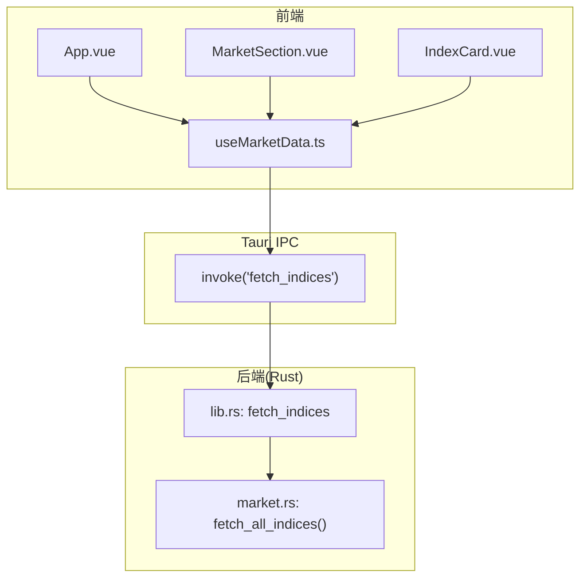
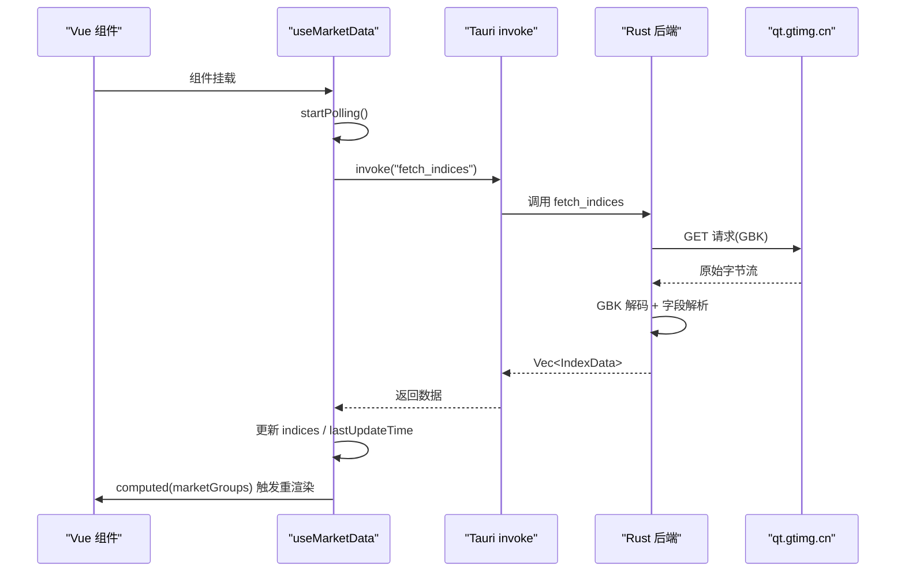
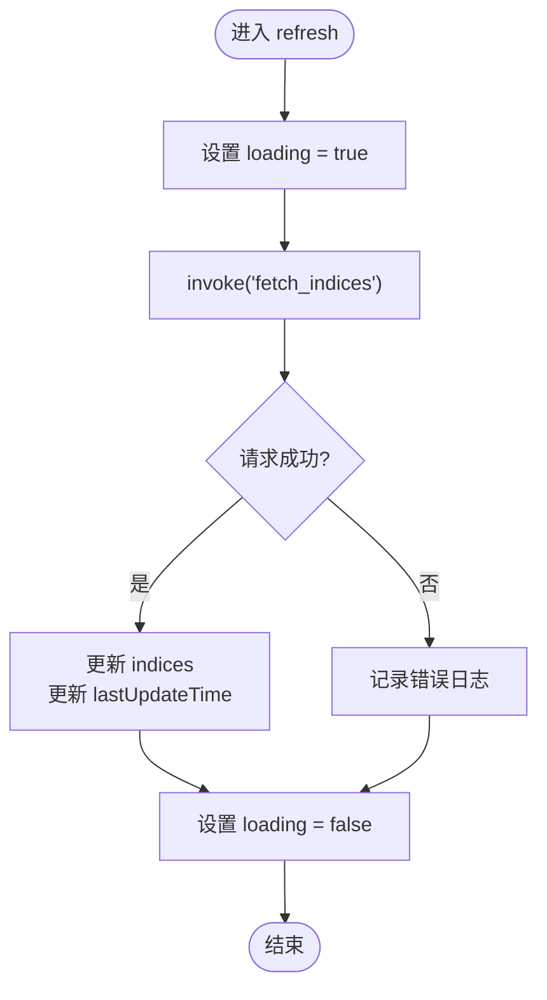
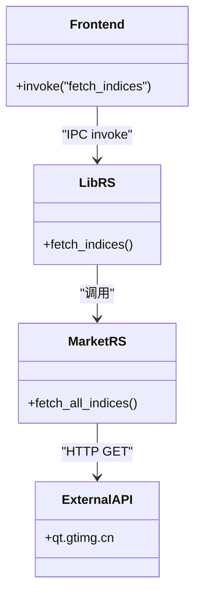
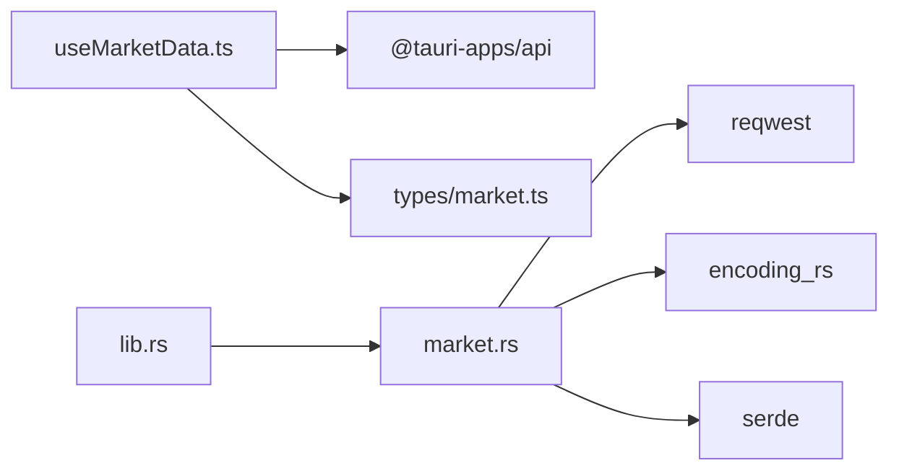

# 状态管理

<cite>
**本文引用的文件**
- [useMarketData.ts](file://src/composables/useMarketData.ts)
- [market.ts](file://src/types/market.ts)
- [lib.rs](file://src-tauri/src/lib.rs)
- [market.rs](file://src-tauri/src/market.rs)
- [App.vue](file://src/App.vue)
- [MarketSection.vue](file://src/components/MarketSection.vue)
- [IndexCard.vue](file://src/components/IndexCard.vue)
- [ARCHITECTURE.md](file://ARCHITECTURE.md)
</cite>

## 目录
1. [简介](#简介)
2. [项目结构](#项目结构)
3. [核心组件](#核心组件)
4. [架构总览](#架构总览)
5. [详细组件分析](#详细组件分析)
6. [依赖关系分析](#依赖关系分析)
7. [性能考虑](#性能考虑)
8. [故障排查指南](#故障排查指南)
9. [结论](#结论)
10. [附录](#附录)

## 简介
本文件聚焦 hq-kanban-app 的状态管理系统，围绕 useMarketData 组合式函数展开，系统性说明：
- 数据轮询机制的设计思路、定时刷新逻辑与错误处理策略
- 响应式状态（marketGroups、loading、lastUpdateTime）的管理方式与维护逻辑
- 与 Tauri 后端的 IPC 通信机制（fetch_indices 命令调用与数据接收）
- 自动刷新间隔的配置与优化策略
- 状态持久化与缓存方案建议
- 性能优化技巧与内存管理最佳实践

## 项目结构
应用采用“前端 Vue 3 + 后端 Rust/Tauri”的双层架构。前端通过 @tauri-apps/api 的 invoke 调用后端命令 fetch_indices，后端使用 reqwest 请求行情接口并解析返回数据，再经 Tauri IPC 返回给前端。Vue 侧使用 ref 与 computed 维护响应式状态，并按市场维度分组渲染。

图表来源
- [useMarketData.ts:1-66](file://src/composables/useMarketData.ts#L1-L66)
- [lib.rs:1-21](file://src-tauri/src/lib.rs#L1-L21)
- [market.rs:1-100](file://src-tauri/src/market.rs#L1-L100)

章节来源
- [ARCHITECTURE.md:106-154](file://ARCHITECTURE.md#L106-L154)
- [useMarketData.ts:1-66](file://src/composables/useMarketData.ts#L1-L66)
- [lib.rs:1-21](file://src-tauri/src/lib.rs#L1-L21)
- [market.rs:1-100](file://src-tauri/src/market.rs#L1-L100)

## 核心组件
- useMarketData：封装数据获取、轮询、分组与响应式状态管理
- App.vue：根组件，消费 useMarketData 暴露的状态与方法
- MarketSection.vue：按市场分组展示指数卡片网格
- IndexCard.vue：单张指数卡片的展示与涨跌样式计算
- market.ts：定义 IndexData 与 MarketGroup 类型
- lib.rs / market.rs：Tauri 命令与行情数据抓取、解析逻辑

章节来源
- [useMarketData.ts:1-66](file://src/composables/useMarketData.ts#L1-L66)
- [App.vue:1-36](file://src/App.vue#L1-L36)
- [MarketSection.vue:1-19](file://src/components/MarketSection.vue#L1-L19)
- [IndexCard.vue:1-71](file://src/components/IndexCard.vue#L1-L71)
- [market.ts:1-22](file://src/types/market.ts#L1-L22)
- [lib.rs:1-21](file://src-tauri/src/lib.rs#L1-L21)
- [market.rs:1-100](file://src-tauri/src/market.rs#L1-L100)

## 架构总览
整体数据流：
1) 前端在组件挂载时启动定时器，每 3 秒调用 invoke('fetch_indices')
2) 后端通过 reqwest 请求 qt.gtimg.cn，GBK 解码后逐行解析为 IndexData
3) 将结果序列化并通过 Tauri IPC 返回前端
4) 前端更新 indices 与 lastUpdateTime，computed 自动重组 marketGroups，视图响应式更新

图表来源
- [useMarketData.ts:25-41](file://src/composables/useMarketData.ts#L25-L41)
- [lib.rs:8-11](file://src-tauri/src/lib.rs#L8-L11)
- [market.rs:41-99](file://src-tauri/src/market.rs#L41-L99)

## 详细组件分析

### useMarketData 组合式函数
职责与实现要点：
- 响应式状态
  - indices：存储从后端获取的指数数组
  - loading：标识当前是否正在请求
  - lastUpdateTime：记录最近一次成功更新时间
  - timer：保存 setInterval 句柄，用于清理
- 数据分组
  - marketGroups：基于 indices.market 字段计算分组（A 股/港股/美股），作为只读视图派生
- 轮询与生命周期
  - onMounted：立即执行一次 refresh，并启动 3 秒定时器
  - onUnmounted：清除定时器，避免内存泄漏
- 错误处理
  - 捕获异常并打印日志，不影响后续轮询
  - finally 中确保 loading 恢复

图表来源
- [useMarketData.ts:25-36](file://src/composables/useMarketData.ts#L25-L36)

章节来源
- [useMarketData.ts:1-66](file://src/composables/useMarketData.ts#L1-L66)

### 响应式状态管理
- marketGroups：computed 派生，当 indices 变化时自动重新分组，无需手动同步
- loading：控制 UI 加载态（如标题栏指示器），请求开始置真，结束置假
- lastUpdateTime：每次成功拉取后更新，便于用户感知数据新鲜度
- 数据流向：后端 → invoke → indices → computed(marketGroups) → 视图

章节来源
- [useMarketData.ts:13-23](file://src/composables/useMarketData.ts#L13-L23)
- [useMarketData.ts:25-36](file://src/composables/useMarketData.ts#L25-L36)
- [App.vue:6-16](file://src/App.vue#L6-L16)

### 与 Tauri 后端的 IPC 通信
- 前端调用：invoke<IndexData[]>('fetch_indices')
- 后端命令：lib.rs 中注册 fetch_indices，委托 market::fetch_all_indices
- 数据解析：market.rs 中通过 reqwest 获取 GBK 编码文本，encoding_rs 解码后按行解析，映射到 IndexData
- 返回类型：Vec<IndexData>，经 serde 序列化为 JSON 返回前端

图表来源
- [useMarketData.ts:28-30](file://src/composables/useMarketData.ts#L28-L30)
- [lib.rs:8-11](file://src-tauri/src/lib.rs#L8-L11)
- [market.rs:41-99](file://src-tauri/src/market.rs#L41-L99)

章节来源
- [lib.rs:1-21](file://src-tauri/src/lib.rs#L1-L21)
- [market.rs:1-100](file://src-tauri/src/market.rs#L1-L100)

### 自动刷新间隔配置与优化
- 当前策略：POLL_INTERVAL = 3000ms，onMounted 启动，onUnmounted 停止
- 优化建议
  - 可配置化：将间隔抽离为环境变量或配置文件，支持运行时调整
  - 自适应刷新：根据网络状态或窗口可见性动态调整间隔（例如页面不可见时降低频率）
  - 防抖/节流：在频繁手动触发刷新时进行节流，避免重复请求
  - 失败退避：连续失败时指数退避重试，减少服务器压力

章节来源
- [useMarketData.ts:5-11](file://src/composables/useMarketData.ts#L5-L11)
- [useMarketData.ts:38-48](file://src/composables/useMarketData.ts#L38-L48)
- [ARCHITECTURE.md:402-408](file://ARCHITECTURE.md#L402-L408)

### 状态持久化与缓存方案
现状：当前未实现本地持久化与缓存，数据仅存在于内存中。
建议方案：
- 浏览器端（开发模式）
  - 使用 localStorage/sessionStorage 缓存上次成功数据与更新时间，首次加载优先读取缓存
  - 结合 navigator.onLine 判断在线状态，离线时使用缓存
- 桌面端（Tauri）
  - 使用 Tauri 插件（如 fs 或 store）将数据写入本地文件或键值存储
  - 启动时优先加载本地缓存，后台静默刷新
- 缓存策略
  - 时间戳校验：超过阈值（如 30 秒）视为过期，强制刷新
  - 增量更新：若后端支持，仅拉取变更字段；否则全量替换
  - 版本兼容：数据结构升级时提供迁移逻辑

章节来源
- [useMarketData.ts:25-36](file://src/composables/useMarketData.ts#L25-L36)
- [market.ts:1-22](file://src/types/market.ts#L1-L22)

### 性能优化与内存管理
- 定时器管理
  - 组件卸载时务必清除定时器，避免内存泄漏（已实现）
- 计算属性
  - marketGroups 使用 computed 派生，避免重复过滤与创建新对象
- 请求合并
  - 若未来扩展多指标请求，可合并为单次批量请求，减少网络开销
- 渲染优化
  - 列表项使用稳定 key（index.code），提升 diff 效率
  - 大列表可考虑虚拟滚动（当前数据量较小，非必需）
- 错误与降级
  - 网络异常时保留上一次有效数据，提升用户体验
  - 限制最大重试次数与退避策略

章节来源
- [useMarketData.ts:38-56](file://src/composables/useMarketData.ts#L38-L56)
- [useMarketData.ts:13-23](file://src/composables/useMarketData.ts#L13-L23)
- [IndexCard.vue:10-38](file://src/components/IndexCard.vue#L10-L38)

## 依赖关系分析
- 前端依赖
  - Vue 3 Composition API（ref、computed、生命周期钩子）
  - @tauri-apps/api（invoke）
  - TypeScript 类型（IndexData、MarketGroup）
- 后端依赖
  - Tauri 命令系统（#[tauri::command]）
  - reqwest（HTTP 客户端）
  - encoding_rs（GBK 解码）
  - serde（序列化）

图表来源
- [useMarketData.ts:1-3](file://src/composables/useMarketData.ts#L1-L3)
- [market.ts:1-22](file://src/types/market.ts#L1-L22)
- [lib.rs:1-21](file://src-tauri/src/lib.rs#L1-L21)
- [market.rs:1-100](file://src-tauri/src/market.rs#L1-L100)

章节来源
- [package.json:12-15](file://package.json#L12-L15)
- [ARCHITECTURE.md:23-49](file://ARCHITECTURE.md#L23-L49)

## 性能考虑
- 轮询频率：3 秒兼顾实时性与服务器压力，适合看板场景
- 计算复杂度：分组为 O(n)，n 为指数数量，当前规模下可忽略
- 网络开销：单次请求包含多个指数代码，减少往返次数
- 内存占用：仅在内存维护少量数据，注意清理定时器与事件监听
- 渲染成本：使用 computed 与稳定 key，避免不必要的重渲染

[本节为通用性能指导，不直接分析具体文件]

## 故障排查指南
常见问题与定位方法：
- 无数据或数据不更新
  - 检查网络连通性与 qt.gtimg.cn 可达性
  - 查看控制台错误日志（fetch 失败会打印错误）
  - 确认组件已挂载且未提前卸载导致定时器未启动
- 数据乱码或解析失败
  - 后端需正确进行 GBK 解码与字段长度校验
  - 关注 market.rs 中的字段索引与分隔符处理
- 内存泄漏
  - 确认 onUnmounted 中清除了定时器
- 性能抖动
  - 检查是否存在重复请求或高频手动刷新
  - 评估是否需要引入节流/防抖

章节来源
- [useMarketData.ts:25-36](file://src/composables/useMarketData.ts#L25-L36)
- [market.rs:41-99](file://src-tauri/src/market.rs#L41-L99)

## 结论
useMarketData 以简洁的组合式函数实现了完整的行情数据轮询、分组与响应式更新，配合 Tauri 后端完成跨域与编码问题处理。当前实现稳定可靠，建议在可配置化、自适应刷新、缓存与持久化方面进一步增强，以提升鲁棒性与用户体验。

[本节为总结性内容，不直接分析具体文件]

## 附录
- 类型定义：IndexData、MarketGroup
- 组件职责：App.vue（聚合）、MarketSection.vue（分组容器）、IndexCard.vue（卡片展示）
- 后端流程：lib.rs 命令注册与转发，market.rs 请求、解码、解析与返回

章节来源
- [market.ts:1-22](file://src/types/market.ts#L1-L22)
- [App.vue:1-36](file://src/App.vue#L1-L36)
- [MarketSection.vue:1-19](file://src/components/MarketSection.vue#L1-L19)
- [IndexCard.vue:1-71](file://src/components/IndexCard.vue#L1-L71)
- [lib.rs:1-21](file://src-tauri/src/lib.rs#L1-L21)
- [market.rs:1-100](file://src-tauri/src/market.rs#L1-L100)