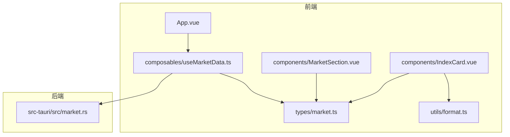
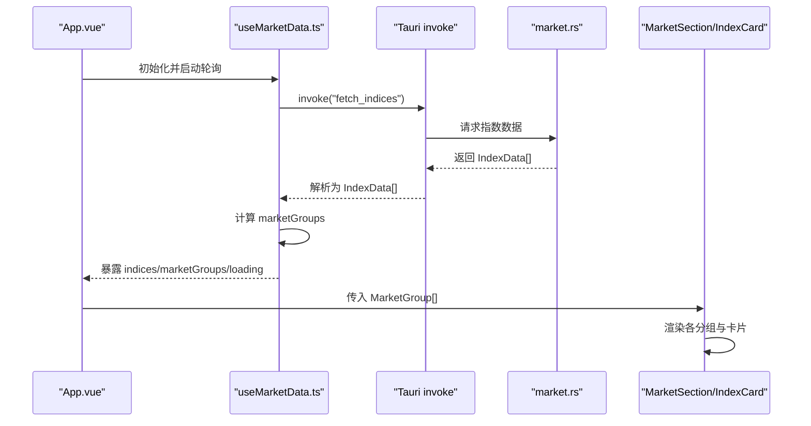
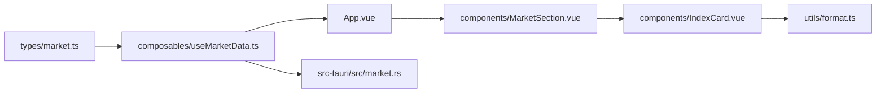
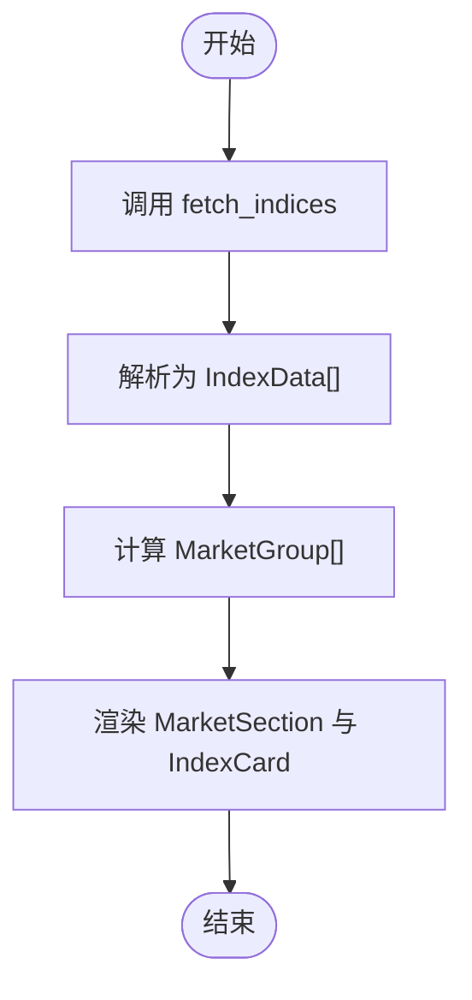

# 类型系统

<cite>
**本文引用的文件**
- [src/types/market.ts](file://src/types/market.ts)
- [src/composables/useMarketData.ts](file://src/composables/useMarketData.ts)
- [src/components/IndexCard.vue](file://src/components/IndexCard.vue)
- [src/components/MarketSection.vue](file://src/components/MarketSection.vue)
- [src/utils/format.ts](file://src/utils/format.ts)
- [src/App.vue](file://src/App.vue)
- [src-tauri/src/market.rs](file://src-tauri/src/market.rs)
- [tsconfig.json](file://tsconfig.json)
</cite>

## 目录
1. [简介](#简介)
2. [项目结构](#项目结构)
3. [核心组件](#核心组件)
4. [架构总览](#架构总览)
5. [详细组件分析](#详细组件分析)
6. [依赖关系分析](#依赖关系分析)
7. [性能考量](#性能考量)
8. [故障排查指南](#故障排查指南)
9. [结论](#结论)
10. [附录](#附录)

## 简介
本文件面向 hq-kanban-app 的 TypeScript 类型系统，聚焦市场数据模型与前后端类型契约。文档将深入解释：
- IndexData 接口的字段定义与业务含义
- MarketGroup 分组结构的设计目的与使用场景
- 前端类型与后端 Rust 结构的对应关系（含预定义指数代码的管理方式）
- 类型安全在前后端通信中的重要性
- 类型扩展与自定义类型的最佳实践
- 类型验证与错误处理策略
- 如何为新数据类型添加支持

## 项目结构
本项目采用“类型集中管理 + 组合式逻辑 + 组件消费”的组织方式：
- 类型定义集中在 src/types/market.ts
- 数据获取与状态管理位于 src/composables/useMarketData.ts
- UI 组件通过 props 消费类型，如 src/components/IndexCard.vue、src/components/MarketSection.vue
- 格式化逻辑位于 src/utils/format.ts
- 应用入口 src/App.vue 组合并渲染市场分组
- 后端 Rust 服务提供数据源，并在 src-tauri/src/market.rs 中定义与前端对齐的数据结构

图表来源
- [src/types/market.ts:1-22](file://src/types/market.ts#L1-L22)
- [src/composables/useMarketData.ts:1-66](file://src/composables/useMarketData.ts#L1-L66)
- [src/components/MarketSection.vue:1-19](file://src/components/MarketSection.vue#L1-L19)
- [src/components/IndexCard.vue:1-71](file://src/components/IndexCard.vue#L1-L71)
- [src/utils/format.ts:1-33](file://src/utils/format.ts#L1-L33)
- [src-tauri/src/market.rs:1-100](file://src-tauri/src/market.rs#L1-L100)

章节来源
- [src/types/market.ts:1-22](file://src/types/market.ts#L1-L22)
- [src/composables/useMarketData.ts:1-66](file://src/composables/useMarketData.ts#L1-L66)
- [src/components/IndexCard.vue:1-71](file://src/components/IndexCard.vue#L1-L71)
- [src/components/MarketSection.vue:1-19](file://src/components/MarketSection.vue#L1-L19)
- [src/utils/format.ts:1-33](file://src/utils/format.ts#L1-L33)
- [src/App.vue:1-36](file://src/App.vue#L1-L36)
- [src-tauri/src/market.rs:1-100](file://src-tauri/src/market.rs#L1-L100)
- [tsconfig.json:1-24](file://tsconfig.json#L1-L24)

## 核心组件
- IndexData：描述单个指数的完整行情快照，包含代码、名称、当前价、昨收、开盘、最高、最低、涨跌额、涨跌幅、成交量、成交额、市场类别、更新时间等。
- MarketGroup：用于将一组指数按市场维度进行分组展示，包含分组键、显示标签和指数数组。
- useMarketData：组合式函数负责拉取数据、维护 loading 状态、计算分组、定时轮询与生命周期管理。
- 组件层：IndexCard 展示单条指数卡片；MarketSection 渲染某一分组的多个卡片；App 聚合分组并处理空态。

章节来源
- [src/types/market.ts:1-22](file://src/types/market.ts#L1-L22)
- [src/composables/useMarketData.ts:1-66](file://src/composables/useMarketData.ts#L1-L66)
- [src/components/IndexCard.vue:1-71](file://src/components/IndexCard.vue#L1-L71)
- [src/components/MarketSection.vue:1-19](file://src/components/MarketSection.vue#L1-L19)
- [src/App.vue:1-36](file://src/App.vue#L1-L36)

## 架构总览
前端通过 Tauri 调用后端 fetch_indices 接口获取指数列表，数据以 IndexData[] 形式返回，再由 useMarketData 计算为 MarketGroup[] 供 UI 渲染。类型系统在前后端之间充当契约，确保数据结构一致性与编译期检查。

图表来源
- [src/App.vue:1-36](file://src/App.vue#L1-L36)
- [src/composables/useMarketData.ts:1-66](file://src/composables/useMarketData.ts#L1-L66)
- [src-tauri/src/market.rs:1-100](file://src-tauri/src/market.rs#L1-L100)
- [src/components/MarketSection.vue:1-19](file://src/components/MarketSection.vue#L1-L19)
- [src/components/IndexCard.vue:1-71](file://src/components/IndexCard.vue#L1-L71)

## 详细组件分析

### IndexData 接口设计
- 字段说明（结合前后端实现）：
  - code：指数代码，用于唯一标识与分组判断依据之一
  - name：指数名称
  - current：当前价格
  - prev_close：昨日收盘价
  - open：开盘价
  - high：最高价
  - low：最低价
  - change：涨跌额
  - change_pct：涨跌幅（百分比）
  - volume：成交量
  - amount：成交额
  - market：市场类别，限定为 'a' | 'hk' | 'us'，便于前端分组
  - update_time：更新时间字符串
- 业务含义：该结构承载一次完整的指数快照，既满足展示需求，也支撑趋势计算（涨跌方向、颜色、边框样式）。
- 类型约束：market 使用字面量联合类型，避免非法值进入 UI 分支逻辑。

章节来源
- [src/types/market.ts:1-15](file://src/types/market.ts#L1-L15)
- [src-tauri/src/market.rs:3-18](file://src-tauri/src/market.rs#L3-L18)
- [src/components/IndexCard.vue:1-71](file://src/components/IndexCard.vue#L1-L71)

### MarketGroup 分组结构
- 设计目的：将指数按市场维度（A 股、港股、美股）分组，提升信息密度与可读性。
- 字段说明：
  - key：分组键，与 market 取值一致，便于筛选与路由扩展
  - label：展示用标签
  - indices：该分组下的指数列表
- 使用场景：MarketSection 接收 MarketGroup 作为 prop，内部循环渲染 IndexCard；useMarketData 通过 computed 动态生成分组，保证响应式更新。

章节来源
- [src/types/market.ts:17-21](file://src/types/market.ts#L17-L21)
- [src/composables/useMarketData.ts:13-23](file://src/composables/useMarketData.ts#L13-L23)
- [src/components/MarketSection.vue:1-19](file://src/components/MarketSection.vue#L1-L19)

### 预定义指数代码集合（IndexCodes）与管理方式
- 作用：在后端集中管理需要抓取的指数代码清单，统一数据来源，避免分散配置导致的不一致。
- 管理方式：
  - 后端以常量字符串维护，拼接成查询 URL
  - 前端无需感知具体代码，仅消费结果数据
  - 新增指数时仅需在后端常量中添加，前端无需改动
- 市场分类：后端根据代码前缀推断 market 字段（sh/sz -> a；r_hk -> hk；r_us -> us），保证前端分组稳定。

章节来源
- [src-tauri/src/market.rs:20-39](file://src-tauri/src/market.rs#L20-L39)

### 类型安全在前后端通信中的重要性
- 编译期保障：TypeScript strict 模式启用严格检查，减少运行时类型错误。
- 契约一致性：前端 IndexData 与后端 IndexData 字段一一对应，降低序列化/反序列化风险。
- 可维护性：当字段变更时，编译器会提示所有受影响位置，便于快速定位与修复。
- 工具链支持：TS 配置开启严格模式与模块隔离，提高类型推断质量。

章节来源
- [tsconfig.json:1-24](file://tsconfig.json#L1-L24)
- [src/composables/useMarketData.ts:25-36](file://src/composables/useMarketData.ts#L25-L36)
- [src-tauri/src/market.rs:3-18](file://src-tauri/src/market.rs#L3-L18)

### 类型扩展与自定义类型最佳实践
- 新增字段：
  - 先在 types/market.ts 中扩展 IndexData 或新增类型
  - 同步更新后端 Rust 结构体字段与映射逻辑
  - 在组件与格式化函数中使用新字段时，TS 会提示缺失实现
- 新增市场类别：
  - 若需新增 market 枚举值，先在前端 IndexData 的 market 字面量联合类型中扩展
  - 在后端 market_type 函数中增加分支映射
  - 在 useMarketData 的分组逻辑中补充对应分组
- 建议：
  - 保持前后端字段命名与语义一致
  - 对可选字段使用 ? 标记，并提供默认值或空态处理
  - 对枚举类字段优先使用字面量联合类型而非任意字符串

章节来源
- [src/types/market.ts:1-21](file://src/types/market.ts#L1-L21)
- [src/composables/useMarketData.ts:13-23](file://src/composables/useMarketData.ts#L13-L23)
- [src-tauri/src/market.rs:29-39](file://src-tauri/src/market.rs#L29-L39)

### 类型验证与错误处理策略
- 输入校验：
  - 后端对空字符串与解析失败做容错处理，确保数值字段有默认值
  - 前端通过 TS 类型约束与 computed 派生状态，避免无效分支
- 异常捕获：
  - 数据拉取失败时记录错误日志，并保持 loading 状态复位
  - 网络异常或解析异常不影响已渲染数据，用户体验更稳健
- 空态处理：
  - 当所有分组无数据且非加载中时，展示“暂无数据”提示

章节来源
- [src-tauri/src/market.rs:22-27](file://src-tauri/src/market.rs#L22-L27)
- [src/composables/useMarketData.ts:25-36](file://src/composables/useMarketData.ts#L25-L36)
- [src/App.vue:26-32](file://src/App.vue#L26-L32)

### 为新数据类型添加支持的步骤
- 定义类型：在 types/market.ts 中新增接口或类型别名
- 更新组合式逻辑：在 useMarketData.ts 中引入并使用新类型，必要时扩展分组或派生状态
- 更新组件：在 IndexCard.vue 或 MarketSection.vue 中消费新类型，并通过 format.ts 提供格式化能力
- 更新后端：在 market.rs 中扩展数据结构与解析逻辑，确保字段映射正确
- 验证：运行类型检查与端到端测试，确认前后端契约一致

章节来源
- [src/types/market.ts:1-22](file://src/types/market.ts#L1-L22)
- [src/composables/useMarketData.ts:1-66](file://src/composables/useMarketData.ts#L1-L66)
- [src/components/IndexCard.vue:1-71](file://src/components/IndexCard.vue#L1-L71)
- [src/utils/format.ts:1-33](file://src/utils/format.ts#L1-L33)
- [src-tauri/src/market.rs:1-100](file://src-tauri/src/market.rs#L1-L100)

## 依赖关系分析
- 类型依赖：
  - IndexCard 依赖 IndexData
  - MarketSection 依赖 MarketGroup
  - useMarketData 依赖 IndexData、MarketGroup 以及 Tauri invoke
- 运行时依赖：
  - 前端通过 Tauri 调用后端 fetch_indices
  - 后端依赖 HTTP 客户端与编码库解析远程数据
- 耦合度：
  - 类型层与 UI 层解耦良好，通过 props 传递数据
  - 数据获取与展示分离，便于测试与维护

图表来源
- [src/types/market.ts:1-22](file://src/types/market.ts#L1-L22)
- [src/composables/useMarketData.ts:1-66](file://src/composables/useMarketData.ts#L1-L66)
- [src/components/MarketSection.vue:1-19](file://src/components/MarketSection.vue#L1-L19)
- [src/components/IndexCard.vue:1-71](file://src/components/IndexCard.vue#L1-L71)
- [src/utils/format.ts:1-33](file://src/utils/format.ts#L1-L33)
- [src-tauri/src/market.rs:1-100](file://src-tauri/src/market.rs#L1-L100)

章节来源
- [src/types/market.ts:1-22](file://src/types/market.ts#L1-L22)
- [src/composables/useMarketData.ts:1-66](file://src/composables/useMarketData.ts#L1-L66)
- [src/components/IndexCard.vue:1-71](file://src/components/IndexCard.vue#L1-L71)
- [src/components/MarketSection.vue:1-19](file://src/components/MarketSection.vue#L1-L19)
- [src/utils/format.ts:1-33](file://src/utils/format.ts#L1-L33)
- [src-tauri/src/market.rs:1-100](file://src-tauri/src/market.rs#L1-L100)

## 性能考量
- 轮询间隔：默认 3 秒刷新一次，平衡实时性与资源消耗
- 计算优化：marketGroups 使用 computed 缓存，仅在 indices 变化时重算
- 渲染优化：v-for 使用 index.code 作为 key，提升列表更新效率
- 网络与解析：后端批量抓取与 GBK 解码，减少多次请求开销

章节来源
- [src/composables/useMarketData.ts:5-6, 13-23, 38-48:5-6](file://src/composables/useMarketData.ts#L5-L6)
- [src/components/MarketSection.vue:14-16](file://src/components/MarketSection.vue#L14-L16)
- [src-tauri/src/market.rs:41-99](file://src-tauri/src/market.rs#L41-L99)

## 故障排查指南
- 数据为空：
  - 检查后端 INDEX_CODES 是否有效，网络是否可达
  - 查看控制台错误日志，确认 invoke 是否抛出异常
- 分组异常：
  - 核对 market 字段是否为预期字面量值
  - 检查 useMarketData 的过滤条件与市场分类逻辑
- 显示格式异常：
  - 检查 format.ts 中的格式化函数是否覆盖边界情况
  - 确认组件模板绑定的字段是否存在于 IndexData

章节来源
- [src/composables/useMarketData.ts:25-36](file://src/composables/useMarketData.ts#L25-L36)
- [src-tauri/src/market.rs:20-39](file://src-tauri/src/market.rs#L20-L39)
- [src/utils/format.ts:1-33](file://src/utils/format.ts#L1-L33)
- [src/components/IndexCard.vue:10-38](file://src/components/IndexCard.vue#L10-L38)

## 结论
本项目的类型系统以 IndexData 与 MarketGroup 为核心，配合严格的 TS 配置与前后端一致的契约，实现了高内聚、低耦合的市场看板功能。通过集中管理指数代码与统一的市场分类，既保证了数据的准确性，又提升了可扩展性。遵循本文的最佳实践，可在不破坏现有类型契约的前提下平滑扩展新功能。

## 附录
- 关键流程图：数据获取与分组渲染流程
- 关键序列图：前后端交互时序

[本图为概念性流程图，不直接映射具体源码]