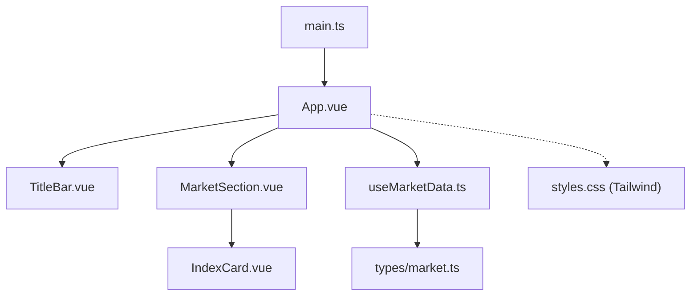
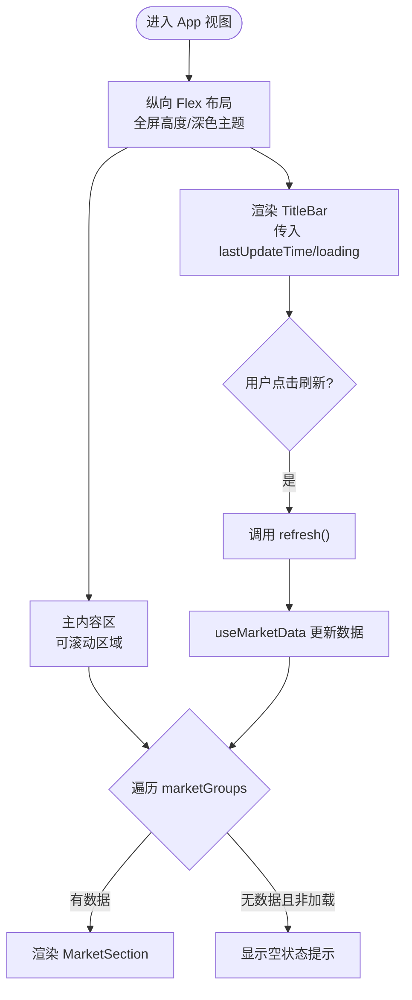
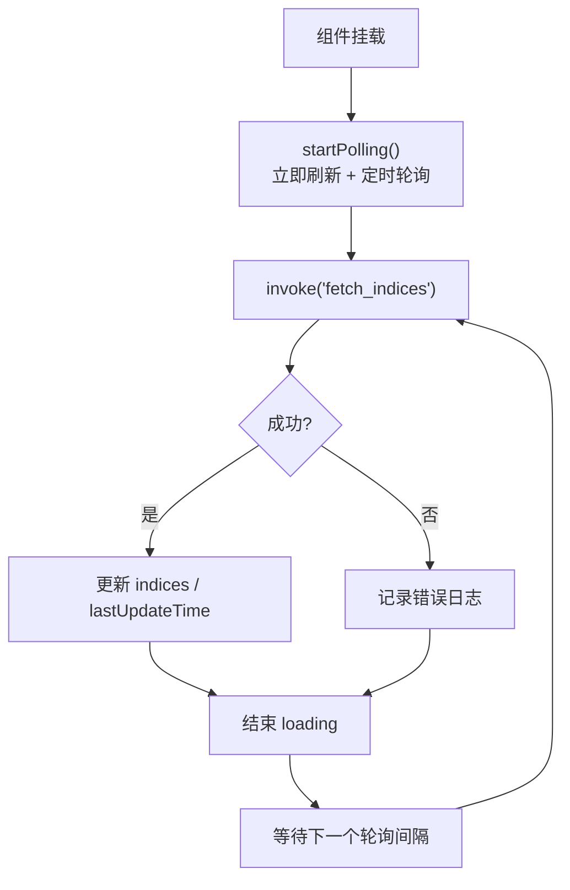
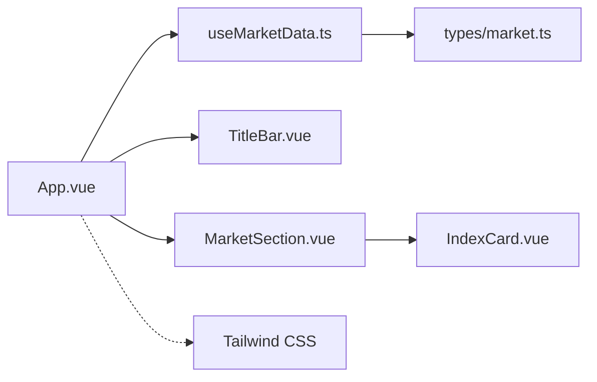

# App根组件

<cite>
**本文引用的文件**
- [App.vue](file://src/App.vue)
- [TitleBar.vue](file://src/components/TitleBar.vue)
- [MarketSection.vue](file://src/components/MarketSection.vue)
- [IndexCard.vue](file://src/components/IndexCard.vue)
- [useMarketData.ts](file://src/composables/useMarketData.ts)
- [market.ts](file://src/types/market.ts)
- [main.ts](file://src/main.ts)
- [styles.css](file://src/styles.css)
- [package.json](file://package.json)
</cite>

## 目录
1. [简介](#简介)
2. [项目结构](#项目结构)
3. [核心组件与职责](#核心组件与职责)
4. [架构总览](#架构总览)
5. [详细组件分析](#详细组件分析)
6. [依赖关系分析](#依赖关系分析)
7. [性能考量](#性能考量)
8. [故障排查指南](#故障排查指南)
9. [结论](#结论)
10. [附录](#附录)

## 简介
本文件聚焦于 hq-kanban-app 的 App 根组件，系统阐述其作为应用入口的职责、组织结构以及与 TitleBar 标题栏、MarketSection 市场分区等子组件的集成方式。文档同时深入解析 useMarketData 组合式函数的状态管理（marketGroups、loading、lastUpdateTime、refresh），说明组件间通过 props 传递数据与事件处理的通信模式，解释响应式布局（flex 布局与滚动区域）的实现，并覆盖空状态与加载状态的显示逻辑，以及样式系统与 Tailwind CSS 的使用模式。

## 项目结构
- 应用入口：main.ts 创建 Vue 应用实例并挂载到 #app，引入全局样式。
- 根组件：App.vue 组织页面骨架，集成标题栏与市场分区，并通过组合式函数获取行情数据。
- 子组件：
  - TitleBar.vue：自定义窗口标题栏，支持拖拽、最小化、关闭及刷新触发。
  - MarketSection.vue：按市场分组渲染指数卡片网格。
  - IndexCard.vue：展示单个指数的价格、涨跌、成交量等信息。
- 组合式函数：useMarketData.ts 负责定时轮询后端接口、计算分组数据、维护加载与更新时间。
- 类型定义：market.ts 定义指数数据与分组数据结构。
- 样式：styles.css 引入 Tailwind CSS；Tailwind 通过 Vite 插件在构建时生效。



图表来源
- [main.ts:1-6](file://src/main.ts#L1-L6)
- [App.vue:1-36](file://src/App.vue#L1-L36)
- [TitleBar.vue:1-63](file://src/components/TitleBar.vue#L1-L63)
- [MarketSection.vue:1-19](file://src/components/MarketSection.vue#L1-L19)
- [IndexCard.vue:1-71](file://src/components/IndexCard.vue#L1-L71)
- [useMarketData.ts:1-66](file://src/composables/useMarketData.ts#L1-L66)
- [market.ts:1-22](file://src/types/market.ts#L1-L22)
- [styles.css:1-2](file://src/styles.css#L1-L2)

章节来源
- [main.ts:1-6](file://src/main.ts#L1-L6)
- [App.vue:1-36](file://src/App.vue#L1-L36)
- [styles.css:1-2](file://src/styles.css#L1-L2)
- [package.json:1-26](file://package.json#L1-L26)

## 核心组件与职责
- App.vue（根组件）
  - 职责：应用容器与布局编排；集成 TitleBar 与 MarketSection；使用 useMarketData 管理数据与交互；处理空状态与滚动区域。
  - 关键行为：从 useMarketData 解构 marketGroups、loading、lastUpdateTime、refresh；将 lastUpdateTime 与 loading 以 props 传递给 TitleBar；监听 refresh 事件调用刷新方法；按组渲染 MarketSection；当所有分组无数据且未加载中时显示空状态提示。
- TitleBar.vue（标题栏）
  - 职责：展示标题、最后更新时间、加载指示器；提供刷新按钮；实现窗口拖拽、最小化、关闭。
  - 通信：接收 lastUpdateTime、loading 属性；通过 emit('refresh') 向父组件发出刷新请求。
- MarketSection.vue（市场分区）
  - 职责：渲染分组标题与指数卡片网格；将 group 数据透传给 IndexCard。
  - 通信：接收 group 属性（MarketGroup）。
- IndexCard.vue（指数卡片）
  - 职责：展示单条指数数据的名称、当前价、涨跌额/涨跌幅、成交量/成交额；根据涨跌趋势动态着色。
  - 通信：接收 data 属性（IndexData）。
- useMarketData.ts（组合式函数）
  - 职责：维护 indices、loading、lastUpdateTime；计算 marketGroups；定时轮询 fetch_indices；暴露 refresh 供外部触发。
  - 生命周期：组件挂载时启动轮询；卸载时清理定时器。
- types/market.ts（类型定义）
  - 职责：定义 IndexData 与 MarketGroup 的结构，确保前后端数据契约一致。

章节来源
- [App.vue:1-36](file://src/App.vue#L1-L36)
- [TitleBar.vue:1-63](file://src/components/TitleBar.vue#L1-L63)
- [MarketSection.vue:1-19](file://src/components/MarketSection.vue#L1-L19)
- [IndexCard.vue:1-71](file://src/components/IndexCard.vue#L1-L71)
- [useMarketData.ts:1-66](file://src/composables/useMarketData.ts#L1-L66)
- [market.ts:1-22](file://src/types/market.ts#L1-L22)

## 架构总览
App 根组件作为视图层协调者，通过组合式函数集中管理数据流，子组件仅关注展示与局部交互。数据流向如下：
- 初始化：useMarketData 在挂载后启动轮询，调用 Tauri invoke 获取行情数据。
- 更新：收到数据后更新 indices，计算 marketGroups，设置 lastUpdateTime，结束 loading。
- 渲染：App 根据 marketGroups 渲染 MarketSection，每个 MarketSection 渲染若干 IndexCard。
- 交互：用户点击刷新或自动轮询触发 refresh，重复上述流程。

```mermaid
sequenceDiagram
participant App as "App.vue"
participant UseMD as "useMarketData.ts"
participant Tauri as "Tauri Core"
participant Title as "TitleBar.vue"
participant Market as "MarketSection.vue"
participant Card as "IndexCard.vue"
App->>UseMD : 初始化(挂载)
UseMD->>Tauri : invoke("fetch_indices")
Tauri-->>UseMD : 返回指数数组
UseMD->>UseMD : 更新indices/loading/lastUpdateTime
UseMD-->>App : 暴露marketGroups/loading/lastUpdateTime/refresh
App->>Title : 传递lastUpdateTime, loading
App->>Market : 遍历marketGroups传递group
Market->>Card : 传递index数据
Note over App,Card : 用户点击刷新或自动轮询时重复上述流程
```

图表来源
- [useMarketData.ts:25-36](file://src/composables/useMarketData.ts#L25-L36)
- [App.vue:10-24](file://src/App.vue#L10-L24)
- [TitleBar.vue:44-51](file://src/components/TitleBar.vue#L44-L51)
- [MarketSection.vue:14-16](file://src/components/MarketSection.vue#L14-L16)
- [IndexCard.vue:41-69](file://src/components/IndexCard.vue#L41-L69)

## 详细组件分析

### App.vue：应用入口与布局编排
- 数据与状态
  - 使用 useMarketData 获取 marketGroups、loading、lastUpdateTime、refresh。
  - marketGroups 为按市场分组的指数列表，用于渲染不同分区。
- 模板与布局
  - 外层容器使用 flex 纵向布局，固定高度占满视口，背景色与文字颜色统一。
  - 主内容区使用 flex-1 自适应剩余空间，overflow-y-auto 启用垂直滚动，内边距 p-4。
  - 通过 v-for 渲染 MarketSection，key 使用 group.key。
  - 空状态：当所有分组 indices 为空且不在加载中时，显示“暂无数据”提示。
- 事件绑定
  - 向 TitleBar 传递 lastUpdateTime、loading，并绑定 @refresh="refresh" 以触发数据刷新。



图表来源
- [App.vue:10-33](file://src/App.vue#L10-L33)
- [useMarketData.ts:25-36](file://src/composables/useMarketData.ts#L25-L36)

章节来源
- [App.vue:1-36](file://src/App.vue#L1-L36)

### TitleBar.vue：标题栏与窗口控制
- 属性与事件
  - 接收 lastUpdateTime、loading；emit('refresh') 通知父组件刷新。
- 功能
  - 双击不触发拖拽，避免与最大化切换冲突；仅左键拖动。
  - 最小化与关闭窗口通过 Tauri API 实现。
  - 加载状态下显示脉动指示器，提升交互反馈。
- 样式
  - 使用 Tailwind 类实现紧凑布局、边框分隔、悬停高亮等。

章节来源
- [TitleBar.vue:1-63](file://src/components/TitleBar.vue#L1-L63)

### MarketSection.vue：市场分区与网格布局
- 属性
  - 接收 group（MarketGroup），包含 key、label、indices。
- 渲染
  - 顶部显示分组标题与分割线。
  - 使用 grid grid-cols-3 三列网格展示指数卡片，间距 gap-3。
- 子组件
  - 对每个指数渲染 IndexCard，传递 data。

章节来源
- [MarketSection.vue:1-19](file://src/components/MarketSection.vue#L1-L19)

### IndexCard.vue：指数卡片展示
- 数据与计算
  - 接收 data（IndexData），基于 change 计算趋势（up/down/flat）。
  - 根据趋势动态设置文本颜色、背景透明度、左边框颜色。
- 展示
  - 名称、当前价格、涨跌额/涨跌幅、成交量/成交额。
  - 数值格式化通过工具函数完成。

章节来源
- [IndexCard.vue:1-71](file://src/components/IndexCard.vue#L1-L71)

### useMarketData.ts：数据获取与状态管理
- 状态
  - indices：原始指数数组。
  - marketGroups：computed 派生，按 market 字段分为 A 股、港股、美股三个分组。
  - loading：是否正在拉取数据。
  - lastUpdateTime：最近一次更新时间字符串。
- 方法
  - refresh：设置 loading=true，调用 Tauri invoke 获取数据，成功后更新 indices 与 lastUpdateTime，finally 中重置 loading。
  - startPolling：首次立即刷新，然后每 3 秒定时刷新。
  - stopPolling：清除定时器。
- 生命周期
  - onMounted：启动轮询。
  - onUnmounted：停止轮询，避免内存泄漏。



图表来源
- [useMarketData.ts:25-56](file://src/composables/useMarketData.ts#L25-L56)

章节来源
- [useMarketData.ts:1-66](file://src/composables/useMarketData.ts#L1-L66)

### 类型定义：market.ts
- IndexData：描述单个指数的代码、名称、价格、涨跌、成交量、成交额、所属市场、更新时间等。
- MarketGroup：描述分组键、标签与指数数组。

章节来源
- [market.ts:1-22](file://src/types/market.ts#L1-L22)

## 依赖关系分析
- 组件耦合
  - App.vue 与 useMarketData.ts 强耦合（数据源），与 TitleBar.vue、MarketSection.vue 松耦合（通过 props/events）。
  - MarketSection.vue 与 IndexCard.vue 通过 props 单向传递数据。
- 外部依赖
  - @tauri-apps/api：用于窗口操作与 invoke 调用后端能力。
  - Vue 3：响应式与组合式 API。
  - Tailwind CSS：原子化样式库，通过 Vite 插件引入。
- 潜在循环依赖
  - 当前结构清晰，无循环导入。



图表来源
- [App.vue:1-36](file://src/App.vue#L1-L36)
- [useMarketData.ts:1-66](file://src/composables/useMarketData.ts#L1-L66)
- [TitleBar.vue:1-63](file://src/components/TitleBar.vue#L1-L63)
- [MarketSection.vue:1-19](file://src/components/MarketSection.vue#L1-L19)
- [IndexCard.vue:1-71](file://src/components/IndexCard.vue#L1-L71)
- [market.ts:1-22](file://src/types/market.ts#L1-L22)
- [styles.css:1-2](file://src/styles.css#L1-L2)

章节来源
- [package.json:12-24](file://package.json#L12-L24)
- [styles.css:1-2](file://src/styles.css#L1-L2)

## 性能考量
- 轮询频率
  - 默认 3 秒轮询，可根据网络与后端负载调整 POLL_INTERVAL。
- 计算优化
  - marketGroups 使用 computed 缓存，仅在 indices 变化时重新计算。
- 渲染优化
  - 使用稳定的 key（group.key、index.code）提升列表渲染性能。
- 资源释放
  - 组件卸载时清理定时器，避免内存泄漏。
- 样式性能
  - 使用 Tailwind 原子类减少自定义 CSS 体积，按需生成样式。

[本节为通用性能建议，不直接分析具体文件]

## 故障排查指南
- 数据无法加载
  - 检查 Tauri invoke 是否正确配置后端命令 fetch_indices。
  - 查看控制台错误日志，确认网络或权限问题。
- 刷新无效
  - 确认 TitleBar 的 @refresh 事件已正确绑定到 App 的 refresh 方法。
  - 检查 useMarketData 中的 loading 状态是否在 finally 中重置。
- 空状态一直显示
  - 确认 marketGroups 的计算逻辑是否正确过滤市场字段。
  - 检查 indices 是否为空数组或数据格式不符合预期。
- 窗口控制异常
  - 确认运行环境为 Tauri 桌面应用，浏览器环境下 window.startDragging 等方法不可用。

章节来源
- [useMarketData.ts:25-36](file://src/composables/useMarketData.ts#L25-L36)
- [TitleBar.vue:13-27](file://src/components/TitleBar.vue#L13-L27)
- [App.vue:26-33](file://src/App.vue#L26-L33)

## 结论
App 根组件通过简洁的组合式函数与清晰的组件分层，实现了行情看板的核心功能：数据轮询、分组展示、用户交互与状态反馈。结合 Tailwind CSS 的原子化样式与 Tauri 的桌面能力，提供了跨平台的稳定体验。未来可在以下方面持续优化：
- 增加错误重试与退避策略。
- 支持手动分页或虚拟滚动以应对大量指数场景。
- 扩展更多市场维度与筛选条件。

[本节为总结性内容，不直接分析具体文件]

## 附录
- 样式系统
  - 通过 styles.css 引入 Tailwind CSS，配合 package.json 中的 tailwindcss 与 @tailwindcss/vite 插件，在构建时生成样式。
- 开发脚本
  - dev/build/preview/tauri 等脚本位于 package.json，便于本地开发与打包。

章节来源
- [styles.css:1-2](file://src/styles.css#L1-L2)
- [package.json:6-11](file://package.json#L6-L11)
- [package.json:12-24](file://package.json#L12-L24)