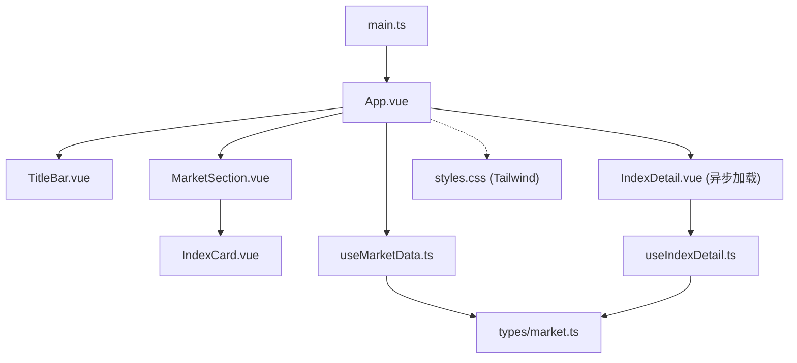
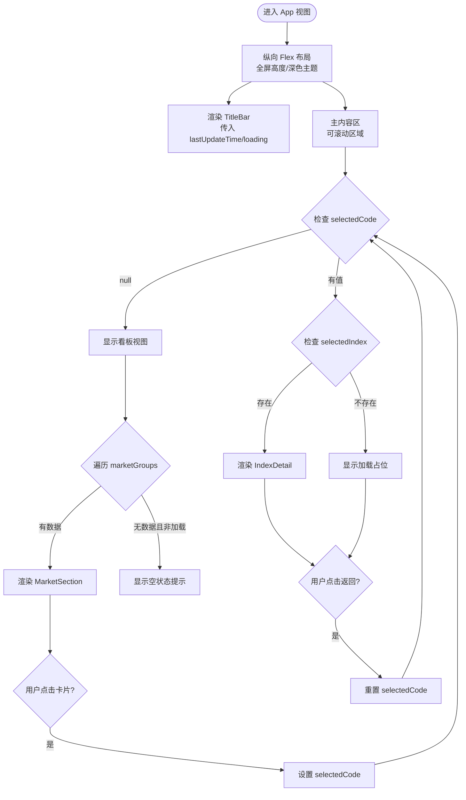
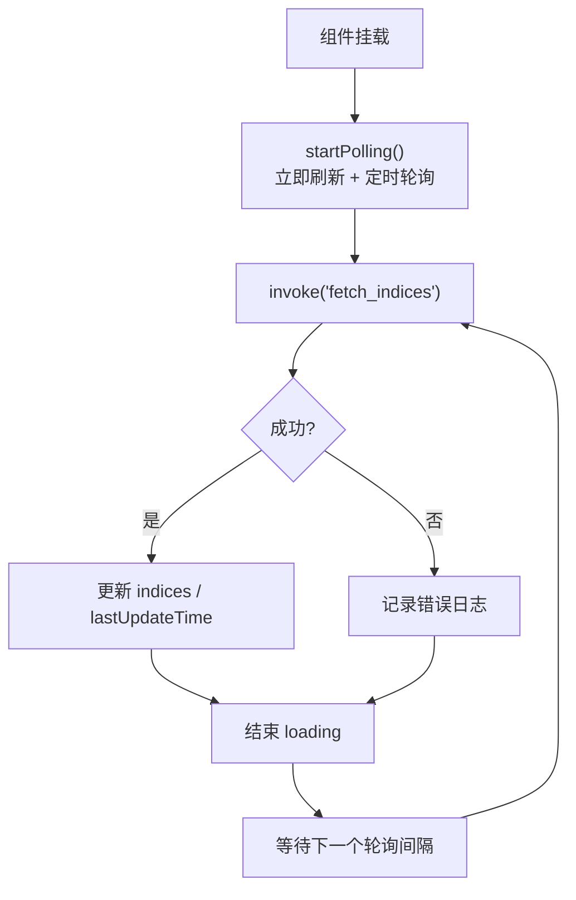
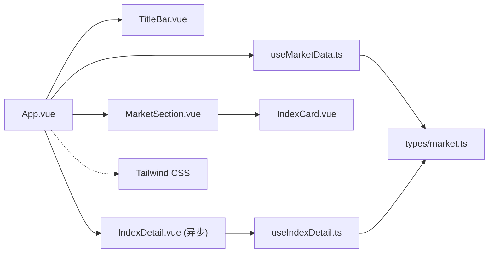

# App根组件

<cite>
**本文引用的文件**
- [App.vue](file://src/App.vue)
- [TitleBar.vue](file://src/components/TitleBar.vue)
- [MarketSection.vue](file://src/components/MarketSection.vue)
- [IndexCard.vue](file://src/components/IndexCard.vue)
- [IndexDetail.vue](file://src/components/IndexDetail.vue)
- [useMarketData.ts](file://src/composables/useMarketData.ts)
- [useIndexDetail.ts](file://src/composables/useIndexDetail.ts)
- [market.ts](file://src/types/market.ts)
- [main.ts](file://src/main.ts)
- [styles.css](file://src/styles.css)
- [package.json](file://package.json)
</cite>

## 更新摘要
**变更内容**
- 新增指数详情页视图切换功能，通过selectedCode状态管理看板与详情视图
- 集成IndexDetail组件支持分时线和K线图展示
- 实现无路由的状态切换机制，避免引入vue-router
- 添加异步组件加载优化首屏性能
- 完善事件处理机制，支持从详情返回看板

## 目录
1. [简介](#简介)
2. [项目结构](#项目结构)
3. [核心组件与职责](#核心组件与职责)
4. [架构总览](#架构总览)
5. [详细组件分析](#详细组件分析)
6. [视图切换机制](#视图切换机制)
7. [依赖关系分析](#依赖关系分析)
8. [性能考量](#性能考量)
9. [故障排查指南](#故障排查指南)
10. [结论](#结论)
11. [附录](#附录)

## 简介
本文件聚焦于 hq-kanban-app 的 App 根组件，系统阐述其作为应用入口的职责、组织结构以及与 TitleBar 标题栏、MarketSection 市场分区等子组件的集成方式。**最新更新**：新增了指数详情页视图切换功能，通过 selectedCode 状态管理看板视图和详情视图的显示，实现了无路由的状态切换机制。文档同时深入解析 useMarketData 组合式函数的状态管理（marketGroups、loading、lastUpdateTime、refresh），说明组件间通过 props 传递数据与事件处理的通信模式，解释响应式布局（flex 布局与滚动区域）的实现，并覆盖空状态与加载状态的显示逻辑，以及样式系统与 Tailwind CSS 的使用模式。

## 项目结构
- 应用入口：main.ts 创建 Vue 应用实例并挂载到 #app，引入全局样式。
- 根组件：App.vue 组织页面骨架，集成标题栏与市场分区，并通过组合式函数获取行情数据。**新增**：支持指数详情页视图切换。
- 子组件：
  - TitleBar.vue：自定义窗口标题栏，支持拖拽、最小化、关闭及刷新触发。
  - MarketSection.vue：按市场分组渲染指数卡片网格。
  - IndexCard.vue：展示单个指数的价格、涨跌、成交量等信息。
  - **新增** IndexDetail.vue：展示指数实时报价头部与分时线/K线图。
- 组合式函数：useMarketData.ts 负责定时轮询后端接口、计算分组数据、维护加载与更新时间；**新增** useIndexDetail.ts 负责详情页数据获取与管理。
- 类型定义：market.ts 定义指数数据、分组数据结构及**新增**的分时/K线数据类型。
- 样式：styles.css 引入 Tailwind CSS；Tailwind 通过 Vite 插件在构建时生效。



**图表来源**
- [main.ts:1-6](file://src/main.ts#L1-L6)
- [App.vue:1-68](file://src/App.vue#L1-L68)
- [TitleBar.vue:1-63](file://src/components/TitleBar.vue#L1-L63)
- [MarketSection.vue:1-26](file://src/components/MarketSection.vue#L1-L26)
- [IndexCard.vue:1-74](file://src/components/IndexCard.vue#L1-L74)
- [IndexDetail.vue:1-140](file://src/components/IndexDetail.vue#L1-L140)
- [useMarketData.ts:1-66](file://src/composables/useMarketData.ts#L1-L66)
- [useIndexDetail.ts:1-144](file://src/composables/useIndexDetail.ts#L1-L144)
- [market.ts:1-55](file://src/types/market.ts#L1-L55)
- [styles.css:1-2](file://src/styles.css#L1-L2)

**章节来源**
- [main.ts:1-6](file://src/main.ts#L1-L6)
- [App.vue:1-68](file://src/App.vue#L1-L68)
- [styles.css:1-2](file://src/styles.css#L1-L2)
- [package.json:1-26](file://package.json#L1-L26)

## 核心组件与职责
- App.vue（根组件）
  - 职责：应用容器与布局编排；集成 TitleBar 与 MarketSection；使用 useMarketData 管理数据与交互；**新增**：管理视图切换状态，支持看板与详情视图切换。
  - 关键行为：从 useMarketData 解构 marketGroups、loading、lastUpdateTime、refresh；将 lastUpdateTime 与 loading 以 props 传递给 TitleBar；监听 refresh 事件调用刷新方法；按组渲染 MarketSection；**新增**：通过 selectedCode 状态控制视图显示；当所有分组无数据且未加载中时显示空状态提示。
- TitleBar.vue（标题栏）
  - 职责：展示标题、最后更新时间、加载指示器；提供刷新按钮；实现窗口拖拽、最小化、关闭。
  - 通信：接收 lastUpdateTime、loading 属性；通过 emit('refresh') 向父组件发出刷新请求。
- MarketSection.vue（市场分区）
  - 职责：渲染分组标题与指数卡片网格；将 group 数据透传给 IndexCard；**新增**：通过 select 事件通知父组件用户选择了某个指数。
  - 通信：接收 group 属性（MarketGroup）；emit('select', data) 事件。
- IndexCard.vue（指数卡片）
  - 职责：展示单条指数数据的名称、当前价、涨跌额/涨跌幅、成交量/成交额；根据涨跌趋势动态着色；**新增**：点击时触发 select 事件进入详情页。
  - 通信：接收 data 属性（IndexData）；emit('select', data) 事件。
- **新增** IndexDetail.vue（指数详情）
  - 职责：展示指数实时报价头部与分时线/K线图；支持Tab切换分时、日K、周K、月K；提供返回按钮和ESC键返回功能。
  - 通信：接收 data 属性（IndexData）；emit('back') 事件返回看板。
- useMarketData.ts（组合式函数）
  - 职责：维护 indices、loading、lastUpdateTime；计算 marketGroups；定时轮询 fetch_indices；暴露 refresh 供外部触发。
  - 生命周期：组件挂载时启动轮询；卸载时清理定时器。
- **新增** useIndexDetail.ts（详情页组合式函数）
  - 职责：管理分时数据和K线数据；实现独立轮询机制；提供缓存策略和错误处理；支持周期切换和重试功能。
  - 特性：15秒分时数据轮询；K线数据缓存（60秒TTL）；防重复请求；乱序防护。
- types/market.ts（类型定义）
  - 职责：定义 IndexData 与 MarketGroup 的结构，确保前后端数据契约一致；**新增**：MinutePoint、MinuteData、KlinePeriod、KlineBar、KlineData 类型定义。

**章节来源**
- [App.vue:1-68](file://src/App.vue#L1-L68)
- [TitleBar.vue:1-63](file://src/components/TitleBar.vue#L1-L63)
- [MarketSection.vue:1-26](file://src/components/MarketSection.vue#L1-L26)
- [IndexCard.vue:1-74](file://src/components/IndexCard.vue#L1-L74)
- [IndexDetail.vue:1-140](file://src/components/IndexDetail.vue#L1-L140)
- [useMarketData.ts:1-66](file://src/composables/useMarketData.ts#L1-L66)
- [useIndexDetail.ts:1-144](file://src/composables/useIndexDetail.ts#L1-L144)
- [market.ts:1-55](file://src/types/market.ts#L1-L55)

## 架构总览
App 根组件作为视图层协调者，通过组合式函数集中管理数据流，子组件仅关注展示与局部交互。**新增**：实现了无路由的状态切换机制，通过 selectedCode 状态在看板视图和详情视图之间切换。数据流向如下：
- 初始化：useMarketData 在挂载后启动轮询，调用 Tauri invoke 获取行情数据。
- 视图切换：用户点击指数卡片时，设置 selectedCode 为对应指数代码，切换到详情视图。
- 详情数据：useIndexDetail 独立管理分时和K线数据，15秒轮询分时数据，K线数据带缓存。
- 更新：收到数据后更新 indices，计算 marketGroups，设置 lastUpdateTime，结束 loading。
- 渲染：App 根据 selectedCode 状态决定显示 MarketSection 或 IndexDetail。
- 交互：用户点击刷新或自动轮询触发 refresh，重复上述流程；ESC键或返回按钮退出详情视图。

```mermaid
sequenceDiagram
participant App as "App.vue"
participant UseMD as "useMarketData.ts"
participant UseID as "useIndexDetail.ts"
participant Tauri as "Tauri Core"
participant Title as "TitleBar.vue"
participant Market as "MarketSection.vue"
participant Card as "IndexCard.vue"
participant Detail as "IndexDetail.vue"
App->>UseMD : 初始化(挂载)
UseMD->>Tauri : invoke("fetch_indices")
Tauri-->>UseMD : 返回指数数组
UseMD->>UseMD : 更新indices/loading/lastUpdateTime
UseMD-->>App : 暴露marketGroups/loading/lastUpdateTime/refresh
App->>Title : 传递lastUpdateTime, loading
App->>Market : 遍历marketGroups传递group
Market->>Card : 传递index数据
Card->>App : @select事件(用户点击卡片)
App->>App : selectedCode = code (视图切换)
App->>Detail : 传入selectedIndex数据
Detail->>UseID : 初始化详情数据
UseID->>Tauri : invoke("fetch_minute_data", "fetch_kline_data")
Note over App,Detail : 用户点击返回或ESC键时重置selectedCode
```

**图表来源**
- [useMarketData.ts:25-36](file://src/composables/useMarketData.ts#L25-L36)
- [useIndexDetail.ts:26-73](file://src/composables/useIndexDetail.ts#L26-L73)
- [App.vue:10-52](file://src/App.vue#L10-L52)
- [TitleBar.vue:44-51](file://src/components/TitleBar.vue#L44-L51)
- [MarketSection.vue:14-16](file://src/components/MarketSection.vue#L14-L16)
- [IndexCard.vue:41-69](file://src/components/IndexCard.vue#L41-L69)
- [IndexDetail.vue:47-53](file://src/components/IndexDetail.vue#L47-L53)

## 详细组件分析

### App.vue：应用入口与布局编排
- 数据与状态
  - 使用 useMarketData 获取 marketGroups、loading、lastUpdateTime、refresh。
  - **新增**：selectedCode 状态管理视图切换，null表示看板视图，字符串表示详情视图。
  - **新增**：selectedIndex 计算属性，根据 selectedCode 查找对应的指数数据。
- 模板与布局
  - 外层容器使用 flex 纵向布局，固定高度占满视口，背景色与文字颜色统一。
  - 主内容区使用 flex-1 自适应剩余空间，overflow-y-auto 启用垂直滚动，内边距 p-4。
  - **新增**：条件渲染逻辑，根据 selectedCode 状态显示 MarketSection 或 IndexDetail。
  - 通过 v-for 渲染 MarketSection，key 使用 group.key。
  - 空状态：当所有分组 indices 为空且不在加载中时，显示"暂无数据"提示。
  - **新增**：加载占位状态，当 selectedIndex 不存在时显示加载提示和返回按钮。
- 事件绑定
  - 向 TitleBar 传递 lastUpdateTime、loading，并绑定 @refresh="refresh" 以触发数据刷新。
  - **新增**：MarketSection 的 @select="selectedCode = $event.code" 事件处理，实现视图切换。
  - **新增**：IndexDetail 的 @back="selectedCode = null" 事件处理，实现返回看板。



**图表来源**
- [App.vue:10-65](file://src/App.vue#L10-L65)
- [useMarketData.ts:25-36](file://src/composables/useMarketData.ts#L25-L36)

**章节来源**
- [App.vue:1-68](file://src/App.vue#L1-L68)

### TitleBar.vue：标题栏与窗口控制
- 属性与事件
  - 接收 lastUpdateTime、loading；emit('refresh') 通知父组件刷新。
- 功能
  - 双击不触发拖拽，避免与最大化切换冲突；仅左键拖动。
  - 最小化与关闭窗口通过 Tauri API 实现。
  - 加载状态下显示脉动指示器，提升交互反馈。
- 样式
  - 使用 Tailwind 类实现紧凑布局、边框分隔、悬停高亮等。

**章节来源**
- [TitleBar.vue:1-63](file://src/components/TitleBar.vue#L1-L63)

### MarketSection.vue：市场分区与网格布局
- 属性
  - 接收 group（MarketGroup），包含 key、label、indices。
- 渲染
  - 顶部显示分组标题与分割线。
  - 使用 grid grid-cols-1 md:grid-cols-3 三列网格展示指数卡片，间距 gap-3。
- 子组件
  - 对每个指数渲染 IndexCard，传递 data。
- **新增**：事件处理
  - 通过 emit('select', data) 向父组件传递选中的指数数据。

**章节来源**
- [MarketSection.vue:1-26](file://src/components/MarketSection.vue#L1-L26)

### IndexCard.vue：指数卡片展示
- 数据与计算
  - 接收 data（IndexData），基于 change 计算趋势（up/down/flat）。
  - 根据趋势动态设置文本颜色、背景透明度、左边框颜色。
- 展示
  - 名称、当前价格、涨跌额/涨跌幅、成交量/成交额。
  - 数值格式化通过工具函数完成。
- **新增**：交互功能
  - 点击卡片时触发 select 事件，传递完整指数数据给父组件。

**章节来源**
- [IndexCard.vue:1-74](file://src/components/IndexCard.vue#L1-L74)

### **新增** IndexDetail.vue：指数详情页面
- 数据与状态
  - 接收 data 属性（IndexData），显示指数基本信息。
  - 使用 useIndexDetail 组合式函数管理分时和K线数据。
  - activeTab 状态管理当前激活的标签页（分时、日K、周K、月K）。
- 功能特性
  - 实时报价头部：显示指数名称、代码、当前价格、涨跌信息。
  - Tab切换：支持分时、日K、周K、月K四种图表类型。
  - 键盘导航：支持ESC键返回看板。
  - 错误处理：独立的分时和K线错误状态，支持重试功能。
- 事件处理
  - emit('back') 事件返回看板视图。
  - switchTab 方法处理标签切换。

**章节来源**
- [IndexDetail.vue:1-140](file://src/components/IndexDetail.vue#L1-L140)

### useMarketData.ts：数据获取与状态管理
- 状态
  - indices：原始指数数组。
  - marketGroups：computed 派生，按 market 字段分为 A 股、港股、美股三个分组。
  - loading：是否正在拉取数据。
  - lastUpdateTime：最近一次更新时间字符串。
- 方法
  - refresh：设置 loading=true，调用 Tauri invoke 获取数据，成功后更新 indices 与 lastUpdateTime，finally 中重置 loading。
  - startPolling：首次立即刷新，然后每 3 秒定时刷新。
  - stopPolling：清除定时器。
- 生命周期
  - onMounted：启动轮询。
  - onUnmounted：停止轮询，避免内存泄漏。



**图表来源**
- [useMarketData.ts:25-56](file://src/composables/useMarketData.ts#L25-L56)

**章节来源**
- [useMarketData.ts:1-66](file://src/composables/useMarketData.ts#L1-L66)

### **新增** useIndexDetail.ts：详情页数据管理
- 状态管理
  - minuteData：分时数据，15秒轮询更新。
  - klineData：K线数据，带60秒TTL缓存。
  - activePeriod：当前K线周期（day/week/month）。
  - loading：整体加载状态。
  - error/klineError：独立的错误状态管理。
- 核心功能
  - loadMinute：分时数据获取，支持防重复请求和乱序防护。
  - loadKline：K线数据获取，实现模块级缓存和TTL过期机制。
  - setPeriod：周期切换，避免重复请求相同周期。
  - retryKline：失败重试功能，绕过周期检查直接重新请求。
- 生命周期管理
  - 初始加载：Promise.all并行加载分时和K线数据。
  - 可见性监听：页面不可见时暂停轮询，恢复时重新加载。
  - 资源清理：组件卸载时清理定时器和事件监听器。

**章节来源**
- [useIndexDetail.ts:1-144](file://src/composables/useIndexDetail.ts#L1-L144)

### 类型定义：market.ts
- IndexData：描述单个指数的代码、名称、价格、涨跌、成交量、成交额、所属市场、更新时间等。
- MarketGroup：描述分组键、标签与指数数组。
- **新增**：MinutePoint、MinuteData、KlinePeriod、KlineBar、KlineData 类型定义，支持分时线和K线图数据展示。

**章节来源**
- [market.ts:1-55](file://src/types/market.ts#L1-L55)

## 视图切换机制
**新增功能**：App根组件实现了无路由的状态切换机制，通过 selectedCode 状态管理看板视图和详情视图的显示。

### 状态管理
- selectedCode：ref<string | null>，null表示看板视图，字符串表示选中了某个指数代码。
- selectedIndex：computed属性，根据 selectedCode 从 indices 数组中查找对应的指数数据。

### 视图切换流程
1. **进入详情**：用户点击指数卡片 → IndexCard 触发 select 事件 → App 设置 selectedCode = code → 条件渲染切换到 IndexDetail。
2. **返回看板**：用户点击返回按钮或按ESC键 → IndexDetail 触发 back 事件 → App 重置 selectedCode = null → 条件渲染回到 MarketSection。

### 条件渲染逻辑
- `v-if="!selectedCode"`：显示看板视图（MarketSection）
- `v-else-if="selectedIndex"`：显示详情视图（IndexDetail）
- `v-else`：显示加载占位（当 selectedIndex 不存在时）

### 性能优化
- **异步组件加载**：IndexDetail 使用 defineAsyncComponent 异步加载，lightweight-charts 拆入独立 chunk，首屏看板零体积增量。
- **条件渲染**：使用 v-if/v-else-if/v-else 确保同一时间只渲染一个视图，避免不必要的DOM操作。

**章节来源**
- [App.vue:7-14](file://src/App.vue#L7-L14)
- [App.vue:29-65](file://src/App.vue#L29-L65)

## 依赖关系分析
- 组件耦合
  - App.vue 与 useMarketData.ts 强耦合（数据源），与 TitleBar.vue、MarketSection.vue、IndexDetail.vue 松耦合（通过 props/events）。
  - MarketSection.vue 与 IndexCard.vue 通过 props 单向传递数据。
  - **新增**：IndexDetail.vue 与 useIndexDetail.ts 强耦合（详情数据管理）。
- 外部依赖
  - @tauri-apps/api：用于窗口操作与 invoke 调用后端能力。
  - Vue 3：响应式与组合式 API。
  - Tailwind CSS：原子化样式库，通过 Vite 插件引入。
- 潜在循环依赖
  - 当前结构清晰，无循环导入。



**图表来源**
- [App.vue:1-68](file://src/App.vue#L1-L68)
- [useMarketData.ts:1-66](file://src/composables/useMarketData.ts#L1-L66)
- [useIndexDetail.ts:1-144](file://src/composables/useIndexDetail.ts#L1-L144)
- [TitleBar.vue:1-63](file://src/components/TitleBar.vue#L1-L63)
- [MarketSection.vue:1-26](file://src/components/MarketSection.vue#L1-L26)
- [IndexCard.vue:1-74](file://src/components/IndexCard.vue#L1-L74)
- [IndexDetail.vue:1-140](file://src/components/IndexDetail.vue#L1-L140)
- [market.ts:1-55](file://src/types/market.ts#L1-L55)
- [styles.css:1-2](file://src/styles.css#L1-L2)

**章节来源**
- [package.json:12-24](file://package.json#L12-L24)
- [styles.css:1-2](file://src/styles.css#L1-L2)

## 性能考量
- 轮询频率
  - 默认 3 秒轮询（看板数据），可根据网络与后端负载调整 POLL_INTERVAL。
  - **新增**：详情页 15 秒分时数据轮询，独立于看板轮询。
- 计算优化
  - marketGroups 使用 computed 缓存，仅在 indices 变化时重新计算。
  - **新增**：selectedIndex 计算属性，避免重复查找操作。
- 渲染优化
  - 使用稳定的 key（group.key、index.code）提升列表渲染性能。
  - **新增**：条件渲染确保同一时间只渲染一个视图。
- 资源释放
  - 组件卸载时清理定时器，避免内存泄漏。
  - **新增**：useIndexDetail 在页面不可见时暂停轮询，减少不必要请求。
- 资源优化
  - **新增**：IndexDetail 组件异步加载，lightweight-charts 拆入独立 chunk，首屏零体积增量。
  - **新增**：K线数据缓存（60秒TTL），避免重复请求相同周期数据。
- 样式性能
  - 使用 Tailwind 原子类减少自定义 CSS 体积，按需生成样式。

## 故障排查指南
- 数据无法加载
  - 检查 Tauri invoke 是否正确配置后端命令 fetch_indices。
  - 查看控制台错误日志，确认网络或权限问题。
- 刷新无效
  - 确认 TitleBar 的 @refresh 事件已正确绑定到 App 的 refresh 方法。
  - 检查 useMarketData 中的 loading 状态是否在 finally 中重置。
- 视图切换异常
  - **新增**：检查 selectedCode 状态是否正确更新和重置。
  - **新增**：确认 selectedIndex 计算属性能正确找到对应指数数据。
  - **新增**：验证条件渲染逻辑是否正确执行。
- 详情页数据问题
  - **新增**：检查 useIndexDetail 的轮询是否正常启动。
  - **新增**：确认 fetch_minute_data 和 fetch_kline_data 命令已正确注册。
  - **新增**：检查 K线缓存机制是否正常工作。
- 空状态一直显示
  - 确认 marketGroups 的计算逻辑是否正确过滤市场字段。
  - 检查 indices 是否为空数组或数据格式不符合预期。
- 窗口控制异常
  - 确认运行环境为 Tauri 桌面应用，浏览器环境下 window.startDragging 等方法不可用。

**章节来源**
- [useMarketData.ts:25-36](file://src/composables/useMarketData.ts#L25-L36)
- [useIndexDetail.ts:26-73](file://src/composables/useIndexDetail.ts#L26-L73)
- [TitleBar.vue:13-27](file://src/components/TitleBar.vue#L13-L27)
- [App.vue:29-65](file://src/App.vue#L29-L65)

## 结论
App 根组件通过简洁的组合式函数与清晰的组件分层，实现了行情看板的核心功能：数据轮询、分组展示、用户交互与状态反馈。**最新更新**：新增了指数详情页视图切换功能，通过 selectedCode 状态管理看板与详情视图，实现了无路由的状态切换机制。结合 Tailwind CSS 的原子化样式与 Tauri 的桌面能力，提供了跨平台的稳定体验。未来可在以下方面持续优化：
- 增加错误重试与退避策略。
- 支持手动分页或虚拟滚动以应对大量指数场景。
- 扩展更多市场维度与筛选条件。
- **新增**：考虑添加路由历史管理，支持浏览器前进后退功能。
- **新增**：优化移动端触摸手势支持，提升用户体验。

## 附录
- 样式系统
  - 通过 styles.css 引入 Tailwind CSS，配合 package.json 中的 tailwindcss 与 @tailwindcss/vite 插件，在构建时生成样式。
- 开发脚本
  - dev/build/preview/tauri 等脚本位于 package.json，便于本地开发与打包。
- **新增**：异步组件加载
  - IndexDetail 组件使用 defineAsyncComponent 实现懒加载，优化首屏性能。
- **新增**：数据缓存策略
  - K线数据采用模块级缓存，60秒TTL过期机制，减少重复请求。

**章节来源**
- [styles.css:1-2](file://src/styles.css#L1-L2)
- [package.json:6-11](file://package.json#L6-L11)
- [package.json:12-24](file://package.json#L12-L24)
- [App.vue:7-8](file://src/App.vue#L7-L8)
- [useIndexDetail.ts:11-12](file://src/composables/useIndexDetail.ts#L11-L12)