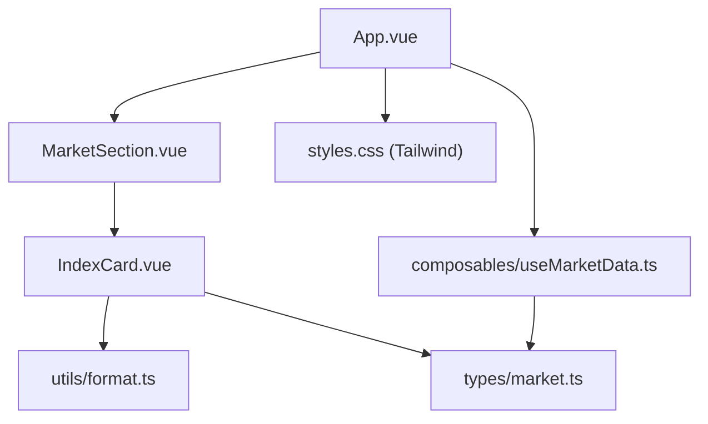
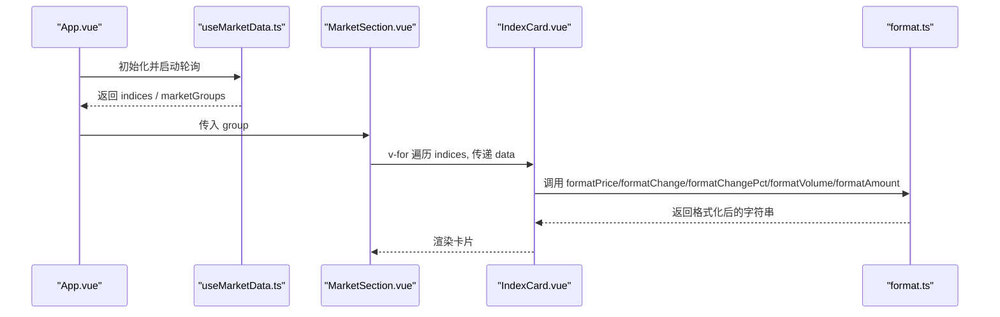
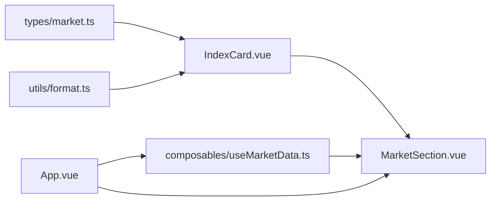

# IndexCard指数卡片组件

<cite>
**本文引用的文件**
- [IndexCard.vue](file://src/components/IndexCard.vue)
- [market.ts](file://src/types/market.ts)
- [format.ts](file://src/utils/format.ts)
- [useMarketData.ts](file://src/composables/useMarketData.ts)
- [MarketSection.vue](file://src/components/MarketSection.vue)
- [App.vue](file://src/App.vue)
- [styles.css](file://src/styles.css)
</cite>

## 目录
1. [简介](#简介)
2. [项目结构](#项目结构)
3. [核心组件与职责](#核心组件与职责)
4. [架构总览](#架构总览)
5. [详细组件分析](#详细组件分析)
6. [依赖关系分析](#依赖关系分析)
7. [性能考量](#性能考量)
8. [故障排查指南](#故障排查指南)
9. [结论](#结论)
10. [附录：Props接口与数据字段映射](#附录props接口与数据字段映射)

## 简介
IndexCard 是一个用于展示单个指数信息的卡片组件，负责呈现指数名称、当前价格、涨跌额、涨跌幅以及成交量/成交额等关键指标。组件通过计算属性根据涨跌情况动态决定颜色、背景与左侧边框样式，并使用统一的格式化函数对数值进行精度控制与单位转换。该组件以单一职责设计，便于在多个市场分组中复用。

## 项目结构
本项目的 UI 层由 Vue 3 + TypeScript 构建，使用 Tailwind CSS 进行样式管理。IndexCard 作为基础展示单元，被 MarketSection 按市场分组渲染；数据由 useMarketData 组合式函数定时拉取并分组，最终在 App.vue 中组织页面布局。

图表来源
- [App.vue:1-36](file://src/App.vue#L1-L36)
- [MarketSection.vue:1-19](file://src/components/MarketSection.vue#L1-L19)
- [IndexCard.vue:1-71](file://src/components/IndexCard.vue#L1-L71)
- [format.ts:1-33](file://src/utils/format.ts#L1-L33)
- [market.ts:1-22](file://src/types/market.ts#L1-L22)
- [useMarketData.ts:1-66](file://src/composables/useMarketData.ts#L1-L66)
- [styles.css:1-2](file://src/styles.css#L1-L2)

章节来源
- [App.vue:1-36](file://src/App.vue#L1-L36)
- [MarketSection.vue:1-19](file://src/components/MarketSection.vue#L1-L19)
- [IndexCard.vue:1-71](file://src/components/IndexCard.vue#L1-L71)
- [format.ts:1-33](file://src/utils/format.ts#L1-L33)
- [market.ts:1-22](file://src/types/market.ts#L1-L22)
- [useMarketData.ts:1-66](file://src/composables/useMarketData.ts#L1-L66)
- [styles.css:1-2](file://src/styles.css#L1-L2)

## 核心组件与职责
- IndexCard.vue：接收一个指数数据对象，计算涨跌趋势与对应样式，调用格式化函数输出可读的数值文本。
- format.ts：提供价格、涨跌额、涨跌幅、成交量、成交额的统一格式化逻辑，确保精度和单位一致。
- market.ts：定义指数数据结构 IndexData 与市场分组 MarketGroup。
- useMarketData.ts：定时获取指数数据，按市场分组，暴露给上层组件使用。
- MarketSection.vue：按市场分组渲染一组 IndexCard。
- App.vue：组织整体布局，集成标题栏、市场分组与空状态提示。

章节来源
- [IndexCard.vue:1-71](file://src/components/IndexCard.vue#L1-L71)
- [format.ts:1-33](file://src/utils/format.ts#L1-L33)
- [market.ts:1-22](file://src/types/market.ts#L1-L22)
- [useMarketData.ts:1-66](file://src/composables/useMarketData.ts#L1-L66)
- [MarketSection.vue:1-19](file://src/components/MarketSection.vue#L1-L19)
- [App.vue:1-36](file://src/App.vue#L1-L36)

## 架构总览
IndexCard 处于展示层的叶子节点，向上依赖格式化函数与类型定义，向下无子组件依赖。数据流自上而下：App → useMarketData → MarketSection → IndexCard。

图表来源
- [App.vue:1-36](file://src/App.vue#L1-L36)
- [useMarketData.ts:1-66](file://src/composables/useMarketData.ts#L1-L66)
- [MarketSection.vue:1-19](file://src/components/MarketSection.vue#L1-L19)
- [IndexCard.vue:1-71](file://src/components/IndexCard.vue#L1-L71)
- [format.ts:1-33](file://src/utils/format.ts#L1-L33)

## 详细组件分析

### 组件功能与显示逻辑
- 指数名称：直接展示 data.name。
- 当前价格：使用 formatPrice 保留两位小数。
- 涨跌额与涨跌幅：分别使用 formatChange 与 formatChangePct，带正负号与百分比。
- 成交量/成交额：使用 formatVolume 与 formatAmount，自动在“万”和“亿”之间切换单位。
- 涨跌趋势与颜色：
  - 根据 change > 0 / < 0 / = 0 计算趋势 up/down/flat。
  - 文字颜色：涨红（text-red-500）、跌绿（text-green-500）、平盘灰（text-gray-400）。
  - 背景色：涨/跌使用低透明度红色/绿色背景，平盘使用深灰背景。
  - 左侧边框：涨红/跌绿/平灰，突出趋势。

章节来源
- [IndexCard.vue:6-38](file://src/components/IndexCard.vue#L6-L38)
- [IndexCard.vue:41-69](file://src/components/IndexCard.vue#L41-L69)

### 数据格式化函数
- formatPrice：保留两位小数，保证价格显示一致性。
- formatChange：为正值添加“+”前缀，保留两位小数。
- formatChangePct：为正值添加“+”前缀，保留两位小数并追加“%”。
- formatVolume：当数值≥10000时转换为“亿”，否则显示“万”，均保留相应精度。
- formatAmount：同 volume 的单位换算策略。

这些函数集中处理精度与单位，避免在组件内重复实现，提升可维护性与一致性。

章节来源
- [format.ts:1-33](file://src/utils/format.ts#L1-L33)

### Props 接口与字段映射
IndexCard 仅接收一个 data 属性，类型为 IndexData，包含以下关键字段：
- code：指数代码（唯一标识）
- name：指数名称
- current：当前价
- prev_close：昨收（未在当前卡片直接展示）
- open：开盘价（未在当前卡片直接展示）
- high：最高价（未在当前卡片直接展示）
- low：最低价（未在当前卡片直接展示）
- change：涨跌点
- change_pct：涨跌幅（百分比）
- volume：成交量
- amount：成交额
- market：市场标识（a/hk/us）
- update_time：更新时间

组件内部将上述字段映射到模板中的展示位置，并通过格式化函数输出。

章节来源
- [IndexCard.vue:6-8](file://src/components/IndexCard.vue#L6-L8)
- [market.ts:1-15](file://src/types/market.ts#L1-L15)
- [IndexCard.vue:41-69](file://src/components/IndexCard.vue#L41-L69)

### 响应式设计
- 网格布局：MarketSection 使用 grid-cols-3 在三列网格中排列卡片，适配桌面端宽度。
- 间距与留白：gap-3 与 p-4 提供舒适的视觉间距。
- 字体层级：指数名称较小、价格较大且加粗，涨跌信息次级，成交量/成交额最小，形成清晰的信息层次。
- 颜色对比：深色背景配合高对比度文字与强调色，确保可读性。

注意：如需移动端自适应，可在 MarketSection 或外层容器增加断点类（如 md:grid-cols-3），或在不同屏幕下调整 grid 列数。

章节来源
- [MarketSection.vue:8-17](file://src/components/MarketSection.vue#L8-L17)
- [IndexCard.vue:41-69](file://src/components/IndexCard.vue#L41-L69)

### 样式定制选项
- 边框：默认使用灰色边框与左侧强调边框（border-l-*），可通过修改 trendBorder 的计算结果或模板 class 自定义。
- 阴影：当前未显式设置阴影，可在卡片根元素添加 shadow-* 类以实现悬浮阴影效果。
- 悬停效果：可在卡片根元素添加 hover:bg-* 或 hover:shadow-* 类，增强交互反馈。
- 主题色：通过 tailwind 的颜色类（red/green/gray）统一管理，便于全局替换。

章节来源
- [IndexCard.vue:41-45](file://src/components/IndexCard.vue#L41-L45)
- [IndexCard.vue:16-38](file://src/components/IndexCard.vue#L16-L38)
- [styles.css:1-2](file://src/styles.css#L1-L2)

### 可复用性设计
- 单一职责：IndexCard 只负责单个指数的展示，不关心数据来源与分组逻辑。
- 纯展示：通过 props 接收数据，无副作用，易于在其他页面或列表中使用。
- 格式化解耦：所有数值格式化集中在 format.ts，便于统一调整精度与单位策略。
- 类型约束：通过 TypeScript 接口保障数据结构稳定，降低误用风险。

章节来源
- [IndexCard.vue:1-71](file://src/components/IndexCard.vue#L1-L71)
- [format.ts:1-33](file://src/utils/format.ts#L1-L33)
- [market.ts:1-22](file://src/types/market.ts#L1-L22)

### 无障碍访问支持与键盘导航
- 语义化：当前模板使用 div 与 span，未包含专门的无障碍属性。建议为卡片根元素添加 role="region" 或 aria-label，描述该卡片展示的指数名称与涨跌状态。
- 焦点管理：若未来需要支持键盘操作（如 Enter 查看详情），可为卡片添加 tabindex="0" 并提供键盘事件处理。
- 颜色对比：已使用高对比度颜色，但应确保在辅助技术或高对比度模式下仍可识别涨跌含义（可结合图标或文字标签）。

章节来源
- [IndexCard.vue:41-69](file://src/components/IndexCard.vue#L41-L69)

### 与父组件的数据绑定与事件处理机制
- 数据绑定：MarketSection 通过 v-for 遍历 group.indices，将每个 index 作为 data 传递给 IndexCard。
- 键值：使用 index.code 作为 key，确保列表渲染稳定性。
- 事件处理：IndexCard 当前未向外抛出事件；如需交互（如点击跳转详情），可在 IndexCard 中 emit 事件并在 MarketSection 或 App 中监听处理。

章节来源
- [MarketSection.vue:8-17](file://src/components/MarketSection.vue#L8-L17)
- [IndexCard.vue:6-8](file://src/components/IndexCard.vue#L6-L8)

## 依赖关系分析
- IndexCard 依赖：
  - types/market.ts：IndexData 类型定义
  - utils/format.ts：数值格式化函数
  - Tailwind CSS：样式类
- MarketSection 依赖：
  - types/market.ts：MarketGroup 类型定义
  - IndexCard：子组件
- App 依赖：
  - composables/useMarketData.ts：数据获取与分组
  - TitleBar：标题栏（外部组件）
  - MarketSection：市场分组展示

图表来源
- [market.ts:1-22](file://src/types/market.ts#L1-L22)
- [format.ts:1-33](file://src/utils/format.ts#L1-L33)
- [IndexCard.vue:1-71](file://src/components/IndexCard.vue#L1-L71)
- [MarketSection.vue:1-19](file://src/components/MarketSection.vue#L1-L19)
- [useMarketData.ts:1-66](file://src/composables/useMarketData.ts#L1-L66)
- [App.vue:1-36](file://src/App.vue#L1-L36)

章节来源
- [IndexCard.vue:1-71](file://src/components/IndexCard.vue#L1-L71)
- [MarketSection.vue:1-19](file://src/components/MarketSection.vue#L1-L19)
- [useMarketData.ts:1-66](file://src/composables/useMarketData.ts#L1-L66)
- [App.vue:1-36](file://src/App.vue#L1-L36)

## 性能考量
- 计算属性优化：trend、trendColor、trendBg、trendBorder 均为 computed，仅在依赖变化时重新计算，减少模板重渲染开销。
- 格式化函数轻量：format.* 函数只做简单数学运算与字符串拼接，时间复杂度 O(1)。
- 列表渲染：MarketSection 使用 v-for 与稳定的 key（index.code），有助于 Vue 高效更新 DOM。
- 数据轮询：useMarketData 每 3 秒刷新一次，避免频繁请求造成性能压力。可根据业务需求调整 POLL_INTERVAL。

章节来源
- [IndexCard.vue:10-38](file://src/components/IndexCard.vue#L10-L38)
- [format.ts:1-33](file://src/utils/format.ts#L1-L33)
- [MarketSection.vue:8-17](file://src/components/MarketSection.vue#L8-L17)
- [useMarketData.ts:5-41](file://src/composables/useMarketData.ts#L5-L41)

## 故障排查指南
- 数据为空或加载失败：
  - 检查 useMarketData 的 refresh 是否成功调用 invoke('fetch_indices')，并查看控制台错误日志。
  - 确认 App 的空状态提示是否正确显示。
- 颜色异常：
  - 确认 IndexData.change 的正负值是否符合预期；若为 0，则显示灰色。
  - 检查 Tailwind 颜色类是否生效（确保 styles.css 引入 Tailwind）。
- 数值格式不符合预期：
  - 检查 format.ts 中的精度与单位换算逻辑，必要时调整 toFixed 的位数或阈值。
- 布局错乱：
  - 检查 MarketSection 的 grid-cols-* 是否与目标屏幕匹配；如需移动端适配，可增加断点类。

章节来源
- [useMarketData.ts:25-36](file://src/composables/useMarketData.ts#L25-L36)
- [App.vue:19-33](file://src/App.vue#L19-L33)
- [IndexCard.vue:10-38](file://src/components/IndexCard.vue#L10-L38)
- [format.ts:1-33](file://src/utils/format.ts#L1-L33)
- [MarketSection.vue:8-17](file://src/components/MarketSection.vue#L8-L17)
- [styles.css:1-2](file://src/styles.css#L1-L2)

## 结论
IndexCard 以简洁清晰的职责划分与一致的格式化策略，实现了指数卡片的稳定展示。通过计算属性驱动样式、集中化的格式化函数与类型约束，组件具备良好的可维护性与可复用性。建议在后续迭代中补充无障碍属性与键盘交互，并根据实际设备尺寸优化响应式布局。

## 附录：Props接口与数据字段映射
- 组件 Props：
  - data: IndexData（必需）
- IndexData 字段说明：
  - code：指数代码（用于列表 key）
  - name：指数名称（展示）
  - current：当前价（格式化后展示）
  - prev_close：昨收（未展示）
  - open：开盘价（未展示）
  - high：最高价（未展示）
  - low：最低价（未展示）
  - change：涨跌点（格式化后展示）
  - change_pct：涨跌幅（格式化后展示）
  - volume：成交量（格式化后展示）
  - amount：成交额（格式化后展示）
  - market：市场标识（a/hk/us）
  - update_time：更新时间（未展示）

章节来源
- [IndexCard.vue:6-8](file://src/components/IndexCard.vue#L6-L8)
- [market.ts:1-15](file://src/types/market.ts#L1-L15)
- [IndexCard.vue:41-69](file://src/components/IndexCard.vue#L41-L69)