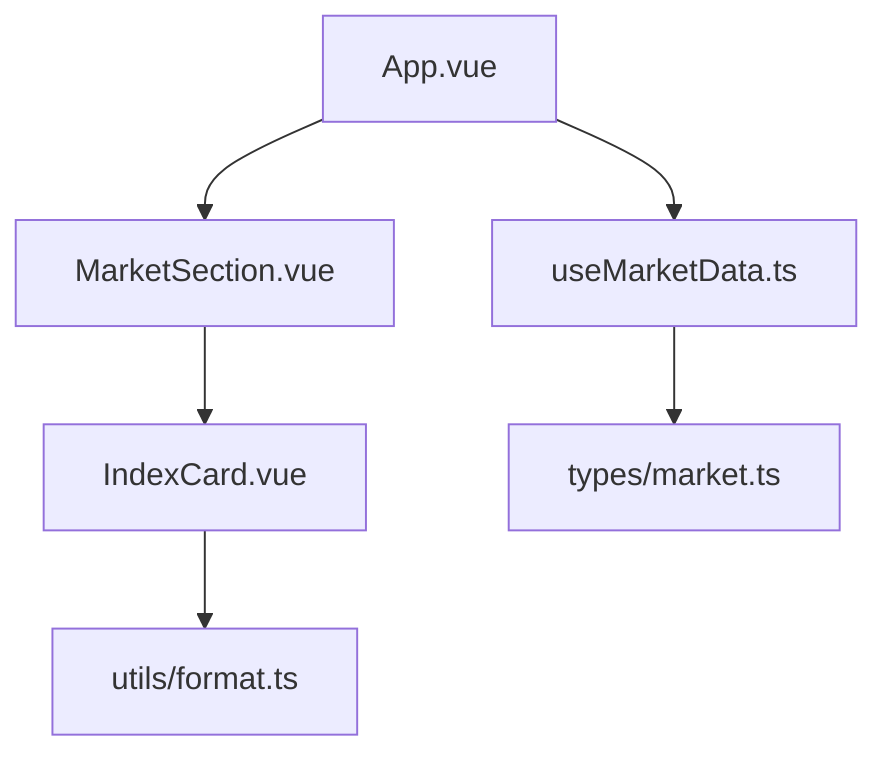
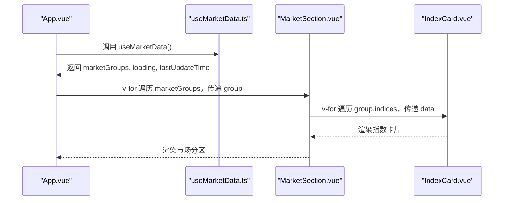
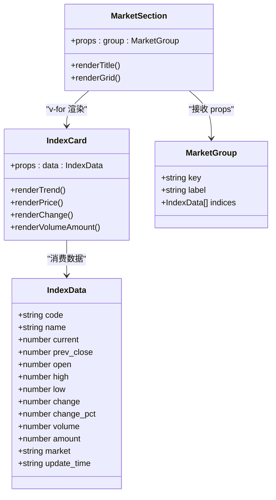
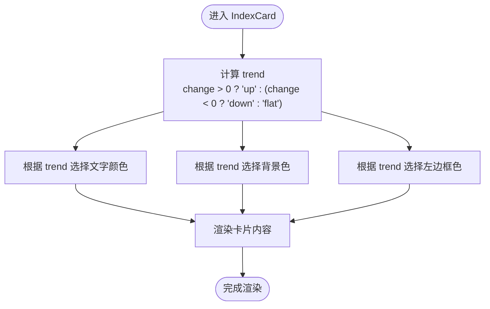
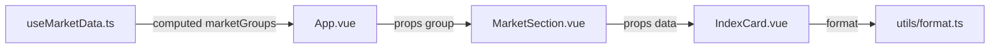

# MarketSection市场分区组件

<cite>
**本文引用的文件**
- [MarketSection.vue](file://src/components/MarketSection.vue)
- [IndexCard.vue](file://src/components/IndexCard.vue)
- [market.ts](file://src/types/market.ts)
- [useMarketData.ts](file://src/composables/useMarketData.ts)
- [App.vue](file://src/App.vue)
- [format.ts](file://src/utils/format.ts)
- [ARCHITECTURE.md](file://ARCHITECTURE.md)
</cite>

## 目录
1. [简介](#简介)
2. [项目结构](#项目结构)
3. [核心组件与数据模型](#核心组件与数据模型)
4. [架构总览](#架构总览)
5. [详细组件分析](#详细组件分析)
6. [依赖关系分析](#依赖关系分析)
7. [性能考虑](#性能考虑)
8. [故障排查指南](#故障排查指南)
9. [结论](#结论)
10. [附录](#附录)

## 简介
本文件聚焦于 MarketSection 市场分区组件，系统性说明其容器化设计、分组渲染机制、数据绑定方式、市场分类逻辑（A股/港股/美股）、样式布局实现、可扩展性设计以及与其他组件的集成和数据流向。同时给出虚拟滚动与懒加载等性能优化建议，帮助在指数数量增长时保持流畅体验。

## 项目结构
MarketSection 位于前端 Vue 组件层，负责按市场类型展示指数卡片网格；数据由 useMarketData 组合式函数提供并按 market 字段分组；具体指数卡片由 IndexCard 渲染；格式化逻辑集中在 format 工具函数中；整体页面由 App.vue 编排。

图表来源
- [App.vue:1-36](file://src/App.vue#L1-L36)
- [MarketSection.vue:1-19](file://src/components/MarketSection.vue#L1-L19)
- [IndexCard.vue:1-71](file://src/components/IndexCard.vue#L1-L71)
- [useMarketData.ts:1-66](file://src/composables/useMarketData.ts#L1-L66)
- [market.ts:1-22](file://src/types/market.ts#L1-L22)
- [format.ts:1-33](file://src/utils/format.ts#L1-L33)

章节来源
- [App.vue:1-36](file://src/App.vue#L1-L36)
- [ARCHITECTURE.md:106-147](file://ARCHITECTURE.md#L106-L147)

## 核心组件与数据模型
- MarketSection：接收一个 MarketGroup 作为 props，渲染分区标题与指数卡片网格。
- IndexCard：接收单个 IndexData，展示名称、价格、涨跌额/涨跌幅、成交量/成交额，并根据涨跌动态着色。
- MarketGroup：包含 key、label、indices 数组，用于标识和展示某一市场的指数集合。
- IndexData：描述单个指数的行情数据，包含 code、name、current、prev_close、open、high、low、change、change_pct、volume、amount、market、update_time。

章节来源
- [MarketSection.vue:1-19](file://src/components/MarketSection.vue#L1-L19)
- [IndexCard.vue:1-71](file://src/components/IndexCard.vue#L1-L71)
- [market.ts:1-22](file://src/types/market.ts#L1-L22)

## 架构总览
MarketSection 是“市场分区”容器组件，职责单一：根据传入的 MarketGroup 渲染标题与卡片网格。数据来源于 useMarketData 计算出的 marketGroups，App.vue 通过 v-for 将每个 MarketGroup 传递给对应的 MarketSection。

图表来源
- [App.vue:1-36](file://src/App.vue#L1-L36)
- [useMarketData.ts:13-23](file://src/composables/useMarketData.ts#L13-L23)
- [MarketSection.vue:8-18](file://src/components/MarketSection.vue#L8-L18)
- [IndexCard.vue:41-70](file://src/components/IndexCard.vue#L41-L70)

## 详细组件分析

### MarketSection 容器组件
- 输入与职责
  - 接收 props：group: MarketGroup
  - 渲染分区标题：使用 group.label
  - 渲染指数卡片网格：v-for 遍历 group.indices，为每个 index 渲染 IndexCard
- 模板关键点
  - 标题区域：flex 布局 + 分隔线，突出分区名
  - 网格布局：grid grid-cols-3 gap-3，三列等宽卡片
- 数据绑定
  - v-for="index in group.indices" :key="index.code"
  - 通过 :data="index" 将单条指数数据传给子组件

章节来源
- [MarketSection.vue:1-19](file://src/components/MarketSection.vue#L1-L19)

#### 类图（MarketSection 与其依赖）

图表来源
- [MarketSection.vue:1-19](file://src/components/MarketSection.vue#L1-L19)
- [IndexCard.vue:1-71](file://src/components/IndexCard.vue#L1-L71)
- [market.ts:1-22](file://src/types/market.ts#L1-L22)

### IndexCard 指数卡片组件
- 输入与职责
  - 接收 props：data: IndexData
  - 根据涨跌计算趋势状态与颜色、背景、左边框色
  - 使用 format 工具函数格式化价格、涨跌额、涨跌幅、成交量、成交额
- 视觉反馈
  - 上涨：红色文字与淡红背景，左侧红色边框
  - 下跌：绿色文字与淡绿背景，左侧绿色边框
  - 平盘：灰色文字与深灰背景，左侧灰色边框

章节来源
- [IndexCard.vue:1-71](file://src/components/IndexCard.vue#L1-L71)
- [format.ts:1-33](file://src/utils/format.ts#L1-L33)

#### 流程图（涨跌趋势判定与样式应用）

图表来源
- [IndexCard.vue:10-38](file://src/components/IndexCard.vue#L10-L38)
- [IndexCard.vue:41-70](file://src/components/IndexCard.vue#L41-L70)

### 数据模型与分组逻辑
- MarketGroup
  - key：市场标识（如 a/hk/us），用于唯一键
  - label：显示名称（如 A 股 / 港 股 / 美 股）
  - indices：该市场下的指数列表
- IndexData
  - market：'a' | 'hk' | 'us'，决定归属哪个市场分组
- 分组来源
  - useMarketData 中的 computed marketGroups 会按 market 字段过滤并生成三个 MarketGroup

章节来源
- [market.ts:1-22](file://src/types/market.ts#L1-L22)
- [useMarketData.ts:13-23](file://src/composables/useMarketData.ts#L13-L23)

### 市场分类逻辑（A股/港股/美股）
- 标识规则
  - A 股：market === 'a'
  - 港股：market === 'hk'
  - 美股：market === 'us'
- 展示差异
  - 标题不同：A 股 / 港 股 / 美 股
  - 卡片内部无市场差异，统一通过涨跌颜色表达趋势
- 扩展新市场
  - 在 useMarketData 中添加对应 market 值的过滤分支与 label
  - 确保后端或数据源能正确标注 market 字段

章节来源
- [useMarketData.ts:13-23](file://src/composables/useMarketData.ts#L13-L23)

### 数据绑定与渲染流程
- App.vue 通过 v-for 遍历 marketGroups，将每个 group 传给 MarketSection
- MarketSection 再通过 v-for 遍历 group.indices，将每条数据传给 IndexCard
- 关键绑定点
  - App.vue：v-for="group in marketGroups" :key="group.key" :group="group"
  - MarketSection.vue：v-for="index in group.indices" :key="index.code" :data="index"

章节来源
- [App.vue:19-24](file://src/App.vue#L19-L24)
- [MarketSection.vue:14-16](file://src/components/MarketSection.vue#L14-L16)

### 样式与布局
- 分区标题
  - 使用 flex 布局，标题与右侧分隔线形成视觉分割
- 卡片网格
  - grid grid-cols-3 gap-3 实现三列等宽、间距一致的网格
- 卡片样式
  - 圆角、边框、左侧彩色边框指示涨跌
  - 文字大小与层级清晰：名称小字、价格大字加粗、涨跌额/涨跌幅并列、成交量/成交额底部两端对齐

章节来源
- [MarketSection.vue:9-16](file://src/components/MarketSection.vue#L9-L16)
- [IndexCard.vue:41-70](file://src/components/IndexCard.vue#L41-L70)

### 可扩展性设计
- 新增市场类型
  - 在 useMarketData 的 computed 中增加对应 market 值的过滤与 label
  - 若需差异化展示（如不同图标或排序），可在 MarketSection 中按 group.key 分支处理
- 新增指标字段
  - 在 IndexData 中扩展字段，并在 IndexCard 中按需展示
- 主题与样式
  - 通过 Tailwind 原子类快速调整布局与配色，无需复杂 CSS

章节来源
- [useMarketData.ts:13-23](file://src/composables/useMarketData.ts#L13-L23)
- [market.ts:1-22](file://src/types/market.ts#L1-L22)

## 依赖关系分析
- 组件依赖
  - MarketSection 依赖 IndexCard 与 types/market.ts
  - IndexCard 依赖 utils/format.ts
  - App.vue 依赖 composables/useMarketData.ts
- 数据流
  - useMarketData 从 Tauri 后端拉取数据，计算 marketGroups
  - App.vue 分发到各 MarketSection
  - MarketSection 分发到各 IndexCard

图表来源
- [useMarketData.ts:13-23](file://src/composables/useMarketData.ts#L13-L23)
- [App.vue:1-36](file://src/App.vue#L1-L36)
- [MarketSection.vue:1-19](file://src/components/MarketSection.vue#L1-L19)
- [IndexCard.vue:1-71](file://src/components/IndexCard.vue#L1-L71)
- [format.ts:1-33](file://src/utils/format.ts#L1-L33)

章节来源
- [ARCHITECTURE.md:106-147](file://ARCHITECTURE.md#L106-L147)

## 性能考虑
当前实现为全量渲染，适合少量指数场景。当指数数量增长时，建议引入以下优化策略：

- 虚拟滚动
  - 对 group.indices 进行可视区域虚拟化，仅渲染可见项，降低 DOM 节点数量
  - 可结合第三方库或自研虚拟列表，按高度估算与偏移定位
- 懒加载
  - 首屏仅渲染前 N 个指数，滚动到底部再加载更多
  - 配合骨架屏提升感知性能
- 列表键优化
  - 使用稳定的 key（如 index.code），避免不必要的重渲染
- 计算属性缓存
  - 利用 Vue 响应式缓存，减少重复计算（当前已使用 computed 分组）
- 防抖/节流
  - 窗口尺寸变化或频繁刷新时可对更新进行节流，避免过度重排
- 图片与资源
  - 若后续加入图标或图片，启用懒加载与压缩

[本节为通用性能建议，不直接分析具体代码文件]

## 故障排查指南
- 数据为空
  - 检查 useMarketData 的 loading 与 lastUpdateTime，确认是否成功获取数据
  - 查看控制台错误日志，确认 invoke('fetch_indices') 是否失败
- 分组异常
  - 确认 IndexData.market 值是否为 'a' | 'hk' | 'us'
  - 检查 useMarketData 的 computed 是否正确过滤
- 渲染错乱
  - 确认 v-for 的 key 是否稳定且唯一（建议使用 index.code）
  - 检查网格布局是否被外层样式覆盖
- 样式问题
  - 确认 Tailwind 类名是否正确生效
  - 检查涨跌颜色逻辑是否与数据一致

章节来源
- [useMarketData.ts:25-36](file://src/composables/useMarketData.ts#L25-L36)
- [App.vue:19-33](file://src/App.vue#L19-L33)

## 结论
MarketSection 作为市场分区容器组件，职责清晰、结构简单，通过 MarketGroup 与 v-for 高效渲染指数卡片网格。结合 useMarketData 的市场分组能力与 IndexCard 的趋势可视化，实现了 A 股/港股/美股的统一展示。未来可通过虚拟滚动、懒加载等手段进一步提升大数据量下的性能表现，并通过扩展 useMarketData 与类型定义轻松支持新市场与新字段。

## 附录
- 相关架构说明参考
  - 系统架构与数据流、组件层次关系、UI 设计要点等详见 ARCHITECTURE.md

章节来源
- [ARCHITECTURE.md:271-298](file://ARCHITECTURE.md#L271-L298)
- [ARCHITECTURE.md:300-331](file://ARCHITECTURE.md#L300-L331)