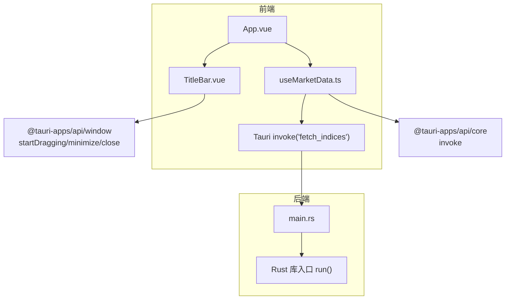
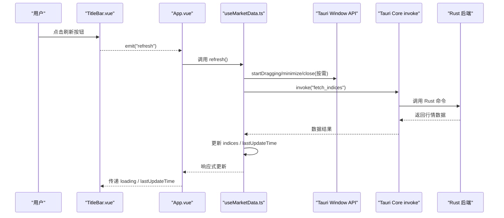
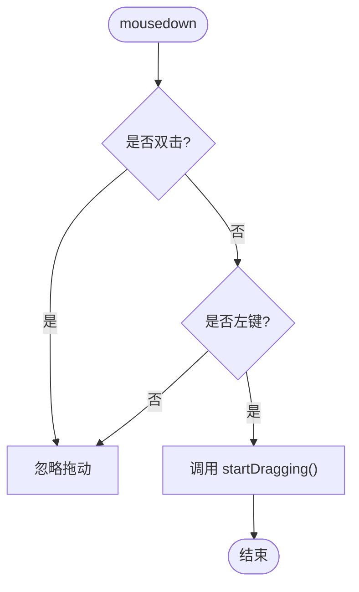
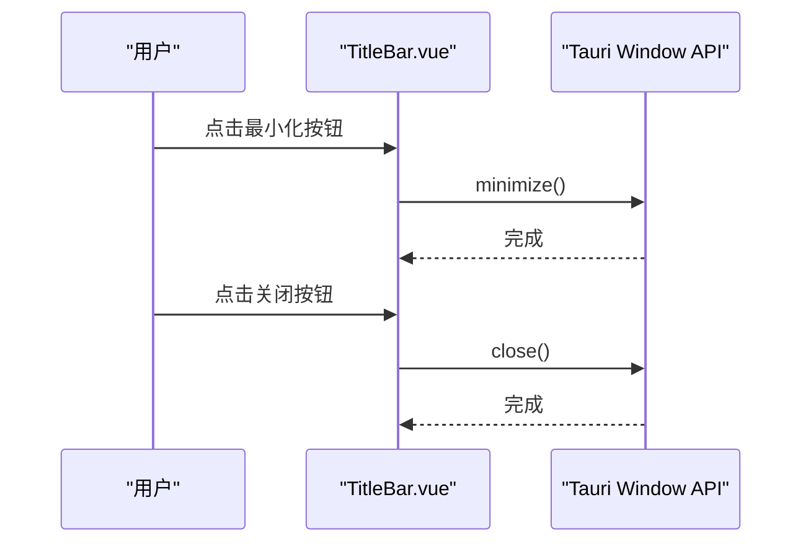
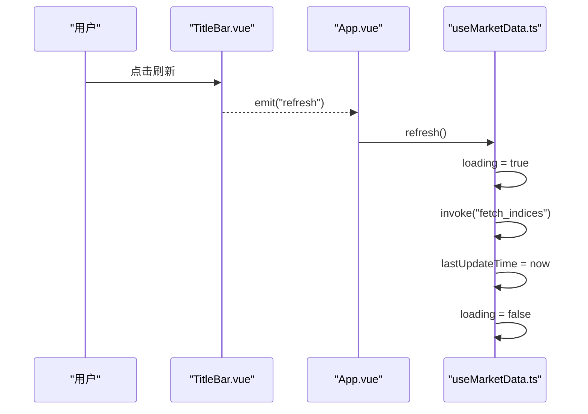
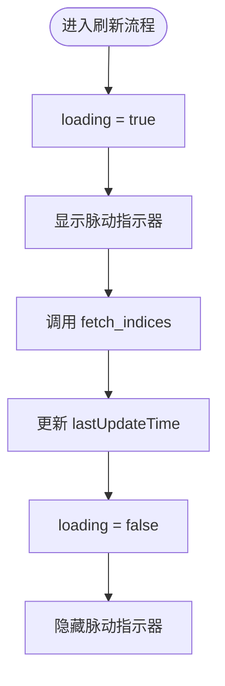
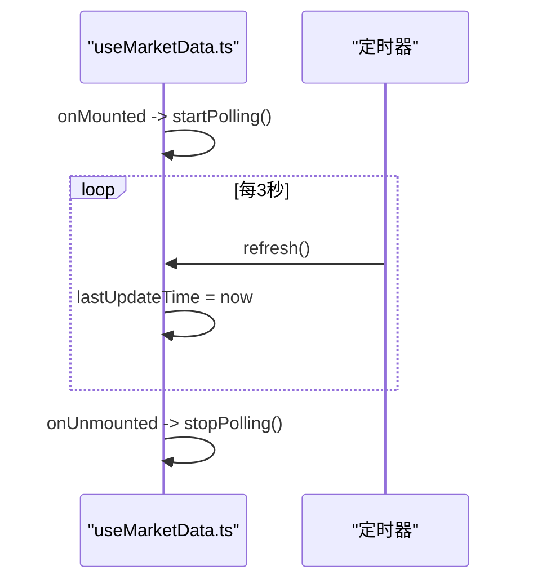
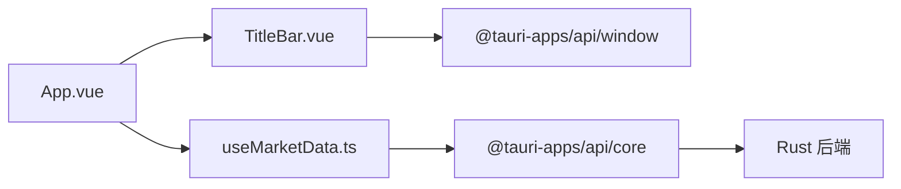

# TitleBar标题栏组件

<cite>
**本文引用的文件**
- [TitleBar.vue](file://src/components/TitleBar.vue)
- [App.vue](file://src/App.vue)
- [useMarketData.ts](file://src/composables/useMarketData.ts)
- [tauri.conf.json](file://src-tauri/tauri.conf.json)
- [main.rs](file://src-tauri/src/main.rs)
- [format.ts](file://src/utils/format.ts)
- [ARCHITECTURE.md](file://ARCHITECTURE.md)
</cite>

## 目录
1. [简介](#简介)
2. [项目结构](#项目结构)
3. [核心组件](#核心组件)
4. [架构总览](#架构总览)
5. [详细组件分析](#详细组件分析)
6. [依赖关系分析](#依赖关系分析)
7. [性能考量](#性能考量)
8. [故障排查指南](#故障排查指南)
9. [结论](#结论)
10. [附录](#附录)

## 简介
本文件为 hq-kanban-app 的 TitleBar 自定义标题栏组件提供完整技术文档。该组件基于 Tauri 框架实现无边框窗口的自定义标题栏，提供窗口拖动、最小化、关闭等原生窗口控制能力；内置刷新按钮与父组件通信以触发数据刷新；展示加载状态指示器（脉动动画）与最后更新时间；并提供样式定制与主题适配建议，以及与系统原生标题栏交互的体验优化说明。

## 项目结构
- 前端采用 Vue 3 + TypeScript，使用 Tailwind CSS 进行样式构建。
- 通过 Tauri 配置禁用系统装饰（decorations: false），由前端渲染自定义标题栏。
- 数据获取与轮询逻辑封装在组合式函数 useMarketData 中，供 App 层统一调度。
- TitleBar 仅负责 UI 与窗口控制调用，并通过事件向父组件发出刷新请求。

图表来源
- [TitleBar.vue:1-28](file://src/components/TitleBar.vue#L1-L28)
- [App.vue:1-16](file://src/App.vue#L1-L16)
- [useMarketData.ts:1-66](file://src/composables/useMarketData.ts#L1-L66)
- [tauri.conf.json:12-23](file://src-tauri/tauri.conf.json#L12-L23)
- [main.rs:1-7](file://src-tauri/src/main.rs#L1-L7)

章节来源
- [tauri.conf.json:12-23](file://src-tauri/tauri.conf.json#L12-L23)
- [App.vue:1-16](file://src/App.vue#L1-L16)
- [TitleBar.vue:1-28](file://src/components/TitleBar.vue#L1-L28)

## 核心组件
- TitleBar 组件：
  - 接收 lastUpdateTime（字符串）与 loading（布尔）两个 props。
  - 暴露 refresh 事件，用于通知父组件执行刷新。
  - 集成窗口拖动、最小化、关闭等原生窗口操作。
  - 显示加载状态指示器（蓝色脉动圆点）与最后更新时间文本。
- 父组件 App.vue：
  - 将 useMarketData 提供的 lastUpdateTime、loading、refresh 绑定到 TitleBar。
  - 监听 refresh 事件并调用对应的刷新逻辑。

章节来源
- [TitleBar.vue:4-27](file://src/components/TitleBar.vue#L4-L27)
- [App.vue:6-16](file://src/App.vue#L6-L16)

## 架构总览
TitleBar 作为无状态 UI 容器，通过 Tauri 的 window API 直接操控当前窗口行为；数据刷新流程由父组件 useMarketData 管理，TitleBar 仅通过事件触发刷新动作。整体遵循“UI 与业务解耦”的原则，便于扩展与维护。

图表来源
- [TitleBar.vue:44-51](file://src/components/TitleBar.vue#L44-L51)
- [App.vue:12-16](file://src/App.vue#L12-L16)
- [useMarketData.ts:25-36](file://src/composables/useMarketData.ts#L25-L36)
- [tauri.conf.json:12-23](file://src-tauri/tauri.conf.json#L12-L23)
- [main.rs:4-6](file://src-tauri/src/main.rs#L4-L6)

## 详细组件分析

### 无边框窗口与标题栏实现
- 通过 tauri.conf.json 设置 decorations: false，隐藏系统原生标题栏，使前端可完全自定义标题区域。
- TitleBar 根元素绑定 mousedown 事件，调用 Tauri window API 的 startDragging 实现拖拽移动窗口。
- 双击不触发拖动，避免与最大化切换冲突；仅左键拖动，提升交互一致性。

图表来源
- [TitleBar.vue:13-19](file://src/components/TitleBar.vue#L13-L19)
- [tauri.conf.json:12-23](file://src-tauri/tauri.conf.json#L12-L23)

章节来源
- [TitleBar.vue:13-19](file://src/components/TitleBar.vue#L13-L19)
- [tauri.conf.json:12-23](file://src-tauri/tauri.conf.json#L12-L23)

### 窗口控制功能（最小化、关闭）
- 最小化：调用 appWindow.minimize()。
- 关闭：调用 appWindow.close()。
- 按钮上绑定 @mousedown.stop，阻止事件冒泡到拖动处理，确保点击按钮时不会误触发窗口拖动。

图表来源
- [TitleBar.vue:21-27](file://src/components/TitleBar.vue#L21-L27)

章节来源
- [TitleBar.vue:21-27](file://src/components/TitleBar.vue#L21-L27)

### 刷新按钮与事件通信
- 刷新按钮绑定 click 事件，通过 emit('refresh') 向父组件发送刷新信号。
- 父组件 App.vue 监听 refresh 并调用 useMarketData 中的 refresh 方法。
- useMarketData.refresh 会：
  - 设置 loading = true
  - 调用 Tauri invoke('fetch_indices') 获取数据
  - 成功后更新 lastUpdateTime 为本地时间（不含12小时制）
  - finally 中重置 loading = false

图表来源
- [TitleBar.vue:44-51](file://src/components/TitleBar.vue#L44-L51)
- [App.vue:12-16](file://src/App.vue#L12-L16)
- [useMarketData.ts:25-36](file://src/composables/useMarketData.ts#L25-L36)

章节来源
- [TitleBar.vue:44-51](file://src/components/TitleBar.vue#L44-L51)
- [App.vue:12-16](file://src/App.vue#L12-L16)
- [useMarketData.ts:25-36](file://src/composables/useMarketData.ts#L25-L36)

### 加载状态指示器与文本提示
- 当 loading 为真时，标题栏左侧显示一个蓝色脉动圆点（animate-pulse），表示自动刷新进行中。
- 该指示器与刷新流程联动：useMarketData.refresh 在进入请求前置 loading 为真，完成后置为假。
- 文本提示方面，标题栏右侧显示 lastUpdateTime，格式化为本地时间（不含12小时制）。

图表来源
- [TitleBar.vue:33-37](file://src/components/TitleBar.vue#L33-L37)
- [useMarketData.ts:25-36](file://src/composables/useMarketData.ts#L25-L36)

章节来源
- [TitleBar.vue:33-37](file://src/components/TitleBar.vue#L33-L37)
- [useMarketData.ts:25-36](file://src/composables/useMarketData.ts#L25-L36)

### 最后更新时间格式化与实时更新机制
- 时间格式化：使用本地时间格式化（不含12小时制），保证跨平台一致显示。
- 实时更新：useMarketData 启动后每 3 秒自动刷新一次（轮询），每次刷新都会更新 lastUpdateTime。
- 组件生命周期：onMounted 启动轮询，onUnmounted 停止轮询，避免内存泄漏。

图表来源
- [useMarketData.ts:5-11](file://src/composables/useMarketData.ts#L5-L11)
- [useMarketData.ts:38-56](file://src/composables/useMarketData.ts#L38-L56)

章节来源
- [useMarketData.ts:5-11](file://src/composables/useMarketData.ts#L5-L11)
- [useMarketData.ts:38-56](file://src/composables/useMarketData.ts#L38-L56)

### Props 接口定义与使用方式
- lastUpdateTime: string
  - 用途：显示最后更新时间文本。
  - 来源：useMarketData 中每次刷新后赋值。
- loading: boolean
  - 用途：控制加载指示器的显示。
  - 来源：useMarketData 中刷新前后切换。

章节来源
- [TitleBar.vue:4-7](file://src/components/TitleBar.vue#L4-L7)
- [useMarketData.ts:8-11](file://src/composables/useMarketData.ts#L8-L11)

### 样式定制选项与主题适配方案
- 样式基础：使用 Tailwind CSS 类名进行布局与颜色控制。
- 主题适配：
  - 背景与边框色可通过 Tailwind 变量或全局样式覆盖。
  - 文字颜色与悬停态可根据主题动态调整。
- 可扩展点：
  - 增加更多按钮（如最大化、全屏）需结合 Tauri 窗口 API。
  - 支持多语言文案替换（如“大盘行情看板”、“刷新”等）。

章节来源
- [TitleBar.vue:31-61](file://src/components/TitleBar.vue#L31-L61)
- [styles.css:1-2](file://src/styles.css#L1-L2)

### 与系统原生标题栏的交互模式与用户体验优化
- 交互模式：
  - 禁用系统装饰后，所有窗口行为（拖动、最小化、关闭）由前端接管。
  - 通过 Tauri window API 精确控制窗口行为，保持与系统一致的体验。
- 体验优化：
  - 双击不触发拖动，避免与最大化切换冲突。
  - 按钮点击使用 @mousedown.stop 防止事件冒泡导致误拖动。
  - 加载状态可视化（脉动圆点）与最后更新时间反馈，提升感知度。
  - 关闭按钮 hover 变红，增强危险操作的视觉提示。

章节来源
- [TitleBar.vue:13-19](file://src/components/TitleBar.vue#L13-L19)
- [TitleBar.vue:54-59](file://src/components/TitleBar.vue#L54-L59)
- [ARCHITECTURE.md:324-330](file://ARCHITECTURE.md#L324-L330)

## 依赖关系分析
- TitleBar 依赖：
  - @tauri-apps/api/window：窗口控制（startDragging、minimize、close）。
  - Vue 3 组合式语法（defineProps、defineEmits）。
- App 依赖：
  - TitleBar 组件。
  - useMarketData 组合式函数。
- useMarketData 依赖：
  - @tauri-apps/api/core：invoke 调用 Rust 命令。
  - Vue 3 响应式 API（ref、computed、生命周期钩子）。

图表来源
- [TitleBar.vue:1-3](file://src/components/TitleBar.vue#L1-L3)
- [App.vue:1-7](file://src/App.vue#L1-L7)
- [useMarketData.ts:1-4](file://src/composables/useMarketData.ts#L1-L4)

章节来源
- [TitleBar.vue:1-3](file://src/components/TitleBar.vue#L1-L3)
- [App.vue:1-7](file://src/App.vue#L1-L7)
- [useMarketData.ts:1-4](file://src/composables/useMarketData.ts#L1-L4)

## 性能考量
- 轮询频率：默认 3 秒一次，可根据网络与后端负载调整 POLL_INTERVAL。
- 事件冒泡控制：按钮使用 @mousedown.stop 减少不必要的事件传播，降低重排风险。
- 资源清理：组件卸载时清除定时器，避免内存泄漏。
- 样式性能：Tailwind 原子类减少自定义样式复杂度，利于浏览器缓存与渲染优化。

[本节为通用指导，无需特定文件引用]

## 故障排查指南
- 无法拖动窗口：
  - 检查 decorations 是否为 false，以及 mousedown 事件是否正确绑定。
- 刷新无效：
  - 确认 useMarketData.refresh 是否被调用，查看 invoke('fetch_indices') 是否成功。
- 时间未更新：
  - 检查 lastUpdateTime 是否在刷新后被赋值，确认本地时间格式化逻辑。
- 按钮点击误触发拖动：
  - 确认按钮绑定了 @mousedown.stop，阻止事件冒泡。

章节来源
- [TitleBar.vue:13-19](file://src/components/TitleBar.vue#L13-L19)
- [TitleBar.vue:44-51](file://src/components/TitleBar.vue#L44-L51)
- [useMarketData.ts:25-36](file://src/composables/useMarketData.ts#L25-L36)

## 结论
TitleBar 组件以简洁的方式实现了 Tauri 无边框窗口的自定义标题栏，提供了完整的窗口控制、刷新交互与加载状态反馈。其设计遵循职责分离原则，易于扩展与主题定制。配合 useMarketData 的数据轮询机制，保证了实时性与用户体验的一致性。

[本节为总结性内容，无需特定文件引用]

## 附录
- 窗口配置参考：
  - 尺寸、居中、可调整大小、系统装饰开关等均在 tauri.conf.json 中配置。
- 后端入口：
  - main.rs 调用 Rust 库入口 run()，具体命令实现位于 Rust 侧。

章节来源
- [tauri.conf.json:12-23](file://src-tauri/tauri.conf.json#L12-L23)
- [main.rs:4-6](file://src-tauri/src/main.rs#L4-L6)