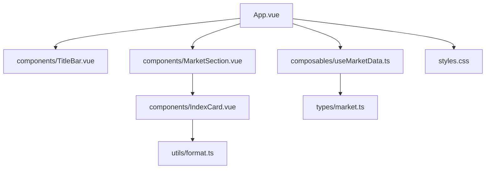
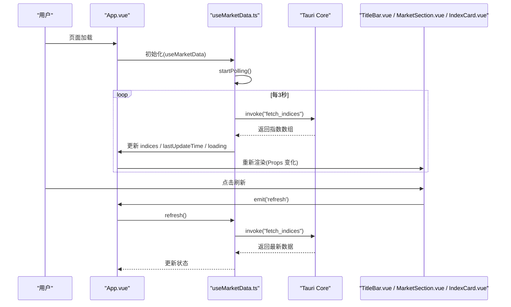
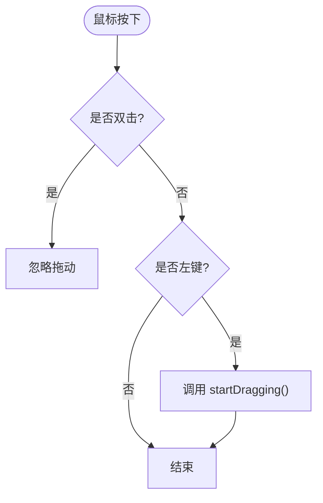
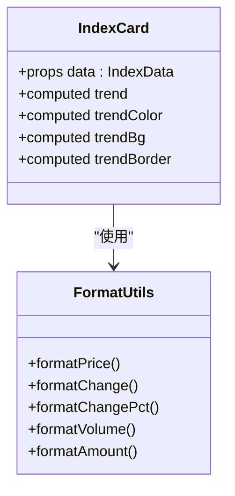
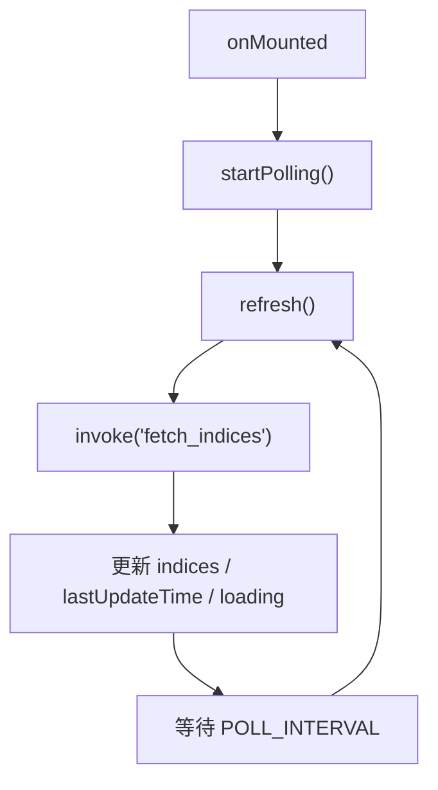
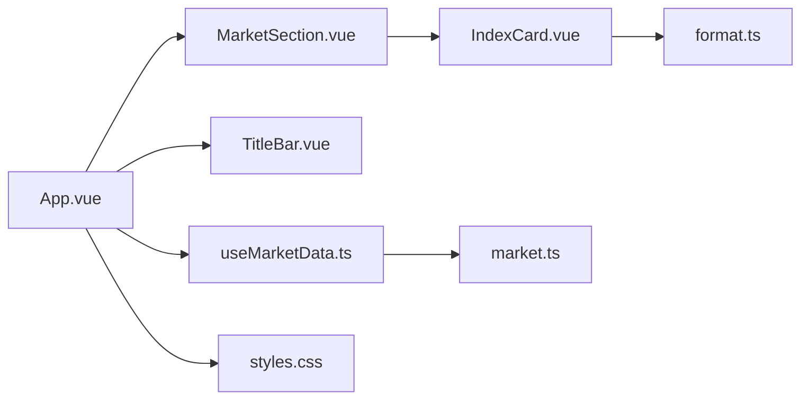

# 组件系统

<cite>
**本文引用的文件**
- [App.vue](file://src/App.vue)
- [TitleBar.vue](file://src/components/TitleBar.vue)
- [MarketSection.vue](file://src/components/MarketSection.vue)
- [IndexCard.vue](file://src/components/IndexCard.vue)
- [useMarketData.ts](file://src/composables/useMarketData.ts)
- [market.ts](file://src/types/market.ts)
- [format.ts](file://src/utils/format.ts)
- [styles.css](file://src/styles.css)
- [package.json](file://package.json)
</cite>

## 目录
1. [简介](#简介)
2. [项目结构](#项目结构)
3. [核心组件](#核心组件)
4. [架构总览](#架构总览)
5. [详细组件分析](#详细组件分析)
6. [依赖关系分析](#依赖关系分析)
7. [性能考量](#性能考量)
8. [故障排查指南](#故障排查指南)
9. [结论](#结论)
10. [附录](#附录)

## 简介
本文件面向 hq-kanban-app 的 Vue 组件系统，聚焦基于 Vue 3 Composition API 的组件化架构与实现细节。文档围绕根组件 App.vue 的组织结构与职责分工，深入解析 TitleBar 自定义标题栏、MarketSection 市场分区、IndexCard 指数卡片的数据绑定与渲染逻辑，并总结组件间通信模式、事件处理与 props 传递的最佳实践，同时给出组件复用策略与样式隔离方案。

## 项目结构
应用采用“按功能域组织”的前端结构：
- src/App.vue：根容器，负责组合状态与布局，挂载子组件
- src/components：UI 组件（TitleBar、MarketSection、IndexCard）
- src/composables：可复用逻辑（useMarketData）
- src/types：类型定义（market.ts）
- src/utils：工具函数（format.ts）
- src/styles.css：全局样式入口（引入 Tailwind）
- package.json：依赖与脚本

图表来源
- [App.vue:1-36](file://src/App.vue#L1-L36)
- [TitleBar.vue:1-63](file://src/components/TitleBar.vue#L1-L63)
- [MarketSection.vue:1-19](file://src/components/MarketSection.vue#L1-L19)
- [IndexCard.vue:1-71](file://src/components/IndexCard.vue#L1-L71)
- [useMarketData.ts:1-66](file://src/composables/useMarketData.ts#L1-L66)
- [market.ts:1-22](file://src/types/market.ts#L1-L22)
- [format.ts:1-33](file://src/utils/format.ts#L1-L33)
- [styles.css:1-2](file://src/styles.css#L1-L2)

章节来源
- [App.vue:1-36](file://src/App.vue#L1-L36)
- [package.json:1-26](file://package.json#L1-L26)

## 核心组件
- App.vue：作为根容器，使用 useMarketData 获取行情数据与刷新能力，组合 TitleBar 与 MarketSection，并提供空状态展示。
- TitleBar.vue：自定义窗口标题栏，提供拖拽、最小化、关闭等窗口控制，以及刷新按钮与最后更新时间显示。
- MarketSection.vue：市场分区容器，接收 MarketGroup 数据，渲染分组标题与指数卡片网格。
- IndexCard.vue：指数卡片，展示名称、价格、涨跌额/涨跌幅、成交量/成交额，并根据涨跌趋势动态着色。

章节来源
- [App.vue:1-36](file://src/App.vue#L1-L36)
- [TitleBar.vue:1-63](file://src/components/TitleBar.vue#L1-L63)
- [MarketSection.vue:1-19](file://src/components/MarketSection.vue#L1-L19)
- [IndexCard.vue:1-71](file://src/components/IndexCard.vue#L1-L71)

## 架构总览
前端通过 Tauri 调用后端能力获取行情数据，Vue 侧以组合式函数集中管理轮询与状态，组件仅关注展示与交互。

图表来源
- [useMarketData.ts:1-66](file://src/composables/useMarketData.ts#L1-L66)
- [App.vue:1-36](file://src/App.vue#L1-L36)
- [TitleBar.vue:1-63](file://src/components/TitleBar.vue#L1-L63)
- [MarketSection.vue:1-19](file://src/components/MarketSection.vue#L1-L19)
- [IndexCard.vue:1-71](file://src/components/IndexCard.vue#L1-L71)

## 详细组件分析

### 根组件 App.vue：组织与职责
- 职责
  - 组合 useMarketData 提供的 marketGroups、loading、lastUpdateTime、refresh
  - 渲染 TitleBar，透传 lastUpdateTime、loading，并监听 refresh 事件
  - 渲染 MarketSection 列表，按 key 进行稳定渲染
  - 在数据为空且未加载中，展示“暂无数据”的空状态
- 关键交互
  - 通过 @refresh 触发数据刷新
  - 通过 v-for + :key 保证列表渲染稳定性

章节来源
- [App.vue:1-36](file://src/App.vue#L1-L36)

### TitleBar.vue：自定义标题栏
- 窗口控制
  - 拖拽：mousedown 时调用窗口 startDragging；双击不触发拖动，避免与最大化切换冲突
  - 最小化/关闭：调用对应窗口方法
- 刷新与状态
  - 接收 loading 与 lastUpdateTime 作为 props
  - 刷新按钮通过 emit('refresh') 通知父组件
- 视觉反馈
  - loading 为真时显示脉动指示点
  - 右侧显示最后更新时间与操作按钮

图表来源
- [TitleBar.vue:13-19](file://src/components/TitleBar.vue#L13-L19)

章节来源
- [TitleBar.vue:1-63](file://src/components/TitleBar.vue#L1-L63)

### MarketSection.vue：市场分区
- 数据绑定
  - 接收 group: MarketGroup，包含 label 与 indices
- 渲染逻辑
  - 顶部显示分组标题与分割线
  - 使用 grid 布局渲染 IndexCard 列表，key 使用 index.code 确保唯一性

章节来源
- [MarketSection.vue:1-19](file://src/components/MarketSection.vue#L1-L19)
- [market.ts:17-21](file://src/types/market.ts#L17-L21)

### IndexCard.vue：指数卡片
- 展示效果
  - 名称、当前价格、涨跌额/涨跌幅、成交量/成交额
  - 根据涨跌趋势计算颜色、背景与左边框色
- 交互行为
  - 纯展示型组件，无外部交互
- 数据处理
  - 使用 format.ts 中的格式化函数统一输出格式

图表来源
- [IndexCard.vue:1-71](file://src/components/IndexCard.vue#L1-L71)
- [format.ts:1-33](file://src/utils/format.ts#L1-L33)

章节来源
- [IndexCard.vue:1-71](file://src/components/IndexCard.vue#L1-L71)
- [format.ts:1-33](file://src/utils/format.ts#L1-L33)

### 组合式函数 useMarketData.ts：数据与轮询
- 状态
  - indices: 原始指数数组
  - marketGroups: 按市场分组的计算属性（A股/港股/美股）
  - loading: 请求中标志
  - lastUpdateTime: 最近更新时间
- 行为
  - refresh(): 调用 Tauri invoke("fetch_indices") 获取数据，更新状态
  - startPolling()/stopPolling(): 定时轮询，生命周期钩子自动启停
- 返回值
  - 暴露 indices、marketGroups、loading、lastUpdateTime、refresh 供 App.vue 使用

图表来源
- [useMarketData.ts:1-66](file://src/composables/useMarketData.ts#L1-L66)

章节来源
- [useMarketData.ts:1-66](file://src/composables/useMarketData.ts#L1-L66)

## 依赖关系分析
- 组件耦合
  - App.vue 依赖 useMarketData 与三个子组件，承担编排职责
  - MarketSection.vue 依赖 IndexCard.vue 与 MarketGroup 类型
  - IndexCard.vue 依赖 format.ts 工具函数
- 外部依赖
  - Tauri API：窗口控制与 invoke 调用
  - Vue 3 Composition API：ref、computed、生命周期钩子
  - Tailwind CSS：原子化样式

图表来源
- [App.vue:1-36](file://src/App.vue#L1-L36)
- [useMarketData.ts:1-66](file://src/composables/useMarketData.ts#L1-L66)
- [MarketSection.vue:1-19](file://src/components/MarketSection.vue#L1-L19)
- [IndexCard.vue:1-71](file://src/components/IndexCard.vue#L1-L71)
- [format.ts:1-33](file://src/utils/format.ts#L1-L33)
- [market.ts:1-22](file://src/types/market.ts#L1-L22)
- [styles.css:1-2](file://src/styles.css#L1-L2)

章节来源
- [package.json:1-26](file://package.json#L1-L26)

## 性能考量
- 轮询频率
  - 默认 3 秒轮询一次，适合看板类场景；可根据网络与后端负载调整
- 响应式优化
  - marketGroups 使用 computed，仅在 indices 变化时重算
  - 列表渲染使用稳定 key（group.key、index.code），减少不必要的 DOM 重建
- 渲染成本
  - IndexCard 为纯展示组件，计算属性用于样式派生，开销较低
- 资源释放
  - onUnmounted 中清理定时器，避免内存泄漏

[本节为通用性能建议，无需特定文件引用]

## 故障排查指南
- 数据无法加载
  - 检查 Tauri 后端是否暴露 fetch_indices 接口
  - 查看控制台错误日志，确认 invoke 调用是否成功
- 刷新无效或卡顿
  - 检查 loading 状态是否正确切换
  - 确认轮询定时器是否被重复创建或未清理
- 窗口控制异常
  - 确认运行环境为 Tauri 桌面端
  - 检查事件冒泡与修饰符（如 @mousedown.stop）是否阻止了预期行为
- 样式异常
  - 确认 Tailwind 已正确引入（styles.css 中 @import "tailwindcss"）
  - 检查浏览器/开发工具中类名是否生效

章节来源
- [useMarketData.ts:25-36](file://src/composables/useMarketData.ts#L25-L36)
- [TitleBar.vue:13-27](file://src/components/TitleBar.vue#L13-L27)
- [styles.css:1-2](file://src/styles.css#L1-L2)

## 结论
该组件系统以 App.vue 为编排中心，结合组合式函数 useMarketData 统一管理数据与轮询，配合 TitleBar、MarketSection、IndexCard 等展示组件，形成清晰的分层与职责边界。通过 props 与事件实现单向数据流与解耦通信，借助 TypeScript 类型与工具函数保障一致性与可维护性。整体架构简洁高效，易于扩展与维护。

[本节为总结性内容，无需特定文件引用]

## 附录

### 组件间通信模式与最佳实践
- Props 传递
  - App.vue 向 TitleBar 传递 lastUpdateTime、loading；向 MarketSection 传递 group
  - MarketSection 向 IndexCard 传递 data（IndexData）
- 事件处理
  - TitleBar 通过 emit('refresh') 向上通知刷新，App.vue 监听并调用 useMarketData.refresh
- 状态提升
  - 所有数据与业务逻辑集中在 useMarketData，组件保持“瘦”，利于测试与复用

章节来源
- [App.vue:1-36](file://src/App.vue#L1-L36)
- [TitleBar.vue:1-63](file://src/components/TitleBar.vue#L1-L63)
- [MarketSection.vue:1-19](file://src/components/MarketSection.vue#L1-L19)
- [IndexCard.vue:1-71](file://src/components/IndexCard.vue#L1-L71)
- [useMarketData.ts:1-66](file://src/composables/useMarketData.ts#L1-L66)

### 组件复用策略
- 展示型组件
  - IndexCard 可复用于任何需要展示指数信息的场景，只需传入 IndexData
- 组合式函数
  - useMarketData 可被多个页面或视图复用，封装数据获取与轮询逻辑
- 工具函数
  - format.ts 中的格式化函数可在多处复用，保证输出一致性

章节来源
- [IndexCard.vue:1-71](file://src/components/IndexCard.vue#L1-L71)
- [useMarketData.ts:1-66](file://src/composables/useMarketData.ts#L1-L66)
- [format.ts:1-33](file://src/utils/format.ts#L1-L33)

### 样式隔离方案
- 使用 Tailwind 原子类，避免全局样式污染
- 组件内通过类名组合实现样式，必要时可使用 scoped 样式或 CSS Modules（当前项目以 Tailwind 为主）
- 全局样式入口 styles.css 仅引入 Tailwind，保持干净

章节来源
- [styles.css:1-2](file://src/styles.css#L1-L2)