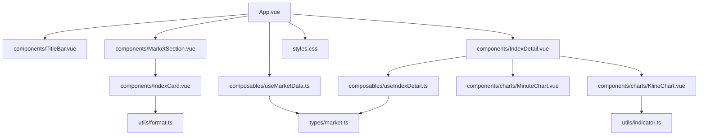
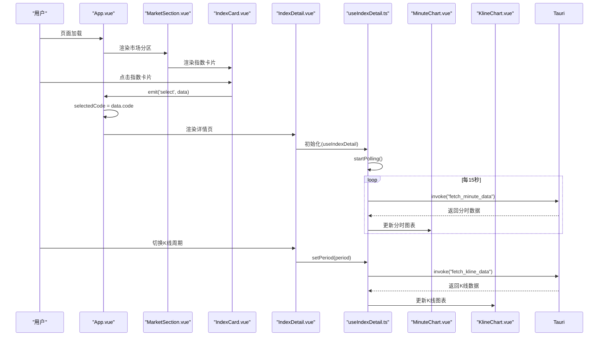
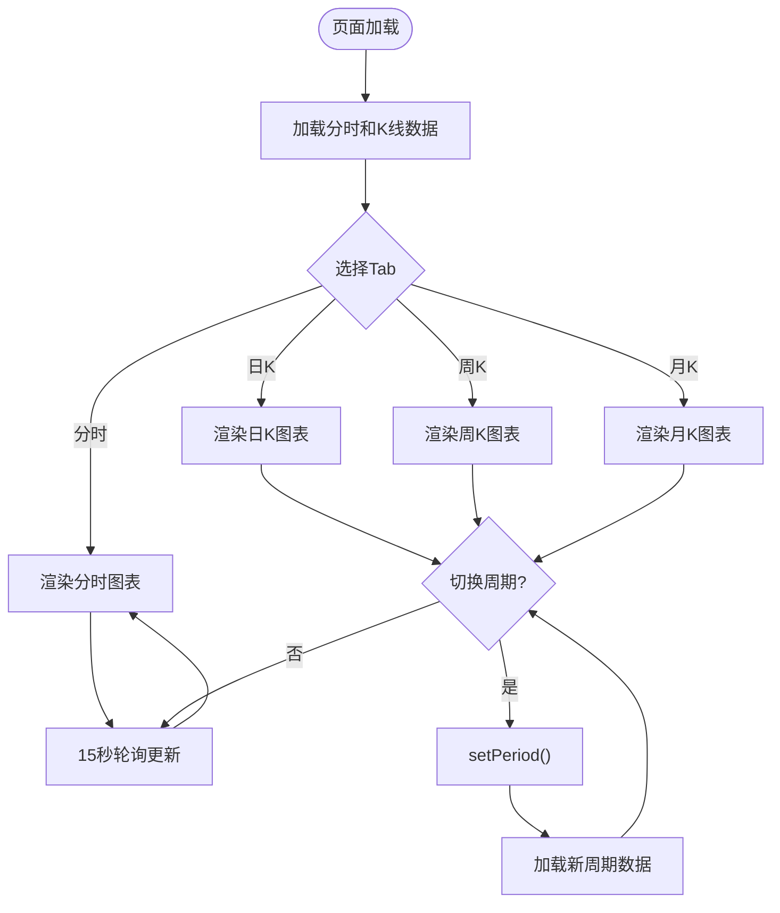
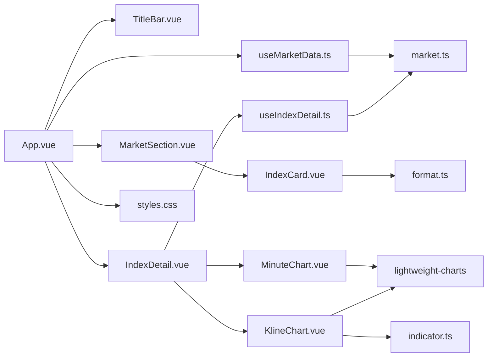

# 组件系统

<cite>
**本文引用的文件**
- [App.vue](file://src/App.vue)
- [TitleBar.vue](file://src/components/TitleBar.vue)
- [MarketSection.vue](file://src/components/MarketSection.vue)
- [IndexCard.vue](file://src/components/IndexCard.vue)
- [IndexDetail.vue](file://src/components/IndexDetail.vue)
- [MinuteChart.vue](file://src/components/charts/MinuteChart.vue)
- [KlineChart.vue](file://src/components/charts/KlineChart.vue)
- [useMarketData.ts](file://src/composables/useMarketData.ts)
- [useIndexDetail.ts](file://src/composables/useIndexDetail.ts)
- [market.ts](file://src/types/market.ts)
- [format.ts](file://src/utils/format.ts)
- [indicator.ts](file://src/utils/indicator.ts)
- [styles.css](file://src/styles.css)
- [package.json](file://package.json)
</cite>

## 更新摘要
**变更内容**
- 新增 IndexDetail 指数详情页组件，支持分时线和K线图展示
- 新增 charts 子目录，包含专业的 MinuteChart 和 KlineChart 图表组件
- 新增 useIndexDetail 组合式函数，管理详情页数据获取和轮询逻辑
- 扩展 market.ts 类型定义，支持分时数据和K线数据结构
- 集成 lightweight-charts 图表库，提供专业级金融图表功能
- 实现无路由状态切换机制，通过 selectedCode 在看板与详情页间切换

## 目录
1. [简介](#简介)
2. [项目结构](#项目结构)
3. [核心组件](#核心组件)
4. [架构总览](#架构总览)
5. [详细组件分析](#详细组件分析)
6. [依赖关系分析](#依赖关系分析)
7. [性能考量](#性能考量)
8. [故障排查指南](#故障排查指南)
9. [结论](#结论)
10. [附录](#附录)

## 简介
本文件面向 hq-kanban-app 的 Vue 组件系统，聚焦基于 Vue 3 Composition API 的组件化架构与实现细节。文档围绕根组件 App.vue 的组织结构与职责分工，深入解析 TitleBar 自定义标题栏、MarketSection 市场分区、IndexCard 指数卡片的数据绑定与渲染逻辑，以及新增的 IndexDetail 指数详情页和专业图表组件。同时总结组件间通信模式、事件处理与 props 传递的最佳实践，并给出组件复用策略与样式隔离方案。

## 项目结构
应用采用"按功能域组织"的前端结构：
- src/App.vue：根容器，负责组合状态与布局，挂载子组件
- src/components：UI 组件（TitleBar、MarketSection、IndexCard、IndexDetail）
- src/components/charts：专业图表组件（MinuteChart、KlineChart）
- src/composables：可复用逻辑（useMarketData、useIndexDetail）
- src/types：类型定义（market.ts）
- src/utils：工具函数（format.ts、indicator.ts）
- src/styles.css：全局样式入口（引入 Tailwind）
- package.json：依赖与脚本

**图表来源**
- [App.vue:1-68](file://src/App.vue#L1-L68)
- [TitleBar.vue:1-63](file://src/components/TitleBar.vue#L1-L63)
- [MarketSection.vue:1-26](file://src/components/MarketSection.vue#L1-L26)
- [IndexCard.vue:1-74](file://src/components/IndexCard.vue#L1-L74)
- [IndexDetail.vue:1-140](file://src/components/IndexDetail.vue#L1-L140)
- [MinuteChart.vue:1-295](file://src/components/charts/MinuteChart.vue#L1-L295)
- [KlineChart.vue:1-211](file://src/components/charts/KlineChart.vue#L1-L211)
- [useMarketData.ts:1-66](file://src/composables/useMarketData.ts#L1-L66)
- [useIndexDetail.ts:1-144](file://src/composables/useIndexDetail.ts#L1-L144)
- [market.ts:1-55](file://src/types/market.ts#L1-L55)
- [format.ts:1-33](file://src/utils/format.ts#L1-L33)
- [indicator.ts:1-50](file://src/utils/indicator.ts#L1-L50)
- [styles.css:1-2](file://src/styles.css#L1-L2)

**章节来源**
- [App.vue:1-68](file://src/App.vue#L1-L68)
- [package.json:1-28](file://package.json#L1-L28)

## 核心组件
- **App.vue**：作为根容器，使用 useMarketData 获取行情数据与刷新能力，组合 TitleBar 与 MarketSection，并通过 selectedCode 状态切换看板与详情页视图。
- **TitleBar.vue**：自定义窗口标题栏，提供拖拽、最小化、关闭等窗口控制，以及刷新按钮与最后更新时间显示。
- **MarketSection.vue**：市场分区容器，接收 MarketGroup 数据，渲染分组标题与指数卡片网格，支持点击选择进入详情页。
- **IndexCard.vue**：指数卡片，展示名称、价格、涨跌额/涨跌幅、成交量/成交额，并根据涨跌趋势动态着色，支持点击触发 select 事件。
- **IndexDetail.vue**：指数详情页，展示指数实时报价头部与分时线/日K/周K/月K图表，支持Tab切换和返回操作。
- **MinuteChart.vue**：分时线图表组件，基于 lightweight-charts 实现专业的分时走势展示。
- **KlineChart.vue**：K线图组件，支持日K、周K、月K展示，包含MA均线指标。

**章节来源**
- [App.vue:1-68](file://src/App.vue#L1-L68)
- [TitleBar.vue:1-63](file://src/components/TitleBar.vue#L1-L63)
- [MarketSection.vue:1-26](file://src/components/MarketSection.vue#L1-L26)
- [IndexCard.vue:1-74](file://src/components/IndexCard.vue#L1-L74)
- [IndexDetail.vue:1-140](file://src/components/IndexDetail.vue#L1-L140)
- [MinuteChart.vue:1-295](file://src/components/charts/MinuteChart.vue#L1-L295)
- [KlineChart.vue:1-211](file://src/components/charts/KlineChart.vue#L1-L211)

## 架构总览
前端通过 Tauri 调用后端能力获取行情数据，Vue 侧以组合式函数集中管理轮询与状态，组件仅关注展示与交互。新增的详情页功能通过无路由状态切换实现，保持应用简洁性。

**图表来源**
- [App.vue:1-68](file://src/App.vue#L1-L68)
- [MarketSection.vue:1-26](file://src/components/MarketSection.vue#L1-L26)
- [IndexCard.vue:1-74](file://src/components/IndexCard.vue#L1-L74)
- [IndexDetail.vue:1-140](file://src/components/IndexDetail.vue#L1-L140)
- [useIndexDetail.ts:1-144](file://src/composables/useIndexDetail.ts#L1-L144)
- [MinuteChart.vue:1-295](file://src/components/charts/MinuteChart.vue#L1-L295)
- [KlineChart.vue:1-211](file://src/components/charts/KlineChart.vue#L1-L211)

## 详细组件分析

### 根组件 App.vue：组织与职责
- **职责**
  - 组合 useMarketData 提供的 marketGroups、loading、lastUpdateTime、refresh
  - 维护 selectedCode 状态用于视图切换（null=看板，字符串=详情页）
  - 渲染 TitleBar，透传 lastUpdateTime、loading，并监听 refresh 事件
  - 根据 selectedCode 条件渲染 MarketSection 或 IndexDetail
  - 在数据为空且未加载中，展示"暂无数据"的空状态
- **关键交互**
  - 通过 @refresh 触发数据刷新
  - 通过 @select 事件设置 selectedCode 进入详情页
  - 通过 v-for + :key 保证列表渲染稳定性

**章节来源**
- [App.vue:1-68](file://src/App.vue#L1-L68)

### TitleBar.vue：自定义标题栏
- **窗口控制**
  - 拖拽：mousedown 时调用窗口 startDragging；双击不触发拖动，避免与最大化切换冲突
  - 最小化/关闭：调用对应窗口方法
- **刷新与状态**
  - 接收 loading 与 lastUpdateTime 作为 props
  - 刷新按钮通过 emit('refresh') 通知父组件
- **视觉反馈**
  - loading 为真时显示脉动指示点
  - 右侧显示最后更新时间与操作按钮

**章节来源**
- [TitleBar.vue:1-63](file://src/components/TitleBar.vue#L1-L63)

### MarketSection.vue：市场分区
- **数据绑定**
  - 接收 group: MarketGroup，包含 label 与 indices
- **渲染逻辑**
  - 顶部显示分组标题与分割线
  - 使用 grid 布局渲染 IndexCard 列表，key 使用 index.code 确保唯一性
  - 通过 @select 事件向上传递选中的指数数据

**章节来源**
- [MarketSection.vue:1-26](file://src/components/MarketSection.vue#L1-L26)
- [market.ts:17-21](file://src/types/market.ts#L17-L21)

### IndexCard.vue：指数卡片
- **展示效果**
  - 名称、当前价格、涨跌额/涨跌幅、成交量/成交额
  - 根据涨跌趋势计算颜色、背景与左边框色
- **交互行为**
  - 点击卡片触发 select 事件，传入 IndexData
  - 纯展示型组件，无外部交互
- **数据处理**
  - 使用 format.ts 中的格式化函数统一输出格式

**章节来源**
- [IndexCard.vue:1-74](file://src/components/IndexCard.vue#L1-L74)
- [format.ts:1-33](file://src/utils/format.ts#L1-L33)

### IndexDetail.vue：指数详情页
- **视图切换**
  - 接收 IndexData 作为 props，展示指数基本信息
  - 通过 @back 事件通知父组件返回看板
  - 支持 ESC 键返回功能
- **数据管理**
  - 使用 useIndexDetail 组合式函数管理分时和K线数据
  - 维护 activeTab 状态（minute/day/week/month）
  - 处理加载状态和错误状态
- **图表集成**
  - 根据 activeTab 条件渲染 MinuteChart 或 KlineChart
  - 支持K线周期切换和数据重试功能

**图表来源**
- [IndexDetail.vue:1-140](file://src/components/IndexDetail.vue#L1-L140)
- [useIndexDetail.ts:1-144](file://src/composables/useIndexDetail.ts#L1-L144)

**章节来源**
- [IndexDetail.vue:1-140](file://src/components/IndexDetail.vue#L1-L140)

### MinuteChart.vue：分时线图表
- **图表特性**
  - 基于 lightweight-charts v5 构建专业分时线
  - 双轴设计：左轴显示价格，右轴显示涨跌幅百分比
  - 副图显示成交量柱状图，红涨绿跌配色
- **时间轴处理**
  - 合成时间戳基准：固定日期 2024-01-01 00:00 UTC，index*60s 等间隔
  - 消除 A 股 11:30→13:00 午休及停牌造成的时间轴空洞
  - 支持不同市场的全天分时点数适配
- **视觉效果**
  - 昨收基准虚线，左右轴刻度严格对齐
  - 对称缩放半幅，以昨收为中心上下对称展开
  - 自适应窗口大小，支持 ResizeObserver

**章节来源**
- [MinuteChart.vue:1-295](file://src/components/charts/MinuteChart.vue#L1-L295)

### KlineChart.vue：K线图组件
- **图表特性**
  - 蜡烛图主图，支持日K、周K、月K切换
  - 成交量副图，与主图物理隔离
  - MA5/10/20 移动平均线指标
- **数据处理**
  - 自动排序确保数据按时间升序
  - 前 n-1 项数据不足为 null，用 whitespace 占位保持时间轴对齐
  - 首次渲染或柱数变化时自适应视野
- **交互体验**
  - 保留用户缩放/平移状态，避免频繁重置
  - 两端各留少量逻辑 bar 空白，确保标签完整可见
  - 实时图例显示最新 MA 值

**章节来源**
- [KlineChart.vue:1-211](file://src/components/charts/KlineChart.vue#L1-L211)

### 组合式函数 useIndexDetail.ts：详情页数据管理
- **状态管理**
  - minuteData：分时数据响应式引用
  - klineData：K线数据响应式引用
  - activePeriod：当前K线周期（day/week/month）
  - loading：整体加载状态
  - error/klineError：错误状态分离管理
- **数据获取**
  - loadMinute()：15秒轮询获取分时数据，支持 inflight 去重
  - loadKline()：K线数据获取，支持缓存和TTL过期
  - setPeriod()：切换K线周期，避免重复请求
  - retryKline()：失败重试功能
- **生命周期**
  - initialLoad()：初始加载分时和K线数据
  - startPolling()/stopPolling()：定时轮询管理
  - visibilitychange：页面可见性监听，优化资源使用

**章节来源**
- [useIndexDetail.ts:1-144](file://src/composables/useIndexDetail.ts#L1-L144)

### 组合式函数 useMarketData.ts：看板数据管理
- **状态**
  - indices：原始指数数组
  - marketGroups：按市场分组的计算属性（A股/港股/美股）
  - loading：请求中标志
  - lastUpdateTime：最近更新时间
- **行为**
  - refresh()：调用 Tauri invoke("fetch_indices") 获取数据，更新状态
  - startPolling()/stopPolling()：定时轮询，生命周期钩子自动启停
- **返回值**
  - 暴露 indices、marketGroups、loading、lastUpdateTime、refresh 供 App.vue 使用

**章节来源**
- [useMarketData.ts:1-66](file://src/composables/useMarketData.ts#L1-L66)

## 依赖关系分析
- **组件耦合**
  - App.vue 依赖 useMarketData 与三个子组件，承担编排职责
  - MarketSection.vue 依赖 IndexCard.vue 与 MarketGroup 类型
  - IndexDetail.vue 依赖 useIndexDetail 和图表组件
  - 图表组件依赖 lightweight-charts 库和工具函数
- **外部依赖**
  - Tauri API：窗口控制与 invoke 调用
  - Vue 3 Composition API：ref、computed、生命周期钩子
  - lightweight-charts：专业金融图表库
  - Tailwind CSS：原子化样式

**图表来源**
- [App.vue:1-68](file://src/App.vue#L1-L68)
- [useMarketData.ts:1-66](file://src/composables/useMarketData.ts#L1-L66)
- [MarketSection.vue:1-26](file://src/components/MarketSection.vue#L1-L26)
- [IndexCard.vue:1-74](file://src/components/IndexCard.vue#L1-L74)
- [IndexDetail.vue:1-140](file://src/components/IndexDetail.vue#L1-L140)
- [useIndexDetail.ts:1-144](file://src/composables/useIndexDetail.ts#L1-L144)
- [MinuteChart.vue:1-295](file://src/components/charts/MinuteChart.vue#L1-L295)
- [KlineChart.vue:1-211](file://src/components/charts/KlineChart.vue#L1-L211)
- [format.ts:1-33](file://src/utils/format.ts#L1-L33)
- [indicator.ts:1-50](file://src/utils/indicator.ts#L1-L50)
- [market.ts:1-55](file://src/types/market.ts#L1-L55)
- [styles.css:1-2](file://src/styles.css#L1-L2)

**章节来源**
- [package.json:1-28](file://package.json#L1-L28)

## 性能考量
- **轮询频率**
  - 看板默认 3 秒轮询一次，适合看板类场景
  - 详情页分时数据 15 秒轮询，平衡实时性与性能
- **响应式优化**
  - marketGroups 使用 computed，仅在 indices 变化时重算
  - 列表渲染使用稳定 key（group.key、index.code），减少不必要的 DOM 重建
  - K线数据缓存机制，避免重复请求
- **渲染成本**
  - IndexCard 为纯展示组件，计算属性用于样式派生，开销较低
  - 图表组件使用轻量级 lightweight-charts，支持按需加载
  - 详情页异步加载，lightweight-charts 拆入独立 chunk
- **资源释放**
  - onUnmounted 中清理定时器，避免内存泄漏
  - ResizeObserver 正确断开连接
  - 图表实例在卸载时正确销毁

## 故障排查指南
- **数据无法加载**
  - 检查 Tauri 后端是否暴露 fetch_indices、fetch_minute_data、fetch_kline_data 接口
  - 查看控制台错误日志，确认 invoke 调用是否成功
- **详情页显示异常**
  - 检查 selectedCode 状态是否正确设置
  - 验证 selectedIndex 计算属性是否能找到对应指数
  - 确认 IndexDetail 组件是否正确接收 props
- **图表渲染问题**
  - 检查 lightweight-charts 库是否正确安装和导入
  - 验证图表容器是否有正确的尺寸
  - 确认数据格式是否符合图表组件要求
- **轮询相关**
  - 检查 loading 状态是否正确切换
  - 确认轮询定时器是否被重复创建或未清理
  - 验证页面可见性监听是否正常工作
- **窗口控制异常**
  - 确认运行环境为 Tauri 桌面端
  - 检查事件冒泡与修饰符（如 @mousedown.stop）是否阻止了预期行为
- **样式异常**
  - 确认 Tailwind 已正确引入（styles.css 中 @import "tailwindcss"）
  - 检查浏览器/开发工具中类名是否生效

**章节来源**
- [useMarketData.ts:25-36](file://src/composables/useMarketData.ts#L25-L36)
- [useIndexDetail.ts:26-46](file://src/composables/useIndexDetail.ts#L26-L46)
- [TitleBar.vue:13-27](file://src/components/TitleBar.vue#L13-L27)
- [styles.css:1-2](file://src/styles.css#L1-L2)

## 结论
该组件系统以 App.vue 为编排中心，结合组合式函数 useMarketData 统一管理数据与轮询，配合 TitleBar、MarketSection、IndexCard 等展示组件，形成清晰的分层与职责边界。新增的 IndexDetail 详情页和专业图表组件丰富了前端组件生态，通过无路由状态切换机制保持了应用的简洁性。通过 props 与事件实现单向数据流与解耦通信，借助 TypeScript 类型与工具函数保障一致性与可维护性。整体架构简洁高效，易于扩展与维护。

## 附录

### 组件间通信模式与最佳实践
- **Props 传递**
  - App.vue 向 TitleBar 传递 lastUpdateTime、loading；向 MarketSection 传递 group；向 IndexDetail 传递 data
  - MarketSection 向 IndexCard 传递 data（IndexData）
  - IndexDetail 向图表组件传递数据（MinuteData、KlineBar[]）
- **事件处理**
  - TitleBar 通过 emit('refresh') 向上通知刷新，App.vue 监听并调用 useMarketData.refresh
  - IndexCard 通过 emit('select', data) 通知父组件选中指数，App.vue 设置 selectedCode
  - IndexDetail 通过 emit('back') 通知返回看板
- **状态提升**
  - 所有数据与业务逻辑集中在组合式函数，组件保持"瘦"，利于测试与复用
  - 详情页状态由 useIndexDetail 统一管理，包括分时数据、K线数据、加载状态等

**章节来源**
- [App.vue:1-68](file://src/App.vue#L1-L68)
- [TitleBar.vue:1-63](file://src/components/TitleBar.vue#L1-L63)
- [MarketSection.vue:1-26](file://src/components/MarketSection.vue#L1-L26)
- [IndexCard.vue:1-74](file://src/components/IndexCard.vue#L1-L74)
- [IndexDetail.vue:1-140](file://src/components/IndexDetail.vue#L1-L140)
- [useMarketData.ts:1-66](file://src/composables/useMarketData.ts#L1-L66)
- [useIndexDetail.ts:1-144](file://src/composables/useIndexDetail.ts#L1-L144)

### 组件复用策略
- **展示型组件**
  - IndexCard 可复用于任何需要展示指数信息的场景，只需传入 IndexData
  - 图表组件（MinuteChart、KlineChart）可独立使用，只需传入相应数据格式
- **组合式函数**
  - useMarketData 可被多个页面或视图复用，封装数据获取与轮询逻辑
  - useIndexDetail 可被详情页或其他需要指数详情的组件复用
- **工具函数**
  - format.ts 中的格式化函数可在多处复用，保证输出一致性
  - indicator.ts 中的技术指标计算函数可用于其他分析场景

**章节来源**
- [IndexCard.vue:1-74](file://src/components/IndexCard.vue#L1-L74)
- [MinuteChart.vue:1-295](file://src/components/charts/MinuteChart.vue#L1-L295)
- [KlineChart.vue:1-211](file://src/components/charts/KlineChart.vue#L1-L211)
- [useMarketData.ts:1-66](file://src/composables/useMarketData.ts#L1-L66)
- [useIndexDetail.ts:1-144](file://src/composables/useIndexDetail.ts#L1-L144)
- [format.ts:1-33](file://src/utils/format.ts#L1-L33)
- [indicator.ts:1-50](file://src/utils/indicator.ts#L1-L50)

### 样式隔离方案
- **使用 Tailwind 原子类**，避免全局样式污染
- **组件内通过类名组合**实现样式，必要时可使用 scoped 样式或 CSS Modules（当前项目以 Tailwind 为主）
- **全局样式入口 styles.css** 仅引入 Tailwind，保持干净
- **图表组件使用内联样式**配置，避免与全局样式冲突

**章节来源**
- [styles.css:1-2](file://src/styles.css#L1-L2)

### 新增数据类型说明
- **MinutePoint**：分时单点数据，包含时间、价格、均价、成交量
- **MinuteData**：分时数据集合，包含代码、日期、昨收价和分钟点数组
- **KlinePeriod**：K线周期类型（'day' | 'week' | 'month'）
- **KlineBar**：K线单根蜡烛图数据，包含日期、开高低收、成交量
- **KlineData**：K线数据集合，包含代码、周期和蜡烛图数组

**章节来源**
- [market.ts:23-55](file://src/types/market.ts#L23-L55)

### 图表库集成说明
- **lightweight-charts v5.2.1**：TradingView 出品的专业金融图表库
- **gzip 约 15KB**：体积适中，支持异步 chunk 按需加载
- **Canvas 渲染**：高性能渲染大量数据点
- **原生系列支持**：Candlestick/Area/Histogram 等金融图表系列
- **API 友好**：setData/update() API 契合轮询数据流

**章节来源**
- [package.json:13-16](file://package.json#L13-L16)
- [MinuteChart.vue:1-20](file://src/components/charts/MinuteChart.vue#L1-L20)
- [KlineChart.vue:1-15](file://src/components/charts/KlineChart.vue#L1-L15)