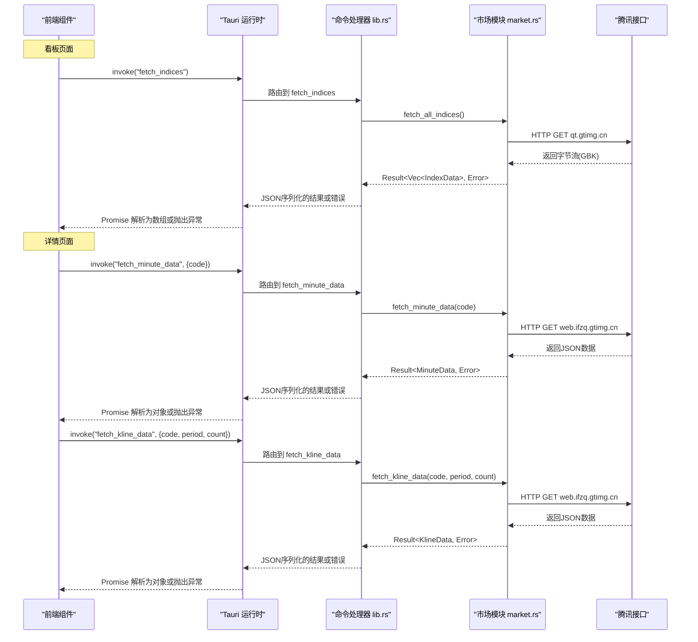
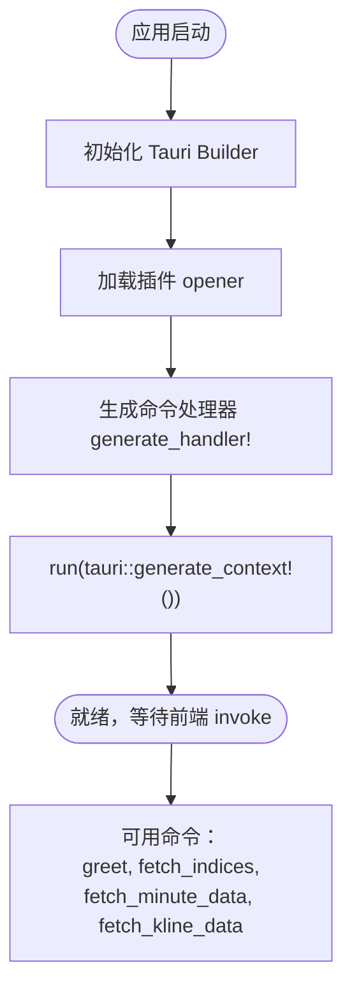
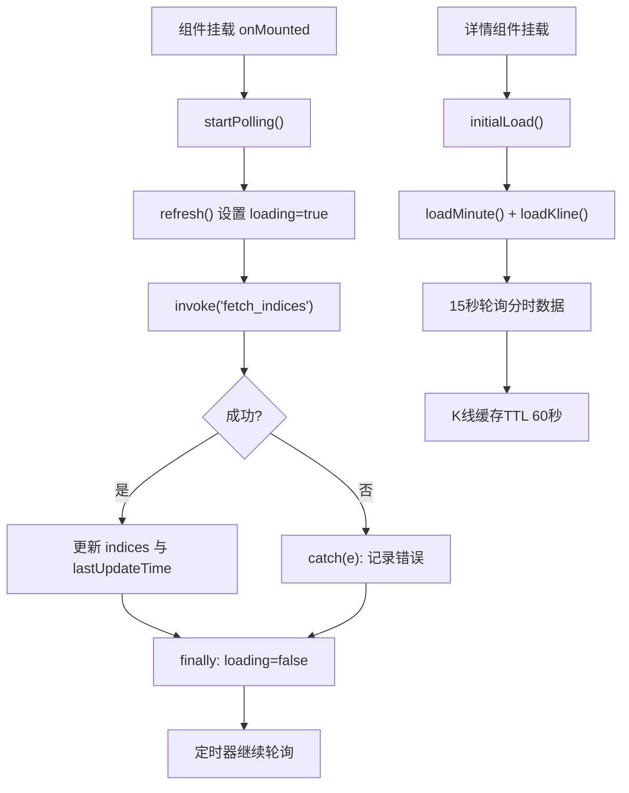
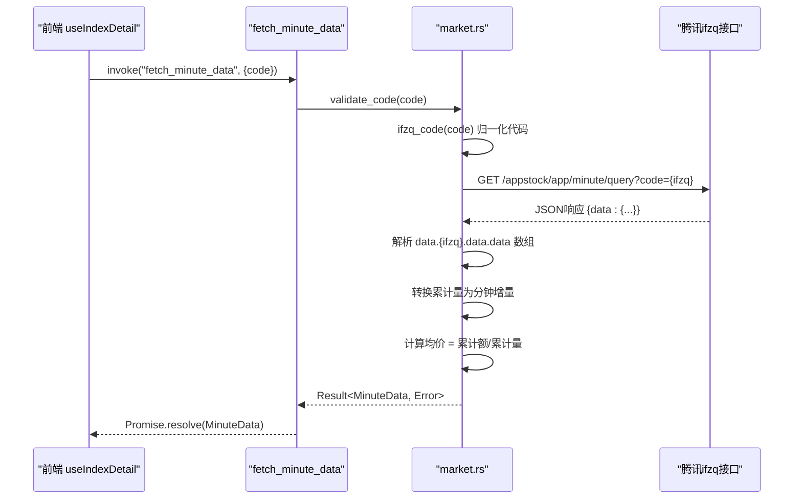
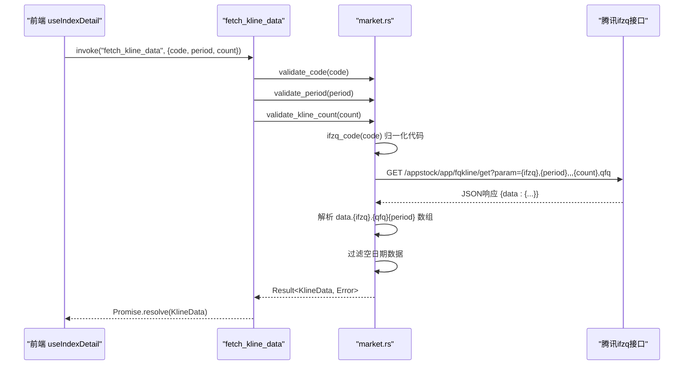
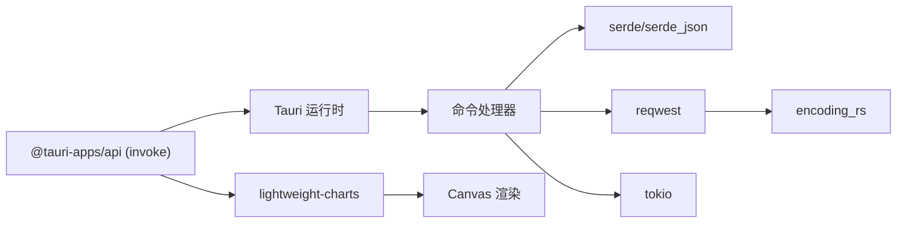

# Tauri命令接口

<cite>
**本文引用的文件**
- [src-tauri/src/lib.rs](file://src-tauri/src/lib.rs)
- [src-tauri/src/market.rs](file://src-tauri/src/market.rs)
- [src-tauri/tauri.conf.json](file://src-tauri/tauri.conf.json)
- [src-tauri/capabilities/default.json](file://src-tauri/capabilities/default.json)
- [src/composables/useMarketData.ts](file://src/composables/useMarketData.ts)
- [src/composables/useIndexDetail.ts](file://src/composables/useIndexDetail.ts)
- [src/types/market.ts](file://src/types/market.ts)
- [src/components/IndexCard.vue](file://src/components/IndexCard.vue)
- [src/components/IndexDetail.vue](file://src/components/IndexDetail.vue)
- [src/components/charts/MinuteChart.vue](file://src/components/charts/MinuteChart.vue)
- [src/components/charts/KlineChart.vue](file://src/components/charts/KlineChart.vue)
- [package.json](file://package.json)
- [src-tauri/Cargo.toml](file://src-tauri/Cargo.toml)
</cite>

## 更新摘要
**变更内容**
- 新增 fetch_minute_data 命令：获取指数分时数据
- 新增 fetch_kline_data 命令：获取指数K线数据（日K/周K/月K）
- 扩展前后端通信能力，支持指数详情页功能
- 新增 lightweight-charts 图表库依赖
- 完善错误处理和输入验证机制

## 目录
1. [简介](#简介)
2. [项目结构](#项目结构)
3. [核心组件](#核心组件)
4. [架构总览](#架构总览)
5. [详细组件分析](#详细组件分析)
6. [新增命令接口详解](#新增命令接口详解)
7. [依赖关系分析](#依赖关系分析)
8. [性能考虑](#性能考虑)
9. [故障排查指南](#故障排查指南)
10. [结论](#结论)
11. [附录](#附录)

## 简介
本文件为Tauri命令接口的权威API文档，聚焦于命令注册机制、前后端通信协议、所有命令的参数与返回值定义、异步处理流程与状态管理、错误码与异常处理、安全权限控制与访问限制、前端调用示例与最佳实践，以及命令扩展开发与版本兼容性建议。目标是帮助开发者快速理解并安全地扩展该应用的Tauri命令体系。

**最新更新**：新增了分时数据和K线数据获取命令，支持指数详情页的实时行情展示和图表渲染功能。

## 项目结构
本项目采用Tauri 2.x的前后端分离架构：
- 后端（Rust）：负责命令注册、网络请求、数据解析与序列化。
- 前端（Vue + TypeScript）：通过@tauri-apps/api的invoke调用后端命令，渲染指数行情卡片和详情图表。

```mermaid
graph TB
subgraph "前端"
FE_Composable["useMarketData.ts<br/>看板数据"]
FE_Detail["useIndexDetail.ts<br/>详情数据"]
FE_IndexCard["IndexCard.vue"]
FE_DetailView["IndexDetail.vue"]
FE_MinuteChart["MinuteChart.vue"]
FE_KlineChart["KlineChart.vue"]
end
subgraph "Tauri 应用"
Lib_rs["lib.rs<br/>命令注册与入口"]
Market_rs["market.rs<br/>数据获取与模型"]
end
subgraph "外部服务"
Tencent_API["腾讯行情接口"]
IFZQ_API["腾讯ifzq接口"]
end
FE_Composable --> |invoke("fetch_indices")| Lib_rs
FE_Detail --> |invoke("fetch_minute_data")| Lib_rs
FE_Detail --> |invoke("fetch_kline_data")| Lib_rs
Lib_rs --> Market_rs
Market_rs --> |HTTP GET| Tencent_API
Market_rs --> |HTTP GET| IFZQ_API
```

**图表来源**
- [src/composables/useMarketData.ts:1-66](file://src/composables/useMarketData.ts#L1-L66)
- [src/composables/useIndexDetail.ts:1-144](file://src/composables/useIndexDetail.ts#L1-L144)
- [src-tauri/src/lib.rs:1-63](file://src-tauri/src/lib.rs#L1-L63)
- [src-tauri/src/market.rs:1-384](file://src-tauri/src/market.rs#L1-L384)

**章节来源**
- [src-tauri/src/lib.rs:1-63](file://src-tauri/src/lib.rs#L1-L63)
- [src-tauri/src/market.rs:1-384](file://src-tauri/src/market.rs#L1-L384)
- [src/composables/useMarketData.ts:1-66](file://src/composables/useMarketData.ts#L1-L66)
- [src/composables/useIndexDetail.ts:1-144](file://src/composables/useIndexDetail.ts#L1-L144)

## 核心组件
- **命令注册与入口**
  - 在库模块中声明命令函数，并通过Tauri构建器注册到全局处理器。
  - 提供 greet、fetch_indices、fetch_minute_data 与 fetch_kline_data 四个命令。
- **市场数据模块**
  - 定义指数数据结构 IndexData，包含代码、名称、价格、涨跌额、涨跌幅、成交量、成交额、市场类型与更新时间等字段。
  - 实现异步获取所有指数的逻辑，从腾讯行情接口拉取并按GBK编码解析，映射为结构化数据。
  - 新增分时数据和K线数据的获取逻辑，使用腾讯ifzq系UTF-8 JSON接口。
- **前端数据组合式函数**
  - useMarketData：使用 @tauri-apps/api/core 的 invoke 调用 fetch_indices 命令，维护加载状态、轮询刷新与分组展示。
  - useIndexDetail：管理指数详情页的分时和K线数据，支持缓存、轮询和错误处理。
- **图表组件**
  - MinuteChart：使用lightweight-charts v5渲染分时图，支持面积图、折线图和成交量柱状图。
  - KlineChart：使用lightweight-charts v5渲染K线图，支持蜡烛图、移动平均线和成交量副图。
- **类型定义**
  - 前端 TypeScript 类型与后端 Rust 结构体一一对应，确保类型安全。

**章节来源**
- [src-tauri/src/lib.rs:3-30](file://src-tauri/src/lib.rs#L3-L30)
- [src-tauri/src/market.rs:1-384](file://src-tauri/src/market.rs#L1-L384)
- [src/composables/useMarketData.ts:1-66](file://src/composables/useMarketData.ts#L1-L66)
- [src/composables/useIndexDetail.ts:1-144](file://src/composables/useIndexDetail.ts#L1-L144)
- [src/types/market.ts:1-55](file://src/types/market.ts#L1-L55)

## 架构总览
Tauri命令调用时序如下：



**图表来源**
- [src/composables/useMarketData.ts:25-36](file://src/composables/useMarketData.ts#L25-L36)
- [src/composables/useIndexDetail.ts:26-73](file://src/composables/useIndexDetail.ts#L26-L73)
- [src-tauri/src/lib.rs:8-30](file://src-tauri/src/lib.rs#L8-L30)
- [src-tauri/src/market.rs:42-383](file://src-tauri/src/market.rs#L42-L383)

## 详细组件分析

### 基础命令

#### fetch_indices 命令
- **命令名**：fetch_indices
- **参数**：无
- **返回值**：Promise<IndexData[]>
- **行为**：
  - 调用后端 market::fetch_all_indices() 获取指数列表。
  - 将错误转换为字符串并返回给前端。
- **数据类型**（IndexData 字段说明）：
  - code: string — 指数代码
  - name: string — 指数名称
  - current: number — 当前价
  - prev_close: number — 昨收价
  - open: number — 开盘价
  - high: number — 最高价
  - low: number — 最低价
  - change: number — 涨跌额
  - change_pct: number — 涨跌幅（百分比数值）
  - volume: number — 成交量
  - amount: number — 成交额
  - market: 'a' | 'hk' | 'us' — 市场类型（A股/港股/美股）
  - update_time: string — 更新时间
- **数据来源**：腾讯行情接口（GBK编码），按行解析并映射为结构化数据。

**章节来源**
- [src-tauri/src/lib.rs:8-11](file://src-tauri/src/lib.rs#L8-L11)
- [src-tauri/src/market.rs:42-100](file://src-tauri/src/market.rs#L42-L100)
- [src/types/market.ts:1-22](file://src/types/market.ts#L1-L22)

### 新增命令接口

#### fetch_minute_data 命令
- **命令名**：fetch_minute_data
- **参数**：
  - code: string — 指数代码（如 sh000001、sz399001、r_hkHSI 等）
- **返回值**：Promise<MinuteData>
- **行为**：
  - 调用后端 market::fetch_minute_data(&code) 获取指定指数的分时数据。
  - 对输入进行白名单校验，防止URL注入攻击。
  - 从腾讯ifzq分钟查询接口获取UTF-8 JSON格式的分时数据。
  - 将累计成交量转换为分钟增量，计算均价线。
  - 将错误转换为字符串并返回给前端。
- **数据类型**（MinuteData 字段说明）：
  - code: string — 指数代码
  - date: string — 日期（YYYYMMDD格式，休市时可能为空）
  - prev_close: number — 昨收价
  - points: MinutePoint[] — 分时点数组
    - time: string — 时间（HH:MM格式）
    - price: number — 价格
    - avg_price: number — 均价
    - volume: number — 成交量（分钟增量）
- **数据来源**：腾讯ifzq minute/query接口（UTF-8 JSON）。

**章节来源**
- [src-tauri/src/lib.rs:13-18](file://src-tauri/src/lib.rs#L13-L18)
- [src-tauri/src/market.rs:204-308](file://src-tauri/src/market.rs#L204-L308)
- [src/types/market.ts:23-37](file://src/types/market.ts#L23-L37)

#### fetch_kline_data 命令
- **命令名**：fetch_kline_data
- **参数**：
  - code: string — 指数代码
  - period: string — K线周期（'day' | 'week' | 'month'）
  - count: Option<u32> — K线数量（可选，默认320，最大2000）
- **返回值**：Promise<KlineData>
- **行为**：
  - 调用后端 market::fetch_kline_data(&code, &period, count) 获取指定指数的K线数据。
  - 对输入进行白名单校验，包括代码、周期和数量的验证。
  - 从腾讯ifzqK线接口获取UTF-8 JSON格式的K线数据。
  - 过滤空日期数据，确保前端图表正常渲染。
  - 将错误转换为字符串并返回给前端。
- **数据类型**（KlineData 字段说明）：
  - code: string — 指数代码
  - period: string — K线周期（'day' | 'week' | 'month'）
  - bars: KlineBar[] — K线柱数组
    - date: string — 日期（YYYY-MM-DD格式）
    - open: number — 开盘价
    - close: number — 收盘价
    - high: number — 最高价
    - low: number — 最低价
    - volume: number — 成交量
- **数据来源**：腾讯ifzq fqkline/get接口（UTF-8 JSON）。

**章节来源**
- [src-tauri/src/lib.rs:20-30](file://src-tauri/src/lib.rs#L20-L30)
- [src-tauri/src/market.rs:313-383](file://src-tauri/src/market.rs#L313-L383)
- [src/types/market.ts:39-54](file://src/types/market.ts#L39-L54)

### 命令注册机制
- **命令声明**：使用 #[tauri::command] 宏标记命令函数。
- **注册方式**：通过 tauri::generate_handler![...] 将命令加入处理器。
- **入口**：应用启动时调用 run()，初始化插件、注入命令处理器并运行窗口。



**图表来源**
- [src-tauri/src/lib.rs:33-51](file://src-tauri/src/lib.rs#L33-L51)

**章节来源**
- [src-tauri/src/lib.rs:1-63](file://src-tauri/src/lib.rs#L1-L63)

### 前后端通信协议
- **通道**：Tauri 内部 IPC（基于 invoke/handle）。
- **序列化**：Rust 侧使用 serde 进行 JSON 序列化；前端通过 @tauri-apps/api/core 的 invoke 接收对应类型。
- **错误传播**：Rust 侧返回 Result<T, E>，E 会被序列化为字符串错误消息；前端 catch 捕获异常。
- **数据验证**：新增的命令包含严格的输入白名单验证，防止恶意输入。

**章节来源**
- [src-tauri/src/lib.rs:8-30](file://src-tauri/src/lib.rs#L8-L30)
- [src/composables/useMarketData.ts:25-36](file://src/composables/useMarketData.ts#L25-L36)
- [src/composables/useIndexDetail.ts:26-73](file://src/composables/useIndexDetail.ts#L26-L73)
- [src-tauri/Cargo.toml:19-26](file://src-tauri/Cargo.toml#L19-L26)

### 异步命令处理流程与状态管理
- **后端**：所有数据获取命令均为 async fn，内部调用异步网络请求，使用 tokio 运行时。
- **前端**：
  - useMarketData：使用 ref 维护 indices、loading、lastUpdateTime，定时刷新看板数据。
  - useIndexDetail：管理分时和K线数据，支持缓存、轮询、错误处理和防重复请求。
  - 组件卸载时清理定时器，避免内存泄漏。



**图表来源**
- [src/composables/useMarketData.ts:25-56](file://src/composables/useMarketData.ts#L25-L56)
- [src/composables/useIndexDetail.ts:86-131](file://src/composables/useIndexDetail.ts#L86-L131)

**章节来源**
- [src/composables/useMarketData.ts:1-66](file://src/composables/useMarketData.ts#L1-L66)
- [src/composables/useIndexDetail.ts:1-144](file://src/composables/useIndexDetail.ts#L1-L144)
- [src-tauri/src/market.rs:42-383](file://src-tauri/src/market.rs#L42-L383)

### 错误码定义与异常处理机制
- **后端错误**：
  - 网络请求失败、响应解码失败、数据解析异常等会转为 String 错误并返回。
  - 新增的输入验证错误：非法指数代码、非法K线周期、超出范围的K线数量。
  - 具体错误类型由 reqwest、encoding_rs、serde_json 等库抛出，统一以字符串形式透传。
- **前端错误**：
  - invoke 抛出的异常被 catch 捕获，打印日志，保持 loading 状态正确复位。
  - 友好的错误提示："数据源暂不可用，请稍后重试"。
  - 防乱序处理：切换指数或周期时丢弃过期请求的结果。
- **建议**：
  - 可在后端自定义错误枚举并实现 Display，便于前端分类处理。
  - 对关键错误增加重试与降级策略（如缓存上次有效数据）。

**章节来源**
- [src-tauri/src/lib.rs:8-30](file://src-tauri/src/lib.rs#L8-L30)
- [src-tauri/src/market.rs:150-189](file://src-tauri/src/market.rs#L150-L189)
- [src/composables/useMarketData.ts:25-36](file://src/composables/useMarketData.ts#L25-L36)
- [src/composables/useIndexDetail.ts:26-73](file://src/composables/useIndexDetail.ts#L26-L73)

### 安全权限控制与访问限制
- **能力配置**：默认能力仅启用 core:default、opener:default 及窗口操作相关权限。
- **安全策略**：CSP 设置为 null（开发环境常见），生产环境建议收紧 CSP 与白名单。
- **命令访问**：未显式限制命令访问范围，意味着所有窗口均可调用已注册命令。如需细粒度控制，可结合能力与窗口标识进行限制。
- **输入验证**：新增的命令包含严格的输入白名单验证，防止URL注入攻击。
- **建议**：
  - 为敏感命令添加能力白名单或窗口级限制。
  - 在生产环境启用严格 CSP，避免内联脚本与不受信任资源。

**章节来源**
- [src-tauri/capabilities/default.json:1-14](file://src-tauri/capabilities/default.json#L1-L14)
- [src-tauri/tauri.conf.json:24-26](file://src-tauri/tauri.conf.json#L24-L26)
- [src-tauri/src/market.rs:150-189](file://src-tauri/src/market.rs#L150-L189)

### 前端调用命令示例与最佳实践
- **基本调用**：
  - 使用 invoke('fetch_indices') 获取看板数据。
  - 使用 invoke('fetch_minute_data', {code}) 获取分时数据。
  - 使用 invoke('fetch_kline_data', {code, period, count}) 获取K线数据。
- **轮询策略**：
  - 看板数据：3秒轮询。
  - 分时数据：15秒轮询。
  - K线数据：60秒缓存TTL，减少重复请求。
- **类型安全**：
  - 使用 TypeScript 类型约束数据，减少运行时错误。
  - 前后端类型严格对齐。
- **用户体验**：
  - 显示最后更新时间，提升感知。
  - 友好的错误提示和重试机制。
  - 防重复请求和乱序防护。
- **错误处理**：
  - 捕获异常并记录日志。
  - 网络不可用时给出提示。
  - 支持手动重试。

**章节来源**
- [src/composables/useMarketData.ts:1-66](file://src/composables/useMarketData.ts#L1-L66)
- [src/composables/useIndexDetail.ts:1-144](file://src/composables/useIndexDetail.ts#L1-L144)
- [src/types/market.ts:1-55](file://src/types/market.ts#L1-L55)
- [src/components/IndexCard.vue:1-71](file://src/components/IndexCard.vue#L1-L71)
- [src/components/IndexDetail.vue:1-140](file://src/components/IndexDetail.vue#L1-L140)

### 图表组件集成
- **lightweight-charts v5**：
  - 用于渲染分时图和K线图。
  - 支持Canvas渲染，性能好，体积小（gzip约15KB）。
  - 原生支持 Candlestick/Area/Histogram 系列。
- **分时图（MinuteChart）**：
  - 面积图展示价格走势。
  - 折线图展示涨跌幅。
  - 柱状图展示成交量。
  - 支持左右双轴，刻度对齐。
- **K线图（KlineChart）**：
  - 蜡烛图展示价格波动。
  - 移动平均线（MA5/10/20）。
  - 柱状图展示成交量。
  - 多pane布局，主图与量区物理隔离。

**章节来源**
- [src/components/charts/MinuteChart.vue:1-295](file://src/components/charts/MinuteChart.vue#L1-L295)
- [src/components/charts/KlineChart.vue:1-211](file://src/components/charts/KlineChart.vue#L1-L211)
- [package.json:13-16](file://package.json#L13-L16)

### 命令扩展开发指南
- **新增命令步骤**：
  1. 在 lib.rs 中定义新的 #[tauri::command] 函数。
  2. 在 generate_handler! 中注册新命令。
  3. 若涉及网络或IO，尽量使用 async 并在 market.rs 或其他模块中实现业务逻辑。
  4. 在前端通过 invoke('your_command', params?) 调用。
- **数据模型**：
  - 使用 serde 派生 Serialize/Deserialize，保证前后端类型一致。
  - 定义TypeScript接口与Rust结构体对应。
- **权限与安全**：
  - 如需限制命令访问，结合 capabilities 与窗口标识进行配置。
  - 对所有用户输入进行白名单验证。
- **测试与调试**：
  - 使用 Tauri 开发模式观察控制台输出与网络请求。
  - 对解析逻辑编写单元测试，确保健壮性。

**章节来源**
- [src-tauri/src/lib.rs:3-30](file://src-tauri/src/lib.rs#L3-L30)
- [src-tauri/src/market.rs:1-384](file://src-tauri/src/market.rs#L1-L384)

### 版本兼容性考虑
- **Tauri 版本**：项目使用 Tauri 2.x（Cargo.toml 指定版本特性）。
- **前端依赖**：@tauri-apps/api ^2.11.1，需与 Tauri 2.x 兼容。
- **图表库**：lightweight-charts ^5.2.1，v5 API 与 v4 有显著差异。
- **升级建议**：
  - 关注 Tauri 2.x 的迁移指南与 breaking changes。
  - 升级前检查命令签名、能力配置与插件兼容性。
  - 逐步引入更严格的 CSP 与权限策略，确保向后兼容。

**章节来源**
- [src-tauri/Cargo.toml:19-26](file://src-tauri/Cargo.toml#L19-L26)
- [package.json:13-16](file://package.json#L13-L16)

## 新增命令接口详解

### 分时数据获取流程
分时数据获取采用腾讯ifzq minute/query接口，返回UTF-8 JSON格式数据：



**图表来源**
- [src/composables/useIndexDetail.ts:26-46](file://src/composables/useIndexDetail.ts#L26-L46)
- [src-tauri/src/market.rs:204-308](file://src-tauri/src/market.rs#L204-L308)

### K线数据获取流程
K线数据获取采用腾讯ifzq fqkline/get接口，支持日K、周K、月K三种周期：



**图表来源**
- [src/composables/useIndexDetail.ts:48-73](file://src/composables/useIndexDetail.ts#L48-L73)
- [src-tauri/src/market.rs:313-383](file://src-tauri/src/market.rs#L313-L383)

### 数据缓存与性能优化
- **K线缓存**：模块级Map缓存，key为 `${code}:${period}`，TTL为60秒。
- **防重复请求**：分时数据使用 inflight 守卫，避免慢网络下请求堆积。
- **防乱序处理**：切换指数或周期时丢弃过期请求的结果。
- **可视性优化**：页面隐藏时停止轮询，恢复时重新加载。

**章节来源**
- [src/composables/useIndexDetail.ts:11-13](file://src/composables/useIndexDetail.ts#L11-L13)
- [src/composables/useIndexDetail.ts:23-24](file://src/composables/useIndexDetail.ts#L23-L24)
- [src/composables/useIndexDetail.ts:104-111](file://src/composables/useIndexDetail.ts#L104-L111)

## 依赖关系分析
- **后端依赖**：
  - tauri 2.x：命令框架与运行时。
  - serde/serde_json：数据序列化。
  - reqwest：HTTP 客户端。
  - encoding_rs：GBK 编码解码。
  - tokio：异步运行时。
- **前端依赖**：
  - @tauri-apps/api：invoke 调用后端命令。
  - lightweight-charts：图表渲染库。
  - Vue 3：组件与组合式函数。



**图表来源**
- [src-tauri/Cargo.toml:19-26](file://src-tauri/Cargo.toml#L19-L26)
- [package.json:13-16](file://package.json#L13-L16)

**章节来源**
- [src-tauri/Cargo.toml:19-26](file://src-tauri/Cargo.toml#L19-L26)
- [package.json:13-16](file://package.json#L13-L16)

## 性能考虑
- **网络请求**：
  - 批量查询指数接口，减少请求次数。
  - 合理设置轮询间隔（看板3秒，分时15秒），避免频繁请求导致限流。
  - K线数据缓存TTL 60秒，减少重复请求。
- **数据解析**：
  - 使用进程级reqwest客户端单例，连接池复用，避免每次请求重建TCP/TLS握手。
  - 流式或分块解析大响应（当前为全量读取后解码，适合小响应）。
- **前端渲染**：
  - 使用 computed 分组与惰性渲染，减少不必要的重绘。
  - lightweight-charts 使用Canvas渲染，性能好。
  - 组件卸载时清理定时器和监听器，防止内存泄漏。
- **内存管理**：
  - 模块级缓存复用K线数据。
  - 防重复请求避免内存占用增长。

## 故障排查指南
- **常见问题**：
  - 网络不可达：检查代理与防火墙，确认腾讯接口可达。
  - 编码问题：确保使用 GBK 解码（指数行情）或 UTF-8（ifzq接口）。
  - 数据格式变化：接口字段顺序或数量变化会导致解析失败，需适配。
  - 图表渲染异常：检查数据格式是否符合 lightweight-charts 要求。
- **定位方法**：
  - 查看前端控制台错误日志。
  - 在后端增加日志输出，定位请求与解析阶段。
  - 使用浏览器开发者工具检查网络请求和响应。
- **恢复策略**：
  - 重试机制与缓存兜底。
  - 降级展示最近一次有效数据。
  - 友好的错误提示和用户引导。

**章节来源**
- [src/composables/useMarketData.ts:25-36](file://src/composables/useMarketData.ts#L25-L36)
- [src/composables/useIndexDetail.ts:26-73](file://src/composables/useIndexDetail.ts#L26-L73)
- [src-tauri/src/market.rs:42-383](file://src-tauri/src/market.rs#L42-L383)

## 结论
本项目的Tauri命令体系经过扩展后更加完善：通过 lib.rs 注册四个命令，market.rs 实现多种数据获取与解析逻辑，前端通过 invoke 调用并维护状态。现有命令包括基础的指数行情获取和新增的分时、K线数据获取，支持完整的指数详情页功能。建议在后续迭代中继续完善错误分类、权限细化与生产环境安全策略，以提升稳定性与可维护性。

**主要改进**：
- 新增分时和K线数据获取能力
- 完善输入验证和安全防护
- 优化性能和用户体验
- 增强错误处理和容错机制

## 附录
- **命令清单**
  - greet(name: &str) -> String：问候命令（示例）
  - fetch_indices() -> Vec<IndexData>：获取指数行情
  - fetch_minute_data(code: string) -> MinuteData：获取分时数据
  - fetch_kline_data(code: string, period: string, count?: number) -> KlineData：获取K线数据
- **数据模型**
  - IndexData：指数行情数据
  - MinuteData：分时数据
  - KlineData：K线数据
- **配置文件**
  - tauri.conf.json：应用元信息与窗口配置
  - capabilities/default.json：默认能力与权限
- **图表库**
  - lightweight-charts v5.2.1：专业金融图表库

**章节来源**
- [src-tauri/src/lib.rs:3-30](file://src-tauri/src/lib.rs#L3-L30)
- [src/types/market.ts:1-55](file://src/types/market.ts#L1-L55)
- [src-tauri/tauri.conf.json:1-51](file://src-tauri/tauri.conf.json#L1-L51)
- [src-tauri/capabilities/default.json:1-14](file://src-tauri/capabilities/default.json#L1-L14)
- [package.json:13-16](file://package.json#L13-L16)