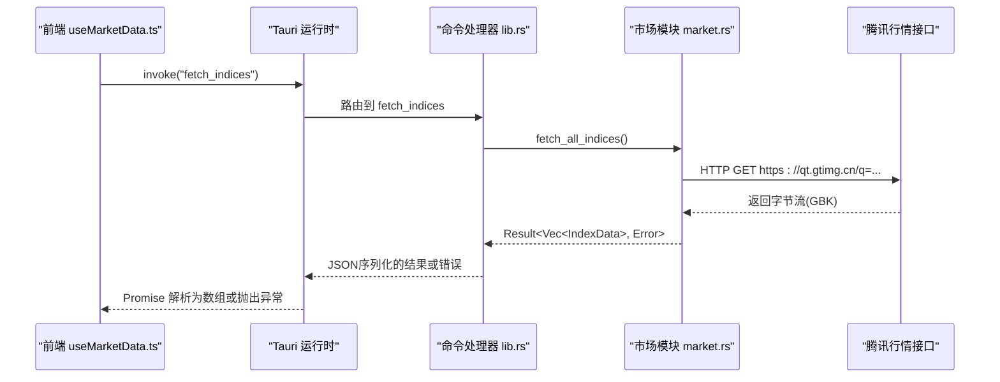
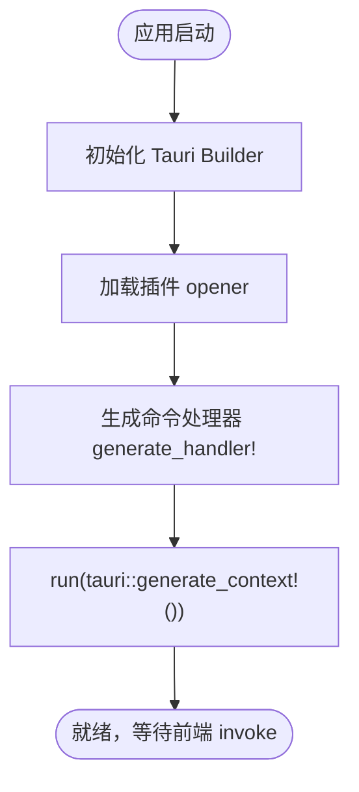
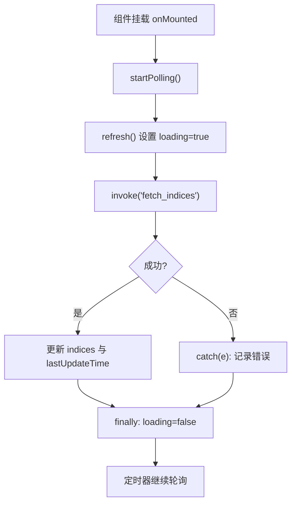
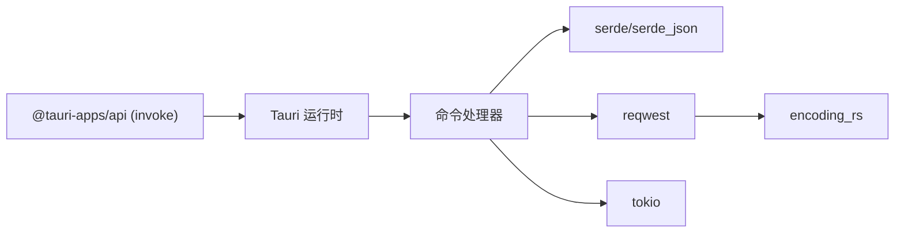

# Tauri命令接口

<cite>
**本文引用的文件**
- [src-tauri/src/lib.rs](file://src-tauri/src/lib.rs)
- [src-tauri/src/market.rs](file://src-tauri/src/market.rs)
- [src-tauri/tauri.conf.json](file://src-tauri/tauri.conf.json)
- [src-tauri/capabilities/default.json](file://src-tauri/capabilities/default.json)
- [src/composables/useMarketData.ts](file://src/composables/useMarketData.ts)
- [src/types/market.ts](file://src/types/market.ts)
- [src/components/IndexCard.vue](file://src/components/IndexCard.vue)
- [package.json](file://package.json)
- [src-tauri/Cargo.toml](file://src-tauri/Cargo.toml)
</cite>

## 目录
1. [简介](#简介)
2. [项目结构](#项目结构)
3. [核心组件](#核心组件)
4. [架构总览](#架构总览)
5. [详细组件分析](#详细组件分析)
6. [依赖关系分析](#依赖关系分析)
7. [性能考虑](#性能考虑)
8. [故障排查指南](#故障排查指南)
9. [结论](#结论)
10. [附录](#附录)

## 简介
本文件为Tauri命令接口的权威API文档，聚焦于命令注册机制、前后端通信协议、fetch_indices命令的参数与返回值定义、异步处理流程与状态管理、错误码与异常处理、安全权限控制与访问限制、前端调用示例与最佳实践，以及命令扩展开发与版本兼容性建议。目标是帮助开发者快速理解并安全地扩展该应用的Tauri命令体系。

## 项目结构
本项目采用Tauri 2.x的前后端分离架构：
- 后端（Rust）：负责命令注册、网络请求、数据解析与序列化。
- 前端（Vue + TypeScript）：通过@tauri-apps/api的invoke调用后端命令，渲染指数行情卡片。

```mermaid
graph TB
subgraph "前端"
FE_Composable["useMarketData.ts"]
FE_IndexCard["IndexCard.vue"]
end
subgraph "Tauri 应用"
Lib_rs["lib.rs<br/>命令注册与入口"]
Market_rs["market.rs<br/>数据获取与模型"]
end
FE_Composable --> |invoke("fetch_indices")| Lib_rs
Lib_rs --> Market_rs
Market_rs --> |"HTTP GET qt.gtimg.cn"| 外部服务["腾讯行情接口"]
```

图表来源
- [src/composables/useMarketData.ts:1-66](file://src/composables/useMarketData.ts#L1-L66)
- [src-tauri/src/lib.rs:1-21](file://src-tauri/src/lib.rs#L1-L21)
- [src-tauri/src/market.rs:1-100](file://src-tauri/src/market.rs#L1-L100)

章节来源
- [src-tauri/src/lib.rs:1-21](file://src-tauri/src/lib.rs#L1-L21)
- [src-tauri/src/market.rs:1-100](file://src-tauri/src/market.rs#L1-L100)
- [src/composables/useMarketData.ts:1-66](file://src/composables/useMarketData.ts#L1-L66)

## 核心组件
- 命令注册与入口
  - 在库模块中声明命令函数，并通过Tauri构建器注册到全局处理器。
  - 提供 greet 与 fetch_indices 两个命令，其中 fetch_indices 用于获取指数行情。
- 市场数据模块
  - 定义指数数据结构 IndexData，包含代码、名称、价格、涨跌额、涨跌幅、成交量、成交额、市场类型与更新时间等字段。
  - 实现异步获取所有指数的逻辑，从腾讯行情接口拉取并按GBK编码解析，映射为结构化数据。
- 前端数据组合式函数
  - 使用 @tauri-apps/api/core 的 invoke 调用 fetch_indices 命令，维护加载状态、轮询刷新与分组展示。
- 类型定义
  - 前端 TypeScript 类型与后端 Rust 结构体一一对应，确保类型安全。

章节来源
- [src-tauri/src/lib.rs:3-18](file://src-tauri/src/lib.rs#L3-L18)
- [src-tauri/src/market.rs:1-100](file://src-tauri/src/market.rs#L1-L100)
- [src/composables/useMarketData.ts:1-66](file://src/composables/useMarketData.ts#L1-L66)
- [src/types/market.ts:1-22](file://src/types/market.ts#L1-L22)

## 架构总览
Tauri命令调用时序如下：



图表来源
- [src/composables/useMarketData.ts:25-36](file://src/composables/useMarketData.ts#L25-L36)
- [src-tauri/src/lib.rs:8-18](file://src-tauri/src/lib.rs#L8-L18)
- [src-tauri/src/market.rs:41-99](file://src-tauri/src/market.rs#L41-L99)

## 详细组件分析

### fetch_indices 命令
- 命令名：fetch_indices
- 参数：无
- 返回值：Promise<IndexData[]>
- 行为：
  - 调用后端 market::fetch_all_indices() 获取指数列表。
  - 将错误转换为字符串并返回给前端。
- 数据类型（IndexData 字段说明）：
  - code: string — 指数代码
  - name: string — 指数名称
  - current: number — 当前价
  - prev_close: number — 昨收价
  - open: number — 开盘价
  - high: number — 最高价
  - low: number — 最低价
  - change: number — 涨跌额
  - change_pct: number — 涨跌幅（百分比数值）
  - volume: number — 成交量
  - amount: number — 成交额
  - market: 'a' | 'hk' | 'us' — 市场类型（A股/港股/美股）
  - update_time: string — 更新时间
- 数据来源：腾讯行情接口（GBK编码），按行解析并映射为结构化数据。

章节来源
- [src-tauri/src/lib.rs:8-11](file://src-tauri/src/lib.rs#L8-L11)
- [src-tauri/src/market.rs:3-18](file://src-tauri/src/market.rs#L3-L18)
- [src-tauri/src/market.rs:41-99](file://src-tauri/src/market.rs#L41-L99)
- [src/types/market.ts:1-22](file://src/types/market.ts#L1-L22)

### 命令注册机制
- 命令声明：使用 #[tauri::command] 宏标记命令函数。
- 注册方式：通过 tauri::generate_handler![...] 将命令加入处理器。
- 入口：应用启动时调用 run()，初始化插件、注入命令处理器并运行窗口。



图表来源
- [src-tauri/src/lib.rs:13-20](file://src-tauri/src/lib.rs#L13-L20)

章节来源
- [src-tauri/src/lib.rs:1-21](file://src-tauri/src/lib.rs#L1-L21)

### 前后端通信协议
- 通道：Tauri 内部 IPC（基于 invoke/handle）。
- 序列化：Rust 侧使用 serde 进行 JSON 序列化；前端通过 @tauri-apps/api/core 的 invoke 接收对应类型。
- 错误传播：Rust 侧返回 Result<T, E>，E 会被序列化为字符串错误消息；前端 catch 捕获异常。

章节来源
- [src-tauri/src/lib.rs:8-18](file://src-tauri/src/lib.rs#L8-L18)
- [src/composables/useMarketData.ts:25-36](file://src/composables/useMarketData.ts#L25-L36)
- [src-tauri/Cargo.toml:19-26](file://src-tauri/Cargo.toml#L19-L26)

### 异步命令处理流程与状态管理
- 后端：fetch_indices 为 async fn，内部调用异步网络请求，使用 tokio 运行时。
- 前端：
  - 使用 ref 维护 indices、loading、lastUpdateTime。
  - refresh() 设置 loading=true，调用 invoke 后更新数据与时间戳，finally 重置 loading。
  - startPolling() 定时触发 refresh，onMounted/onUnmounted 管理生命周期。



图表来源
- [src/composables/useMarketData.ts:25-56](file://src/composables/useMarketData.ts#L25-L56)

章节来源
- [src/composables/useMarketData.ts:1-66](file://src/composables/useMarketData.ts#L1-L66)
- [src-tauri/src/market.rs:41-99](file://src-tauri/src/market.rs#L41-L99)

### 错误码定义与异常处理机制
- 后端错误：
  - 网络请求失败、响应解码失败、数据解析异常等会转为 String 错误并返回。
  - 具体错误类型由 reqwest、encoding_rs 等库抛出，统一以字符串形式透传。
- 前端错误：
  - invoke 抛出的异常被 catch 捕获，打印日志，保持 loading 状态正确复位。
- 建议：
  - 可在后端自定义错误枚举并实现 Display，便于前端分类处理。
  - 对关键错误增加重试与降级策略（如缓存上次有效数据）。

章节来源
- [src-tauri/src/lib.rs:8-11](file://src-tauri/src/lib.rs#L8-L11)
- [src-tauri/src/market.rs:41-99](file://src-tauri/src/market.rs#L41-L99)
- [src/composables/useMarketData.ts:25-36](file://src/composables/useMarketData.ts#L25-L36)

### 安全权限控制与访问限制
- 能力配置：默认能力仅启用 core:default、opener:default 及窗口操作相关权限。
- 安全策略：CSP 设置为 null（开发环境常见），生产环境建议收紧 CSP 与白名单。
- 命令访问：未显式限制命令访问范围，意味着所有窗口均可调用已注册命令。如需细粒度控制，可结合能力与窗口标识进行限制。
- 建议：
  - 为敏感命令添加能力白名单或窗口级限制。
  - 在生产环境启用严格 CSP，避免内联脚本与不受信任资源。

章节来源
- [src-tauri/capabilities/default.json:1-14](file://src-tauri/capabilities/default.json#L1-L14)
- [src-tauri/tauri.conf.json:24-26](file://src-tauri/tauri.conf.json#L24-L26)

### 前端调用命令示例与最佳实践
- 基本调用：
  - 使用 invoke('fetch_indices') 获取数据，注意处理 loading 与错误分支。
- 轮询策略：
  - 使用 setInterval 定时刷新，组件卸载时清理定时器，避免内存泄漏。
- 类型安全：
  - 使用 TypeScript 类型 IndexData 约束数据，减少运行时错误。
- 用户体验：
  - 显示最后更新时间，提升感知；在网络不可用时给出提示。
- 错误处理：
  - 捕获异常并记录日志，必要时提示用户重试。

章节来源
- [src/composables/useMarketData.ts:1-66](file://src/composables/useMarketData.ts#L1-L66)
- [src/types/market.ts:1-22](file://src/types/market.ts#L1-L22)
- [src/components/IndexCard.vue:1-71](file://src/components/IndexCard.vue#L1-L71)

### 命令扩展开发指南
- 新增命令步骤：
  1. 在 lib.rs 中定义新的 #[tauri::command] 函数。
  2. 在 generate_handler! 中注册新命令。
  3. 若涉及网络或IO，尽量使用 async 并在 market.rs 或其他模块中实现业务逻辑。
  4. 在前端通过 invoke('your_command', params?) 调用。
- 数据模型：
  - 使用 serde 派生 Serialize/Deserialize，保证前后端类型一致。
- 权限与安全：
  - 如需限制命令访问，结合 capabilities 与窗口标识进行配置。
- 测试与调试：
  - 使用 Tauri 开发模式观察控制台输出与网络请求。
  - 对解析逻辑编写单元测试，确保健壮性。

章节来源
- [src-tauri/src/lib.rs:3-18](file://src-tauri/src/lib.rs#L3-L18)
- [src-tauri/src/market.rs:1-100](file://src-tauri/src/market.rs#L1-L100)

### 版本兼容性考虑
- Tauri 版本：项目使用 Tauri 2.x（Cargo.toml 指定版本特性）。
- 前端依赖：@tauri-apps/api ^2.11.1，需与 Tauri 2.x 兼容。
- 升级建议：
  - 关注 Tauri 2.x 的迁移指南与 breaking changes。
  - 升级前检查命令签名、能力配置与插件兼容性。
  - 逐步引入更严格的 CSP 与权限策略，确保向后兼容。

章节来源
- [src-tauri/Cargo.toml:19-26](file://src-tauri/Cargo.toml#L19-L26)
- [package.json:12-14](file://package.json#L12-L14)

## 依赖关系分析
- 后端依赖：
  - tauri 2.x：命令框架与运行时。
  - serde/serde_json：数据序列化。
  - reqwest：HTTP 客户端。
  - encoding_rs：GBK 编码解码。
  - tokio：异步运行时。
- 前端依赖：
  - @tauri-apps/api：invoke 调用后端命令。
  - Vue 3：组件与组合式函数。



图表来源
- [src-tauri/Cargo.toml:19-26](file://src-tauri/Cargo.toml#L19-L26)
- [package.json:12-14](file://package.json#L12-L14)

章节来源
- [src-tauri/Cargo.toml:19-26](file://src-tauri/Cargo.toml#L19-L26)
- [package.json:12-14](file://package.json#L12-L14)

## 性能考虑
- 网络请求：
  - 批量查询指数接口，减少请求次数。
  - 合理设置轮询间隔（当前为3秒），避免频繁请求导致限流。
- 数据解析：
  - 使用流式或分块解析大响应（当前为全量读取后解码，适合小响应）。
- 前端渲染：
  - 使用 computed 分组与惰性渲染，减少不必要的重绘。
- 内存管理：
  - 组件卸载时清理定时器，防止内存泄漏。

[本节为通用指导，不直接分析具体文件]

## 故障排查指南
- 常见问题：
  - 网络不可达：检查代理与防火墙，确认腾讯接口可达。
  - 编码问题：确保使用 GBK 解码，避免乱码。
  - 数据格式变化：接口字段顺序或数量变化会导致解析失败，需适配。
- 定位方法：
  - 查看前端控制台错误日志。
  - 在后端增加日志输出，定位请求与解析阶段。
- 恢复策略：
  - 重试机制与缓存兜底。
  - 降级展示最近一次有效数据。

章节来源
- [src/composables/useMarketData.ts:25-36](file://src/composables/useMarketData.ts#L25-L36)
- [src-tauri/src/market.rs:41-99](file://src-tauri/src/market.rs#L41-L99)

## 结论
本项目的Tauri命令体系简洁清晰：通过 lib.rs 注册命令，market.rs 实现数据获取与解析，前端通过 invoke 调用并维护状态。fetch_indices 命令无参、返回指数数组，支持轮询刷新与错误处理。建议在后续迭代中完善错误分类、权限细化与生产环境安全策略，以提升稳定性与可维护性。

[本节为总结，不直接分析具体文件]

## 附录
- 命令清单
  - greet(name: &str) -> String：问候命令（示例）
  - fetch_indices() -> Vec<IndexData>：获取指数行情
- 数据模型
  - IndexData：见类型定义
- 配置文件
  - tauri.conf.json：应用元信息与窗口配置
  - capabilities/default.json：默认能力与权限

章节来源
- [src-tauri/src/lib.rs:3-18](file://src-tauri/src/lib.rs#L3-L18)
- [src/types/market.ts:1-22](file://src/types/market.ts#L1-L22)
- [src-tauri/tauri.conf.json:1-51](file://src-tauri/tauri.conf.json#L1-L51)
- [src-tauri/capabilities/default.json:1-14](file://src-tauri/capabilities/default.json#L1-L14)