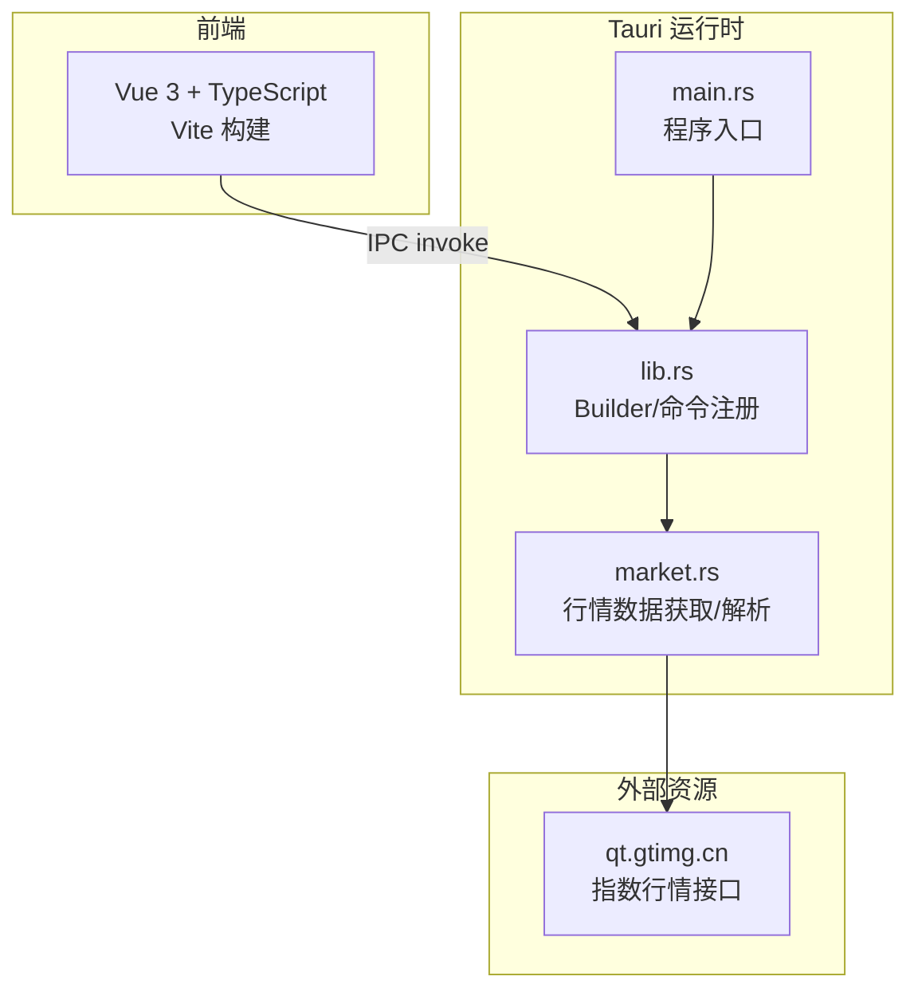
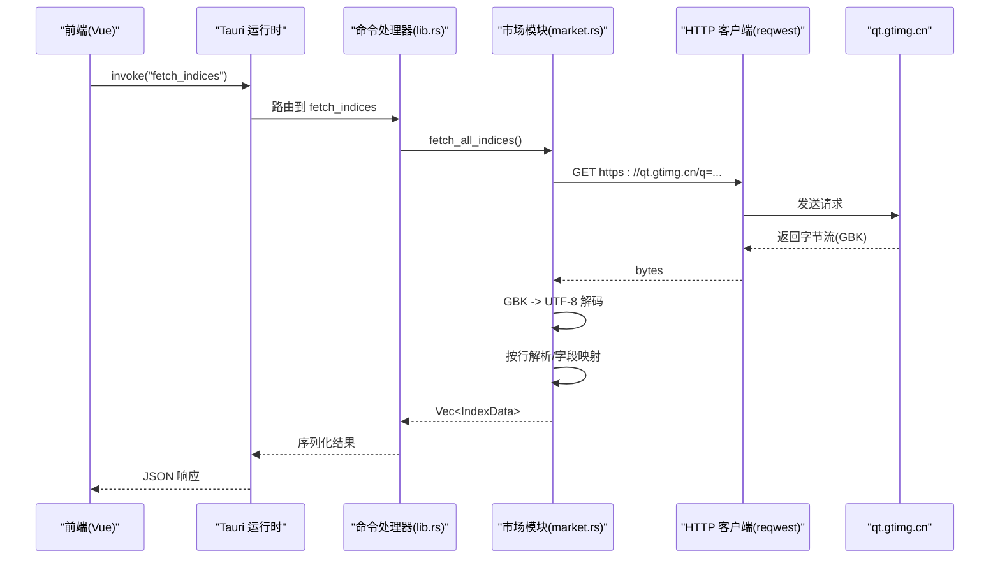
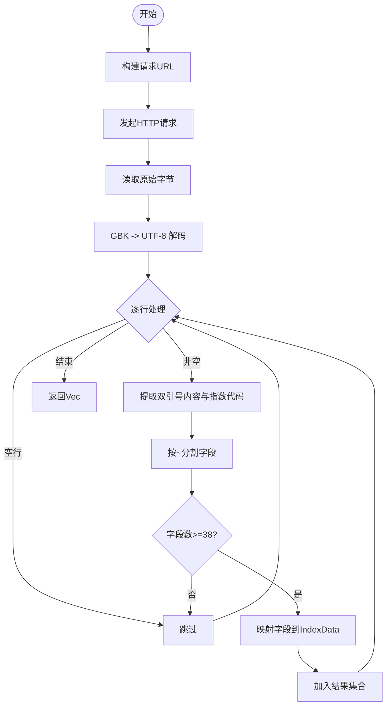
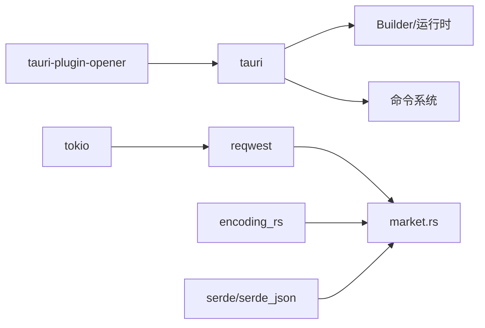

# Tauri服务架构

<cite>
**本文引用的文件**
- [src-tauri/Cargo.toml](file://src-tauri/Cargo.toml)
- [src-tauri/src/main.rs](file://src-tauri/src/main.rs)
- [src-tauri/src/lib.rs](file://src-tauri/src/lib.rs)
- [src-tauri/src/market.rs](file://src-tauri/src/market.rs)
- [src-tauri/tauri.conf.json](file://src-tauri/tauri.conf.json)
- [src-tauri/build.rs](file://src-tauri/build.rs)
- [src-tauri/capabilities/default.json](file://src-tauri/capabilities/default.json)
- [package.json](file://package.json)
- [ARCHITECTURE.md](file://ARCHITECTURE.md)
</cite>

## 目录
1. [简介](#简介)
2. [项目结构](#项目结构)
3. [核心组件](#核心组件)
4. [架构总览](#架构总览)
5. [详细组件分析](#详细组件分析)
6. [依赖关系分析](#依赖关系分析)
7. [性能考量](#性能考量)
8. [故障排查指南](#故障排查指南)
9. [结论](#结论)
10. [附录](#附录)

## 简介
本技术文档围绕基于 Tauri 的桌面应用“大盘行情看板”展开，重点说明 Rust 主程序入口、Windows 平台特殊配置、应用程序生命周期管理；lib 模块的组织与核心功能注册；Tauri 命令系统的注册流程与 IPC 通信原理；Cargo.toml 依赖管理与构建选项；以及 Tauri 在桌面开发中的优势与最佳实践。同时提供扩展服务与自定义命令的开发指导。

## 项目结构
本项目采用前后端分离：前端使用 Vue 3 + TypeScript + Vite，后端使用 Rust + Tauri。Rust 侧通过 Tauri 暴露命令供前端调用，实现跨进程 IPC。

图表来源
- [src-tauri/src/main.rs:1-7](file://src-tauri/src/main.rs#L1-L7)
- [src-tauri/src/lib.rs:1-21](file://src-tauri/src/lib.rs#L1-L21)
- [src-tauri/src/market.rs:1-100](file://src-tauri/src/market.rs#L1-L100)

章节来源
- [ARCHITECTURE.md:58-102](file://ARCHITECTURE.md#L58-L102)
- [src-tauri/tauri.conf.json:1-51](file://src-tauri/tauri.conf.json#L1-L51)

## 核心组件
- 程序入口 main.rs：负责 Windows 平台发布模式隐藏控制台窗口，并委托 lib 模块启动 Tauri 应用。
- 库入口 lib.rs：定义 Tauri 命令（greet、fetch_indices），组装 Tauri Builder，注册插件与命令处理器，启动应用。
- 市场模块 market.rs：封装指数代码列表、HTTP 请求、GBK 解码、行级解析、字段映射与类型转换，返回结构化数据。
- 配置文件 tauri.conf.json：定义产品名称、版本、标识符、窗口尺寸、安全策略、打包图标等。
- 构建脚本 build.rs：调用 tauri-build 完成构建期生成。
- 权限 capabilities/default.json：声明窗口拖动、最小化、关闭等能力。
- Cargo.toml：声明 Rust 依赖（Tauri、reqwest、encoding_rs、serde、tokio 等）与 crate 类型。
- package.json：前端脚本与依赖，包含 @tauri-apps/cli 用于 Tauri CLI。

章节来源
- [src-tauri/src/main.rs:1-7](file://src-tauri/src/main.rs#L1-L7)
- [src-tauri/src/lib.rs:1-21](file://src-tauri/src/lib.rs#L1-L21)
- [src-tauri/src/market.rs:1-100](file://src-tauri/src/market.rs#L1-L100)
- [src-tauri/tauri.conf.json:1-51](file://src-tauri/tauri.conf.json#L1-L51)
- [src-tauri/build.rs:1-4](file://src-tauri/build.rs#L1-L4)
- [src-tauri/capabilities/default.json:1-14](file://src-tauri/capabilities/default.json#L1-L14)
- [src-tauri/Cargo.toml:1-27](file://src-tauri/Cargo.toml#L1-L27)
- [package.json:1-26](file://package.json#L1-L26)

## 架构总览
整体采用“前端 WebView + Rust 原生后端”的双层架构。前端通过 Tauri 的 invoke 机制调用 Rust 命令，Rust 侧发起 HTTP 请求获取行情数据，进行编码转换与解析后返回 JSON 给前端渲染。

图表来源
- [src-tauri/src/lib.rs:3-18](file://src-tauri/src/lib.rs#L3-L18)
- [src-tauri/src/market.rs:41-99](file://src-tauri/src/market.rs#L41-L99)

章节来源
- [ARCHITECTURE.md:106-155](file://ARCHITECTURE.md#L106-L155)

## 详细组件分析

### Rust 主程序入口与生命周期
- Windows 平台特殊配置：在 release 模式下隐藏控制台窗口，避免弹出额外终端。
- 生命周期：main.rs 仅做平台开关与委托，实际应用启动由 lib.rs 中的 run() 完成，包括初始化插件、注册命令、加载上下文并运行事件循环。

章节来源
- [src-tauri/src/main.rs:1-7](file://src-tauri/src/main.rs#L1-L7)
- [src-tauri/src/lib.rs:13-20](file://src-tauri/src/lib.rs#L13-L20)

### lib 模块组织与命令注册
- 模块划分：lib.rs 引入 market 模块，并在同一文件中定义 Tauri 命令。
- 命令注册：通过 #[tauri::command] 标注函数，并使用 generate_handler! 将 greet、fetch_indices 注册为可被前端调用的命令。
- 插件集成：启用 opener 插件以支持系统打开链接等操作。
- 运行器：使用 tauri::Builder 装配应用上下文并启动。

章节来源
- [src-tauri/src/lib.rs:1-21](file://src-tauri/src/lib.rs#L1-L21)

### 市场数据模块 market.rs
- 数据结构：IndexData 包含指数代码、名称、价格、涨跌、成交量、成交额、市场类型、更新时间等字段，并通过 serde 序列化为 JSON。
- 数据源：固定指数代码列表，拼接为查询 URL。
- 网络请求：使用 reqwest 发起异步 GET 请求，读取原始字节。
- 编码处理：使用 encoding_rs 将 GBK 字节解码为 UTF-8 字符串。
- 解析逻辑：逐行提取双引号内内容，按 ~ 分割字段，校验字段数量后进行安全数值转换与字段映射。
- 市场分类：根据代码前缀判定 A 股、港股、美股或未知。

图表来源
- [src-tauri/src/market.rs:20-99](file://src-tauri/src/market.rs#L20-L99)

章节来源
- [src-tauri/src/market.rs:1-100](file://src-tauri/src/market.rs#L1-L100)

### Tauri 命令系统与 IPC 通信
- 命令定义：在 lib.rs 中用宏标注命令函数，参数与返回值需满足 Tauri 的序列化要求。
- 命令路由：generate_handler! 将命令名与处理函数绑定，形成命令表。
- IPC 通道：前端通过 @tauri-apps/api 的 invoke 调用命令，Tauri 运行时负责跨进程消息传递与序列化。
- 错误处理：命令返回 Result 类型，错误会被转换为字符串并回传给前端。

章节来源
- [src-tauri/src/lib.rs:3-18](file://src-tauri/src/lib.rs#L3-L18)
- [ARCHITECTURE.md:148-155](file://ARCHITECTURE.md#L148-L155)

### 配置文件与构建选项
- tauri.conf.json：定义产品名、版本、唯一标识符、窗口尺寸与行为、安全策略（CSP）、打包目标与图标集。
- build.rs：调用 tauri-build 完成构建期代码生成。
- capabilities/default.json：声明默认窗口能力，如拖动、最小化、关闭等。
- Cargo.toml：声明 crate 类型（lib、cdylib、staticlib），以及 Tauri、插件、网络、序列化、编码、异步运行时等依赖。
- package.json：前端脚本与 Tauri CLI 依赖，便于统一开发与构建。

章节来源
- [src-tauri/tauri.conf.json:1-51](file://src-tauri/tauri.conf.json#L1-L51)
- [src-tauri/build.rs:1-4](file://src-tauri/build.rs#L1-L4)
- [src-tauri/capabilities/default.json:1-14](file://src-tauri/capabilities/default.json#L1-L14)
- [src-tauri/Cargo.toml:1-27](file://src-tauri/Cargo.toml#L1-L27)
- [package.json:1-26](file://package.json#L1-L26)

## 依赖关系分析
Rust 侧依赖关系如下：
- tauri：框架核心，提供 Builder、命令系统、上下文与运行时。
- tauri-plugin-opener：系统打开器插件，增强窗口交互能力。
- reqwest：HTTP 客户端，用于请求行情接口。
- encoding_rs：字符编码转换，解决 GBK 到 UTF-8 的可靠解码。
- serde / serde_json：数据序列化/反序列化，支撑命令参数与返回值。
- tokio：异步运行时，配合 reqwest 的异步 I/O。

图表来源
- [src-tauri/Cargo.toml:10-27](file://src-tauri/Cargo.toml#L10-L27)
- [src-tauri/src/lib.rs:13-18](file://src-tauri/src/lib.rs#L13-L18)
- [src-tauri/src/market.rs:41-46](file://src-tauri/src/market.rs#L41-L46)

章节来源
- [src-tauri/Cargo.toml:10-27](file://src-tauri/Cargo.toml#L10-L27)

## 性能考量
- 网络请求：使用 reqwest 异步请求，减少阻塞；对响应体先读取字节再解码，避免重复分配。
- 编码转换：encoding_rs 提供高效 GBK 解码，确保大文本处理的稳定性。
- 数据解析：逐行处理并提前校验字段长度，避免无效计算与越界访问。
- 轮询频率：前端每 3 秒轮询一次，兼顾实时性与服务器压力。
- 内存管理：及时释放临时对象，避免长时间持有大对象引用。

[本节为通用性能建议，不直接分析具体文件]

## 故障排查指南
- 无法获取数据：检查网络连通性与 qt.gtimg.cn 可达性；确认 INDEX_CODES 列表有效；查看日志输出。
- 编码异常：确认使用 encoding_rs 进行 GBK 解码；若出现乱码，检查响应头与编码假设。
- 解析失败：核对字段索引与分隔符；确保 fields.len() >= 38；必要时增加调试日志。
- 命令未生效：确认 generate_handler! 已注册对应命令；检查前端 invoke 的命令名是否一致。
- 权限不足：检查 capabilities/default.json 是否包含所需权限（如窗口拖动、最小化、关闭）。
- Windows 控制台：确认 release 构建时已通过 cfg_attr 隐藏控制台窗口。

章节来源
- [src-tauri/src/market.rs:41-99](file://src-tauri/src/market.rs#L41-L99)
- [src-tauri/src/lib.rs:3-18](file://src-tauri/src/lib.rs#L3-L18)
- [src-tauri/capabilities/default.json:1-14](file://src-tauri/capabilities/default.json#L1-L14)
- [src-tauri/src/main.rs:1-2](file://src-tauri/src/main.rs#L1-L2)

## 结论
该 Tauri 服务架构通过 Rust 后端集中处理网络与编码问题，结合前端 Vue 的响应式渲染，实现了轻量、稳定且跨平台的桌面行情看板。命令系统与 IPC 机制清晰解耦前后端职责，便于扩展与维护。遵循本文档的最佳实践，可快速新增命令与服务，提升应用的可扩展性与健壮性。

[本节为总结性内容，不直接分析具体文件]

## 附录

### Tauri 在桌面应用开发中的优势与最佳实践
- 优势
  - 轻量跨平台：基于 WebView 的原生外壳，体积小、启动快。
  - 安全可控：通过能力与权限模型限制前端能力，降低风险。
  - 高性能后端：Rust 提供内存安全与高并发能力，适合网络与数据处理。
  - 生态完善：丰富的插件体系与成熟的工具链。
- 最佳实践
  - 将敏感逻辑与网络请求放在 Rust 后端，避免暴露密钥与绕过 CORS。
  - 使用 Tauri 能力与权限最小化授权原则。
  - 合理拆分模块，保持命令与业务逻辑清晰。
  - 做好错误处理与日志记录，便于定位问题。
  - 针对平台差异（如 Windows 控制台）进行条件编译与配置。

[本节为通用指导，不直接分析具体文件]

### 服务扩展与自定义命令开发指导
- 新增命令步骤
  - 在 lib.rs 中定义新的 #[tauri::command] 函数，编写参数与返回值类型。
  - 在 generate_handler! 中注册新命令。
  - 在前端通过 @tauri-apps/api 的 invoke 调用新命令。
- 扩展市场数据
  - 在 market.rs 中扩展 INDEX_CODES 列表。
  - 如需新字段，调整解析逻辑与 IndexData 结构体。
- 权限与能力
  - 在 capabilities/default.json 中添加所需权限。
  - 在 tauri.conf.json 中调整窗口与安全策略。
- 构建与测试
  - 使用 pnpm tauri dev 进行本地调试。
  - 使用 pnpm tauri build 构建发布包。

章节来源
- [src-tauri/src/lib.rs:3-18](file://src-tauri/src/lib.rs#L3-L18)
- [src-tauri/src/market.rs:20-99](file://src-tauri/src/market.rs#L20-L99)
- [src-tauri/capabilities/default.json:1-14](file://src-tauri/capabilities/default.json#L1-L14)
- [src-tauri/tauri.conf.json:1-51](file://src-tauri/tauri.conf.json#L1-L51)
- [package.json:6-11](file://package.json#L6-L11)