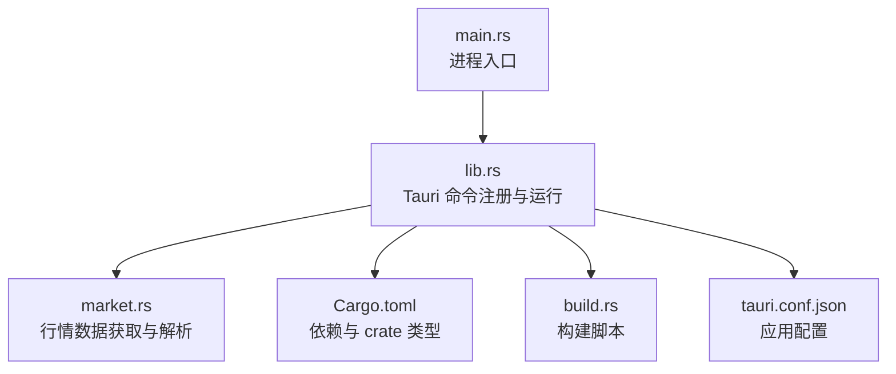
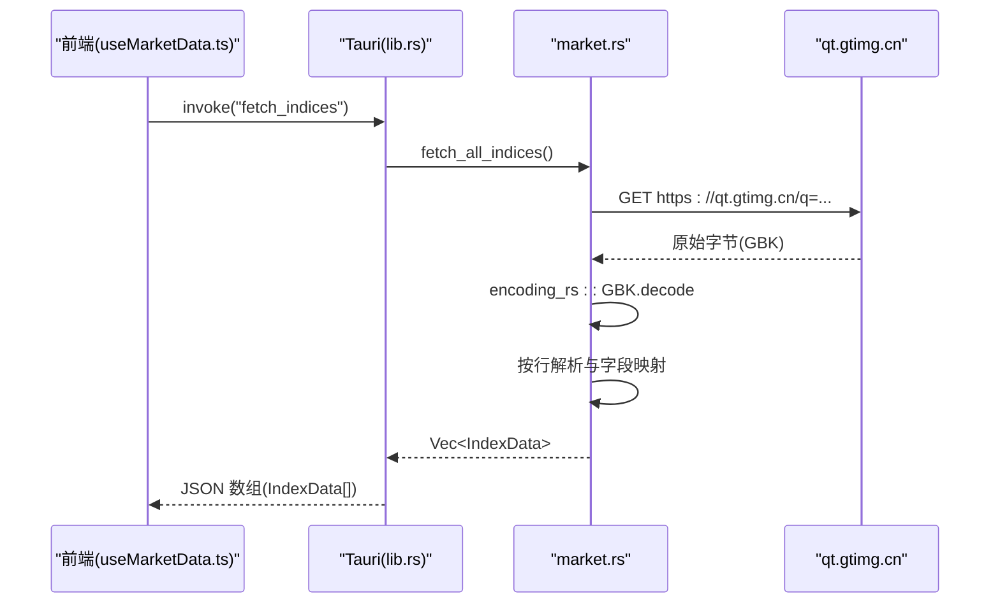
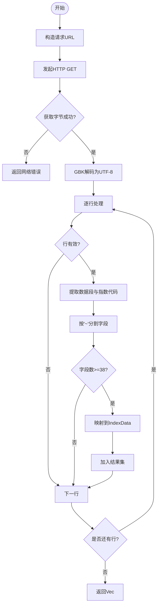
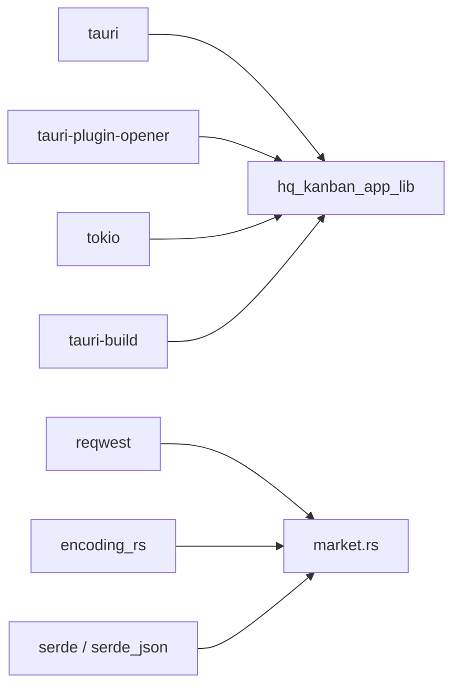

# 后端开发

<cite>
**本文引用的文件**
- [src-tauri/src/main.rs](file://src-tauri/src/main.rs)
- [src-tauri/src/lib.rs](file://src-tauri/src/lib.rs)
- [src-tauri/src/market.rs](file://src-tauri/src/market.rs)
- [src-tauri/Cargo.toml](file://src-tauri/Cargo.toml)
- [src-tauri/build.rs](file://src-tauri/build.rs)
- [src-tauri/tauri.conf.json](file://src-tauri/tauri.conf.json)
- [src/composables/useMarketData.ts](file://src/composables/useMarketData.ts)
- [src/types/market.ts](file://src/types/market.ts)
- [ARCHITECTURE.md](file://ARCHITECTURE.md)
</cite>

## 目录
1. [简介](#简介)
2. [项目结构](#项目结构)
3. [核心组件](#核心组件)
4. [架构总览](#架构总览)
5. [详细组件分析](#详细组件分析)
6. [依赖关系分析](#依赖关系分析)
7. [性能考量](#性能考量)
8. [故障排查指南](#故障排查指南)
9. [结论](#结论)
10. [附录](#附录)

## 简介
本文件面向 hq-kanban-app 的后端部分，聚焦基于 Tauri 的 Rust 服务实现。内容涵盖：
- 主程序入口、命令注册与生命周期管理
- market 模块的数据获取逻辑（腾讯财经 API、GBK 编码处理、JSON 数据解析）
- Tauri 命令接口的定义与使用方法
- 异步 HTTP 请求的实现模式与错误处理策略
- Rust 生态中的依赖管理与构建配置
- 后端扩展开发的指导原则与最佳实践

## 项目结构
后端位于 src-tauri 目录，采用 Tauri 2.x 工程组织方式：
- main.rs：进程入口，调用库层 run() 启动应用
- lib.rs：库入口，声明并注册 Tauri 命令，初始化 Tauri Builder
- market.rs：行情数据模块，封装对外部 API 的请求、编码转换与数据解析
- Cargo.toml：Rust 依赖与 crate 类型配置
- build.rs：Tauri 构建脚本
- tauri.conf.json：窗口、安全、打包等应用级配置

图表来源
- [src-tauri/src/main.rs:1-7](file://src-tauri/src/main.rs#L1-L7)
- [src-tauri/src/lib.rs:1-21](file://src-tauri/src/lib.rs#L1-L21)
- [src-tauri/src/market.rs:1-100](file://src-tauri/src/market.rs#L1-L100)
- [src-tauri/Cargo.toml:1-27](file://src-tauri/Cargo.toml#L1-L27)
- [src-tauri/build.rs:1-4](file://src-tauri/build.rs#L1-L4)
- [src-tauri/tauri.conf.json:1-51](file://src-tauri/tauri.conf.json#L1-L51)

章节来源
- [src-tauri/src/main.rs:1-7](file://src-tauri/src/main.rs#L1-L7)
- [src-tauri/src/lib.rs:1-21](file://src-tauri/src/lib.rs#L1-L21)
- [src-tauri/src/market.rs:1-100](file://src-tauri/src/market.rs#L1-L100)
- [src-tauri/Cargo.toml:1-27](file://src-tauri/Cargo.toml#L1-L27)
- [src-tauri/build.rs:1-4](file://src-tauri/build.rs#L1-L4)
- [src-tauri/tauri.conf.json:1-51](file://src-tauri/tauri.conf.json#L1-L51)

## 核心组件
- 主程序入口：main.rs 仅负责调用库层的 run()，保持入口简洁
- 命令注册与运行时：lib.rs 使用 #[tauri::command] 暴露 greet 与 fetch_indices，并通过 generate_handler! 注册；通过 tauri::Builder 初始化插件与上下文
- 市场数据模块：market.rs 提供 IndexData 数据模型与 fetch_all_indices 异步函数，完成 HTTP 请求、GBK 解码、文本行解析与结构化映射

章节来源
- [src-tauri/src/main.rs:1-7](file://src-tauri/src/main.rs#L1-L7)
- [src-tauri/src/lib.rs:1-21](file://src-tauri/src/lib.rs#L1-L21)
- [src-tauri/src/market.rs:1-100](file://src-tauri/src/market.rs#L1-L100)

## 架构总览
前端通过 Tauri invoke 调用 Rust 命令 fetch_indices，后者调用 market 模块拉取腾讯财经接口，进行 GBK 解码与字段解析后返回 Vec<IndexData>。

图表来源
- [src/composables/useMarketData.ts:25-36](file://src/composables/useMarketData.ts#L25-L36)
- [src-tauri/src/lib.rs:8-11](file://src-tauri/src/lib.rs#L8-L11)
- [src-tauri/src/market.rs:41-99](file://src-tauri/src/market.rs#L41-L99)

章节来源
- [src/composables/useMarketData.ts:25-36](file://src/composables/useMarketData.ts#L25-L36)
- [src-tauri/src/lib.rs:8-11](file://src-tauri/src/lib.rs#L8-L11)
- [src-tauri/src/market.rs:41-99](file://src-tauri/src/market.rs#L41-L99)

## 详细组件分析

### 主程序与生命周期
- 进程入口 main.rs 调用库层 run()，避免在二进制中承载业务逻辑
- lib.rs 中 run() 使用 tauri::Builder 初始化：
  - 启用 opener 插件
  - 通过 generate_handler! 注册 greet 与 fetch_indices 两个命令
  - 通过 generate_context!() 加载上下文并运行应用
- 生命周期要点：
  - 应用启动时执行 Builder 链式配置
  - 命令处理器在 IPC 通道上监听 invoke 调用
  - 应用退出由 Tauri 运行时管理

章节来源
- [src-tauri/src/main.rs:1-7](file://src-tauri/src/main.rs#L1-L7)
- [src-tauri/src/lib.rs:13-20](file://src-tauri/src/lib.rs#L13-L20)

### 命令接口定义与使用
- 已注册命令
  - greet(name: &str) -> String：示例命令，用于验证 IPC 通道
  - fetch_indices() -> Result<Vec<IndexData>, String>：核心命令，返回指数列表
- 前端调用方式
  - 通过 @tauri-apps/api/core 的 invoke 调用 fetch_indices
  - 返回类型为 IndexData[]，与 Rust 侧 IndexData 序列化一致
- 类型契约
  - 前端 types/market.ts 定义 IndexData 接口，字段与 Rust 侧保持一致，确保前后端数据结构对齐

章节来源
- [src-tauri/src/lib.rs:3-11](file://src-tauri/src/lib.rs#L3-L11)
- [src/composables/useMarketData.ts:25-36](file://src/composables/useMarketData.ts#L25-L36)
- [src/types/market.ts:1-22](file://src/types/market.ts#L1-L22)

### market 模块：数据获取与解析
- 数据模型 IndexData
  - 包含代码、名称、价格、涨跌、成交量额、市场类型、更新时间等字段
  - 通过 serde Serialize 支持序列化为 JSON 返回前端
- 外部 API
  - 目标地址：https://qt.gtimg.cn/q={指数代码列表}
  - 请求参数：URL 路径拼接多个指数代码，逗号分隔
  - 响应格式：GBK 编码的纯文本，每行一个指数记录，形如 v_{code}="字段1~字段2~...";
- 编码处理
  - 使用 reqwest 获取原始字节流
  - 使用 encoding_rs 将 GBK 字节解码为 UTF-8 字符串
- 解析流程
  - 逐行分割，跳过空行
  - 提取双引号内的数据段
  - 从变量名中提取指数代码（去除 v_ 前缀）
  - 按 ~ 分割字段数组，校验长度≥38，防止越界
  - 映射关键字段到 IndexData，计算市场类型（A/HK/US），安全解析数值字段
- 错误处理
  - 网络或 I/O 错误通过 ? 传播至调用方
  - 解析失败时跳过异常行，保证整体结果可用
  - 数值解析使用安全 parse_f64，空串返回默认值

图表来源
- [src-tauri/src/market.rs:41-99](file://src-tauri/src/market.rs#L41-L99)

章节来源
- [src-tauri/src/market.rs:1-100](file://src-tauri/src/market.rs#L1-L100)

### 前端集成与轮询机制
- useMarketData.ts 在组件挂载时启动定时器，每 3 秒调用 fetch_indices
- 请求期间设置 loading 状态，完成后更新 lastUpdateTime
- 失败时记录错误日志但不中断轮询
- 组件卸载时清理定时器，避免内存泄漏
- 数据分组：根据 market 字段分为 A 股、港股、美股三组，供 UI 渲染

章节来源
- [src/composables/useMarketData.ts:1-66](file://src/composables/useMarketData.ts#L1-L66)

## 依赖关系分析
- 运行时依赖
  - tauri 2：桌面框架与命令系统
  - tauri-plugin-opener 2：系统打开器插件
  - reqwest 0.12（blocking）：HTTP 客户端
  - encoding_rs 0.8：GBK 编解码
  - serde/serde_json：序列化/反序列化
  - tokio 1（full）：异步运行时
- 构建期依赖
  - tauri-build 2：构建脚本，生成上下文与 schema
- crate 类型
  - 同时输出 lib、cdylib、staticlib，便于嵌入宿主与应用链接

图表来源
- [src-tauri/Cargo.toml:10-27](file://src-tauri/Cargo.toml#L10-L27)
- [src-tauri/src/market.rs:1-100](file://src-tauri/src/market.rs#L1-L100)
- [src-tauri/build.rs:1-4](file://src-tauri/build.rs#L1-L4)

章节来源
- [src-tauri/Cargo.toml:1-27](file://src-tauri/Cargo.toml#L1-L27)
- [src-tauri/build.rs:1-4](file://src-tauri/build.rs#L1-L4)

## 性能考量
- 网络请求
  - 使用 reqwest 异步请求，减少阻塞；当前启用 blocking 特性以简化调用，注意在高并发场景下评估是否需要非阻塞模式
  - 对 qt.gtimg.cn 的频繁请求需考虑限流与重试退避策略
- 编码与解析
  - GBK 解码在每次请求后进行，属于 CPU 密集操作；可考虑缓存最近一次响应并在短时间内复用，但需注意数据时效性
  - 字段解析采用逐行扫描与字符串分割，时间复杂度 O(N)，N 为返回行数；可通过预分配容量优化
- 前端轮询
  - 3 秒轮询兼顾实时性与服务器压力；可根据实际场景调整间隔
  - 组件卸载时清理定时器，避免资源泄露
- 序列化开销
  - IndexData 通过 serde 序列化返回前端；若数据量增大，可考虑按需字段裁剪或使用更高效的序列化格式

[本节为通用性能建议，不直接分析具体文件]

## 故障排查指南
- 网络错误
  - 现象：invoke 抛出错误，前端 console.error 打印失败信息
  - 可能原因：网络不可达、超时、远端服务异常
  - 处理：检查网络连接与代理设置；增加重试与超时配置
- 编码问题
  - 现象：中文乱码或解析失败
  - 可能原因：响应非预期编码或字段顺序变化
  - 处理：确认 encoding_rs 使用正确；对字段索引做健壮性校验与降级处理
- 解析异常
  - 现象：部分指数缺失或字段为空
  - 可能原因：API 返回行格式不一致或字段不足
  - 处理：跳过异常行；对必要字段增加默认值；记录日志以便定位
- 前端状态
  - 现象：loading 一直为真或无刷新
  - 可能原因：定时器未启动或异常中断
  - 处理：检查 onMounted/onUnmounted 钩子；确保错误分支不会中断轮询

章节来源
- [src/composables/useMarketData.ts:25-36](file://src/composables/useMarketData.ts#L25-L36)
- [src-tauri/src/market.rs:41-99](file://src-tauri/src/market.rs#L41-L99)

## 结论
本项目采用 Tauri + Rust 后端与 Vue 3 前端的分层架构，通过 invoke 机制实现稳定可靠的 IPC 通信。market 模块封装了腾讯财经 API 的调用、GBK 编码转换与字段解析，提供了清晰的 IndexData 数据模型。命令注册简洁明了，易于扩展。建议在后续迭代中关注网络层稳定性、解析鲁棒性与性能优化，并遵循统一的错误处理与日志规范。

[本节为总结性内容，不直接分析具体文件]

## 附录

### Tauri 应用配置要点
- 窗口尺寸与行为：宽高、居中、可调整大小、无边框装饰
- 安全策略：CSP 设置为 null（无限制），适合本地桌面应用
- 构建流程：beforeDevCommand 与 beforeBuildCommand 分别驱动前端开发与生产构建
- 打包图标：多平台图标集合

章节来源
- [src-tauri/tauri.conf.json:1-51](file://src-tauri/tauri.conf.json#L1-L51)

### 构建与依赖说明
- 构建脚本：build.rs 调用 tauri_build::build()
- 依赖版本：明确标注 tauri、reqwest、encoding_rs、serde、tokio 等版本与特性
- crate 类型：同时输出多种类型以适配不同宿主环境

章节来源
- [src-tauri/build.rs:1-4](file://src-tauri/build.rs#L1-L4)
- [src-tauri/Cargo.toml:1-27](file://src-tauri/Cargo.toml#L1-L27)

### 前端类型契约
- IndexData 接口定义了前后端共享的数据结构，确保类型安全与一致性
- MarketGroup 用于前端分组展示

章节来源
- [src/types/market.ts:1-22](file://src/types/market.ts#L1-L22)

### 架构参考
- ARCHITECTURE.md 提供了完整的技术栈、项目结构、数据流、UI 设计与构建部署说明，可作为整体理解项目的权威参考

章节来源
- [ARCHITECTURE.md:1-408](file://ARCHITECTURE.md#L1-L408)