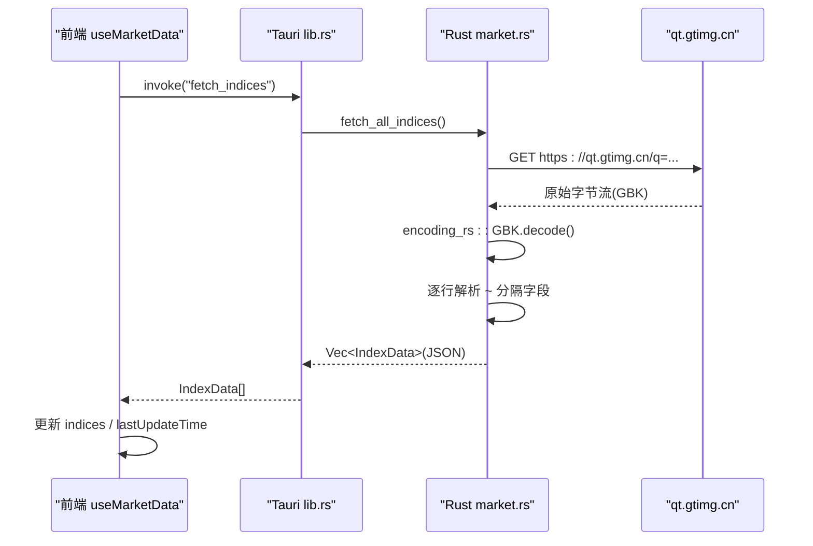
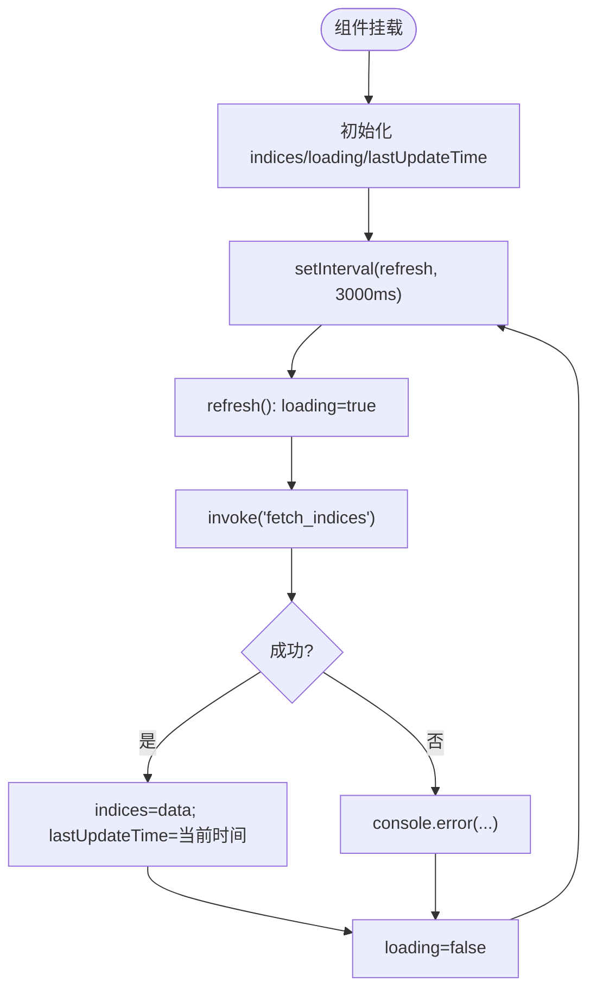
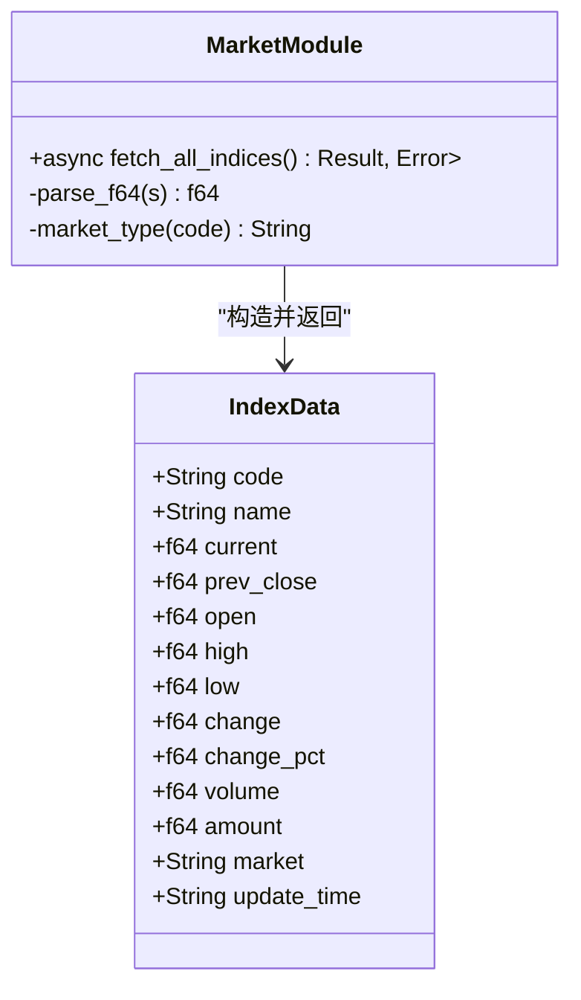
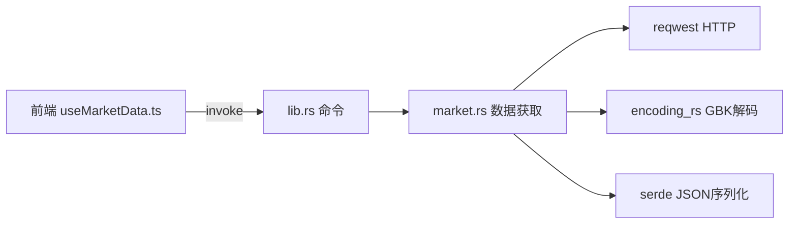

# 市场数据模块

<cite>
**本文引用的文件**
- [useMarketData.ts](file://src/composables/useMarketData.ts)
- [market.ts](file://src/types/market.ts)
- [market.rs](file://src-tauri/src/market.rs)
- [lib.rs](file://src-tauri/src/lib.rs)
- [main.rs](file://src-tauri/src/main.rs)
- [IndexCard.vue](file://src/components/IndexCard.vue)
- [MarketSection.vue](file://src/components/MarketSection.vue)
- [format.ts](file://src/utils/format.ts)
- [ARCHITECTURE.md](file://ARCHITECTURE.md)
- [package.json](file://package.json)
</cite>

## 目录
1. [简介](#简介)
2. [项目结构](#项目结构)
3. [核心组件](#核心组件)
4. [架构总览](#架构总览)
5. [详细组件分析](#详细组件分析)
6. [依赖关系分析](#依赖关系分析)
7. [性能与缓存优化](#性能与缓存优化)
8. [故障排查指南](#故障排查指南)
9. [结论](#结论)
10. [附录：接口适配与调试技巧](#附录接口适配与调试技巧)

## 简介
本技术文档聚焦于“市场数据模块”，覆盖腾讯财经API调用方式、GBK编码处理机制、HTTP异步请求模式与错误处理策略、多市场指数（A股、港股、美股）数据格式差异、数据缓存与性能优化、API变更适配方案与故障恢复机制，并提供具体代码示例路径与调试技巧。该模块基于Tauri架构：前端使用Vue 3 + TypeScript，后端使用Rust通过Tauri命令暴露能力，统一封装行情数据的获取、解析与展示。

## 项目结构
市场数据模块涉及前后端协作：
- 前端：Vue组合式函数负责轮询与分组渲染；类型定义约束数据结构；工具函数负责数值格式化；组件负责展示。
- 后端：Rust模块负责HTTP请求、GBK解码、字段解析与序列化返回；通过Tauri命令注册对外暴露。

```mermaid
graph TB
subgraph "前端(Vue)"
A["useMarketData.ts<br/>轮询与分组"]
B["types/market.ts<br/>IndexData/MarketGroup"]
C["components/MarketSection.vue<br/>按市场分区"]
D["components/IndexCard.vue<br/>单卡展示"]
E["utils/format.ts<br/>价格/涨跌/成交量/成交额格式化"]
end
subgraph "后端(Rust/Tauri)"
F["lib.rs<br/>命令注册 fetch_indices"]
G["market.rs<br/>HTTP请求/GBK解码/字段解析"]
H["main.rs<br/>应用入口"]
end
A --> |invoke('fetch_indices')| F
F --> G
G --> |Vec<IndexData>| F
F --> |JSON| A
A --> C
C --> D
D --> E
```

图表来源
- [useMarketData.ts:1-66](file://src/composables/useMarketData.ts#L1-L66)
- [market.ts:1-22](file://src/types/market.ts#L1-L22)
- [MarketSection.vue:1-19](file://src/components/MarketSection.vue#L1-L19)
- [IndexCard.vue:1-71](file://src/components/IndexCard.vue#L1-L71)
- [format.ts:1-33](file://src/utils/format.ts#L1-L33)
- [lib.rs:1-21](file://src-tauri/src/lib.rs#L1-L21)
- [market.rs:1-100](file://src-tauri/src/market.rs#L1-L100)
- [main.rs:1-7](file://src-tauri/src/main.rs#L1-L7)

章节来源
- [ARCHITECTURE.md:106-154](file://ARCHITECTURE.md#L106-L154)
- [ARCHITECTURE.md:157-213](file://ARCHITECTURE.md#L157-L213)
- [ARCHITECTURE.md:216-298](file://ARCHITECTURE.md#L216-L298)

## 核心组件
- 前端轮询与分组：useMarketData.ts 提供定时刷新、加载状态、最后更新时间、按市场分组计算属性。
- 数据类型：market.ts 定义 IndexData 与 MarketGroup，确保前后端数据结构一致。
- 后端数据获取：market.rs 实现 HTTP 请求、GBK 解码、字段映射、市场类型判定。
- Tauri命令：lib.rs 将 Rust 函数暴露为前端可调用命令 fetch_indices。
- UI展示：MarketSection.vue 按市场分区渲染；IndexCard.vue 展示单个指数卡片；format.ts 提供格式化方法。

章节来源
- [useMarketData.ts:7-65](file://src/composables/useMarketData.ts#L7-L65)
- [market.ts:1-22](file://src/types/market.ts#L1-L22)
- [market.rs:20-99](file://src-tauri/src/market.rs#L20-L99)
- [lib.rs:8-11](file://src-tauri/src/lib.rs#L8-L11)
- [MarketSection.vue:1-19](file://src/components/MarketSection.vue#L1-L19)
- [IndexCard.vue:1-71](file://src/components/IndexCard.vue#L1-L71)
- [format.ts:1-33](file://src/utils/format.ts#L1-L33)

## 架构总览
整体采用“前端发起 → Tauri命令 → Rust后端请求 → GBK解码 → 字段解析 → JSON返回 → 前端渲染”的链路。前端每3秒轮询一次，后端通过reqwest发起HTTPS GET请求到腾讯财经API，使用encoding_rs进行GBK→UTF-8转换，再按固定字段索引解析为IndexData数组，最终通过serde序列化为JSON返回前端。



图表来源
- [useMarketData.ts:25-36](file://src/composables/useMarketData.ts#L25-L36)
- [lib.rs:8-11](file://src-tauri/src/lib.rs#L8-L11)
- [market.rs:41-99](file://src-tauri/src/market.rs#L41-L99)

章节来源
- [ARCHITECTURE.md:139-154](file://ARCHITECTURE.md#L139-L154)
- [ARCHITECTURE.md:157-213](file://ARCHITECTURE.md#L157-L213)

## 详细组件分析

### 前端：useMarketData 组合式函数
- 职责：启动定时器、发起请求、维护loading与更新时间、按市场分组。
- 关键点：
  - 轮询间隔：3秒。
  - 错误处理：捕获异常并记录日志，不中断轮询。
  - 生命周期：onMounted启动，onUnmounted清理定时器。
  - 分组逻辑：根据IndexData.market字段分为A股、港股、美股三组。



图表来源
- [useMarketData.ts:5-65](file://src/composables/useMarketData.ts#L5-L65)

章节来源
- [useMarketData.ts:7-65](file://src/composables/useMarketData.ts#L7-L65)

### 前端：类型与UI组件
- types/market.ts：定义IndexData与MarketGroup，明确字段与市场枚举。
- MarketSection.vue：接收MarketGroup，按网格布局渲染IndexCard。
- IndexCard.vue：根据change正负决定趋势颜色与边框，调用format.ts进行数值格式化。
- format.ts：提供价格、涨跌额、涨跌幅、成交量、成交额的格式化方法。

章节来源
- [market.ts:1-22](file://src/types/market.ts#L1-L22)
- [MarketSection.vue:1-19](file://src/components/MarketSection.vue#L1-L19)
- [IndexCard.vue:1-71](file://src/components/IndexCard.vue#L1-L71)
- [format.ts:1-33](file://src/utils/format.ts#L1-L33)

### 后端：Rust 市场数据模块
- 数据模型：IndexData包含指数代码、名称、价格、涨跌、成交量、成交额、市场类型、更新时间等。
- 市场类型判定：根据代码前缀sh/sz→a，r_hk→hk，r_us→us。
- 请求与解析：
  - 构建URL：https://qt.gtimg.cn/q={指数代码列表}
  - 获取bytes后使用encoding_rs进行GBK解码
  - 逐行解析：提取双引号内容，按~分割字段，校验长度≥38
  - 安全解析f64：空字符串或非法数字返回0.0
- 返回：Vec<IndexData>，经serde序列化为JSON返回前端。



图表来源
- [market.rs:3-18](file://src-tauri/src/market.rs#L3-L18)
- [market.rs:20-99](file://src-tauri/src/market.rs#L20-L99)

章节来源
- [market.rs:20-99](file://src-tauri/src/market.rs#L20-L99)

### Tauri命令注册与IPC
- lib.rs中通过#[tauri::command]声明greet与fetch_indices，后者调用market::fetch_all_indices()并返回结果。
- 通过generate_handler!注册命令，供前端invoke调用。
- main.rs作为程序入口，调用库的run函数。

章节来源
- [lib.rs:1-21](file://src-tauri/src/lib.rs#L1-L21)
- [main.rs:1-7](file://src-tauri/src/main.rs#L1-L7)

## 依赖关系分析
- 前端依赖：
  - Vue 3 Composition API用于响应式与组合式逻辑。
  - @tauri-apps/api用于invoke调用后端命令。
  - Tailwind CSS用于样式。
- 后端依赖：
  - reqwest用于HTTP请求。
  - encoding_rs用于GBK解码。
  - serde用于序列化。
  - tokio用于异步运行时。



图表来源
- [useMarketData.ts:1-3](file://src/composables/useMarketData.ts#L1-L3)
- [lib.rs:1-21](file://src-tauri/src/lib.rs#L1-L21)
- [market.rs:41-99](file://src-tauri/src/market.rs#L41-L99)

章节来源
- [ARCHITECTURE.md:23-49](file://ARCHITECTURE.md#L23-L49)
- [package.json:12-24](file://package.json#L12-L24)

## 性能与缓存优化
- 轮询频率：3秒间隔平衡实时性与服务器压力。
- 内存管理：组件卸载时清除定时器，避免泄漏。
- 网络层：后端集中请求，减少前端CORS限制与跨域问题。
- 编码处理：后端统一GBK解码，避免浏览器兼容性问题。
- 建议的缓存策略（可选扩展）：
  - 本地缓存：在Rust侧对最近一次结果做短时内存缓存，相同指数代码短时间内重复请求直接返回缓存。
  - 增量更新：前端对比上次数据，仅更新变化项，减少重渲染开销。
  - 失败重试：对网络错误实施指数退避重试，提升鲁棒性。
  - 批量合并：合并多个指数请求为单次HTTP调用（已实现），降低连接开销。

[本节为通用性能建议，未直接分析具体文件]

## 故障排查指南
- 常见问题定位：
  - 中文乱码：确认后端使用encoding_rs进行GBK解码，且字段解析顺序正确。
  - 数据为空：检查INDEX_CODES是否有效，响应行数是否为空，字段数量是否≥38。
  - 网络错误：检查reqwest请求是否成功，超时设置是否合理。
  - 前端无更新：检查invoke是否正确调用，错误日志是否打印。
- 调试技巧：
  - 在Rust侧打印请求URL与响应首行，验证数据格式。
  - 在前端控制台查看invoke返回与错误信息。
  - 逐步断点：在market.rs的parse_f64与market_type处观察字段值。
  - 手动构造测试用例：模拟不同市场代码前缀，验证市场类型判定。

章节来源
- [market.rs:41-99](file://src-tauri/src/market.rs#L41-L99)
- [useMarketData.ts:25-36](file://src/composables/useMarketData.ts#L25-L36)

## 结论
市场数据模块通过Tauri将后端网络与编码处理能力与前端展示解耦，实现了稳定可靠的行情数据获取与展示。GBK解码、字段解析、市场类型判定与前端轮询机制共同保障了数据的准确性与时效性。建议在后续迭代中引入缓存与重试机制，进一步提升性能与鲁棒性。

[本节为总结，未直接分析具体文件]

## 附录：接口适配与调试技巧

### 腾讯财经API调用方式
- 地址：https://qt.gtimg.cn/q={指数代码列表}
- 请求：HTTPS GET，参数为逗号分隔的指数代码。
- 响应：GBK编码文本，每行一个指数，格式为 v_{code}="字段1~字段2~...";
- 字段映射：参考ARCHITECTURE.md中的字段索引表，本项目使用索引1、3、4、5、30、31、32、33、34、36、37。

章节来源
- [ARCHITECTURE.md:157-213](file://ARCHITECTURE.md#L157-L213)
- [market.rs:41-99](file://src-tauri/src/market.rs#L41-L99)

### GBK编码处理机制
- 后端使用encoding_rs::GBK.decode将GBK字节转换为UTF-8字符串，确保中文名称正确显示。
- 若前端直接处理GBK存在兼容性问题，因此统一在后端完成解码。

章节来源
- [market.rs:41-46](file://src-tauri/src/market.rs#L41-L46)
- [ARCHITECTURE.md:375-382](file://ARCHITECTURE.md#L375-L382)

### HTTP异步实现与错误处理
- 前端：useMarketData.ts使用async/await调用invoke，try/catch捕获错误并记录日志，保持轮询继续。
- 后端：market.rs使用reqwest异步请求，错误通过Result传播，lib.rs将其转为String错误返回前端。

章节来源
- [useMarketData.ts:25-36](file://src/composables/useMarketData.ts#L25-L36)
- [lib.rs:8-11](file://src-tauri/src/lib.rs#L8-L11)
- [market.rs:41-46](file://src-tauri/src/market.rs#L41-L46)

### 多市场指数数据格式差异
- A股：代码以sh或sz开头，如sh000001、sz399001。
- 港股：代码以r_hk开头，如r_hkHSI、r_hkHSTECH。
- 美股：代码以r_us开头，如r_us.DJI、r_us.IXIC、r_us.INX。
- 市场类型由market_type函数根据前缀判定。

章节来源
- [market.rs:29-39](file://src-tauri/src/market.rs#L29-L39)
- [ARCHITECTURE.md:175-183](file://ARCHITECTURE.md#L175-L183)

### 数据缓存机制与性能优化
- 当前实现：无显式缓存，每次轮询均发起HTTP请求。
- 建议扩展：
  - 内存缓存：对最近一次结果按指数代码缓存，短时间重复请求直接返回。
  - 增量更新：前端对比新旧数据，仅更新变化项。
  - 失败重试：指数退避重试，提升稳定性。
  - 批量化：已实现多指数合并请求，减少连接开销。

[本节为通用建议，未直接分析具体文件]

### API接口变更适配方案
- 字段索引变化：若腾讯API字段顺序调整，需同步更新market.rs中的字段映射索引。
- 新增字段：扩展IndexData结构体，并在前端类型与UI中增加对应展示。
- 市场代码变化：更新INDEX_CODES常量与market_type判定逻辑。
- 版本兼容：在解析前增加字段数量校验，防止越界。

章节来源
- [market.rs:74-93](file://src-tauri/src/market.rs#L74-L93)
- [market.ts:1-15](file://src/types/market.ts#L1-L15)

### 故障恢复机制
- 网络异常：后端返回错误，前端catch并记录日志，轮询继续。
- 解析异常：parse_f64对空或非法值返回0.0，避免崩溃。
- 数据不完整：fields.len()<38时跳过该行，保证健壮性。

章节来源
- [market.rs:22-27](file://src-tauri/src/market.rs#L22-L27)
- [market.rs:74-77](file://src-tauri/src/market.rs#L74-L77)
- [useMarketData.ts:31-35](file://src/composables/useMarketData.ts#L31-L35)

### 具体代码示例路径
- 前端轮询与分组：[useMarketData.ts:7-65](file://src/composables/useMarketData.ts#L7-L65)
- 类型定义：[market.ts:1-22](file://src/types/market.ts#L1-L22)
- 后端请求与解析：[market.rs:41-99](file://src-tauri/src/market.rs#L41-L99)
- Tauri命令注册：[lib.rs:8-11](file://src-tauri/src/lib.rs#L8-L11)
- UI展示与格式化：[IndexCard.vue:1-71](file://src/components/IndexCard.vue#L1-L71), [format.ts:1-33](file://src/utils/format.ts#L1-L33)