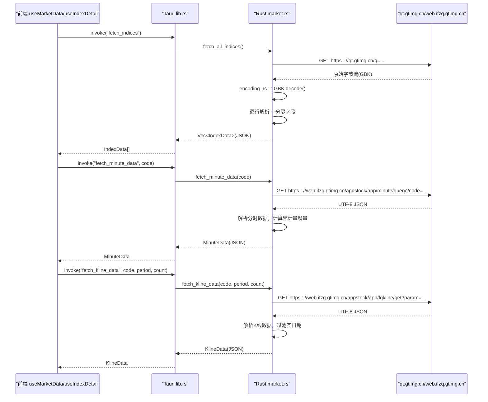
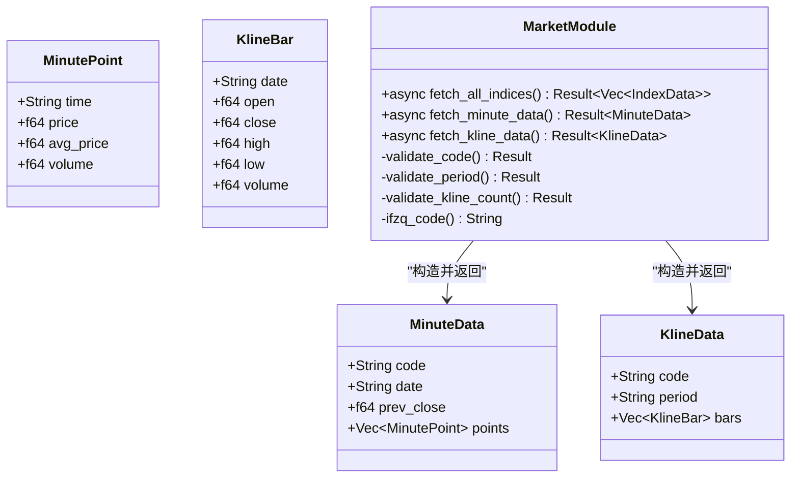
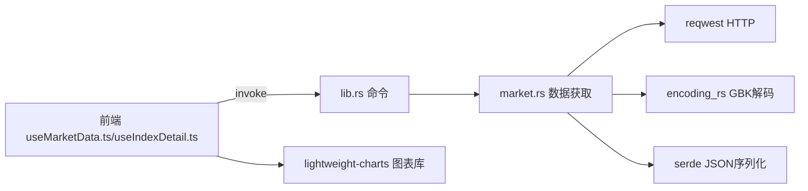

# 市场数据模块

<cite>
**本文引用的文件**
- [useMarketData.ts](file://src/composables/useMarketData.ts)
- [useIndexDetail.ts](file://src/composables/useIndexDetail.ts)
- [market.ts](file://src/types/market.ts)
- [market.rs](file://src-tauri/src/market.rs)
- [lib.rs](file://src-tauri/src/lib.rs)
- [main.rs](file://src-tauri/src/main.rs)
- [IndexCard.vue](file://src/components/IndexCard.vue)
- [IndexDetail.vue](file://src/components/IndexDetail.vue)
- [MarketSection.vue](file://src/components/MarketSection.vue)
- [MinuteChart.vue](file://src/components/charts/MinuteChart.vue)
- [KlineChart.vue](file://src/components/charts/KlineChart.vue)
- [format.ts](file://src/utils/format.ts)
- [ARCHITECTURE.md](file://ARCHITECTURE.md)
- [package.json](file://package.json)
</cite>

## 更新摘要
**变更内容**
- 新增分时数据和K线数据获取功能，支持指数详情页展示
- 新增fetch_minute_data和fetch_kline_data两个Tauri命令
- 实现轻量级图表组件（lightweight-charts）集成
- 增强后端API能力，支持多周期K线数据获取
- 完善前端状态管理和缓存机制

## 目录
1. [简介](#简介)
2. [项目结构](#项目结构)
3. [核心组件](#核心组件)
4. [架构总览](#架构总览)
5. [详细组件分析](#详细组件分析)
6. [依赖关系分析](#依赖关系分析)
7. [性能与缓存优化](#性能与缓存优化)
8. [故障排查指南](#故障排查指南)
9. [结论](#结论)
10. [附录：接口适配与调试技巧](#附录接口适配与调试技巧)

## 简介
本技术文档聚焦于"市场数据模块"，覆盖腾讯财经API调用方式、GBK编码处理机制、HTTP异步请求模式与错误处理策略、多市场指数（A股、港股、美股）数据格式差异、数据缓存与性能优化、API变更适配方案与故障恢复机制，并提供具体代码示例路径与调试技巧。该模块基于Tauri架构：前端使用Vue 3 + TypeScript，后端使用Rust通过Tauri命令暴露能力，统一封装行情数据的获取、解析与展示。**最新更新**：新增分时数据和K线数据获取功能，支持指数详情页的实时报价头部与分时线/日K/周K/月K图表展示。

## 项目结构
市场数据模块涉及前后端协作：
- 前端：Vue组合式函数负责轮询与分组渲染；类型定义约束数据结构；工具函数负责数值格式化；组件负责展示。
- 后端：Rust模块负责HTTP请求、GBK解码、字段解析与序列化返回；通过Tauri命令注册对外暴露。

```mermaid
graph TB
subgraph "前端(Vue)"
A["useMarketData.ts<br/>基础行情轮询"]
B["useIndexDetail.ts<br/>详情数据管理"]
C["types/market.ts<br/>IndexData/MinuteData/KlineData"]
D["components/MarketSection.vue<br/>按市场分区"]
E["components/IndexCard.vue<br/>单卡展示"]
F["components/IndexDetail.vue<br/>详情页视图"]
G["components/charts/*<br/>图表组件"]
H["utils/format.ts<br/>价格/涨跌/成交量/成交额格式化"]
end
subgraph "后端(Rust/Tauri)"
I["lib.rs<br/>命令注册 fetch_indices/fetch_minute_data/fetch_kline_data"]
J["market.rs<br/>HTTP请求/GBK解码/字段解析"]
K["main.rs<br/>应用入口"]
end
A --> |invoke('fetch_indices')| I
B --> |invoke('fetch_minute_data')| I
B --> |invoke('fetch_kline_data')| I
I --> J
J --> |Vec<IndexData>| I
J --> |MinuteData| I
J --> |KlineData| I
I --> |JSON| A
I --> |JSON| B
A --> D
D --> E
F --> G
E --> H
```

**图表来源**
- [useMarketData.ts:1-66](file://src/composables/useMarketData.ts#L1-L66)
- [useIndexDetail.ts:1-144](file://src/composables/useIndexDetail.ts#L1-L144)
- [market.ts:1-55](file://src/types/market.ts#L1-L55)
- [lib.rs:1-63](file://src-tauri/src/lib.rs#L1-L63)
- [market.rs:1-384](file://src-tauri/src/market.rs#L1-L384)

**章节来源**
- [ARCHITECTURE.md:106-154](file://ARCHITECTURE.md#L106-L154)
- [ARCHITECTURE.md:157-213](file://ARCHITECTURE.md#L157-L213)
- [ARCHITECTURE.md:216-298](file://ARCHITECTURE.md#L216-L298)

## 核心组件
- **基础行情轮询**：useMarketData.ts 提供定时刷新、加载状态、最后更新时间、按市场分组计算属性。
- **详情数据管理**：useIndexDetail.ts 管理分时数据和K线数据的获取、缓存、轮询和错误处理。
- **数据类型扩展**：market.ts 新增 MinutePoint、MinuteData、KlineBar、KlineData 等类型定义。
- **后端数据获取**：market.rs 新增分时和K线数据获取函数，支持多周期K线。
- **Tauri命令扩展**：lib.rs 新增 fetch_minute_data 和 fetch_kline_data 命令。
- **UI展示增强**：新增 IndexDetail.vue 详情页组件和 lightweight-charts 图表组件。

**章节来源**
- [useMarketData.ts:7-65](file://src/composables/useMarketData.ts#L7-L65)
- [useIndexDetail.ts:14-143](file://src/composables/useIndexDetail.ts#L14-L143)
- [market.ts:23-55](file://src/types/market.ts#L23-L55)
- [market.rs:204-383](file://src-tauri/src/market.rs#L204-L383)
- [lib.rs:13-30](file://src-tauri/src/lib.rs#L13-L30)
- [IndexDetail.vue:1-140](file://src/components/IndexDetail.vue#L1-L140)

## 架构总览
整体采用"前端发起 → Tauri命令 → Rust后端请求 → GBK解码 → 字段解析 → JSON返回 → 前端渲染"的链路。**新增功能**：支持分时数据和K线数据的独立获取，通过不同的腾讯API接口实现。



**图表来源**
- [useMarketData.ts:30-41](file://src/composables/useMarketData.ts#L30-L41)
- [useIndexDetail.ts:26-73](file://src/composables/useIndexDetail.ts#L26-L73)
- [lib.rs:8-30](file://src-tauri/src/lib.rs#L8-L30)
- [market.rs:42-99](file://src-tauri/src/market.rs#L42-L99)
- [market.rs:204-308](file://src-tauri/src/market.rs#L204-L308)
- [market.rs:313-383](file://src-tauri/src/market.rs#L313-L383)

**章节来源**
- [ARCHITECTURE.md:139-154](file://ARCHITECTURE.md#L139-L154)
- [ARCHITECTURE.md:157-213](file://ARCHITECTURE.md#L157-L213)

## 详细组件分析

### 前端：基础行情轮询组合式函数
- **职责**：启动定时器、发起请求、维护loading与更新时间、按市场分组。
- **关键点**：
  - 轮询间隔：桌面端3秒，移动端15秒。
  - 错误处理：捕获异常并记录日志，不中断轮询。
  - 生命周期：onMounted启动，onUnmounted清理定时器。
  - 分组逻辑：根据IndexData.market字段分为A股、港股、美股三组。

**章节来源**
- [useMarketData.ts:7-65](file://src/composables/useMarketData.ts#L7-L65)

### 前端：详情数据管理组合式函数
- **职责**：管理分时数据和K线数据的获取、缓存、轮询和错误处理。
- **关键特性**：
  - 分时数据：15秒轮询，inflight去重守卫防止请求堆积。
  - K线数据：模块级缓存，TTL过期机制（60秒），支持日/周/月周期切换。
  - 错误处理：友好错误文案，乱序防护避免状态错配。
  - 生命周期：页面可见性监听，自动启停轮询。

**章节来源**
- [useIndexDetail.ts:14-143](file://src/composables/useIndexDetail.ts#L14-L143)

### 前端：类型定义扩展
- **新增类型**：
  - `MinutePoint`：分时数据点，包含时间、价格、均价、成交量。
  - `MinuteData`：分时数据集合，包含代码、日期、前收盘价、数据点数组。
  - `KlinePeriod`：K线周期类型，支持day/week/month。
  - `KlineBar`：K线柱状图数据，包含开收高低量。
  - `KlineData`：K线数据集合，包含代码、周期、柱状图数组。

**章节来源**
- [market.ts:23-55](file://src/types/market.ts#L23-L55)

### 后端：Rust 市场数据模块扩展
- **新增数据模型**：
  - `MinutePoint`：分时数据点结构体。
  - `MinuteData`：分时数据集合结构体。
  - `KlineBar`：K线柱状图结构体。
  - `KlineData`：K线数据集合结构体。
- **新增数据获取函数**：
  - `fetch_minute_data`：获取分时数据，使用腾讯ifzq minute/query接口。
  - `fetch_kline_data`：获取K线数据，使用腾讯ifzq fqkline/get接口。
- **安全验证**：新增输入白名单校验，防止URL注入攻击。
- **数据处理**：
  - 分时数据：累计量→分钟增量转换，均价计算，前收盘兜底逻辑。
  - K线数据：多周期支持，空数据过滤，日期格式化处理。



**图表来源**
- [market.rs:104-135](file://src-tauri/src/market.rs#L104-L135)
- [market.rs:204-383](file://src-tauri/src/market.rs#L204-L383)

**章节来源**
- [market.rs:204-383](file://src-tauri/src/market.rs#L204-L383)

### Tauri命令扩展与IPC
- **新增命令**：
  - `fetch_minute_data(code: String)`：获取指定指数的分时数据。
  - `fetch_kline_data(code: String, period: String, count: Option<u32>)`：获取指定指数的K线数据。
- **参数验证**：前端传入的参数在后端进行严格验证。
- **默认值处理**：K线数量默认为320根。
- **错误处理**：统一转换为字符串错误返回前端。

**章节来源**
- [lib.rs:13-30](file://src-tauri/src/lib.rs#L13-L30)
- [lib.rs:45-50](file://src-tauri/src/lib.rs#L45-L50)

### 前端：详情页组件与图表
- **IndexDetail.vue**：详情页主组件，管理tab切换、数据加载状态、错误处理。
- **MinuteChart.vue**：分时图组件，使用lightweight-charts v5实现面积图、折线图、直方图。
- **KlineChart.vue**：K线图组件，支持蜡烛图、成交量图、移动平均线。
- **图表特性**：
  - 响应式设计，支持窗口大小变化自适应。
  - 自定义配色方案，红涨绿跌符合国内习惯。
  - 多轴显示，价格和百分比同步缩放。
  - 交互功能，十字光标、缩放平移。

**章节来源**
- [IndexDetail.vue:1-140](file://src/components/IndexDetail.vue#L1-L140)
- [MinuteChart.vue:1-295](file://src/components/charts/MinuteChart.vue#L1-L295)
- [KlineChart.vue:1-211](file://src/components/charts/KlineChart.vue#L1-L211)

## 依赖关系分析
- **前端依赖**：
  - Vue 3 Composition API用于响应式与组合式逻辑。
  - @tauri-apps/api用于invoke调用后端命令。
  - lightweight-charts用于图表渲染（按需加载）。
  - Tailwind CSS用于样式。
- **后端依赖**：
  - reqwest用于HTTP请求。
  - encoding_rs用于GBK解码。
  - serde用于序列化。
  - tokio用于异步运行时。



**图表来源**
- [useMarketData.ts:1-3](file://src/composables/useMarketData.ts#L1-L3)
- [useIndexDetail.ts:1-3](file://src/composables/useIndexDetail.ts#L1-L3)
- [lib.rs:1-63](file://src-tauri/src/lib.rs#L1-L63)
- [market.rs:137-148](file://src-tauri/src/market.rs#L137-L148)

**章节来源**
- [ARCHITECTURE.md:23-49](file://ARCHITECTURE.md#L23-L49)
- [package.json:12-24](file://package.json#L12-L24)

## 性能与缓存优化
- **轮询频率优化**：
  - 基础行情：桌面端3秒，移动端15秒，平衡实时性与服务器压力。
  - 分时数据：15秒轮询，避免过度请求。
  - K线数据：模块级缓存，TTL 60秒，减少重复请求。
- **内存管理**：组件卸载时清除定时器，避免泄漏；图表实例正确销毁。
- **网络层优化**：后端集中请求，减少前端CORS限制与跨域问题；进程级reqwest客户端复用连接池。
- **编码处理**：后端统一GBK解码，避免浏览器兼容性问题。
- **新增优化策略**：
  - inflight去重：防止慢网络下请求堆积。
  - 乱序防护：确保数据与当前状态匹配。
  - 按需加载：详情页组件异步加载，减少首屏体积。
  - 图表优化：lightweight-charts Canvas渲染，性能好体积小。

## 故障排查指南
- **常见问题定位**：
  - 中文乱码：确认后端使用encoding_rs进行GBK解码，且字段解析顺序正确。
  - 数据为空：检查INDEX_CODES是否有效，响应行数是否为空，字段数量是否≥38。
  - 网络错误：检查reqwest请求是否成功，超时设置是否合理。
  - 前端无更新：检查invoke是否正确调用，错误日志是否打印。
  - 图表显示异常：检查数据格式是否符合lightweight-charts要求。
- **调试技巧**：
  - 在Rust侧打印请求URL与响应首行，验证数据格式。
  - 在前端控制台查看invoke返回与错误信息。
  - 逐步断点：在market.rs的parse_f64与market_type处观察字段值。
  - 手动构造测试用例：模拟不同市场代码前缀，验证市场类型判定。
  - 图表调试：检查数据时间戳格式，确保符合UTC时间要求。

**章节来源**
- [market.rs:42-99](file://src-tauri/src/market.rs#L42-L99)
- [useMarketData.ts:30-41](file://src/composables/useMarketData.ts#L30-L41)
- [useIndexDetail.ts:26-73](file://src/composables/useIndexDetail.ts#L26-L73)

## 结论
市场数据模块通过Tauri将后端网络与编码处理能力与前端展示解耦，实现了稳定可靠的行情数据获取与展示。**最新增强**：新增的分时数据和K线数据功能，为指数详情页提供了完整的可视化展示能力。GBK解码、字段解析、市场类型判定与前端轮询机制共同保障了数据的准确性与时效性。建议在后续迭代中继续优化缓存策略和错误处理机制，进一步提升用户体验。

## 附录：接口适配与调试技巧

### 腾讯财经API调用方式
- **基础行情接口**：https://qt.gtimg.cn/q={指数代码列表}
- **分时数据接口**：https://web.ifzq.gtimg.cn/appstock/app/minute/query?code={指数代码}
- **K线数据接口**：https://web.ifzq.gtimg.cn/appstock/app/fqkline/get?param={指数代码},{周期},,,{数量},qfq
- **响应格式**：
  - 基础行情：GBK编码文本，每行一个指数。
  - 分时/K线：UTF-8 JSON格式，无需GBK解码。

**章节来源**
- [ARCHITECTURE.md:157-213](file://ARCHITECTURE.md#L157-L213)
- [market.rs:204-325](file://src-tauri/src/market.rs#L204-L325)

### GBK编码处理机制
- **基础行情**：后端使用encoding_rs::GBK.decode将GBK字节转换为UTF-8字符串，确保中文名称正确显示。
- **分时/K线数据**：直接使用UTF-8 JSON接口，无需GBK解码。
- **优势**：统一在后端完成解码，避免浏览器兼容性问题。

**章节来源**
- [market.rs:44-46](file://src-tauri/src/market.rs#L44-L46)
- [ARCHITECTURE.md:375-382](file://ARCHITECTURE.md#L375-L382)

### HTTP异步实现与错误处理
- **前端**：useMarketData.ts和useIndexDetail.ts使用async/await调用invoke，try/catch捕获错误并记录日志。
- **后端**：market.rs使用reqwest异步请求，错误通过Result传播，lib.rs将其转为String错误返回前端。
- **新增特性**：
  - inflight去重：防止并发请求堆积。
  - 乱序防护：确保数据与当前状态匹配。
  - 友好错误：用户友好的错误提示。

**章节来源**
- [useMarketData.ts:30-41](file://src/composables/useMarketData.ts#L30-L41)
- [useIndexDetail.ts:26-73](file://src/composables/useIndexDetail.ts#L26-L73)
- [lib.rs:8-30](file://src-tauri/src/lib.rs#L8-L30)

### 多市场指数数据格式差异
- **A股**：代码以sh或sz开头，如sh000001、sz399001。
- **港股**：代码以r_hk开头，如r_hkHSI、r_hkHSTECH。
- **美股**：代码以r_us开头，如r_us.DJI、r_us.IXIC、r_us.INX。
- **市场类型判定**：根据代码前缀自动识别市场类型。

**章节来源**
- [market.rs:30-40](file://src-tauri/src/market.rs#L30-L40)
- [ARCHITECTURE.md:175-183](file://ARCHITECTURE.md#L175-L183)

### 数据缓存机制与性能优化
- **基础实现**：无显式缓存，每次轮询均发起HTTP请求。
- **新增缓存策略**：
  - K线模块级缓存：Map存储，key为`${code}:${period}`，TTL 60秒。
  - 分时数据：inflight去重，避免重复请求。
  - 连接池复用：进程级reqwest客户端，避免TCP/TLS握手开销。
- **建议扩展**：
  - 本地缓存：对最近一次结果按指数代码缓存。
  - 增量更新：前端对比新旧数据，仅更新变化项。
  - 失败重试：指数退避重试，提升稳定性。

### API接口变更适配方案
- **字段索引变化**：若腾讯API字段顺序调整，需同步更新market.rs中的字段映射索引。
- **新增字段**：扩展对应结构体，并在前端类型与UI中增加对应展示。
- **市场代码变化**：更新INDEX_CODES常量与market_type判定逻辑。
- **版本兼容**：在解析前增加字段数量校验，防止越界。
- **新增接口适配**：
  - ifzq代码转换：统一处理r_前缀，适配不同市场代码格式。
  - 多周期支持：day/week/month三种K线周期。
  - 数据完整性：空数据检测和容错处理。

**章节来源**
- [market.rs:156-189](file://src-tauri/src/market.rs#L156-L189)
- [market.rs:194-199](file://src-tauri/src/market.rs#L194-L199)

### 故障恢复机制
- **网络异常**：后端返回错误，前端catch并记录日志，轮询继续。
- **解析异常**：parse_f64对空或非法值返回0.0，避免崩溃。
- **数据不完整**：fields.len()<38时跳过该行，保证健壮性。
- **新增恢复机制**：
  - 页面可见性检测：隐藏页面时停止轮询，显示时恢复。
  - 错误状态隔离：分时和K线错误独立管理，互不影响。
  - 重试机制：K线加载失败支持点击重试。

**章节来源**
- [market.rs:23-28](file://src-tauri/src/market.rs#L23-L28)
- [market.rs:74-77](file://src-tauri/src/market.rs#L74-L77)
- [useMarketData.ts:30-41](file://src/composables/useMarketData.ts#L30-L41)
- [useIndexDetail.ts:104-111](file://src/composables/useIndexDetail.ts#L104-L111)

### 具体代码示例路径
- **基础行情轮询**：[useMarketData.ts:7-65](file://src/composables/useMarketData.ts#L7-L65)
- **详情数据管理**：[useIndexDetail.ts:14-143](file://src/composables/useIndexDetail.ts#L14-L143)
- **类型定义**：[market.ts:1-55](file://src/types/market.ts#L1-L55)
- **后端请求与解析**：[market.rs:42-383](file://src-tauri/src/market.rs#L42-L383)
- **Tauri命令注册**：[lib.rs:8-50](file://src-tauri/src/lib.rs#L8-L50)
- **UI展示与格式化**：[IndexDetail.vue:1-140](file://src/components/IndexDetail.vue#L1-L140), [format.ts:1-33](file://src/utils/format.ts#L1-L33)
- **图表组件**：[MinuteChart.vue:1-295](file://src/components/charts/MinuteChart.vue#L1-L295), [KlineChart.vue:1-211](file://src/components/charts/KlineChart.vue#L1-L211)