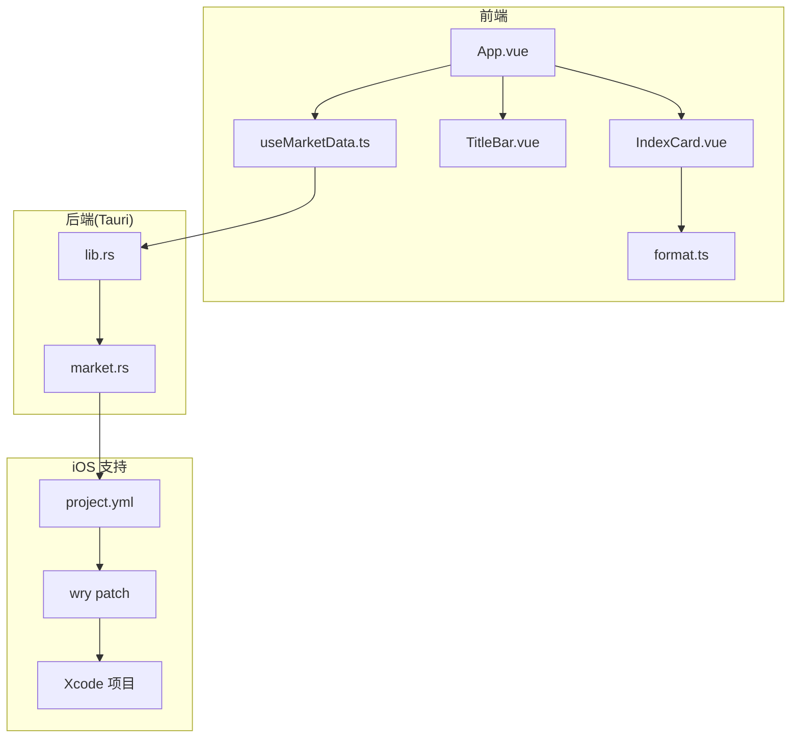
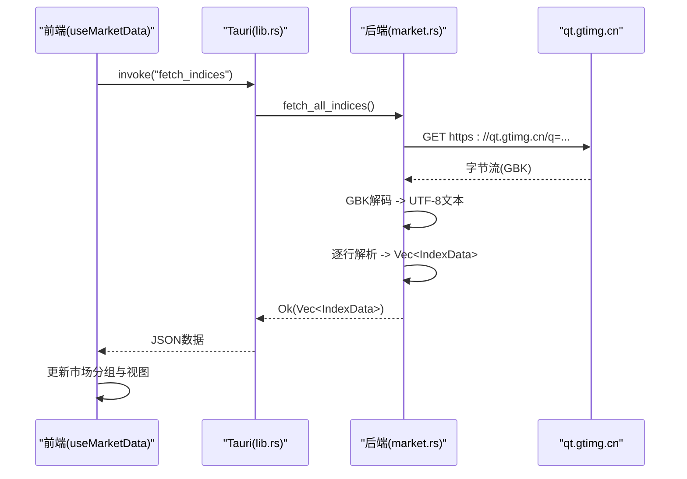
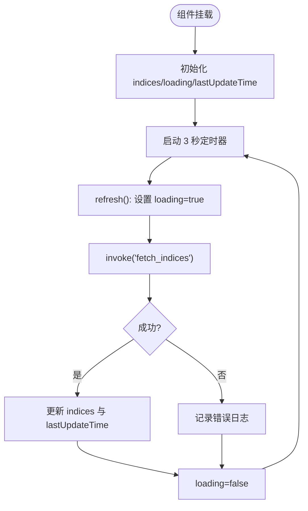
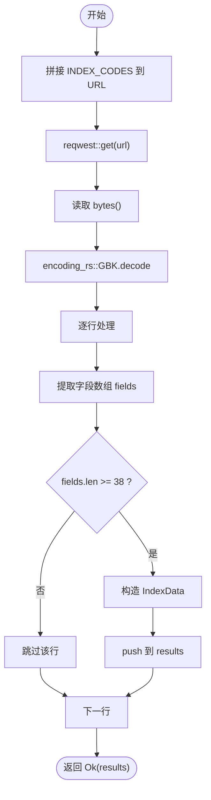
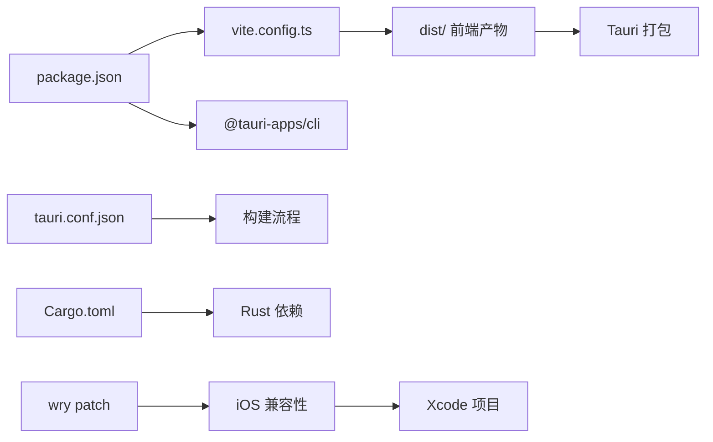

# 开发指南

<cite>
**本文引用的文件**
- [package.json](file://package.json)
- [ARCHITECTURE.md](file://ARCHITECTURE.md)
- [vite.config.ts](file://vite.config.ts)
- [src-tauri/Cargo.toml](file://src-tauri/Cargo.toml)
- [src-tauri/tauri.conf.json](file://src-tauri/tauri.conf.json)
- [src/main.ts](file://src/main.ts)
- [src/App.vue](file://src/App.vue)
- [src/composables/useMarketData.ts](file://src/composables/useMarketData.ts)
- [src/types/market.ts](file://src/types/market.ts)
- [src/components/TitleBar.vue](file://src/components/TitleBar.vue)
- [src/components/IndexCard.vue](file://src/components/IndexCard.vue)
- [src/utils/format.ts](file://src/utils/format.ts)
- [src-tauri/src/lib.rs](file://src-tauri/src/lib.rs)
- [src-tauri/src/market.rs](file://src-tauri/src/market.rs)
- [docs/构建调试命令手册.md](file://docs/构建调试命令手册.md)
- [docs/iOS真机部署问题排查报告.md](file://docs/iOS真机部署问题排查报告.md)
- [src-tauri/gen/apple/project.yml](file://src-tauri/gen/apple/project.yml)
</cite>

## 目录
1. [简介](#简介)
2. [项目结构](#项目结构)
3. [核心组件](#核心组件)
4. [架构总览](#架构总览)
5. [详细组件分析](#详细组件分析)
6. [依赖分析](#依赖分析)
7. [性能考虑](#性能考虑)
8. [环境搭建与工具链配置](#环境搭建与工具链配置)
9. [开发工作流](#开发工作流)
10. [构建与发布](#构建与发布)
11. [调试与故障排查](#调试与故障排查)
12. [结论](#结论)
13. [附录](#附录)

## 简介
本指南面向 hq-kanban-app 的开发者，提供从环境搭建、项目初始化、日常开发工作流到构建发布的完整说明。该项目基于 Vue 3 + TypeScript + Vite 前端与 Rust/Tauri 后端，实现跨平台桌面应用和 iOS 移动应用，实时展示全球主要股指行情数据（A 股、港股、美股），并支持自动轮询刷新与自定义无边框窗口。

**最新更新**：新增了完整的构建调试命令手册、iOS 真机部署问题排查指南，以及针对桌面和移动平台的增强开发环境设置。

## 项目结构
项目采用前后端分离的双层架构，同时支持桌面和移动端部署：
- 前端：Vue 3 + TypeScript + Vite + Tailwind CSS，负责 UI 渲染与交互
- 后端：Rust + Tauri，负责网络请求、数据解析与 IPC 暴露命令
- 构建与打包：Vite 构建前端产物，Tauri CLI 编译 Rust 并打包为各平台安装包
- iOS 支持：通过 xcodegen 生成 Xcode 项目，支持模拟器和真机部署



**图表来源**
- [src/App.vue:1-36](file://src/App.vue#L1-L36)
- [src/composables/useMarketData.ts:1-66](file://src/composables/useMarketData.ts#L1-L66)
- [src/components/TitleBar.vue:1-63](file://src/components/TitleBar.vue#L1-L63)
- [src/components/IndexCard.vue:1-71](file://src/components/IndexCard.vue#L1-L71)
- [src/utils/format.ts:1-33](file://src/utils/format.ts#L1-L33)
- [src-tauri/src/lib.rs:1-21](file://src-tauri/src/lib.rs#L1-L21)
- [src-tauri/src/market.rs:1-100](file://src-tauri/src/market.rs#L1-L100)
- [src-tauri/gen/apple/project.yml:1-105](file://src-tauri/gen/apple/project.yml#L1-L105)

**章节来源**
- [ARCHITECTURE.md:58-102](file://ARCHITECTURE.md#L58-L102)
- [package.json:1-26](file://package.json#L1-L26)
- [vite.config.ts:1-32](file://vite.config.ts#L1-L32)
- [src-tauri/tauri.conf.json:1-51](file://src-tauri/tauri.conf.json#L1-L51)

## 核心组件
- 前端入口与根组件：main.ts 创建 Vue 应用并挂载；App.vue 组织标题栏与市场分区
- 数据轮询：useMarketData.ts 使用 setInterval 每 3 秒调用 Tauri 命令 fetch_indices，维护 loading 与更新时间
- 窗口控制：TitleBar.vue 实现拖动、最小化、关闭等窗口操作
- 指数卡片：IndexCard.vue 根据涨跌计算样式，并使用 format.ts 格式化数值
- 后端命令：lib.rs 注册 greet 与 fetch_indices 命令；market.rs 实现 HTTP 请求、GBK 解码、字段解析与分组
- iOS 适配：通过 wry patch 修复 iOS 26+ WebView 崩溃问题，支持模拟器与真机部署

**章节来源**
- [src/main.ts:1-6](file://src/main.ts#L1-L6)
- [src/App.vue:1-36](file://src/App.vue#L1-L36)
- [src/composables/useMarketData.ts:1-66](file://src/composables/useMarketData.ts#L1-L66)
- [src/components/TitleBar.vue:1-63](file://src/components/TitleBar.vue#L1-L63)
- [src/components/IndexCard.vue:1-71](file://src/components/IndexCard.vue#L1-L71)
- [src/utils/format.ts:1-33](file://src/utils/format.ts#L1-L33)
- [src-tauri/src/lib.rs:1-21](file://src-tauri/src/lib.rs#L1-L21)
- [src-tauri/src/market.rs:1-100](file://src-tauri/src/market.rs#L1-L100)

## 架构总览
整体采用"前端（Vue）+ 后端（Rust/Tauri）"双层架构，通过 Tauri invoke 进行 IPC 通信。前端发起轮询请求，后端通过 reqwest 获取行情数据，使用 encoding_rs 将 GBK 响应解码为 UTF-8，再按行解析为结构化数据返回前端渲染。iOS 平台通过自定义 preBuildScript 和 wry patch 解决兼容性问题。



**图表来源**
- [src/composables/useMarketData.ts:25-36](file://src/composables/useMarketData.ts#L25-L36)
- [src-tauri/src/lib.rs:8-11](file://src-tauri/src/lib.rs#L8-L11)
- [src-tauri/src/market.rs:41-99](file://src-tauri/src/market.rs#L41-L99)

**章节来源**
- [ARCHITECTURE.md:106-155](file://ARCHITECTURE.md#L106-L155)

## 详细组件分析

### 数据轮询与分组（useMarketData）
- 定时轮询：onMounted 启动定时器，每 3 秒调用 refresh；onUnmounted 清理定时器避免内存泄漏
- IPC 调用：通过 @tauri-apps/api/core 的 invoke 调用 fetch_indices
- 状态管理：indices、loading、lastUpdateTime 三个 ref；computed 生成 marketGroups（A 股/港股/美股）
- 错误处理：catch 打印错误日志，finally 重置 loading



**图表来源**
- [src/composables/useMarketData.ts:1-66](file://src/composables/useMarketData.ts#L1-L66)

**章节来源**
- [src/composables/useMarketData.ts:1-66](file://src/composables/useMarketData.ts#L1-L66)

### 后端数据获取与解析（market.rs）
- 请求：reqwest 异步 GET 到 qt.gtimg.cn
- 编码：encoding_rs::GBK.decode 将字节流转为 UTF-8 文本
- 解析：逐行提取双引号内容，按 ~ 分割字段，校验字段数量，映射到 IndexData
- 市场类型：根据代码前缀 sh/sz → a，r_hk → hk，r_us → us



**图表来源**
- [src-tauri/src/market.rs:20-99](file://src-tauri/src/market.rs#L20-L99)

**章节来源**
- [src-tauri/src/market.rs:1-100](file://src-tauri/src/market.rs#L1-L100)

### 窗口控制与交互（TitleBar.vue）
- 拖动：startDragging 在 mousedown 触发，双击不触发拖动
- 窗口控制：minimize/close 调用 @tauri-apps/api/window
- 事件冒泡：按钮使用 @mousedown.stop 阻止拖动事件冒泡

**章节来源**
- [src/components/TitleBar.vue:1-63](file://src/components/TitleBar.vue#L1-L63)

### 指数卡片与格式化（IndexCard.vue, format.ts）
- 趋势判断：根据 change 正负平计算趋势与颜色
- 格式化：价格保留两位小数；涨跌额带符号；涨跌幅带百分号；成交量/成交额按万/亿单位转换

**章节来源**
- [src/components/IndexCard.vue:1-71](file://src/components/IndexCard.vue#L1-L71)
- [src/utils/format.ts:1-33](file://src/utils/format.ts#L1-L33)

## 依赖分析
- 前端依赖：vue、@tauri-apps/api、@vitejs/plugin-vue、tailwindcss、typescript、vite、vue-tsc
- 后端依赖：tauri、tauri-plugin-opener、serde、serde_json、reqwest（blocking）、encoding_rs、tokio
- iOS 依赖：wry patch 修复 iOS 26+ 兼容性，xcodegen 生成 Xcode 项目
- 构建配置：Vite 固定端口 1420，忽略 src-tauri 监听；Tauri 配置 beforeDevCommand/beforeBuildCommand 与 frontendDist



**图表来源**
- [package.json:1-26](file://package.json#L1-L26)
- [vite.config.ts:1-32](file://vite.config.ts#L1-L32)
- [src-tauri/tauri.conf.json:1-51](file://src-tauri/tauri.conf.json#L1-L51)
- [src-tauri/Cargo.toml:1-27](file://src-tauri/Cargo.toml#L1-L27)
- [src-tauri/Cargo.toml:28-30](file://src-tauri/Cargo.toml#L28-L30)

**章节来源**
- [package.json:1-26](file://package.json#L1-L26)
- [src-tauri/Cargo.toml:1-27](file://src-tauri/Cargo.toml#L1-L27)
- [vite.config.ts:1-32](file://vite.config.ts#L1-L32)
- [src-tauri/tauri.conf.json:1-51](file://src-tauri/tauri.conf.json#L1-L51)

## 性能考虑
- 轮询间隔：3 秒平衡实时性与服务器压力，适合非高频交易场景
- 资源清理：组件卸载时清除定时器，避免后台资源浪费
- 网络优化：后端统一请求，规避浏览器 CORS 限制与 GBK 解码问题
- 渲染优化：Vue 响应式系统自动追踪依赖，减少不必要的重绘
- iOS 优化：Release 模式启用 custom-protocol feature，使用打包的前端资源而非开发服务器

## 环境搭建与工具链配置

### 桌面开发环境
- 安装 Node.js（推荐 LTS）
- 安装 pnpm（项目使用 pnpm-lock.yaml）
- 安装 Rust 工具链（cargo、rustc）
- 安装 Tauri CLI（可通过 npm/pnpm 全局安装或使用项目脚本）
- 安装系统级依赖（如 WebView 运行时，依平台而定）

### iOS 开发环境
- **Rust 工具链 PATH**（所有 cargo 命令前先 export）：
  ```bash
  export PATH="$HOME/.rustup/toolchains/stable-aarch64-apple-darwin/bin:$HOME/.cargo/bin:$PATH"
  ```
- **iOS targets**：`rustup target add aarch64-apple-ios aarch64-apple-ios-sim`
- **xcodegen**：重新生成 Xcode 项目（`brew install xcodegen`）
- **Xcode 26.5+**：含 iOS SDK 与真机支持组件

**章节来源**
- [docs/构建调试命令手册.md:9-31](file://docs/构建调试命令手册.md#L9-L31)
- [package.json:6-11](file://package.json#L6-L11)
- [ARCHITECTURE.md:333-364](file://ARCHITECTURE.md#L333-L364)

## 开发工作流

### 日常开发（macOS 桌面）
```bash
# 开发模式：同时启动 Vite(localhost:1420) 与 Rust 后端，支持 HMR
pnpm tauri dev
```

### iOS 模拟器调试
```bash
# 方式一：Tauri CLI 一键运行（自动起 Vite + cargo + 模拟器）
pnpm tauri ios dev

# 方式二：手动构建（自定义构建流程时使用）
cd src-tauri/gen/apple
xcodegen generate                      # project.yml 有改动时必须执行
xcodebuild -project hq-kanban-app.xcodeproj \
  -scheme hq-kanban-app_iOS \
  -configuration debug \
  -destination 'platform=iOS Simulator,name=iPhone 17' build
```

### iOS 真机部署
```bash
# Release 构建 + 部署（推荐）
DEVICE_UDID="00008150-000A31163407801C"   # 替换为实际 UDID
xcodebuild -project hq-kanban-app.xcodeproj \
  -scheme hq-kanban-app_iOS \
  -configuration release \
  -destination "id=$DEVICE_UDID" \
  -allowProvisioningUpdates build
```

**章节来源**
- [docs/构建调试命令手册.md:34-96](file://docs/构建调试命令手册.md#L34-L96)
- [docs/构建调试命令手册.md:99-150](file://docs/构建调试命令手册.md#L99-L150)

## 构建与发布

### 发布构建
```bash
# 生产构建（类型检查 → Vite 构建 → Rust release 编译 → 打包）
pnpm tauri build
```

**产物位置**：
| 产物 | 路径 | 用途 |
|---|---|---|
| App | `src-tauri/target/release/bundle/macos/大盘行情看板.app` | 本机直接运行 / 拖入 Applications 安装 |
| DMG | `src-tauri/target/release/bundle/dmg/大盘行情看板_0.1.0_aarch64.dmg` | 分发给其他 macOS 用户 |

### IPA 导出（分发测试）
```bash
# 带签名导出 debugging 方式 IPA（真机直接安装测试用）
pnpm tauri ios build --ignore-version-mismatches --ci --export-method debugging
# 产物: src-tauri/gen/apple/build/arm64/大盘行情看板.ipa
```

**章节来源**
- [docs/构建调试命令手册.md:43-69](file://docs/构建调试命令手册.md#L43-L69)
- [docs/构建调试命令手册.md:154-166](file://docs/构建调试命令手册.md#L154-L166)

## 调试与故障排查

### 常见问题速查
| 现象 | 排查命令 | 常见原因 |
|---|---|---|
| 启动即闪退（SIGTRAP/EXC_BREAKPOINT） | Xcode 附加调试看堆栈 | wry NSBundle 崩溃（已有 patch），确认 patch 生效 |
| dyld 阶段 EXC_BAD_ACCESS (0x0) | `ls <app>/ \| grep libapp.a` | 静态库误入 bundle；签名团队不匹配 |
| 安装失败 "No code signature found" | `codesign -dv <app>` | IPA 未签名（`--no-sign` 构建的 IPA 不可直接安装） |
| 报 localhost:1420 错误 | `strings libapp.a \| grep -c "local network permissions"` | 结果为 1：custom-protocol 未生效；检查 pbxproj 是否同步、清缓存重建 |

### 验证与排查命令
```bash
# 查看本机可用签名身份（对比 tauri.conf.json 的 developmentTeam）
security find-identity -v -p codesigning

# production 模式判据：以下输出必须为 0
strings <libapp.a路径> | grep -c "local network permissions"

# 确认 preBuildScript 中 feature 标志已同步到 pbxproj
grep -o "CARGO_FLAGS=[^;]*" src-tauri/gen/apple/hq-kanban-app.xcodeproj/project.pbxproj
```

**章节来源**
- [docs/构建调试命令手册.md:170-232](file://docs/构建调试命令手册.md#L170-L232)
- [docs/iOS真机部署问题排查报告.md:22-130](file://docs/iOS真机部署问题排查报告.md#L22-L130)

### 配置文件一致性清单
修改签名或 Bundle ID 时，以下位置必须保持一致：
| 文件 | 字段 | 当前值 |
|---|---|---|
| `src-tauri/tauri.conf.json` | `identifier` / `bundle.iOS.developmentTeam` | `com.huafu.hqkanbanapp` / `QZ5VGE4SZ9` |
| `src-tauri/gen/apple/project.yml` | `bundleIdPrefix` / `PRODUCT_BUNDLE_IDENTIFIER` / `DEVELOPMENT_TEAM` | `com.huafu.hqkanbanapp` / `com.huafu.hqkanbanapp` / `QZ5VGE4SZ9` |

**黄金法则**：`project.yml` 是唯一事实来源。改 yml → `xcodegen generate` → `grep` 验证 pbxproj → `cargo clean` → 重新构建。

**章节来源**
- [docs/构建调试命令手册.md:235-246](file://docs/构建调试命令手册.md#L235-L246)

## 结论
本项目以轻量、跨平台的桌面应用为目标，通过 Vue 3 与 Tauri/Rust 的组合实现了稳定的行情看板功能，并成功扩展到 iOS 平台。遵循本文的环境搭建、开发工作流与调试方法，可快速上手并高效迭代。建议在新增功能时保持前后端职责清晰、错误处理完善，并持续监控网络与解析逻辑的健壮性。

**重要更新**：新增的构建调试命令手册和 iOS 真机部署问题排查报告为开发者提供了完整的跨平台开发体验，特别是解决了 iOS 26+ 系统的兼容性问题。

## 附录

### 常用开发与构建命令
- 开发模式（同时启动 Vite dev server 与 Tauri 后端）
  - 使用项目脚本：`pnpm tauri dev`
- 仅前端开发服务器
  - 使用项目脚本：`pnpm dev`
- 构建生产版本
  - 使用项目脚本：`pnpm tauri build`
- 预览构建产物
  - 使用项目脚本：`pnpm preview`

**章节来源**
- [package.json:6-11](file://package.json#L6-L11)
- [ARCHITECTURE.md:335-355](file://ARCHITECTURE.md#L335-L355)

### 代码规范与提交约定
- 语言与框架：TypeScript + Vue 3 Composition API
- 样式：Tailwind CSS 原子类
- 命名：组件使用 PascalCase，函数与变量使用 camelCase
- 类型：优先定义接口（如 types/market.ts），避免 any
- 错误处理：IPC 调用需 try/catch，后端返回 Result 并携带错误信息
- 提交建议：遵循语义化提交（feat/fix/docs/chore），附简要描述

### 调试技巧
- 前端调试：浏览器 DevTools 查看网络请求与 console 输出
- 后端调试：查看 Tauri 日志与 Rust 编译输出，定位解析与网络错误
- iOS 调试：使用 Xcode 附加调试器查看崩溃堆栈
- 断点与日志：在 useMarketData.refresh 与 market.fetch_all_indices 处添加日志
- 端口与 HMR：确认 vite.config.ts 的端口与 HMR 配置，避免冲突

**章节来源**
- [src/composables/useMarketData.ts:25-36](file://src/composables/useMarketData.ts#L25-L36)
- [src-tauri/src/market.rs:41-99](file://src-tauri/src/market.rs#L41-L99)
- [vite.config.ts:15-25](file://vite.config.ts#L15-L25)

### 贡献代码与 Pull Request 流程
- Fork 仓库并创建功能分支
- 本地完成开发与测试（dev/build）
- 提交变更并推送至远程分支
- 发起 Pull Request，描述变更内容与影响范围
- 等待审查与合并