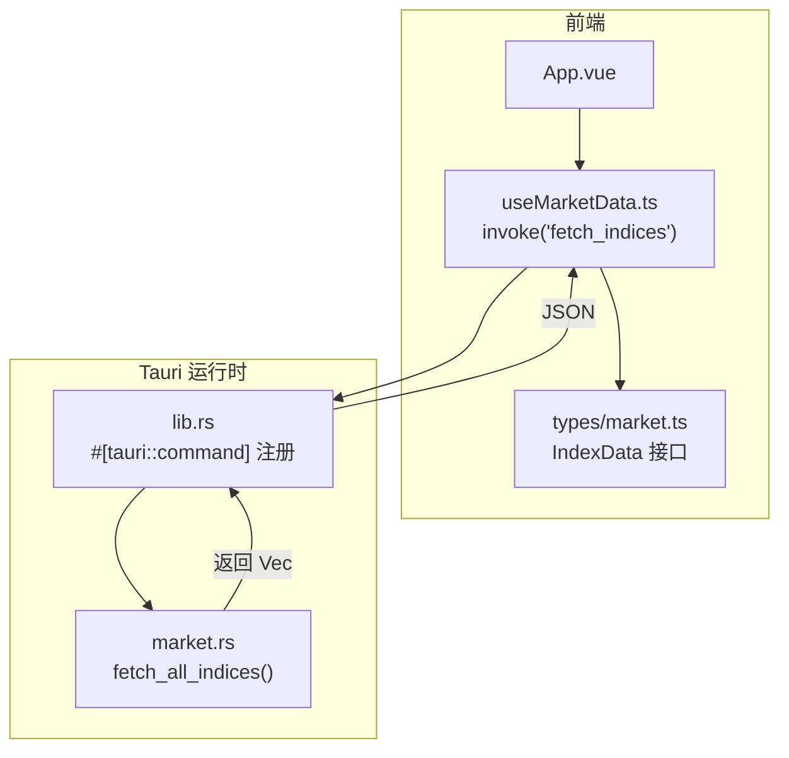
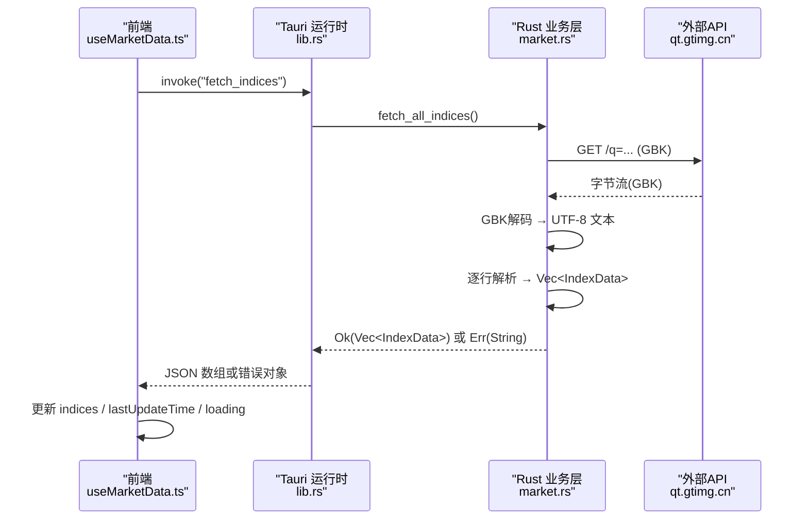
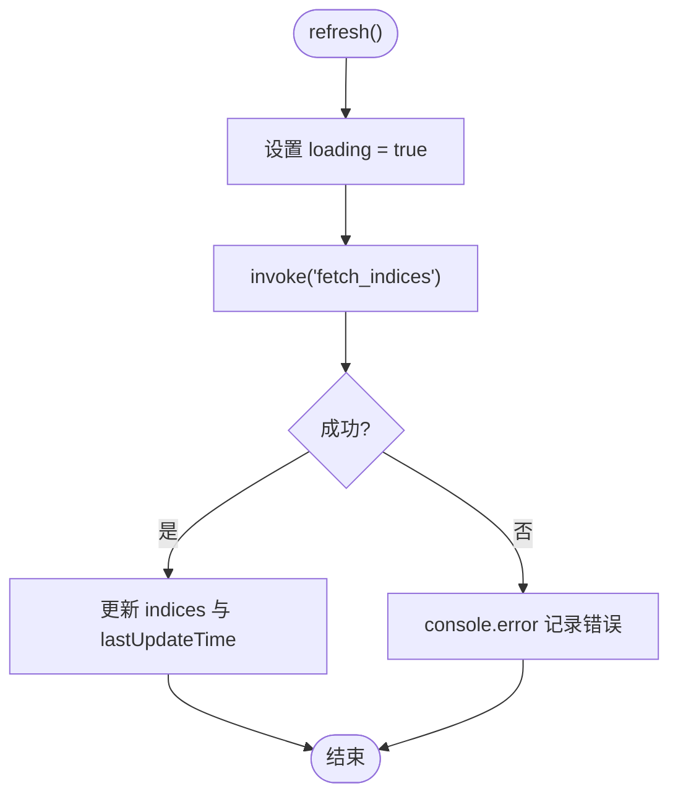
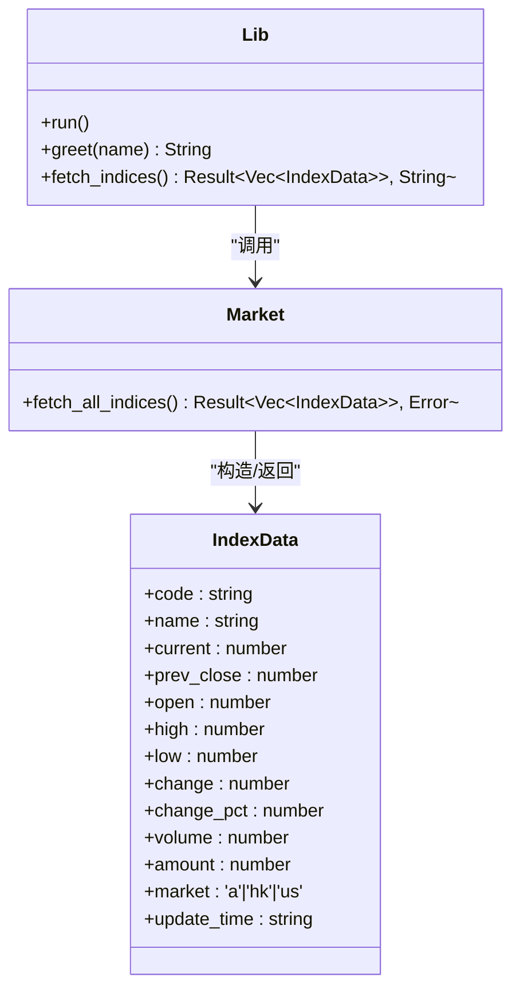
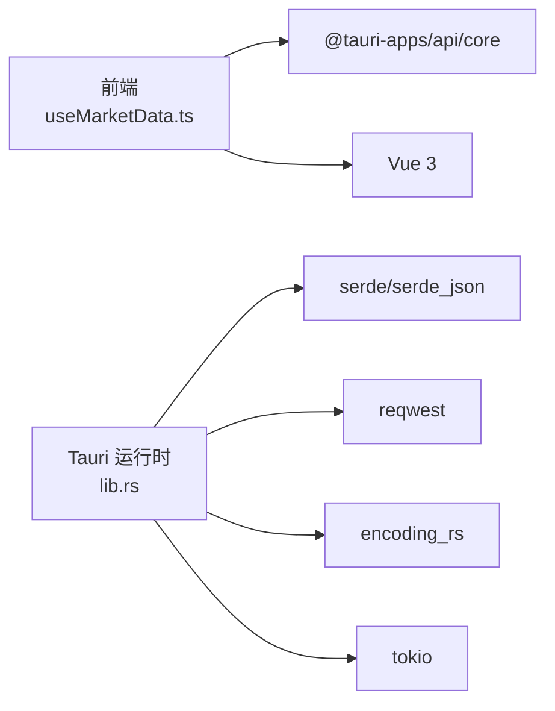

# Tauri IPC通信机制

<cite>
**本文引用的文件**
- [src-tauri/src/lib.rs](file://src-tauri/src/lib.rs)
- [src-tauri/src/market.rs](file://src-tauri/src/market.rs)
- [src-tauri/src/main.rs](file://src-tauri/src/main.rs)
- [src/composables/useMarketData.ts](file://src/composables/useMarketData.ts)
- [src/types/market.ts](file://src/types/market.ts)
- [src/App.vue](file://src/App.vue)
- [src-tauri/tauri.conf.json](file://src-tauri/tauri.conf.json)
- [ARCHITECTURE.md](file://ARCHITECTURE.md)
</cite>

## 目录
1. [简介](#简介)
2. [项目结构](#项目结构)
3. [核心组件](#核心组件)
4. [架构总览](#架构总览)
5. [详细组件分析](#详细组件分析)
6. [依赖关系分析](#依赖关系分析)
7. [性能考量](#性能考量)
8. [故障排查指南](#故障排查指南)
9. [结论](#结论)
10. [附录：命令调用示例路径](#附录命令调用示例路径)

## 简介
本文件面向 hq-kanban-app 的 Tauri IPC 通信机制，聚焦 Vue 前端与 Rust 后端之间的命令调用模式。重点说明 fetch_indices 命令的注册、调用与响应处理流程；解释异步命令的实现方式（async/await）与错误处理策略；文档化前端的 invoke 调用方式和后端的 #[tauri::command] 宏使用方法；说明命令参数传递、返回值处理和异常捕获机制；并提供具体代码片段路径以展示前后端通信的完整实现过程。

## 项目结构
- 前端（Vue 3 + TypeScript）位于 src/，通过 @tauri-apps/api/core 提供的 invoke 调用后端命令。
- 后端（Rust/Tauri）位于 src-tauri/src/，使用 #[tauri::command] 暴露命令并通过 tauri::generate_handler! 注册到应用。
- 数据模型在前后端分别定义，确保类型一致（IndexData）。

图表来源
- [src/composables/useMarketData.ts:25-36](file://src/composables/useMarketData.ts#L25-L36)
- [src-tauri/src/lib.rs:3-18](file://src-tauri/src/lib.rs#L3-L18)
- [src-tauri/src/market.rs:41-99](file://src-tauri/src/market.rs#L41-L99)
- [src/types/market.ts:1-22](file://src/types/market.ts#L1-L22)

章节来源
- [ARCHITECTURE.md:106-155](file://ARCHITECTURE.md#L106-L155)
- [src-tauri/tauri.conf.json:1-51](file://src-tauri/tauri.conf.json#L1-L51)

## 核心组件
- 前端 composable useMarketData：封装轮询逻辑、invoke 调用、加载状态与错误处理。
- 后端命令 fetch_indices：通过 #[tauri::command] 暴露为异步命令，调用 market.rs 中的 fetch_all_indices 获取并解析行情数据。
- 数据模型 IndexData：前后端共用语义一致的字段结构，用于序列化/反序列化。

章节来源
- [src/composables/useMarketData.ts:1-66](file://src/composables/useMarketData.ts#L1-L66)
- [src-tauri/src/lib.rs:3-18](file://src-tauri/src/lib.rs#L3-L18)
- [src-tauri/src/market.rs:1-19](file://src-tauri/src/market.rs#L1-L19)

## 架构总览
下图展示了从前端发起请求到后端返回数据的完整 IPC 流程，包括命令注册、异步执行、错误传播与前端响应式更新。

图表来源
- [src/composables/useMarketData.ts:25-36](file://src/composables/useMarketData.ts#L25-L36)
- [src-tauri/src/lib.rs:3-18](file://src-tauri/src/lib.rs#L3-L18)
- [src-tauri/src/market.rs:41-99](file://src-tauri/src/market.rs#L41-L99)

## 详细组件分析

### 前端：invoke 调用与响应处理
- 调用入口：useMarketData 中的 refresh 函数通过 invoke<IndexData[]>('fetch_indices') 发起命令调用。
- 生命周期管理：onMounted 启动定时器轮询，onUnmounted 清理定时器，避免内存泄漏。
- 状态管理：loading 控制 UI 加载态；lastUpdateTime 记录最近一次更新时间；indices 存储最新数据。
- 错误处理：catch 分支打印错误日志，finally 确保 loading 复位，保证轮询不中断。

图表来源
- [src/composables/useMarketData.ts:25-36](file://src/composables/useMarketData.ts#L25-L36)

章节来源
- [src/composables/useMarketData.ts:1-66](file://src/composables/useMarketData.ts#L1-L66)
- [src/App.vue:1-36](file://src/App.vue#L1-L36)

### 后端：命令注册与异步实现
- 命令注册：在 lib.rs 中通过 #[tauri::command] 声明 greet 与 fetch_indices，并使用 tauri::generate_handler! 将命令注入到应用。
- 异步命令：fetch_indices 为 async fn，内部调用 market.rs 的 fetch_all_indices()，并将 Result<Vec<IndexData>, String> 作为返回值。
- 错误处理：market.rs 中 fetch_all_indices 返回 Result<T, Box<dyn Error>>，在命令层通过 map_err 转换为 String，便于前端统一捕获。

图表来源
- [src-tauri/src/lib.rs:3-18](file://src-tauri/src/lib.rs#L3-L18)
- [src-tauri/src/market.rs:1-19](file://src-tauri/src/market.rs#L1-L19)
- [src-tauri/src/market.rs:41-99](file://src-tauri/src/market.rs#L41-L99)

章节来源
- [src-tauri/src/lib.rs:1-21](file://src-tauri/src/lib.rs#L1-L21)
- [src-tauri/src/market.rs:1-100](file://src-tauri/src/market.rs#L1-L100)

### 数据模型与类型对齐
- 前端 types/market.ts 定义了 IndexData 与 MarketGroup 接口，供 Vue 组件与 composable 使用。
- 后端 market.rs 定义了对应的 Rust 结构体 IndexData，并通过 serde 进行序列化/反序列化。
- 两者字段保持一致，确保 IPC 传输的数据结构稳定且可被正确解析。

章节来源
- [src/types/market.ts:1-22](file://src/types/market.ts#L1-L22)
- [src-tauri/src/market.rs:1-19](file://src-tauri/src/market.rs#L1-L19)

### 命令参数传递、返回值与异常捕获
- 参数传递：当前 fetch_indices 无入参；如需扩展，可在 #[tauri::command] 中添加参数，并在前端 invoke 时传入对应值。
- 返回值：后端返回 Result<Vec<IndexData>, String>，成功时序列化为 JSON 数组，失败时以字符串形式抛出错误。
- 异常捕获：前端 catch 分支捕获错误并记录日志，同时确保 loading 状态复位，不影响后续轮询。

章节来源
- [src-tauri/src/lib.rs:3-11](file://src-tauri/src/lib.rs#L3-L11)
- [src/composables/useMarketData.ts:25-36](file://src/composables/useMarketData.ts#L25-L36)

### 异步命令实现与错误处理策略
- 后端使用 async/await 发起 HTTP 请求（reqwest），并进行 GBK 解码与数据解析。
- 错误传播：网络错误、解码错误、解析错误均通过 Result 向上返回，最终在命令层转为 String 错误，由前端统一捕获。
- 健壮性：对空字段与安全转换（parse_f64）做了容错处理，避免单条数据异常影响整体结果。

章节来源
- [src-tauri/src/market.rs:41-99](file://src-tauri/src/market.rs#L41-L99)
- [src-tauri/src/lib.rs:8-11](file://src-tauri/src/lib.rs#L8-L11)

## 依赖关系分析
- 前端依赖：@tauri-apps/api/core 提供 invoke；Vue 组合式函数管理状态与生命周期。
- 后端依赖：tauri 框架、serde/serde_json 用于序列化；reqwest 发起 HTTP 请求；encoding_rs 处理 GBK 解码；tokio 提供异步运行时。
- 配置：tauri.conf.json 定义窗口、安全策略与构建产物等。

图表来源
- [src/composables/useMarketData.ts:1-3](file://src/composables/useMarketData.ts#L1-L3)
- [src-tauri/Cargo.toml:19-27](file://src-tauri/Cargo.toml#L19-L27)
- [src-tauri/tauri.conf.json:12-27](file://src-tauri/tauri.conf.json#L12-L27)

章节来源
- [src-tauri/Cargo.toml:1-27](file://src-tauri/Cargo.toml#L1-L27)
- [src-tauri/tauri.conf.json:1-51](file://src-tauri/tauri.conf.json#L1-L51)

## 性能考量
- 轮询间隔：默认 3 秒，兼顾实时性与服务器压力；可根据需求调整 POLL_INTERVAL。
- 并发与阻塞：后端使用 reqwest 异步请求，避免阻塞事件循环；若需更高吞吐，可考虑连接池与超时配置。
- 编码转换：GBK→UTF-8 转换开销较小，但大量数据时需关注内存占用；当前实现按行处理，内存友好。
- 前端渲染：使用 computed 分组减少重复计算；按需渲染列表项，避免不必要的重绘。

[本节为通用指导，不直接分析具体文件]

## 故障排查指南
- 常见问题
  - 网络错误：检查 qt.gtimg.cn 可达性与防火墙策略；查看后端日志确认请求是否发出。
  - 编码问题：确认 encoding_rs 是否正确解码 GBK；如出现乱码，检查响应内容与解码流程。
  - 解析异常：校验响应行格式是否符合预期（双引号内容、字段数量≥38）；必要时增加调试日志。
  - 前端错误：查看浏览器控制台错误信息；确认 invoke 名称与后端命令一致。
- 定位步骤
  - 在后端 fetch_all_indices 的关键节点添加日志（请求 URL、响应长度、解析结果数量）。
  - 在前端 refresh 的 catch 分支输出错误详情，确认错误来源（网络/解析/序列化）。
  - 使用 Tauri 开发模式观察 WebView 控制台与 Rust 侧日志。

章节来源
- [src/composables/useMarketData.ts:25-36](file://src/composables/useMarketData.ts#L25-L36)
- [src-tauri/src/market.rs:41-99](file://src-tauri/src/market.rs#L41-L99)

## 结论
本项目通过 Tauri 的 invoke 机制实现了稳定的前后端 IPC 通信。前端使用 composable 封装轮询与状态管理，后端通过 #[tauri::command] 暴露异步命令，结合 serde 完成数据结构序列化。该方案有效规避了浏览器侧的 CORS 与 GBK 编码限制，提升了应用的跨平台兼容性与健壮性。未来可扩展更多命令与参数，进一步优化错误处理与性能监控。

[本节为总结，不直接分析具体文件]

## 附录：命令调用示例路径
- 前端 invoke 调用位置：[src/composables/useMarketData.ts:25-36](file://src/composables/useMarketData.ts#L25-L36)
- 后端命令注册与实现：[src-tauri/src/lib.rs:3-18](file://src-tauri/src/lib.rs#L3-L18)
- 后端业务逻辑（HTTP 请求与解析）：[src-tauri/src/market.rs:41-99](file://src-tauri/src/market.rs#L41-L99)
- 数据模型定义（前端）：[src/types/market.ts:1-22](file://src/types/market.ts#L1-L22)
- 数据模型定义（后端）：[src-tauri/src/market.rs:1-19](file://src-tauri/src/market.rs#L1-L19)
- 应用入口与 Builder 配置：[src-tauri/src/main.rs:4-6](file://src-tauri/src/main.rs#L4-L6)、[src-tauri/src/lib.rs:14-19](file://src-tauri/src/lib.rs#L14-L19)
- 窗口与安全配置：[src-tauri/tauri.conf.json:12-27](file://src-tauri/tauri.conf.json#L12-L27)