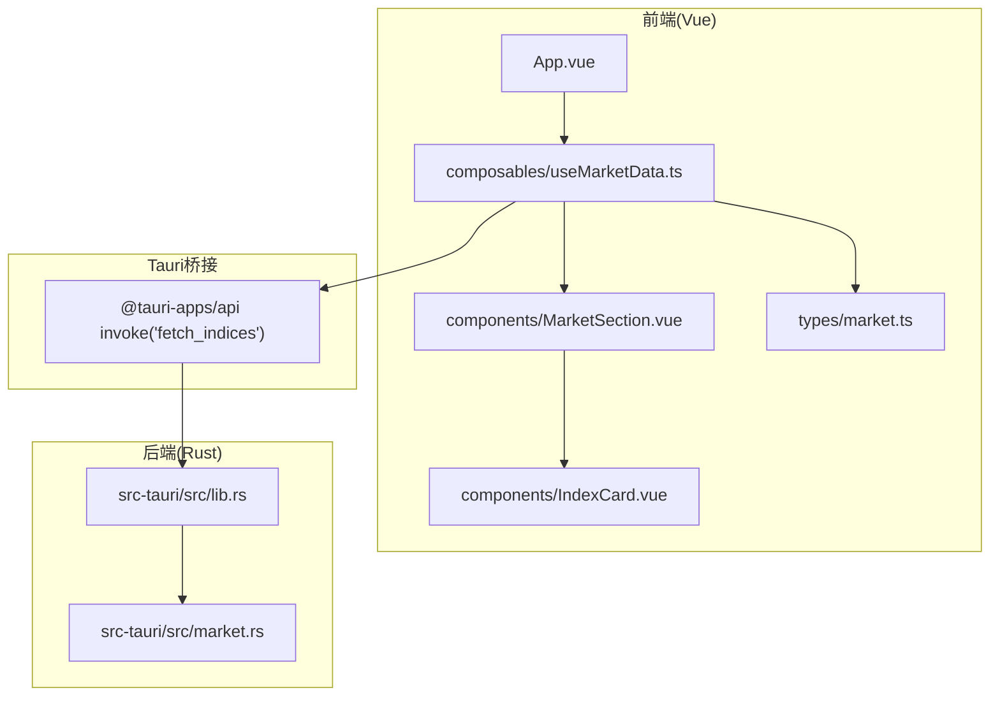
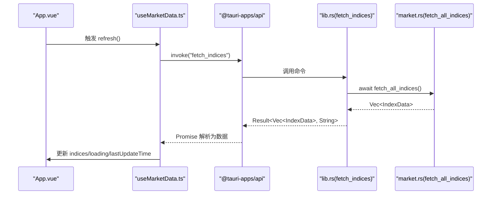
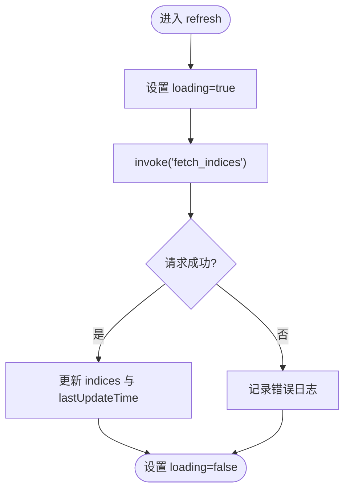
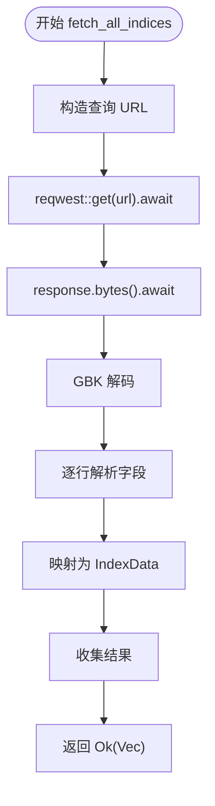
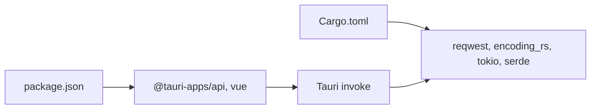

# 异步编程模型

<cite>
**本文引用的文件**
- [useMarketData.ts](file://src/composables/useMarketData.ts)
- [market.rs](file://src-tauri/src/market.rs)
- [lib.rs](file://src-tauri/src/lib.rs)
- [App.vue](file://src/App.vue)
- [MarketSection.vue](file://src/components/MarketSection.vue)
- [IndexCard.vue](file://src/components/IndexCard.vue)
- [market.ts](file://src/types/market.ts)
- [Cargo.toml](file://src-tauri/Cargo.toml)
- [package.json](file://package.json)
</cite>

## 目录
1. [简介](#简介)
2. [项目结构](#项目结构)
3. [核心组件](#核心组件)
4. [架构总览](#架构总览)
5. [详细组件分析](#详细组件分析)
6. [依赖关系分析](#依赖关系分析)
7. [性能考虑](#性能考虑)
8. [故障排查指南](#故障排查指南)
9. [结论](#结论)
10. [附录](#附录)

## 简介
本文件面向 hq-kanban-app 的异步编程模型，聚焦前端 JavaScript Promise 与后端 Rust async/await 的协作方式。重点说明：
- 自动轮询机制：定时器管理、并发控制、错误重试策略
- 异步状态管理与加载状态显示
- 异步错误的捕获与处理
- 性能优化：防抖、节流、资源清理
- 提供流程图与最佳实践，帮助开发者正确理解和使用异步模式

## 项目结构
应用采用 Tauri 架构：前端使用 Vue 3 + TypeScript，通过 @tauri-apps/api 调用 Rust 暴露的命令；Rust 侧使用 reqwest 进行网络请求并解析数据，返回给前端渲染。

图表来源
- [useMarketData.ts:1-66](file://src/composables/useMarketData.ts#L1-L66)
- [lib.rs:1-21](file://src-tauri/src/lib.rs#L1-L21)
- [market.rs:1-100](file://src-tauri/src/market.rs#L1-L100)
- [App.vue:1-36](file://src/App.vue#L1-L36)
- [MarketSection.vue:1-19](file://src/components/MarketSection.vue#L1-L19)
- [IndexCard.vue:1-71](file://src/components/IndexCard.vue#L1-L71)
- [market.ts:1-22](file://src/types/market.ts#L1-L22)

章节来源
- [useMarketData.ts:1-66](file://src/composables/useMarketData.ts#L1-L66)
- [lib.rs:1-21](file://src-tauri/src/lib.rs#L1-L21)
- [market.rs:1-100](file://src-tauri/src/market.rs#L1-L100)
- [App.vue:1-36](file://src/App.vue#L1-L36)
- [MarketSection.vue:1-19](file://src/components/MarketSection.vue#L1-L19)
- [IndexCard.vue:1-71](file://src/components/IndexCard.vue#L1-L71)
- [market.ts:1-22](file://src/types/market.ts#L1-L22)

## 核心组件
- 前端轮询与状态管理：useMarketData 组合式函数负责启动/停止轮询、发起异步请求、维护 loading 与更新时间等状态。
- 后端数据获取：Rust 命令 fetch_indices 调用 market::fetch_all_indices，使用 reqwest 异步拉取行情数据并解析为 IndexData 列表。
- UI 展示：App.vue 消费 useMarketData 提供的数据与状态，MarketSection.vue 按市场分组渲染，IndexCard.vue 展示单个指数卡片。

章节来源
- [useMarketData.ts:1-66](file://src/composables/useMarketData.ts#L1-L66)
- [lib.rs:1-21](file://src-tauri/src/lib.rs#L1-L21)
- [market.rs:1-100](file://src-tauri/src/market.rs#L1-L100)
- [App.vue:1-36](file://src/App.vue#L1-L36)
- [MarketSection.vue:1-19](file://src/components/MarketSection.vue#L1-L19)
- [IndexCard.vue:1-71](file://src/components/IndexCard.vue#L1-L71)

## 架构总览
前端通过 @tauri-apps/api 的 invoke 调用 Rust 命令，Rust 层使用 tokio 运行时执行异步 I/O，最终将结构化数据返回给前端更新视图。

图表来源
- [useMarketData.ts:25-36](file://src/composables/useMarketData.ts#L25-L36)
- [lib.rs:8-11](file://src-tauri/src/lib.rs#L8-L11)
- [market.rs:41-99](file://src-tauri/src/market.rs#L41-L99)

## 详细组件分析

### 前端轮询与状态管理（useMarketData）
- 定时器管理：使用 setInterval 以固定间隔触发刷新；在组件卸载时 clearInterval 释放资源，避免内存泄漏。
- 并发控制：当前实现未对重复请求做互斥保护，若刷新耗时较长且间隔较短，可能出现多个请求并发。建议增加“上一次请求未完成则跳过”或队列化策略。
- 错误重试策略：当前 catch 仅记录日志，无重试逻辑。可引入指数退避重试（如最大重试次数、递增等待时间）。
- 状态管理：loading 用于指示加载中；lastUpdateTime 记录最近一次成功更新时间；indices 存储最新数据；computed 派生市场分组。
- 生命周期：onMounted 启动轮询，onUnmounted 停止轮询，确保资源正确释放。

图表来源
- [useMarketData.ts:25-36](file://src/composables/useMarketData.ts#L25-L36)

章节来源
- [useMarketData.ts:1-66](file://src/composables/useMarketData.ts#L1-L66)

### 后端异步数据获取（market.rs）
- 异步 I/O：使用 reqwest 的 .get().await 与 .bytes().await 进行非阻塞网络请求。
- 编码处理：将字节流解码为 GBK 文本，再逐行解析。
- 数据结构：定义 IndexData 并通过 serde 序列化到前端。
- 错误传播：函数返回 Result<Vec<IndexData>, Box<dyn Error>>，上层命令将其转换为字符串错误返回前端。

图表来源
- [market.rs:41-99](file://src-tauri/src/market.rs#L41-L99)

章节来源
- [market.rs:1-100](file://src-tauri/src/market.rs#L1-L100)

### Tauri 命令桥接（lib.rs）
- 暴露命令：#[tauri::command] 暴露 greet 与 fetch_indices。
- 异步命令：fetch_indices 为 async 函数，调用 market::fetch_all_indices 并将错误转为字符串返回。
- 注册处理器：通过 generate_handler! 注册命令处理器。

章节来源
- [lib.rs:1-21](file://src-tauri/src/lib.rs#L1-L21)

### UI 展示与状态消费（App.vue / MarketSection.vue / IndexCard.vue）
- App.vue 消费 useMarketData 的 marketGroups、loading、lastUpdateTime，并在标题栏中提供手动刷新入口。
- MarketSection.vue 根据市场分组渲染指数卡片列表。
- IndexCard.vue 基于 change 计算趋势样式，展示价格、涨跌额、涨跌幅、成交量与成交额。

章节来源
- [App.vue:1-36](file://src/App.vue#L1-L36)
- [MarketSection.vue:1-19](file://src/components/MarketSection.vue#L1-L19)
- [IndexCard.vue:1-71](file://src/components/IndexCard.vue#L1-L71)

## 依赖关系分析
- 前端依赖：@tauri-apps/api 用于调用 Rust 命令；Vue 3 响应式系统驱动 UI 更新。
- 后端依赖：reqwest 用于异步 HTTP；encoding_rs 用于 GBK 解码；tokio 提供异步运行时；serde/serde_json 用于序列化。

图表来源
- [package.json:1-26](file://package.json#L1-L26)
- [Cargo.toml:19-27](file://src-tauri/Cargo.toml#L19-L27)

章节来源
- [package.json:1-26](file://package.json#L1-L26)
- [Cargo.toml:19-27](file://src-tauri/Cargo.toml#L19-L27)

## 性能考虑
- 防抖与节流
  - 防抖：当用户频繁点击刷新时，合并多次请求为一次，减少不必要的网络开销。
  - 节流：限制单位时间内最多执行一次刷新，避免高频触发导致的资源浪费。
- 并发控制
  - 增加“进行中请求”标志，防止同一时刻多个请求并发导致竞态条件。
  - 必要时使用请求队列或取消令牌（AbortController）取消过期请求。
- 资源清理
  - 组件卸载时务必清除定时器与监听器，避免内存泄漏。
  - 网络请求失败时及时释放临时资源。
- 错误重试
  - 指数退避重试：首次失败后等待较短时间重试，逐步增加等待时间，达到最大重试次数后放弃。
  - 区分可重试与不可重试错误，避免无限重试。
- 数据更新策略
  - 仅在数据变化时更新视图，利用 computed 派生分组减少重渲染。
  - 合理设置轮询间隔，平衡实时性与性能。

[本节为通用性能指导，不直接分析具体代码文件]

## 故障排查指南
- 常见问题定位
  - 轮询不停止：检查 onUnmounted 是否正确调用 stopPolling，确认 clearInterval 已执行。
  - 数据不更新：检查 invoke 是否成功返回，查看浏览器控制台与 Rust 日志。
  - 乱码问题：确认后端 GBK 解码流程正常，网络响应编码一致。
- 错误捕获与处理
  - 前端：catch 块记录错误信息，便于调试；可结合用户提示增强体验。
  - 后端：Result 类型统一错误传播，命令层将错误转为字符串返回前端。
- 调试建议
  - 在前端添加关键步骤日志（如进入 refresh、请求开始/结束、错误堆栈）。
  - 在后端打印关键解析步骤与异常信息，辅助定位数据格式问题。

章节来源
- [useMarketData.ts:25-36](file://src/composables/useMarketData.ts#L25-L36)
- [lib.rs:8-11](file://src-tauri/src/lib.rs#L8-L11)
- [market.rs:41-99](file://src-tauri/src/market.rs#L41-L99)

## 结论
hq-kanban-app 的异步模型以 Vue 组合式函数为核心，配合 Tauri 命令与 Rust 异步 I/O，实现了稳定的自动轮询与数据更新。当前实现简洁可靠，建议在并发控制、错误重试与防抖节流方面进一步增强，以提升鲁棒性与用户体验。

[本节为总结性内容，不直接分析具体代码文件]

## 附录
- 类型定义
  - IndexData：包含指数代码、名称、价格、涨跌、成交量等字段，以及市场分类与更新时间。
  - MarketGroup：用于前端分组展示，包含 key、label 与 indices 数组。

章节来源
- [market.ts:1-22](file://src/types/market.ts#L1-L22)