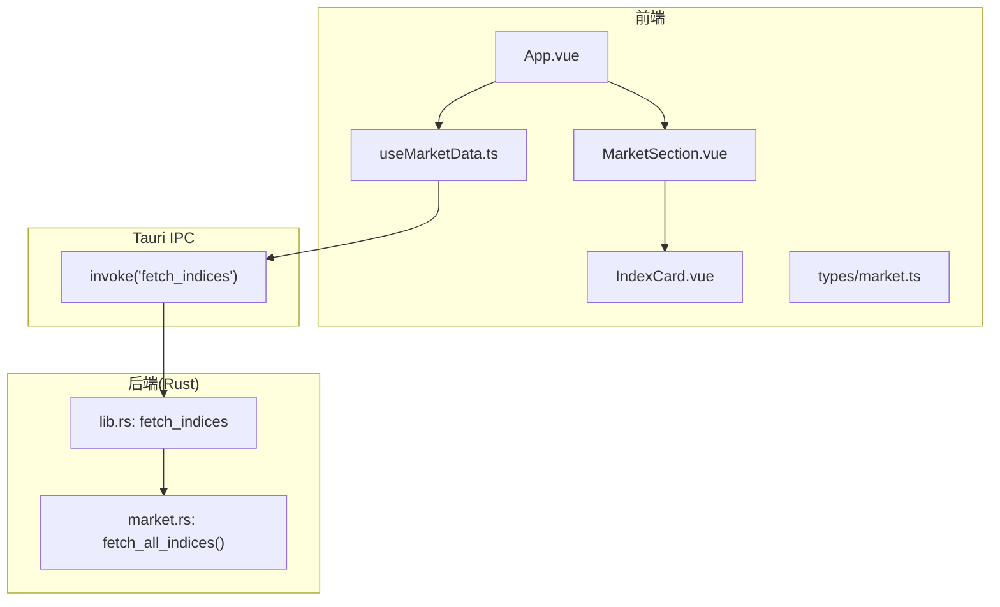
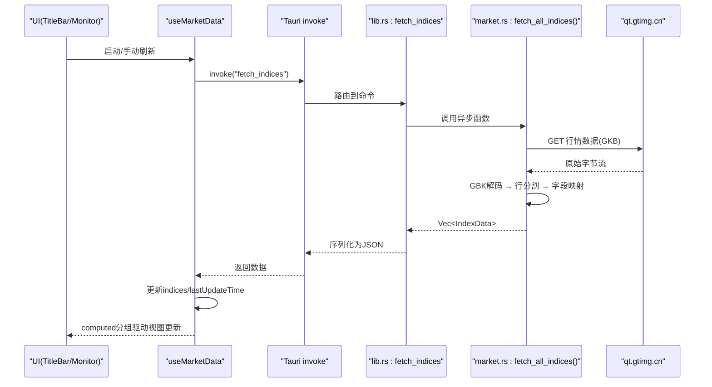
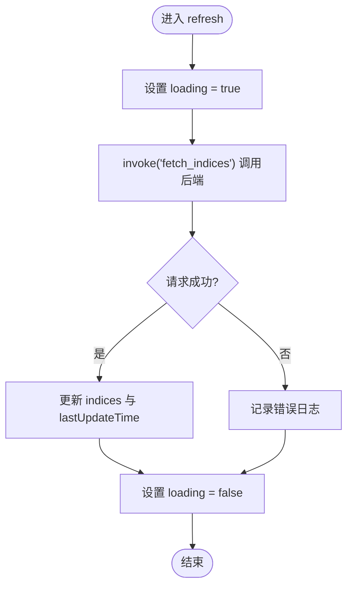
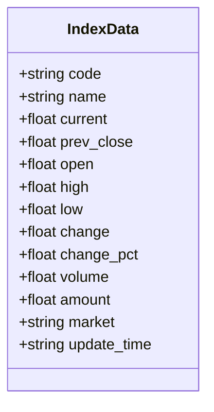
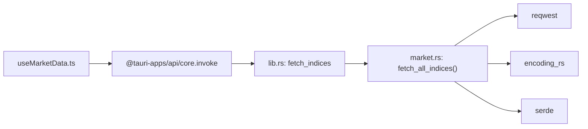
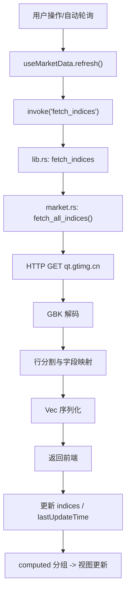

# 数据流架构设计

<cite>
**本文引用的文件**
- [useMarketData.ts](file://src/composables/useMarketData.ts)
- [market.ts](file://src/types/market.ts)
- [market.rs](file://src-tauri/src/market.rs)
- [lib.rs](file://src-tauri/src/lib.rs)
- [App.vue](file://src/App.vue)
- [MarketSection.vue](file://src/components/MarketSection.vue)
- [IndexCard.vue](file://src/components/IndexCard.vue)
- [ARCHITECTURE.md](file://ARCHITECTURE.md)
</cite>

## 目录
1. [简介](#简介)
2. [项目结构](#项目结构)
3. [核心组件](#核心组件)
4. [架构总览](#架构总览)
5. [详细组件分析](#详细组件分析)
6. [依赖关系分析](#依赖关系分析)
7. [性能考量](#性能考量)
8. [故障排查指南](#故障排查指南)
9. [结论](#结论)
10. [附录](#附录)

## 简介
本文件面向 hq-kanban-app 的数据流架构，系统性描述从用户界面触发到数据获取、解析、状态更新的全链路过程。重点说明：
- 前端 useMarketData 组合式函数如何管理数据状态与轮询逻辑
- Rust 后端 market 模块如何处理网络请求与数据解析
- TypeScript 类型定义与 Rust 结构体的映射关系
- 错误处理与数据验证机制
- 数据流向图与关键节点的状态变化

该文档旨在帮助开发者快速理解整个数据生命周期，并在扩展或优化时具备清晰的参考依据。

## 项目结构
应用采用“前端（Vue 3 + TypeScript）+ 后端（Rust/Tauri）”双层架构，通过 Tauri 的 invoke 机制进行 IPC 通信。前端负责 UI 渲染与状态管理，后端负责网络请求、编码转换与数据解析。

图表来源
- [App.vue:1-36](file://src/App.vue#L1-L36)
- [MarketSection.vue:1-19](file://src/components/MarketSection.vue#L1-L19)
- [IndexCard.vue:1-71](file://src/components/IndexCard.vue#L1-L71)
- [useMarketData.ts:1-66](file://src/composables/useMarketData.ts#L1-L66)
- [lib.rs:1-21](file://src-tauri/src/lib.rs#L1-L21)
- [market.rs:1-100](file://src-tauri/src/market.rs#L1-L100)

章节来源
- [ARCHITECTURE.md:58-102](file://ARCHITECTURE.md#L58-L102)

## 核心组件
- 前端数据层：useMarketData.ts 提供数据状态、分组计算、轮询控制与刷新接口
- 类型契约：types/market.ts 定义 IndexData 与 MarketGroup，约束前后端数据结构
- 后端数据层：market.rs 实现 HTTP 请求、GBK 解码、行级解析与字段映射
- 命令桥接：lib.rs 注册 fetch_indices 命令，将前端调用转发至 market 模块
- UI 展示：App.vue、MarketSection.vue、IndexCard.vue 负责布局与渲染

章节来源
- [useMarketData.ts:1-66](file://src/composables/useMarketData.ts#L1-L66)
- [market.ts:1-22](file://src/types/market.ts#L1-L22)
- [market.rs:1-100](file://src-tauri/src/market.rs#L1-L100)
- [lib.rs:1-21](file://src-tauri/src/lib.rs#L1-L21)
- [App.vue:1-36](file://src/App.vue#L1-L36)
- [MarketSection.vue:1-19](file://src/components/MarketSection.vue#L1-L19)
- [IndexCard.vue:1-71](file://src/components/IndexCard.vue#L1-L71)

## 架构总览
整体数据流遵循“前端轮询 → IPC 调用 → 后端请求 → 解析序列化 → 返回前端 → 响应式更新”的闭环。

图表来源
- [useMarketData.ts:25-41](file://src/composables/useMarketData.ts#L25-L41)
- [lib.rs:8-11](file://src-tauri/src/lib.rs#L8-L11)
- [market.rs:41-99](file://src-tauri/src/market.rs#L41-L99)

## 详细组件分析

### 前端：useMarketData 组合式函数
职责
- 维护 indices、loading、lastUpdateTime 等响应式状态
- 每 3 秒自动轮询，首次挂载立即刷新一次
- 通过 invoke('fetch_indices') 调用后端命令
- 使用 computed 按 market 字段分组为 A 股、港股、美股三组
- 在卸载时清理定时器，避免内存泄漏

关键流程
- 启动：onMounted → startPolling → refresh → setInterval(refresh, 3000ms)
- 刷新：设置 loading=true → 调用后端 → 成功则更新 indices 与 lastUpdateTime → finally 恢复 loading=false
- 停止：onUnmounted → clearInterval

错误处理
- 捕获异常并记录日志，不中断后续轮询

章节来源
- [useMarketData.ts:5-11](file://src/composables/useMarketData.ts#L5-L11)
- [useMarketData.ts:13-23](file://src/composables/useMarketData.ts#L13-L23)
- [useMarketData.ts:25-48](file://src/composables/useMarketData.ts#L25-L48)
- [useMarketData.ts:50-56](file://src/composables/useMarketData.ts#L50-L56)

#### 流程图：轮询与刷新

图表来源
- [useMarketData.ts:25-36](file://src/composables/useMarketData.ts#L25-L36)

### 前端：类型定义与组件
- types/market.ts 定义 IndexData 与 MarketGroup，作为前后端数据契约
- App.vue 消费 useMarketData 暴露的 state 与方法，并传递到子组件
- MarketSection.vue 接收 MarketGroup 并按市场分区渲染
- IndexCard.vue 根据 change 正负决定颜色与边框样式，并使用工具函数格式化数值

章节来源
- [market.ts:1-22](file://src/types/market.ts#L1-L22)
- [App.vue:1-36](file://src/App.vue#L1-L36)
- [MarketSection.vue:1-19](file://src/components/MarketSection.vue#L1-L19)
- [IndexCard.vue:1-71](file://src/components/IndexCard.vue#L1-L71)

### 后端：Rust market 模块
职责
- 发起 HTTP 请求到 qt.gtimg.cn
- 将 GBK 编码响应解码为 UTF-8
- 逐行解析，提取指数代码与字段数组，映射为 IndexData
- 根据代码前缀判定市场类型（a/hk/us）
- 安全地将字符串转为 f64，空值默认 0.0

关键流程
- 构造 URL 并发起 GET
- bytes() 获取原始字节流
- encoding_rs::GBK.decode 转换为文本
- 按行过滤空行，提取双引号内容，按 ~ 拆分字段
- 校验字段数量，确保索引有效
- 填充 IndexData 并收集结果

错误处理
- 网络或解码失败通过 Result 向上抛出，由 lib.rs 转换为 String 错误返回前端
- 字段解析使用 parse_f64 容错，避免单条数据异常导致整体失败

章节来源
- [market.rs:1-18](file://src-tauri/src/market.rs#L1-L18)
- [market.rs:22-39](file://src-tauri/src/market.rs#L22-L39)
- [market.rs:41-99](file://src-tauri/src/market.rs#L41-L99)

#### 类图：Rust 数据模型

图表来源
- [market.rs:3-18](file://src-tauri/src/market.rs#L3-L18)

### 命令桥接：lib.rs
- 注册 greet 与 fetch_indices 两个命令
- fetch_indices 调用 market::fetch_all_indices，并将错误转换为 String 返回前端

章节来源
- [lib.rs:1-21](file://src-tauri/src/lib.rs#L1-L21)

### 类型映射：TypeScript ↔ Rust
- IndexData 字段一一对应：code、name、current、prev_close、open、high、low、change、change_pct、volume、amount、market、update_time
- market 字段在前端为联合字面量 'a' | 'hk' | 'us'，后端以 String 表示，但约定值一致
- 前端通过 computed 对 indices 进行分组，形成 MarketGroup 供 UI 渲染

章节来源
- [market.ts:1-22](file://src/types/market.ts#L1-L22)
- [market.rs:3-18](file://src-tauri/src/market.rs#L3-L18)

## 依赖关系分析
- 前端依赖
  - Vue 3 响应式系统（ref、computed、生命周期钩子）
  - @tauri-apps/api/core 的 invoke 用于 IPC
- 后端依赖
  - reqwest 用于 HTTP 请求
  - encoding_rs 用于 GBK 解码
  - serde 用于结构体序列化
  - tokio 异步运行时

图表来源
- [useMarketData.ts:1-3](file://src/composables/useMarketData.ts#L1-L3)
- [lib.rs:8-11](file://src-tauri/src/lib.rs#L8-L11)
- [market.rs:1-2](file://src-tauri/src/market.rs#L1-L2)
- [market.rs:41-45](file://src-tauri/src/market.rs#L41-L45)

章节来源
- [package.json:12-24](file://package.json#L12-L24)
- [market.rs:1-2](file://src-tauri/src/market.rs#L1-L2)

## 性能考量
- 轮询间隔 3 秒，平衡实时性与服务器压力；可根据业务需求调整 POLL_INTERVAL
- 仅在需要时刷新，组件卸载时清理定时器，避免后台资源浪费
- 后端逐行解析且字段校验，减少无效数据处理开销
- 使用 f64 存储价格与指标，注意精度问题；如需更高精度可考虑 Decimal 类型
- 批量请求多个指数代码，减少网络往返次数

[本节为通用指导，不直接分析具体文件]

## 故障排查指南
常见问题与定位要点
- 网络请求失败
  - 检查后端是否成功发起 HTTP 请求与响应码
  - 关注 network error 与超时配置
- 编码问题
  - 确认响应为 GBK 编码，后端已正确解码为 UTF-8
  - 若出现乱码，检查 encoding_rs 的使用与输入字节流
- 解析异常
  - 检查行格式是否符合预期（包含双引号内容与 ~ 分隔字段）
  - 字段数量不足时会被跳过，需核对 API 字段顺序与索引
- 前端状态未更新
  - 检查 invoke 返回值类型是否与 TypeScript 类型一致
  - 确认 computed 分组逻辑与市场字段取值一致
- 内存泄漏
  - 确认 onUnmounted 中清除了定时器

章节来源
- [useMarketData.ts:25-36](file://src/composables/useMarketData.ts#L25-L36)
- [market.rs:41-99](file://src-tauri/src/market.rs#L41-L99)

## 结论
本应用通过清晰的前后端分层与严格的类型契约，实现了稳定可靠的行情数据获取与展示。useMarketData 集中管理轮询与状态，Rust market 模块负责健壮的网络与解析逻辑。建议在后续迭代中：
- 增加重试与退避策略以提升鲁棒性
- 引入缓存以减少重复请求
- 完善错误上报与监控
- 按需优化轮询频率与批量化策略

[本节为总结性内容，不直接分析具体文件]

## 附录

### 数据流向图（端到端）

图表来源
- [useMarketData.ts:25-41](file://src/composables/useMarketData.ts#L25-L41)
- [lib.rs:8-11](file://src-tauri/src/lib.rs#L8-L11)
- [market.rs:41-99](file://src-tauri/src/market.rs#L41-L99)

### 关键节点状态变化
- 初始化：loading=false，indices=[]，lastUpdateTime=''
- 开始刷新：loading=true
- 请求成功：indices=最新数据，lastUpdateTime=当前时间，loading=false
- 请求失败：记录错误，loading=false，保持上次数据
- 组件卸载：清除定时器，释放资源

章节来源
- [useMarketData.ts:5-11](file://src/composables/useMarketData.ts#L5-L11)
- [useMarketData.ts:25-48](file://src/composables/useMarketData.ts#L25-L48)
- [useMarketData.ts:50-56](file://src/composables/useMarketData.ts#L50-L56)