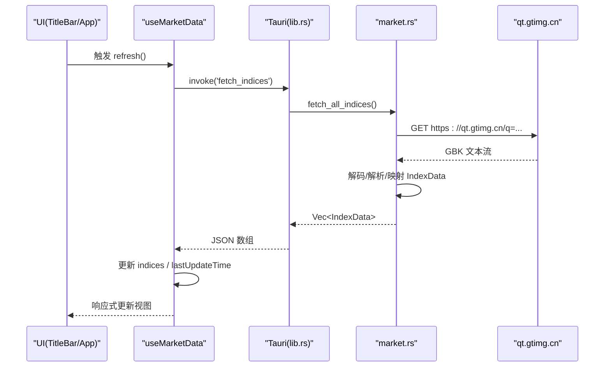
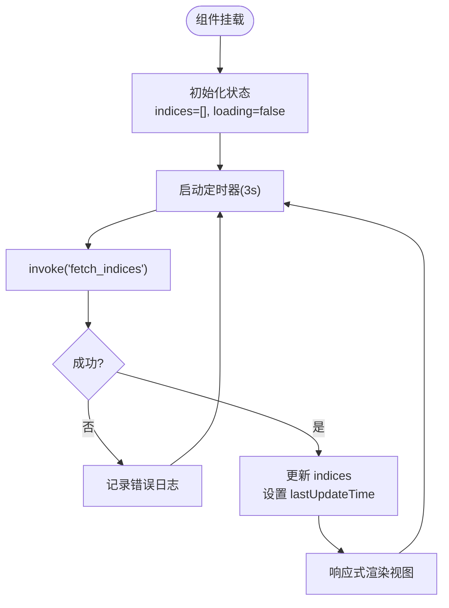
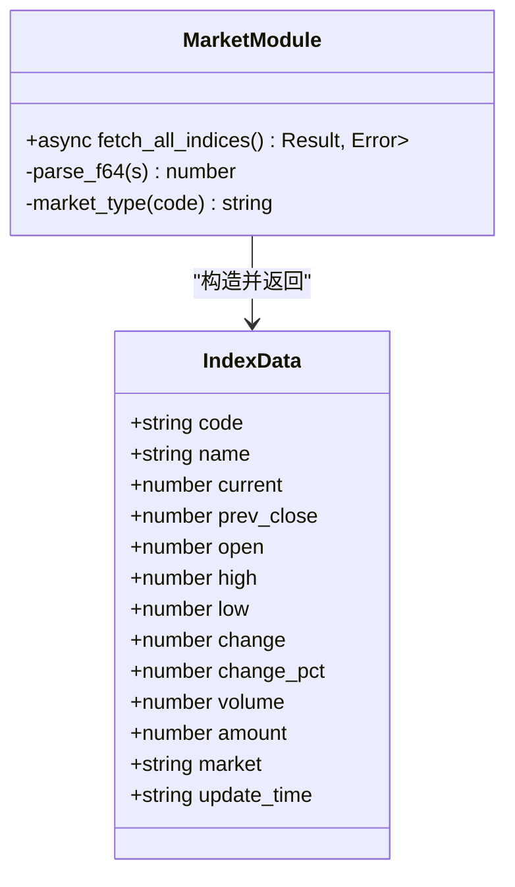
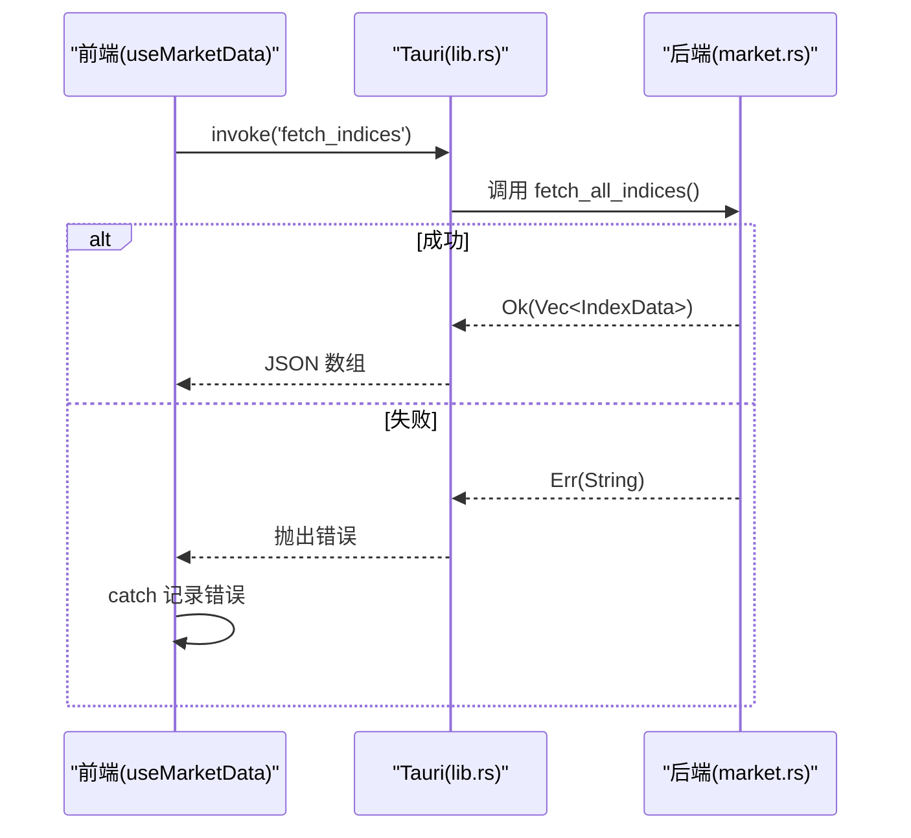
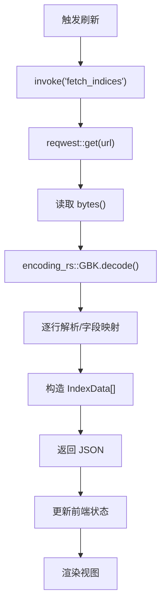
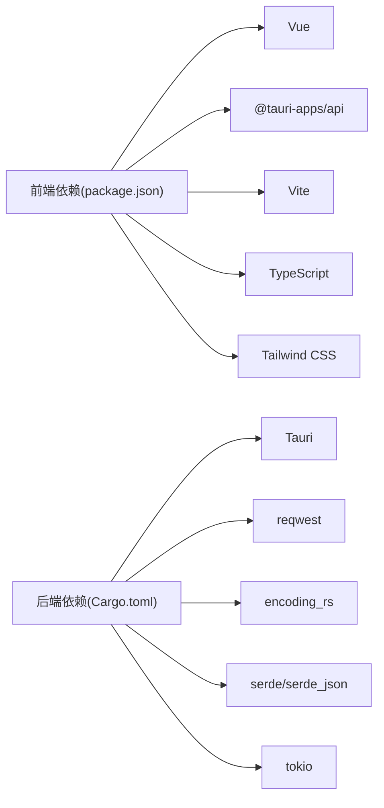

# 架构设计

<cite>
**本文引用的文件**
- [package.json](file://package.json)
- [Cargo.toml](file://src-tauri/Cargo.toml)
- [tauri.conf.json](file://src-tauri/tauri.conf.json)
- [ARCHITECTURE.md](file://ARCHITECTURE.md)
- [main.rs](file://src-tauri/src/main.rs)
- [lib.rs](file://src-tauri/src/lib.rs)
- [market.rs](file://src-tauri/src/market.rs)
- [App.vue](file://src/App.vue)
- [useMarketData.ts](file://src/composables/useMarketData.ts)
- [TitleBar.vue](file://src/components/TitleBar.vue)
- [MarketSection.vue](file://src/components/MarketSection.vue)
- [IndexCard.vue](file://src/components/IndexCard.vue)
- [market.ts](file://src/types/market.ts)
- [format.ts](file://src/utils/format.ts)
</cite>

## 目录
1. [简介](#简介)
2. [项目结构](#项目结构)
3. [核心组件](#核心组件)
4. [架构总览](#架构总览)
5. [详细组件分析](#详细组件分析)
6. [依赖关系分析](#依赖关系分析)
7. [性能考量](#性能考量)
8. [故障排查指南](#故障排查指南)
9. [结论](#结论)
10. [附录](#附录)

## 简介
本项目为基于 Tauri 的跨平台桌面应用，采用前后端分离架构：前端使用 Vue 3 + TypeScript + Vite，负责 UI 渲染与用户交互；后端使用 Rust 实现本地服务，通过 Tauri IPC 暴露命令供前端调用。应用的核心能力是定时轮询获取全球主要股指行情数据（A 股、港股、美股），并以看板形式展示涨跌、价格、成交量与成交额等关键指标。

## 项目结构
项目分为前端 src 与后端 src-tauri 两部分：
- 前端：Vue 组件、组合式函数、类型定义与工具函数，构建产物由 Vite 输出到 dist。
- 后端：Rust 模块，注册 Tauri 命令，封装网络请求、编码转换与数据解析。

```mermaid
graph TB
subgraph "前端 (Vue)"
A["App.vue"]
B["TitleBar.vue"]
C["MarketSection.vue"]
D["IndexCard.vue"]
E["useMarketData.ts"]
F["types/market.ts"]
G["utils/format.ts"]
end
subgraph "Tauri"
H["lib.rs"]
I["market.rs"]
end
A --> B
A --> C
C --> D
A --> E
E --> F
D --> G
E --> |invoke('fetch_indices')| H
H --> I
```

图表来源
- [App.vue:1-36](file://src/App.vue#L1-L36)
- [useMarketData.ts:1-66](file://src/composables/useMarketData.ts#L1-L66)
- [lib.rs:1-21](file://src-tauri/src/lib.rs#L1-L21)
- [market.rs:1-100](file://src-tauri/src/market.rs#L1-L100)

章节来源
- [package.json:1-26](file://package.json#L1-L26)
- [Cargo.toml:1-27](file://src-tauri/Cargo.toml#L1-L27)
- [tauri.conf.json:1-51](file://src-tauri/tauri.conf.json#L1-L51)
- [ARCHITECTURE.md:58-102](file://ARCHITECTURE.md#L58-L102)

## 核心组件
- 前端入口与布局：App.vue 组织标题栏与市场分区，挂载 useMarketData 提供状态与刷新能力。
- 组合式函数：useMarketData.ts 管理轮询、IPC 调用、数据分组与生命周期清理。
- 视图组件：TitleBar.vue 提供窗口控制与手动刷新；MarketSection.vue 按市场分组渲染；IndexCard.vue 展示单条指数详情。
- 类型与工具：types/market.ts 定义 IndexData 与 MarketGroup；utils/format.ts 提供数值格式化。
- 后端命令：lib.rs 注册 fetch_indices 命令；market.rs 实现网络请求、GBK 解码、字段解析与结构化数据返回。

章节来源
- [App.vue:1-36](file://src/App.vue#L1-L36)
- [useMarketData.ts:1-66](file://src/composables/useMarketData.ts#L1-L66)
- [TitleBar.vue:1-63](file://src/components/TitleBar.vue#L1-L63)
- [MarketSection.vue:1-19](file://src/components/MarketSection.vue#L1-L19)
- [IndexCard.vue:1-71](file://src/components/IndexCard.vue#L1-L71)
- [market.ts:1-22](file://src/types/market.ts#L1-L22)
- [format.ts:1-33](file://src/utils/format.ts#L1-L33)
- [lib.rs:1-21](file://src-tauri/src/lib.rs#L1-L21)
- [market.rs:1-100](file://src-tauri/src/market.rs#L1-L100)

## 架构总览
系统采用“前端（Vue）+ 后端（Rust/Tauri）”双层架构，通过 Tauri invoke 进行 IPC 通信。前端发起命令调用，后端执行网络请求并返回结构化数据，前端响应式更新视图。



图表来源
- [useMarketData.ts:25-36](file://src/composables/useMarketData.ts#L25-L36)
- [lib.rs:8-11](file://src-tauri/src/lib.rs#L8-L11)
- [market.rs:41-99](file://src-tauri/src/market.rs#L41-L99)

章节来源
- [ARCHITECTURE.md:106-154](file://ARCHITECTURE.md#L106-L154)

## 详细组件分析

### 前端：Vue 组件与组合式 API
- App.vue：组合 TitleBar 与 MarketSection，注入 useMarketData 的状态与方法。
- TitleBar.vue：实现窗口拖动、最小化、关闭以及手动刷新事件。
- MarketSection.vue：接收 MarketGroup，按网格渲染 IndexCard。
- IndexCard.vue：根据涨跌计算样式与颜色，调用 format 工具显示数值。
- useMarketData.ts：
  - 使用 ref/computed 管理 indices、loading、lastUpdateTime 与 marketGroups。
  - 每 3 秒通过 invoke('fetch_indices') 拉取数据，失败时记录错误但不中断轮询。
  - onMounted/onUnmounted 管理定时器生命周期，避免内存泄漏。



图表来源
- [useMarketData.ts:1-66](file://src/composables/useMarketData.ts#L1-L66)

章节来源
- [App.vue:1-36](file://src/App.vue#L1-L36)
- [TitleBar.vue:1-63](file://src/components/TitleBar.vue#L1-L63)
- [MarketSection.vue:1-19](file://src/components/MarketSection.vue#L1-L19)
- [IndexCard.vue:1-71](file://src/components/IndexCard.vue#L1-L71)
- [useMarketData.ts:1-66](file://src/composables/useMarketData.ts#L1-L66)
- [market.ts:1-22](file://src/types/market.ts#L1-L22)
- [format.ts:1-33](file://src/utils/format.ts#L1-L33)

### 后端：Rust 命令与数据处理
- lib.rs：注册 greet 与 fetch_indices 两个命令，并通过 generate_handler! 绑定到 Tauri 运行时。
- market.rs：
  - 定义 IndexData 结构体并启用序列化。
  - fetch_all_indices() 异步发起 HTTP 请求，获取字节流后使用 encoding_rs 将 GBK 解码为 UTF-8。
  - 逐行解析响应，提取双引号内内容并按 ~ 分割字段，校验字段数量后进行安全转换与映射。
  - 根据代码前缀判定市场类型（a/hk/us）。
  - 返回 Vec<IndexData>，经 serde_json 序列化为 JSON 返回前端。



图表来源
- [market.rs:1-100](file://src-tauri/src/market.rs#L1-L100)

章节来源
- [lib.rs:1-21](file://src-tauri/src/lib.rs#L1-L21)
- [market.rs:1-100](file://src-tauri/src/market.rs#L1-L100)

### Tauri IPC 通信机制
- 命令调用：前端通过 @tauri-apps/api/core 的 invoke 调用后端命令 fetch_indices。
- 事件处理：当前未使用事件通道，仅通过命令返回值传递数据。
- 错误处理策略：
  - 前端：catch 捕获异常并记录日志，保持轮询继续。
  - 后端：Result 包装错误，转换为字符串错误返回给前端。



图表来源
- [useMarketData.ts:25-36](file://src/composables/useMarketData.ts#L25-L36)
- [lib.rs:8-11](file://src-tauri/src/lib.rs#L8-L11)
- [market.rs:41-99](file://src-tauri/src/market.rs#L41-L99)

章节来源
- [useMarketData.ts:1-66](file://src/composables/useMarketData.ts#L1-L66)
- [lib.rs:1-21](file://src-tauri/src/lib.rs#L1-L21)
- [market.rs:1-100](file://src-tauri/src/market.rs#L1-L100)

### 数据获取流程（端到端）
- 触发点：TitleBar 手动刷新或自动轮询触发 useMarketData.refresh。
- 网络请求：Rust 后端使用 reqwest 发起 HTTPS GET 至 qt.gtimg.cn。
- 编码转换：encoding_rs 将 GBK 响应解码为 UTF-8。
- 数据解析：按行拆分、提取双引号内容、按 ~ 分割字段、校验长度、映射到 IndexData。
- 状态更新：前端收到数据后更新 indices 与 lastUpdateTime，视图自动重渲染。



图表来源
- [market.rs:41-99](file://src-tauri/src/market.rs#L41-L99)
- [useMarketData.ts:25-36](file://src/composables/useMarketData.ts#L25-L36)

章节来源
- [ARCHITECTURE.md:139-147](file://ARCHITECTURE.md#L139-L147)
- [market.rs:1-100](file://src-tauri/src/market.rs#L1-L100)
- [useMarketData.ts:1-66](file://src/composables/useMarketData.ts#L1-L66)

### 组件化设计与组合式 API 模式
- 组件职责单一：TitleBar 负责窗口控制与刷新触发；MarketSection 负责分组渲染；IndexCard 负责单条数据展示。
- 组合式函数复用逻辑：useMarketData 封装轮询、IPC 调用、数据分组与生命周期管理，被多个组件共享。
- 数据流向清晰：父组件通过 props 向下传递数据，子组件通过 emit 向上触发事件（如刷新）。

章节来源
- [App.vue:1-36](file://src/App.vue#L1-L36)
- [TitleBar.vue:1-63](file://src/components/TitleBar.vue#L1-L63)
- [MarketSection.vue:1-19](file://src/components/MarketSection.vue#L1-L19)
- [IndexCard.vue:1-71](file://src/components/IndexCard.vue#L1-L71)
- [useMarketData.ts:1-66](file://src/composables/useMarketData.ts#L1-L66)

### 异步编程模型
- 前端：使用 async/await 调用 Tauri 命令，结合 setInterval 实现定时轮询，onUnmounted 清理定时器。
- 后端：使用 tokio 异步运行时，reqwest 发起异步请求，整体链路非阻塞。

章节来源
- [useMarketData.ts:1-66](file://src/composables/useMarketData.ts#L1-L66)
- [Cargo.toml:19-27](file://src-tauri/Cargo.toml#L19-L27)
- [market.rs:41-99](file://src-tauri/src/market.rs#L41-L99)

## 依赖关系分析
- 前端依赖：Vue、@tauri-apps/api、Vite、TypeScript、Tailwind CSS。
- 后端依赖：Tauri、reqwest（blocking）、encoding_rs、serde、serde_json、tokio。
- 配置：tauri.conf.json 指定产品名称、窗口尺寸、前端构建路径与开发服务器地址。



图表来源
- [package.json:12-24](file://package.json#L12-L24)
- [Cargo.toml:19-27](file://src-tauri/Cargo.toml#L19-L27)

章节来源
- [package.json:1-26](file://package.json#L1-L26)
- [Cargo.toml:1-27](file://src-tauri/Cargo.toml#L1-L27)
- [tauri.conf.json:1-51](file://src-tauri/tauri.conf.json#L1-L51)

## 性能考量
- 轮询间隔：3 秒平衡实时性与服务器压力，适合非高频交易场景。
- 网络请求：后端直接请求不受浏览器 CORS 限制，且可稳定处理 GBK 编码。
- 渲染优化：Vue 响应式系统自动追踪依赖，computed 分组减少重复计算。
- 资源清理：组件卸载时清除定时器，避免后台资源浪费。

[本节为通用指导，不直接分析具体文件]

## 故障排查指南
- 前端错误：
  - 检查 invoke 调用是否成功，查看控制台错误日志。
  - 确认网络可达与后端命令已正确注册。
- 后端错误：
  - 检查 qt.gtimg.cn 接口可用性。
  - 确认 GBK 解码与字段解析逻辑是否满足响应格式变化。
  - 关注 Result 错误分支，确保错误信息能回传到前端。

章节来源
- [useMarketData.ts:25-36](file://src/composables/useMarketData.ts#L25-L36)
- [lib.rs:8-11](file://src-tauri/src/lib.rs#L8-L11)
- [market.rs:41-99](file://src-tauri/src/market.rs#L41-L99)

## 结论
本应用通过 Tauri 将 Vue 前端与 Rust 后端解耦，利用 IPC 完成数据获取与展示。前端以组合式 API 组织业务逻辑，后端以模块化方式处理网络请求与数据解析。该架构具备良好的可维护性与扩展性，适合持续迭代与功能增强。

[本节为总结，不直接分析具体文件]

## 附录
- 技术栈与版本详见 ARCHITECTURE.md。
- 构建与部署流程见 ARCHITECTURE.md 构建章节。
- 窗口配置与权限在 tauri.conf.json 中定义。

章节来源
- [ARCHITECTURE.md:23-55](file://ARCHITECTURE.md#L23-L55)
- [ARCHITECTURE.md:333-372](file://ARCHITECTURE.md#L333-L372)
- [tauri.conf.json:1-51](file://src-tauri/tauri.conf.json#L1-L51)