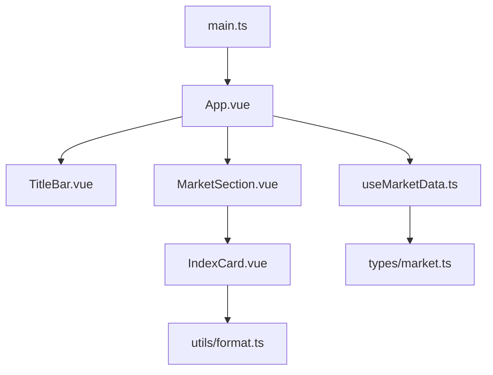
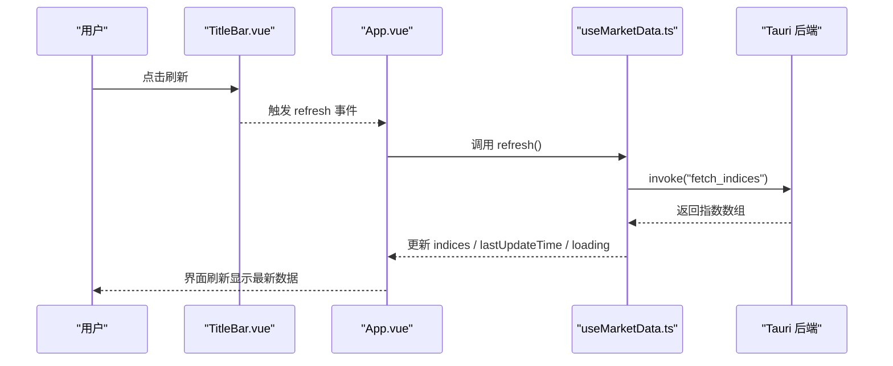
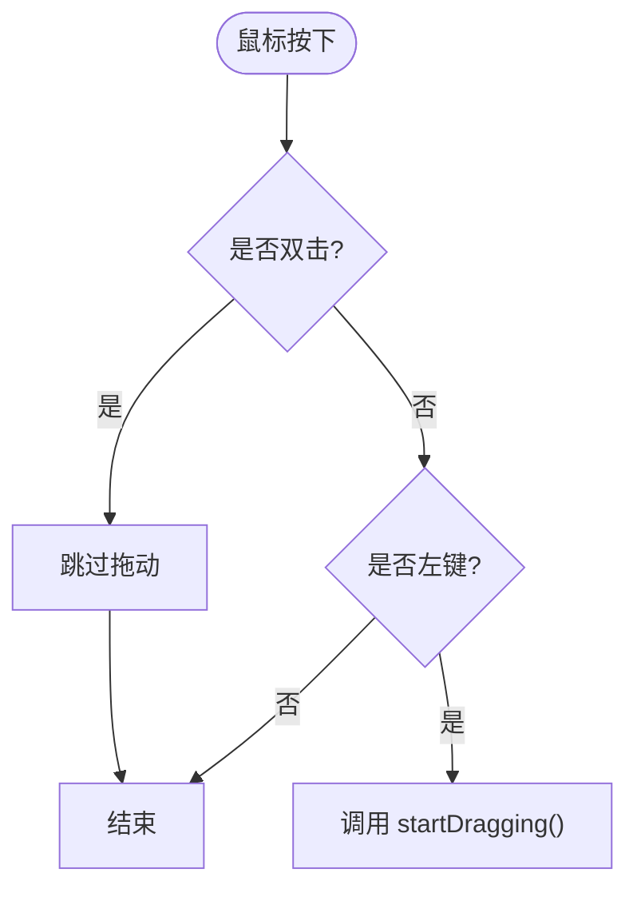
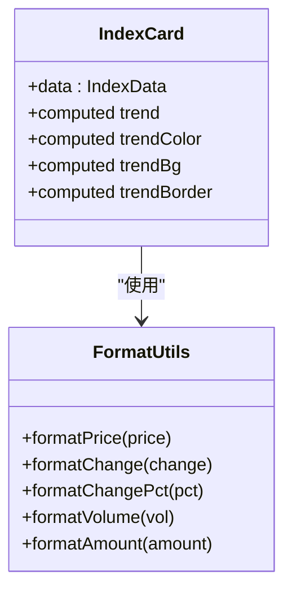
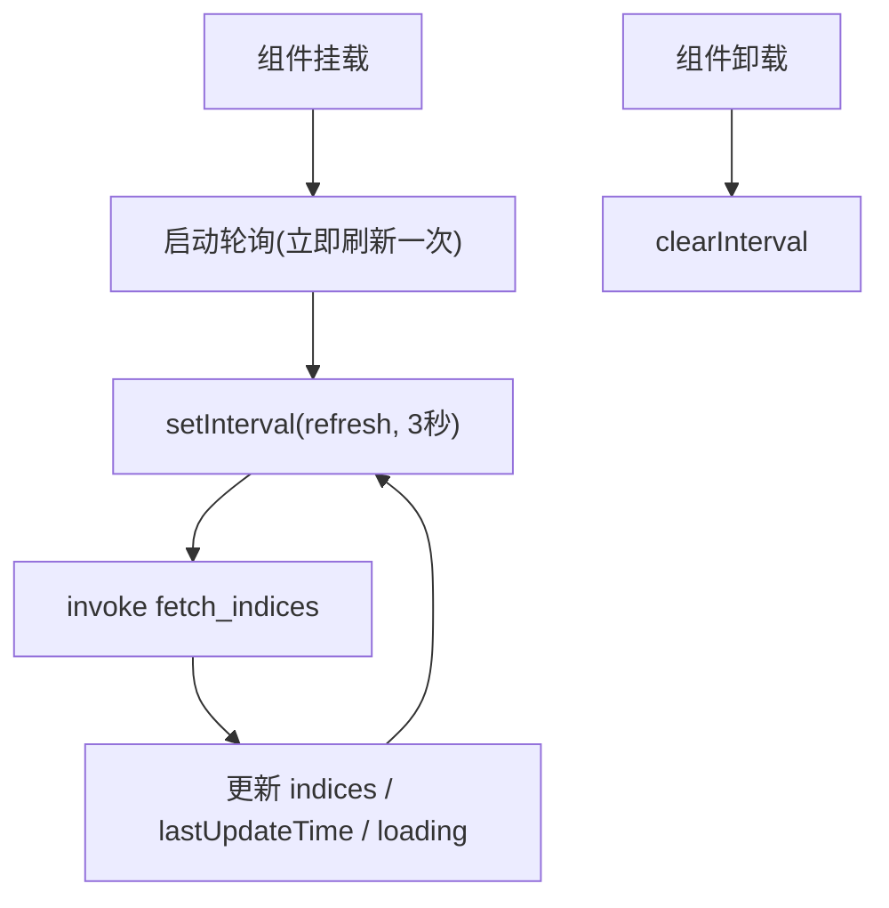
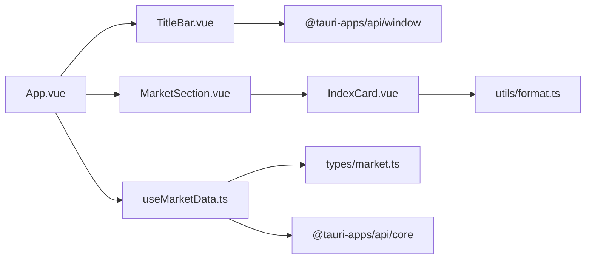

# 组件化架构设计

<cite>
**本文引用的文件**
- [src/App.vue](file://src/App.vue)
- [src/components/TitleBar.vue](file://src/components/TitleBar.vue)
- [src/components/MarketSection.vue](file://src/components/MarketSection.vue)
- [src/components/IndexCard.vue](file://src/components/IndexCard.vue)
- [src/composables/useMarketData.ts](file://src/composables/useMarketData.ts)
- [src/types/market.ts](file://src/types/market.ts)
- [src/utils/format.ts](file://src/utils/format.ts)
- [src/main.ts](file://src/main.ts)
- [package.json](file://package.json)
</cite>

## 目录
1. [简介](#简介)
2. [项目结构](#项目结构)
3. [核心组件](#核心组件)
4. [架构总览](#架构总览)
5. [详细组件分析](#详细组件分析)
6. [依赖关系分析](#依赖关系分析)
7. [性能考量](#性能考量)
8. [故障排查指南](#故障排查指南)
9. [结论](#结论)
10. [附录](#附录)

## 简介
本文件为 hq-kanban-app 的组件化架构设计文档，聚焦基于 Vue 3 的组件层次与职责划分。应用采用组合式 API（Composition API）与可复用逻辑（composables），通过 props 传递数据、事件冒泡触发刷新，并使用 Tauri 能力获取实时行情数据。根组件 App.vue 组织页面布局，TitleBar 负责窗口控制与刷新入口，MarketSection 按市场分区渲染指数卡片，IndexCard 展示单个指数的关键指标。文档同时说明响应式设计实现方式、扩展点以及组件间协作模式。

## 项目结构
- 前端入口：main.ts 创建 Vue 应用并挂载到 #app。
- 根组件：App.vue 组合 TitleBar 与 MarketSection，并通过 useMarketData 管理全局状态与轮询。
- 业务组件：
  - TitleBar.vue：窗口拖拽、最小化、关闭；显示最后更新时间与加载指示；提供刷新事件。
  - MarketSection.vue：接收一组指数数据并按网格布局渲染 IndexCard。
  - IndexCard.vue：展示单条指数数据的名称、价格、涨跌额、涨跌幅、成交量与成交额。
- 可复用逻辑：useMarketData.ts 封装数据获取、分组计算、轮询与生命周期管理。
- 类型定义：types/market.ts 定义 IndexData 与 MarketGroup。
- 工具函数：utils/format.ts 提供价格、涨跌、成交量等格式化方法。
- 构建与依赖：package.json 声明 Vue、Tauri 相关依赖与脚本。

图表来源
- [src/main.ts:1-6](file://src/main.ts#L1-L6)
- [src/App.vue:1-36](file://src/App.vue#L1-L36)
- [src/components/TitleBar.vue:1-63](file://src/components/TitleBar.vue#L1-L63)
- [src/components/MarketSection.vue:1-19](file://src/components/MarketSection.vue#L1-L19)
- [src/components/IndexCard.vue:1-71](file://src/components/IndexCard.vue#L1-L71)
- [src/composables/useMarketData.ts:1-66](file://src/composables/useMarketData.ts#L1-L66)
- [src/types/market.ts:1-22](file://src/types/market.ts#L1-L22)
- [src/utils/format.ts:1-33](file://src/utils/format.ts#L1-L33)

章节来源
- [src/main.ts:1-6](file://src/main.ts#L1-L6)
- [package.json:1-26](file://package.json#L1-L26)

## 核心组件
- App.vue
  - 职责：页面骨架、布局容器；组合 TitleBar 与 MarketSection；使用 useMarketData 提供数据与刷新能力；处理空状态提示。
  - 通信：向 TitleBar 传入 lastUpdateTime 与 loading，监听 refresh 事件；向 MarketSection 传入 group 列表。
- TitleBar.vue
  - 职责：窗口控制（拖拽、最小化、关闭）、显示最后更新时间、加载指示、刷新按钮。
  - 通信：通过 emit('refresh') 通知父组件触发数据刷新。
- MarketSection.vue
  - 职责：按市场分组渲染标题与指数卡片网格。
  - 通信：接收 group 数据，向下分发至 IndexCard。
- IndexCard.vue
  - 职责：展示单条指数数据的关键信息，根据涨跌趋势动态样式。
  - 通信：仅接收 data 属性，无事件向上冒泡。

章节来源
- [src/App.vue:1-36](file://src/App.vue#L1-L36)
- [src/components/TitleBar.vue:1-63](file://src/components/TitleBar.vue#L1-L63)
- [src/components/MarketSection.vue:1-19](file://src/components/MarketSection.vue#L1-L19)
- [src/components/IndexCard.vue:1-71](file://src/components/IndexCard.vue#L1-L71)

## 架构总览
应用采用“根组件 + 业务组件 + composables”的分层架构：
- 视图层：App.vue、TitleBar.vue、MarketSection.vue、IndexCard.vue。
- 状态与副作用：useMarketData.ts 集中管理数据获取、分组、轮询与生命周期。
- 类型与工具：types/market.ts、utils/format.ts 提供强类型与格式化能力。
- 平台集成：通过 @tauri-apps/api/window 进行窗口操作，通过 @tauri-apps/api/core 调用后端 fetch_indices。

图表来源
- [src/components/TitleBar.vue:1-63](file://src/components/TitleBar.vue#L1-L63)
- [src/App.vue:1-36](file://src/App.vue#L1-L36)
- [src/composables/useMarketData.ts:1-66](file://src/composables/useMarketData.ts#L1-L66)

## 详细组件分析

### 根组件 App.vue
- 组织方式：使用 flex 布局将 TitleBar 置于顶部，主内容区滚动显示 MarketSection 列表；当所有分组无数据且未加载中时显示空状态。
- 数据流：通过 useMarketData 暴露 marketGroups、loading、lastUpdateTime、refresh；将 lastUpdateTime 与 loading 传递给 TitleBar，并在刷新事件中调用 refresh。
- 响应式：使用 Tailwind 类实现全屏高度、滚动区域与间距控制。
- 扩展点：可在主内容区增加更多分区或控制面板；可通过扩展 useMarketData 支持多数据源或缓存策略。

章节来源
- [src/App.vue:1-36](file://src/App.vue#L1-L36)
- [src/composables/useMarketData.ts:1-66](file://src/composables/useMarketData.ts#L1-L66)

### TitleBar 窗口控制组件
- 功能：
  - 窗口拖拽：通过 Tauri window API 实现 startDragging，双击不触发拖动以保留最大化切换语义。
  - 窗口控制：最小化与关闭。
  - 刷新入口：emit('refresh') 触发父组件刷新。
  - 状态展示：显示最后更新时间与加载脉冲指示器。
- 通信：props 接收 lastUpdateTime 与 loading；事件 emit('refresh')。
- 响应式：使用 Tailwind 控制尺寸、颜色与交互反馈。

图表来源
- [src/components/TitleBar.vue:1-63](file://src/components/TitleBar.vue#L1-L63)

章节来源
- [src/components/TitleBar.vue:1-63](file://src/components/TitleBar.vue#L1-L63)

### MarketSection 市场分区组件
- 功能：渲染市场分组标题与分隔线，并以三列网格布局渲染该分组的指数卡片。
- 数据契约：接收 group: MarketGroup（包含 key、label、indices）。
- 响应式：使用 grid-cols-3 与 gap-3 实现自适应网格。
- 扩展点：可按需增加排序、筛选或分页；可引入虚拟滚动优化大数据量场景。

章节来源
- [src/components/MarketSection.vue:1-19](file://src/components/MarketSection.vue#L1-L19)
- [src/types/market.ts:1-22](file://src/types/market.ts#L1-L22)

### IndexCard 指数卡片组件
- 功能：展示指数名称、当前价格、涨跌额、涨跌幅、成交量与成交额；根据涨跌趋势动态设置颜色与边框。
- 计算属性：trend、trendColor、trendBg、trendBorder 由 change 决定。
- 格式化：使用 formatPrice、formatChange、formatChangePct、formatVolume、formatAmount。
- 响应式：使用 Tailwind 控制字号、间距与边框样式。
- 扩展点：可增加迷你走势图、点击跳转详情、收藏标记等。

图表来源
- [src/components/IndexCard.vue:1-71](file://src/components/IndexCard.vue#L1-L71)
- [src/utils/format.ts:1-33](file://src/utils/format.ts#L1-L33)

章节来源
- [src/components/IndexCard.vue:1-71](file://src/components/IndexCard.vue#L1-L71)
- [src/utils/format.ts:1-33](file://src/utils/format.ts#L1-L33)

### 数据与状态管理（useMarketData）
- 职责：
  - 维护 indices、loading、lastUpdateTime。
  - 计算 marketGroups：按 market 字段分组为 A 股、港股、美股。
  - 提供 refresh：调用 Tauri 后端 fetch_indices，更新数据与时间戳，错误日志记录。
  - 轮询：启动时自动开始定时刷新，卸载时清理定时器。
- 生命周期：onMounted 启动轮询，onUnmounted 停止轮询。
- 扩展点：可加入本地缓存、增量更新、错误重试与退避策略。

图表来源
- [src/composables/useMarketData.ts:1-66](file://src/composables/useMarketData.ts#L1-L66)

章节来源
- [src/composables/useMarketData.ts:1-66](file://src/composables/useMarketData.ts#L1-L66)

## 依赖关系分析
- 组件耦合：
  - App.vue 依赖 TitleBar.vue、MarketSection.vue 与 useMarketData.ts。
  - MarketSection.vue 依赖 IndexCard.vue 与 types/market.ts。
  - IndexCard.vue 依赖 utils/format.ts 与 types/market.ts。
  - TitleBar.vue 依赖 Tauri window API。
- 外部依赖：
  - Vue 3 与 Composition API。
  - Tauri 用于窗口控制与后端调用。
  - Tailwind CSS 用于样式。

图表来源
- [src/App.vue:1-36](file://src/App.vue#L1-L36)
- [src/components/TitleBar.vue:1-63](file://src/components/TitleBar.vue#L1-L63)
- [src/components/MarketSection.vue:1-19](file://src/components/MarketSection.vue#L1-L19)
- [src/components/IndexCard.vue:1-71](file://src/components/IndexCard.vue#L1-L71)
- [src/composables/useMarketData.ts:1-66](file://src/composables/useMarketData.ts#L1-L66)
- [src/utils/format.ts:1-33](file://src/utils/format.ts#L1-L33)
- [src/types/market.ts:1-22](file://src/types/market.ts#L1-L22)

章节来源
- [package.json:1-26](file://package.json#L1-L26)

## 性能考量
- 轮询频率：默认 3 秒刷新一次，可根据网络与后端负载调整 POLL_INTERVAL。
- 渲染优化：MarketSection 使用网格布局，IndexCard 为纯展示组件，适合进一步虚拟化或懒加载。
- 计算开销：IndexCard 的计算属性轻量，仅在数据变化时重算。
- 资源释放：useMarketData 在卸载时清理定时器，避免内存泄漏。
- 建议：
  - 对大数据集引入虚拟滚动或分页。
  - 对频繁更新的字段考虑局部更新或增量同步。
  - 对网络请求增加去抖与重试机制。

## 故障排查指南
- 刷新失败：
  - 检查 Tauri 后端是否暴露 fetch_indices。
  - 查看控制台错误日志，确认 invoke 调用是否成功。
- 数据不更新：
  - 确认轮询是否启动与停止逻辑正确。
  - 检查 market 字段是否正确，确保分组逻辑能产出有效数据。
- 窗口控制无效：
  - 确认运行环境为 Tauri 桌面端，浏览器中 window API 不可用。
- 样式异常：
  - 确认 Tailwind 已正确引入与编译。

章节来源
- [src/composables/useMarketData.ts:25-36](file://src/composables/useMarketData.ts#L25-L36)
- [src/components/TitleBar.vue:13-27](file://src/components/TitleBar.vue#L13-L27)

## 结论
hq-kanban-app 采用清晰的组件分层与职责划分：根组件负责编排与状态注入，业务组件专注展示与交互，composables 集中管理与后端交互。通过 props 与事件完成单向数据流，结合 Tauri 实现桌面端窗口控制与数据获取。该架构具备良好的可扩展性与可维护性，便于后续引入更多市场、指标与可视化能力。

## 附录
- 响应式设计实现要点：
  - 使用 Tailwind 的 flex/grid 布局与断点类实现自适应。
  - 主内容区使用 overflow-y-auto 保证长列表滚动。
  - 卡片网格 grid-cols-3 在不同屏幕下保持良好可读性。
- 组件通信总结：
  - 父传子：props（如 group、data、lastUpdateTime、loading）。
  - 子传父：事件冒泡（TitleBar 触发 refresh）。
  - 状态共享：useMarketData 作为单一数据源，被 App 消费并派发给子组件。
- 扩展点示例：
  - 新增市场分组：扩展 useMarketData 的分组逻辑与类型。
  - 新增卡片指标：在 IndexCard 中增加展示项与格式化函数。
  - 新增窗口行为：在 TitleBar 中扩展自定义按钮与 Tauri 调用。