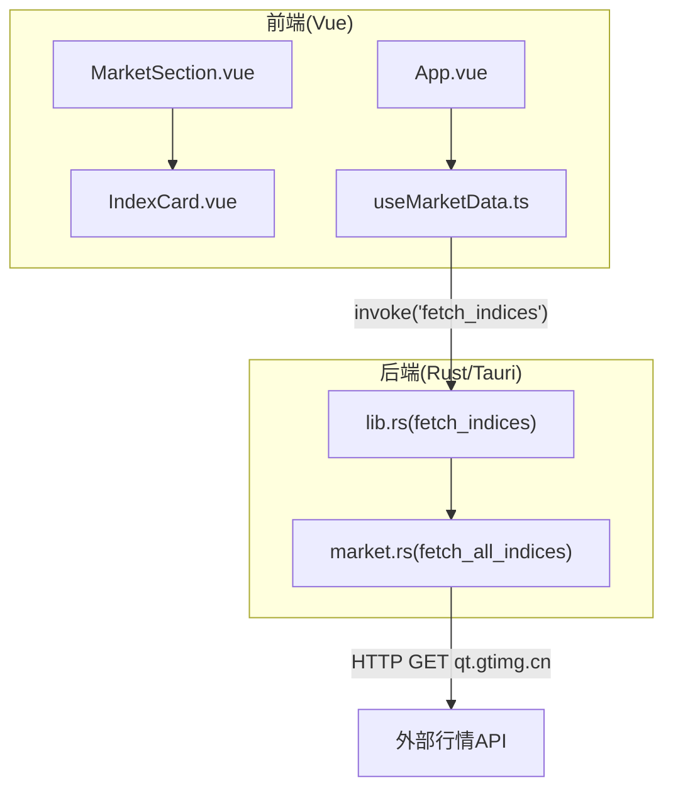
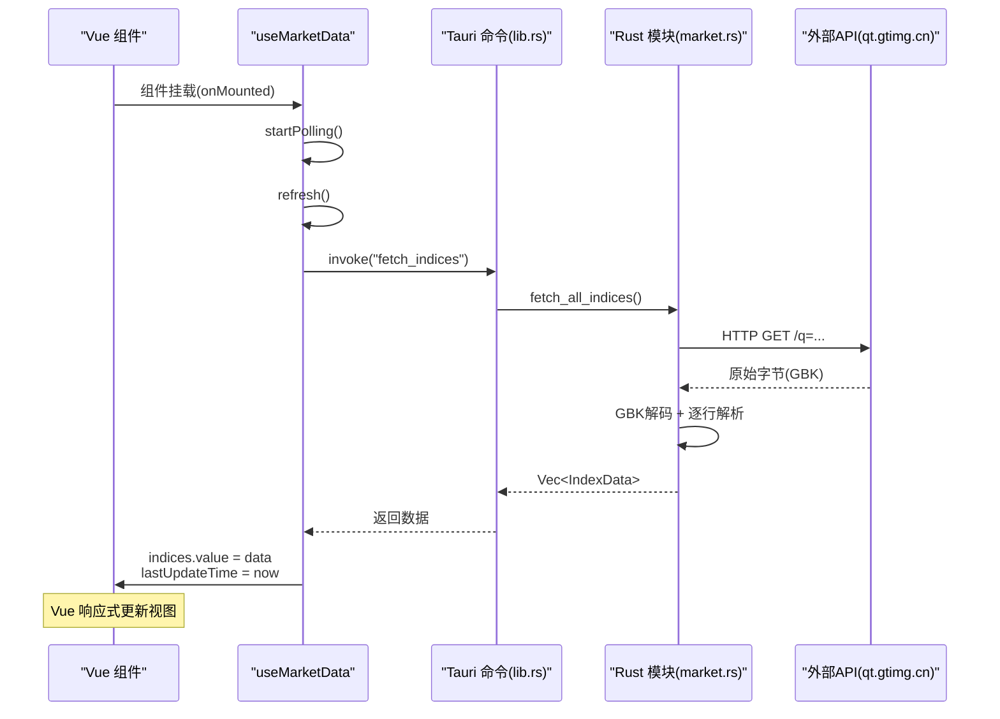
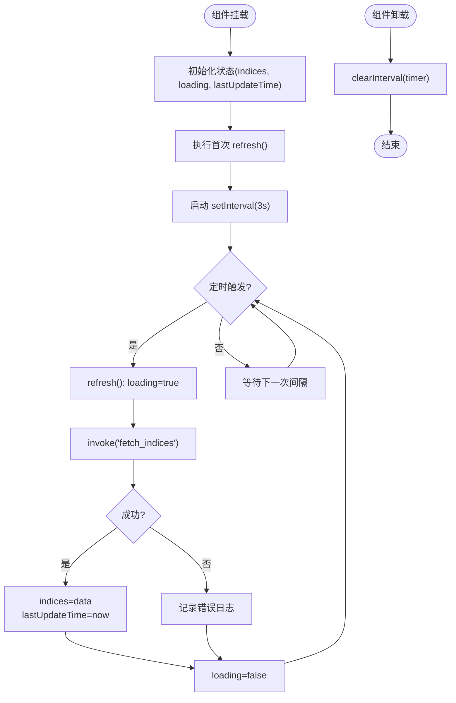
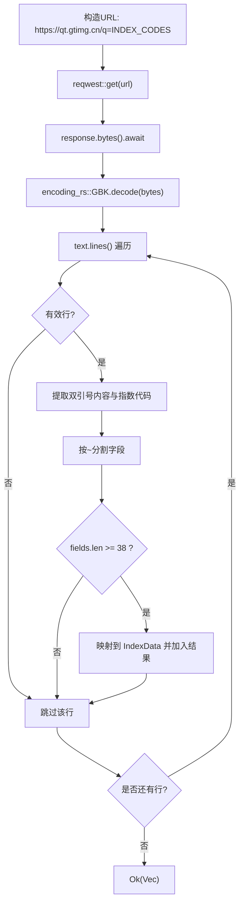
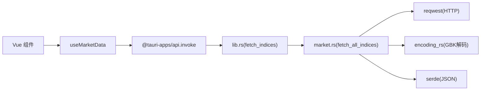

# 实时更新机制

<cite>
**本文引用的文件**
- [useMarketData.ts](file://src/composables/useMarketData.ts)
- [market.rs](file://src-tauri/src/market.rs)
- [lib.rs](file://src-tauri/src/lib.rs)
- [market.ts](file://src/types/market.ts)
- [IndexCard.vue](file://src/components/IndexCard.vue)
- [MarketSection.vue](file://src/components/MarketSection.vue)
- [App.vue](file://src/App.vue)
- [ARCHITECTURE.md](file://ARCHITECTURE.md)
</cite>

## 目录
1. [简介](#简介)
2. [项目结构](#项目结构)
3. [核心组件](#核心组件)
4. [架构总览](#架构总览)
5. [详细组件分析](#详细组件分析)
6. [依赖关系分析](#依赖关系分析)
7. [性能考量](#性能考量)
8. [故障排查指南](#故障排查指南)
9. [结论](#结论)
10. [附录](#附录)

## 简介
本技术文档聚焦于 hq-kanban-app 的“实时更新机制”，围绕以下目标展开：
- 自动刷新原理与 3 秒轮询间隔的配置与管理
- 定时器生命周期管理（启动、停止、内存泄漏防护）
- 前后端实时数据同步（Vue 响应式更新与 Rust 后端数据获取的协调）
- 性能优化策略（请求去重、缓存机制、资源管理）
- 错误处理与恢复机制（网络异常、API 限流、服务不可用时的降级策略）
- 监控与调试工具使用指南

## 项目结构
应用采用前端 Vue 3 + 后端 Rust/Tauri 的双层架构，通过 Tauri 的 invoke 进行 IPC 通信。前端负责 UI 渲染与轮询调度，后端负责 HTTP 请求、编码转换与数据解析。

图表来源
- [App.vue:1-36](file://src/App.vue#L1-L36)
- [MarketSection.vue:1-19](file://src/components/MarketSection.vue#L1-L19)
- [IndexCard.vue:1-71](file://src/components/IndexCard.vue#L1-L71)
- [useMarketData.ts:1-66](file://src/composables/useMarketData.ts#L1-L66)
- [lib.rs:1-21](file://src-tauri/src/lib.rs#L1-L21)
- [market.rs:1-100](file://src-tauri/src/market.rs#L1-L100)

章节来源
- [ARCHITECTURE.md:106-155](file://ARCHITECTURE.md#L106-L155)

## 核心组件
- 前端轮询与状态管理：useMarketData.ts
- 后端命令与数据获取：lib.rs、market.rs
- 类型定义：market.ts
- 视图组件：App.vue、MarketSection.vue、IndexCard.vue

章节来源
- [useMarketData.ts:1-66](file://src/composables/useMarketData.ts#L1-L66)
- [lib.rs:1-21](file://src-tauri/src/lib.rs#L1-L21)
- [market.rs:1-100](file://src-tauri/src/market.rs#L1-L100)
- [market.ts:1-22](file://src/types/market.ts#L1-L22)
- [App.vue:1-36](file://src/App.vue#L1-L36)
- [MarketSection.vue:1-19](file://src/components/MarketSection.vue#L1-L19)
- [IndexCard.vue:1-71](file://src/components/IndexCard.vue#L1-L71)

## 架构总览
整体数据流如下：
1. 前端在组件挂载时启动定时器，每 3 秒调用一次 refresh()
2. refresh() 通过 invoke('fetch_indices') 调用 Rust 命令
3. Rust 命令调用 market.rs 中的 fetch_all_indices() 发起 HTTP 请求
4. 后端对 GBK 编码响应进行解码并按行解析为 IndexData 列表
5. 数据经 Tauri IPC 返回前端，Vue 响应式系统自动更新视图

图表来源
- [useMarketData.ts:25-56](file://src/composables/useMarketData.ts#L25-L56)
- [lib.rs:8-11](file://src-tauri/src/lib.rs#L8-L11)
- [market.rs:41-99](file://src-tauri/src/market.rs#L41-L99)

## 详细组件分析

### 前端轮询与定时器生命周期（useMarketData.ts）
- 轮询间隔：常量 POLL_INTERVAL = 3000ms（3 秒）
- 启动：onMounted 时立即执行一次 refresh()，并启动 setInterval(refresh, 3000)
- 停止：onUnmounted 时 clearInterval(timer)，避免内存泄漏
- 刷新逻辑：设置 loading=true → 调用 invoke('fetch_indices') → 成功后更新 indices 与 lastUpdateTime → finally 中恢复 loading=false
- 错误处理：catch 中记录错误日志，不中断轮询

图表来源
- [useMarketData.ts:5-56](file://src/composables/useMarketData.ts#L5-L56)

章节来源
- [useMarketData.ts:5-56](file://src/composables/useMarketData.ts#L5-L56)

### 后端数据获取与解析（market.rs）
- 指数代码集合：INDEX_CODES 包含 A 股、港股、美股共 11 个主要指数
- 市场判定：根据代码前缀 sh/sz→a，r_hk→hk，r_us→us
- 请求流程：reqwest::get 发起 HTTPS 请求 → bytes() 获取原始字节 → encoding_rs::GBK.decode 解码为 UTF-8
- 解析流程：按行分割 → 提取双引号内内容 → 提取指数代码（去除 v_ 前缀）→ 按 ~ 分割字段数组 → 校验字段数量 ≥ 38 → 映射到 IndexData
- 安全转换：parse_f64 将空字符串或非法数字转为 0.0，避免崩溃

图表来源
- [market.rs:20-99](file://src-tauri/src/market.rs#L20-L99)

章节来源
- [market.rs:20-99](file://src-tauri/src/market.rs#L20-L99)

### Tauri 命令注册（lib.rs）
- 暴露命令：greet（示例）、fetch_indices（核心）
- fetch_indices 异步调用 market::fetch_all_indices()，并将错误转换为 String 返回前端

章节来源
- [lib.rs:1-21](file://src-tauri/src/lib.rs#L1-L21)

### 类型定义与视图渲染（market.ts、IndexCard.vue、MarketSection.vue、App.vue）
- 类型：IndexData 与 MarketGroup 定义了前后端数据结构契约
- 分组：useMarketData.computed 将 indices 按 market 字段分为 A 股、港股、美股三组
- 渲染：MarketSection 渲染分区标题与卡片网格；IndexCard 展示价格、涨跌额、涨跌幅、成交量/成交额，并根据涨跌动态着色
- 根组件：App 组合 TitleBar 与 MarketSection，并提供空状态提示

章节来源
- [market.ts:1-22](file://src/types/market.ts#L1-L22)
- [IndexCard.vue:1-71](file://src/components/IndexCard.vue#L1-L71)
- [MarketSection.vue:1-19](file://src/components/MarketSection.vue#L1-L19)
- [App.vue:1-36](file://src/App.vue#L1-L36)

## 依赖关系分析
- 前端依赖：Vue 3 响应式、@tauri-apps/api 用于 invoke
- 后端依赖：reqwest 用于 HTTP 请求、encoding_rs 用于 GBK 解码、serde 用于序列化
- 组件耦合：useMarketData 被 App.vue 引用；MarketSection 与 IndexCard 通过 props 传递数据
- 外部依赖：qt.gtimg.cn 行情 API（GBK 文本格式）

图表来源
- [useMarketData.ts:1-66](file://src/composables/useMarketData.ts#L1-L66)
- [lib.rs:1-21](file://src-tauri/src/lib.rs#L1-L21)
- [market.rs:1-100](file://src-tauri/src/market.rs#L1-L100)

章节来源
- [ARCHITECTURE.md:216-298](file://ARCHITECTURE.md#L216-L298)

## 性能考量
当前实现已具备基础的性能保障：
- 定时器清理：组件卸载时清除定时器，避免内存泄漏
- 轻量请求：单次批量请求多个指数，减少网络往返
- 本地解析：后端完成编码转换与解析，减轻前端负担

可进一步优化的方向（建议）：
- 请求去重：在轮询期间若已有未完成的请求，则跳过新请求，避免重复网络开销
- 缓存机制：对最近一次成功的数据进行短时缓存，在网络失败时回退显示缓存数据
- 超时与重试：为 reqwest 请求配置合理的超时时间；对瞬时错误实施有限次数的重试（如指数退避）
- 节流与自适应间隔：当检测到连续失败或服务器响应缓慢时，动态增大轮询间隔
- 资源管理：确保所有异步任务在组件卸载时取消（例如使用 AbortController），防止悬挂请求

[本节为通用性能建议，不直接分析具体文件]

## 故障排查指南
常见问题与定位方法：
- 网络异常：检查浏览器控制台与 Rust 日志，确认 invoke 是否抛出错误；在后端捕获并打印错误信息
- API 限流：观察响应码与频率，必要时降低轮询间隔或增加重试退避
- 服务不可用：启用缓存回退，显示最后可用数据；提供用户可见的错误提示
- 编码问题：确认后端是否正确进行 GBK 解码；若出现乱码，检查 encoding_rs 的使用与输入字节流
- 定时器泄漏：确认 onUnmounted 中是否清除了定时器；可通过浏览器开发者工具的 Performance 面板检测

章节来源
- [useMarketData.ts:25-56](file://src/composables/useMarketData.ts#L25-L56)
- [market.rs:41-99](file://src-tauri/src/market.rs#L41-L99)

## 结论
本应用的实时更新机制以“前端 3 秒轮询 + 后端批量请求”为核心，结合 Vue 响应式系统与 Rust 的高效解析，实现了稳定、低延迟的行情看板。当前实现已覆盖基本的生命周期管理与错误处理，建议在后续迭代中加入请求去重、缓存、超时重试与自适应间隔等增强能力，以提升鲁棒性与用户体验。

[本节为总结性内容，不直接分析具体文件]

## 附录
- 数据源接口说明与字段映射详见架构文档
- 构建与部署步骤请参考项目文档

章节来源
- [ARCHITECTURE.md:157-214](file://ARCHITECTURE.md#L157-L214)
- [ARCHITECTURE.md:333-373](file://ARCHITECTURE.md#L333-L373)