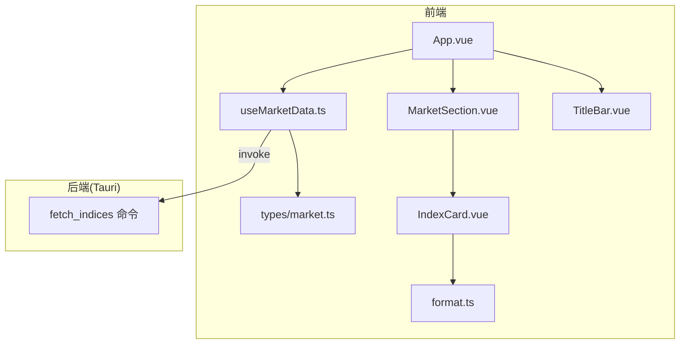
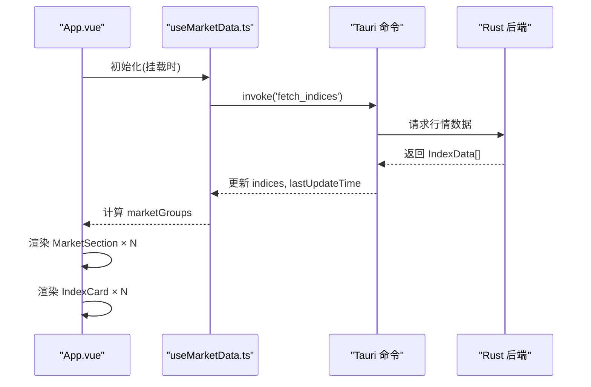
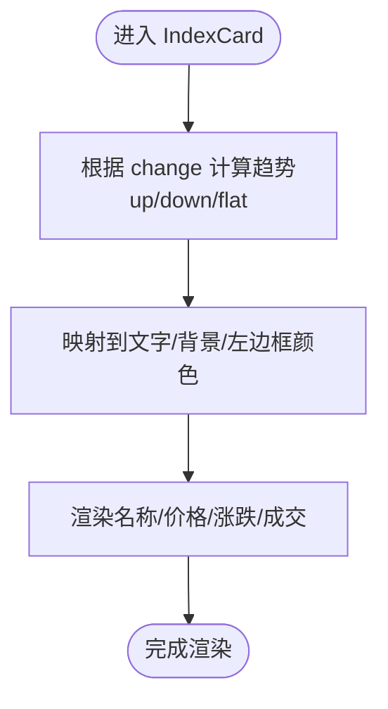
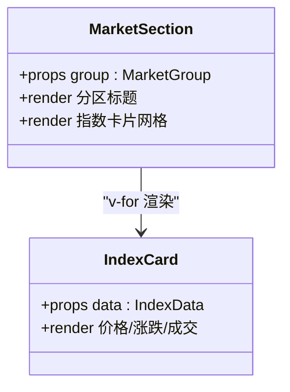
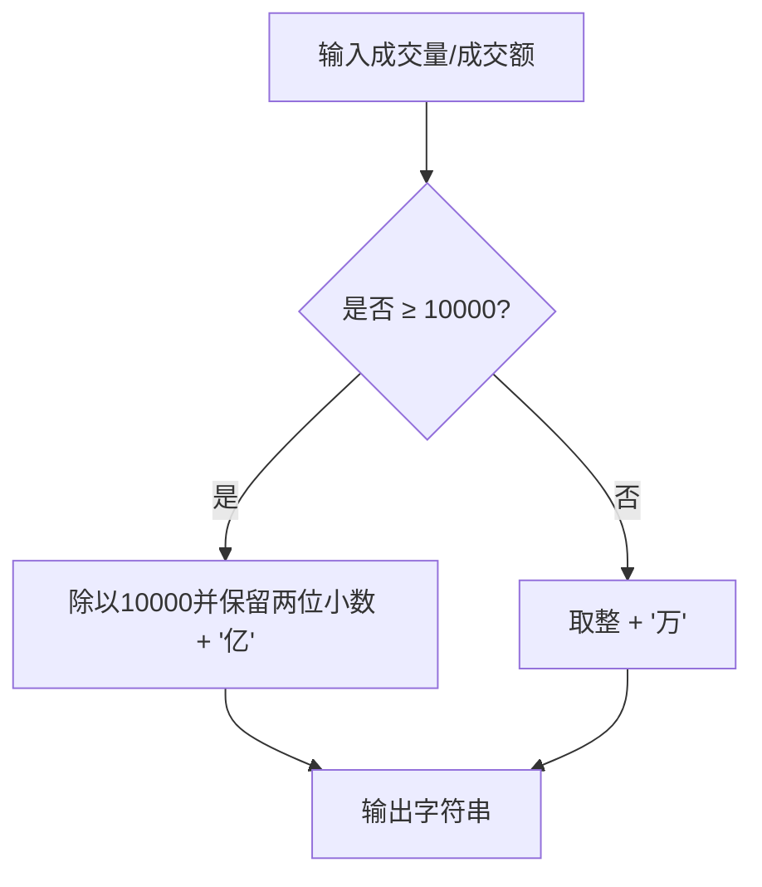
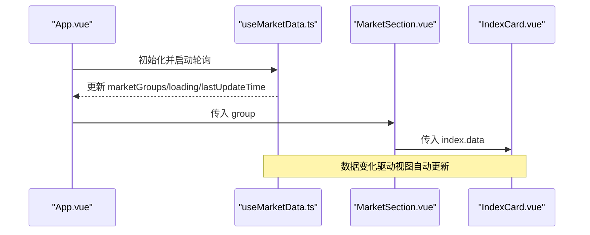
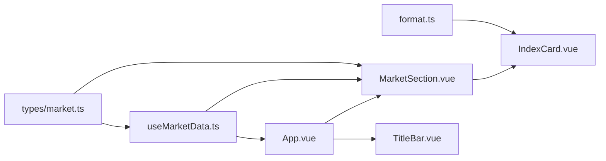

# 指数展示

<cite>
**本文引用的文件**
- [src/components/IndexCard.vue](file://src/components/IndexCard.vue)
- [src/components/MarketSection.vue](file://src/components/MarketSection.vue)
- [src/composables/useMarketData.ts](file://src/composables/useMarketData.ts)
- [src/types/market.ts](file://src/types/market.ts)
- [src/utils/format.ts](file://src/utils/format.ts)
- [src/App.vue](file://src/App.vue)
- [src/components/TitleBar.vue](file://src/components/TitleBar.vue)
- [src/styles.css](file://src/styles.css)
- [ARCHITECTURE.md](file://ARCHITECTURE.md)
</cite>

## 目录
1. [简介](#简介)
2. [项目结构](#项目结构)
3. [核心组件与职责](#核心组件与职责)
4. [架构总览](#架构总览)
5. [详细组件分析](#详细组件分析)
6. [依赖关系分析](#依赖关系分析)
7. [性能考量](#性能考量)
8. [故障排查指南](#故障排查指南)
9. [结论](#结论)
10. [附录：样式与主题定制](#附录样式与主题定制)

## 简介
本技术文档聚焦 hq-kanban-app 的“指数展示”能力，围绕卡片式界面、市场分区展示、响应式布局、数据格式化、组件通信与状态同步、以及自定义样式与主题配置进行系统化说明。目标是帮助开发者快速理解并扩展该功能模块。

## 项目结构
前端采用 Vue 3 + TypeScript + Tailwind CSS，通过 Tauri 调用 Rust 后端获取行情数据。关键目录与职责如下：
- components：UI 组件（指数卡片、市场分区、标题栏）
- composables：组合式函数（数据轮询与分组）
- types：类型定义（指数数据与市场分组）
- utils：工具函数（价格、涨跌、成交量、成交额格式化）
- App.vue：根布局与页面编排
- styles.css：全局样式入口（引入 Tailwind）

图表来源
- [src/App.vue:1-36](file://src/App.vue#L1-L36)
- [src/components/MarketSection.vue:1-19](file://src/components/MarketSection.vue#L1-L19)
- [src/components/IndexCard.vue:1-71](file://src/components/IndexCard.vue#L1-L71)
- [src/composables/useMarketData.ts:1-66](file://src/composables/useMarketData.ts#L1-L66)
- [src/utils/format.ts:1-33](file://src/utils/format.ts#L1-L33)
- [src/types/market.ts:1-22](file://src/types/market.ts#L1-L22)

章节来源
- [ARCHITECTURE.md:58-102](file://ARCHITECTURE.md#L58-L102)

## 核心组件与职责
- IndexCard.vue：单张指数卡片的视觉呈现，包含名称、当前价、涨跌额/涨跌幅、成交量/成交额，并根据涨跌动态着色。
- MarketSection.vue：按市场分区（A股、港股、美股）渲染指数卡片网格，提供分区标题与分隔线。
- useMarketData.ts：负责从后端拉取指数数据、定时轮询、按市场分组、暴露 loading 与更新时间等状态。
- format.ts：统一的价格、涨跌、涨跌幅、成交量、成交额格式化逻辑。
- TitleBar.vue：应用标题栏，显示最后更新时间、加载指示器、刷新按钮及窗口控制。
- App.vue：页面骨架，编排标题栏与各个市场分区，处理空状态。

章节来源
- [src/components/IndexCard.vue:1-71](file://src/components/IndexCard.vue#L1-L71)
- [src/components/MarketSection.vue:1-19](file://src/components/MarketSection.vue#L1-L19)
- [src/composables/useMarketData.ts:1-66](file://src/composables/useMarketData.ts#L1-L66)
- [src/utils/format.ts:1-33](file://src/utils/format.ts#L1-L33)
- [src/components/TitleBar.vue:1-63](file://src/components/TitleBar.vue#L1-L63)
- [src/App.vue:1-36](file://src/App.vue#L1-L36)

## 架构总览
前端通过 composable 定时调用 Tauri 命令 fetch_indices 获取指数数据，随后在本地按 market 字段分组为 A 股、港股、美股，再由 MarketSection 渲染为三列网格，每个格子为 IndexCard。

图表来源
- [src/composables/useMarketData.ts:25-36](file://src/composables/useMarketData.ts#L25-L36)
- [src/App.vue:1-36](file://src/App.vue#L1-L36)
- [ARCHITECTURE.md:139-154](file://ARCHITECTURE.md#L139-L154)

## 详细组件分析

### IndexCard 组件（卡片式界面）
- 视觉呈现
  - 左侧彩色边框标识涨跌方向（上涨红、下跌绿、平盘灰），配合极淡背景色增强可读性。
  - 价格使用大号加粗字体突出显示；涨跌额与涨跌幅并列展示，颜色与趋势一致。
  - 底部两端对齐展示成交量与成交额，单位自动换算（万/亿）。
- 布局结构
  - 纵向堆叠：名称 → 价格 → 涨跌信息 → 成交信息。
  - 使用 Tailwind 原子类实现圆角、边框、间距与过渡动画。
- 样式定制
  - 颜色策略基于 computed 推导 trend/trendColor/trendBg/trendBorder，便于统一调整主题色或替换为其他配色方案。
  - 可通过覆盖 Tailwind 类名或注入自定义样式实现品牌化。

图表来源
- [src/components/IndexCard.vue:10-38](file://src/components/IndexCard.vue#L10-L38)
- [src/components/IndexCard.vue:41-70](file://src/components/IndexCard.vue#L41-L70)

章节来源
- [src/components/IndexCard.vue:1-71](file://src/components/IndexCard.vue#L1-L71)
- [src/utils/format.ts:1-33](file://src/utils/format.ts#L1-L33)

### MarketSection 组件（市场分区展示）
- 分类机制
  - 接收 MarketGroup 对象，渲染分区标题（如“A 股”、“港 股”、“美 股”）与分隔线。
  - 内部以三列网格展示该分区下的所有指数卡片。
- 数据来源
  - 由 useMarketData 的 computed 属性 marketGroups 按 market 字段过滤生成。
- 响应式适配
  - 使用 grid-cols-3 固定三列；如需在不同屏幕下自适应列数，可在外层容器增加断点类（例如 md:grid-cols-4 / lg:grid-cols-5）。

图表来源
- [src/components/MarketSection.vue:1-19](file://src/components/MarketSection.vue#L1-L19)
- [src/components/IndexCard.vue:1-71](file://src/components/IndexCard.vue#L1-L71)
- [src/types/market.ts:17-22](file://src/types/market.ts#L17-L22)

章节来源
- [src/components/MarketSection.vue:1-19](file://src/components/MarketSection.vue#L1-L19)
- [src/composables/useMarketData.ts:13-23](file://src/composables/useMarketData.ts#L13-L23)

### 数据格式化逻辑
- 价格显示：保留两位小数。
- 涨跌额：带正负号，保留两位小数。
- 涨跌幅：带正负号与百分号，保留两位小数。
- 成交量：超过一万转换为“亿”，否则显示“万”。
- 成交额：超过一万转换为“亿”，否则显示“万”。

图表来源
- [src/utils/format.ts:18-32](file://src/utils/format.ts#L18-L32)

章节来源
- [src/utils/format.ts:1-33](file://src/utils/format.ts#L1-L33)

### 组件间通信与状态同步
- 数据流
  - useMarketData 通过 setInterval 每 3 秒调用 Tauri 命令 fetch_indices，更新 indices 与 lastUpdateTime。
  - marketGroups 为 computed，依据 market 字段将数据分为 A 股、港股、美股。
- 组件通信
  - App.vue 将 marketGroups、loading、lastUpdateTime 传递给子组件；TitleBar 通过事件触发 refresh。
  - MarketSection 接收 MarketGroup，再向 IndexCard 传递 IndexData。
- 生命周期管理
  - 组件挂载时启动轮询，卸载时清理定时器，避免内存泄漏。

图表来源
- [src/App.vue:1-36](file://src/App.vue#L1-L36)
- [src/composables/useMarketData.ts:1-66](file://src/composables/useMarketData.ts#L1-L66)
- [src/components/MarketSection.vue:1-19](file://src/components/MarketSection.vue#L1-L19)
- [src/components/IndexCard.vue:1-71](file://src/components/IndexCard.vue#L1-L71)

章节来源
- [src/composables/useMarketData.ts:38-56](file://src/composables/useMarketData.ts#L38-L56)
- [src/App.vue:1-36](file://src/App.vue#L1-L36)

## 依赖关系分析
- 组件耦合
  - IndexCard 仅依赖类型与格式化工具，低耦合、高内聚。
  - MarketSection 依赖 IndexCard 与 MarketGroup 类型，职责单一。
  - useMarketData 依赖 Tauri IPC 与类型定义，封装数据获取与分组。
- 外部依赖
  - Tauri invoke 用于跨进程调用 Rust 命令。
  - Tailwind CSS 提供原子化样式能力。

图表来源
- [src/utils/format.ts:1-33](file://src/utils/format.ts#L1-L33)
- [src/types/market.ts:1-22](file://src/types/market.ts#L1-L22)
- [src/composables/useMarketData.ts:1-66](file://src/composables/useMarketData.ts#L1-L66)
- [src/components/MarketSection.vue:1-19](file://src/components/MarketSection.vue#L1-L19)
- [src/components/IndexCard.vue:1-71](file://src/components/IndexCard.vue#L1-L71)
- [src/App.vue:1-36](file://src/App.vue#L1-L36)
- [src/components/TitleBar.vue:1-63](file://src/components/TitleBar.vue#L1-L63)

章节来源
- [ARCHITECTURE.md:271-298](file://ARCHITECTURE.md#L271-L298)

## 性能考量
- 轮询频率：默认 3 秒一次，平衡实时性与服务器压力。可根据业务需求调整 POLL_INTERVAL。
- 渲染优化：使用 computed 对数据进行分组，减少重复计算；卡片组件无额外副作用，利于虚拟列表扩展。
- 资源释放：组件卸载时清除定时器，避免后台轮询造成资源浪费。
- 网络层：后端统一处理 GBK 解码与解析，避免前端多次转换开销。

[本节为通用性能建议，不直接分析具体代码行]

## 故障排查指南
- 数据为空
  - 检查后端 fetch_indices 是否正常返回数据。
  - 确认网络连通性与 CORS（若未来改为前端直连）。
- 轮询异常
  - 查看控制台错误日志，确认 invoke 调用是否成功。
  - 检查 onUnmounted 是否正确清理定时器。
- 显示异常
  - 确认 format.ts 中数值格式化是否符合预期（如 NaN、undefined 情况）。
  - 检查 Tailwind 类名是否被覆盖或冲突。

章节来源
- [src/composables/useMarketData.ts:25-36](file://src/composables/useMarketData.ts#L25-L36)
- [src/components/TitleBar.vue:1-63](file://src/components/TitleBar.vue#L1-L63)
- [src/utils/format.ts:1-33](file://src/utils/format.ts#L1-L33)

## 结论
本模块通过清晰的组件分层与数据流设计，实现了指数数据的实时展示与按市场分区渲染。IndexCard 提供一致的视觉语言与可定制的主题策略；MarketSection 以网格布局承载多指数卡片；useMarketData 封装了数据获取与分组逻辑，保证状态同步与生命周期安全。整体架构简洁、可扩展性强，适合持续迭代与主题化定制。

[本节为总结性内容，不直接分析具体代码行]

## 附录：样式与主题定制
- 主题风格
  - 暗色主题：全局深灰背景与白色文字，标题栏与卡片边框采用中性灰。
  - 涨跌配色：上涨红、下跌绿、平盘灰，通过左侧边框与背景透明度强化视觉层次。
- 响应式策略
  - 当前 MarketSection 使用固定三列网格。可根据屏幕尺寸增加断点类以实现自适应列数（例如 md:grid-cols-4 / lg:grid-cols-5）。
  - 卡片内部采用纵向堆叠，在小屏设备上仍保持良好可读性。
- 自定义指南
  - 修改 IndexCard 的趋势颜色映射（trendColor/trendBg/trendBorder）即可切换主题色系。
  - 通过 Tailwind 类名覆盖或新增样式文件，调整圆角、阴影、字号与间距。
  - 如需更复杂的主题系统，可将颜色变量抽离至 CSS 变量或主题配置文件，并在组件中引用。

章节来源
- [src/styles.css:1-2](file://src/styles.css#L1-L2)
- [src/components/IndexCard.vue:10-38](file://src/components/IndexCard.vue#L10-L38)
- [src/components/MarketSection.vue:8-17](file://src/components/MarketSection.vue#L8-L17)
- [ARCHITECTURE.md:300-331](file://ARCHITECTURE.md#L300-L331)