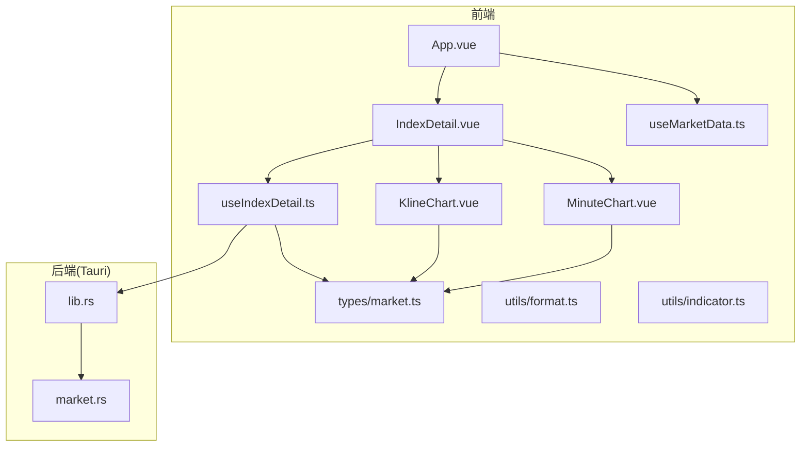
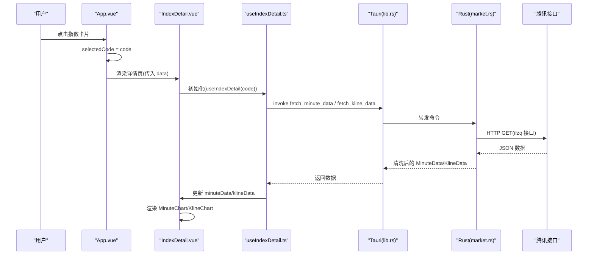
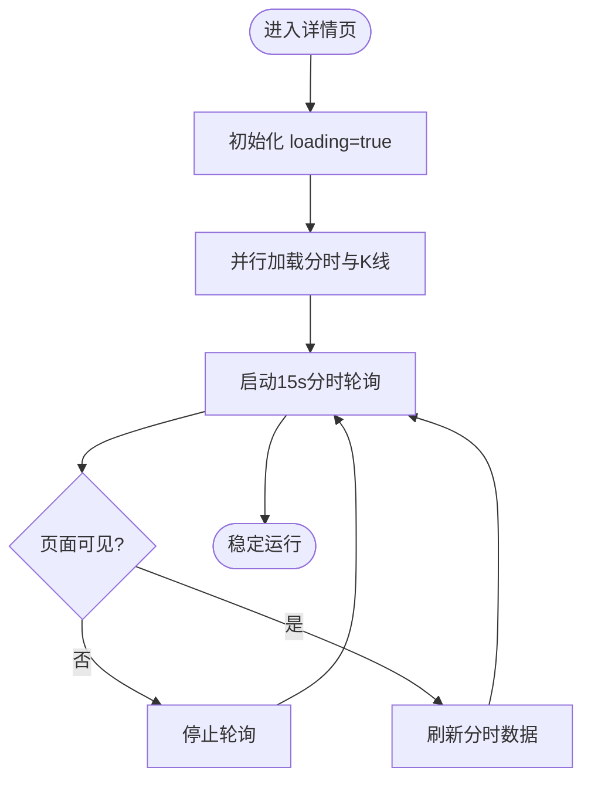
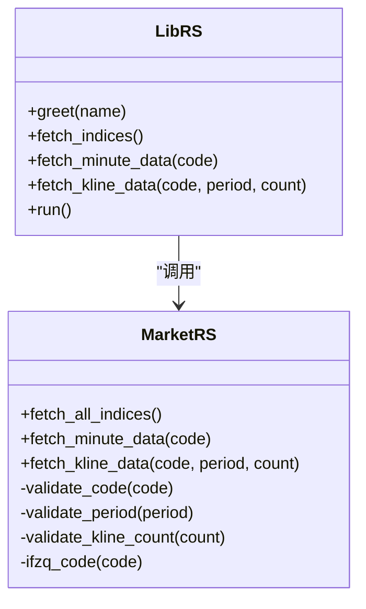
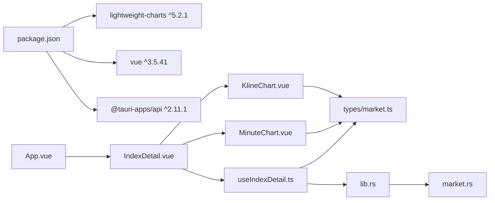

# 指数详情页

<cite>
**本文引用的文件**
- [App.vue](file://src/App.vue)
- [IndexDetail.vue](file://src/components/IndexDetail.vue)
- [useIndexDetail.ts](file://src/composables/useIndexDetail.ts)
- [market.ts](file://src/types/market.ts)
- [MinuteChart.vue](file://src/components/charts/MinuteChart.vue)
- [KlineChart.vue](file://src/components/charts/KlineChart.vue)
- [format.ts](file://src/utils/format.ts)
- [indicator.ts](file://src/utils/indicator.ts)
- [useMarketData.ts](file://src/composables/useMarketData.ts)
- [MarketSection.vue](file://src/components/MarketSection.vue)
- [lib.rs](file://src-tauri/src/lib.rs)
- [market.rs](file://src-tauri/src/market.rs)
- [package.json](file://package.json)
- [README.md](file://README.md)
</cite>

## 目录
1. [简介](#简介)
2. [项目结构](#项目结构)
3. [核心组件](#核心组件)
4. [架构总览](#架构总览)
5. [详细组件分析](#详细组件分析)
6. [依赖关系分析](#依赖关系分析)
7. [性能考量](#性能考量)
8. [故障排查指南](#故障排查指南)
9. [结论](#结论)

## 简介
本项目为基于 Tauri v2 的跨平台行情看板，新增「指数详情页」能力：点击看板中的指数卡片进入详情页，展示实时报价头部与分时线、日K/周K/月K图表。方案采用无路由状态切换、lightweight-charts v5 图表、Rust 后端新增两个数据命令（分时与K线），对现有看板轮询逻辑零改动，前端唯一新增 lightweight-charts 依赖。

## 项目结构
- 前端（Vue 3 + TypeScript + Vite + Tailwind）：视图与交互集中在 App.vue、IndexDetail.vue 及图表组件；数据获取与轮询在 composable 中封装；类型定义集中于 market.ts。
- 后端（Rust + Tauri）：在 lib.rs 注册 IPC 命令，market.rs 实现指数抓取与解析，并新增分时与K线数据拉取与清洗。
- 构建与运行：通过 package.json scripts 与 README 提供的命令进行开发与发布。

**图示来源**
- [App.vue:1-68](file://src/App.vue#L1-L68)
- [IndexDetail.vue:1-140](file://src/components/IndexDetail.vue#L1-L140)
- [useIndexDetail.ts:1-144](file://src/composables/useIndexDetail.ts#L1-L144)
- [MinuteChart.vue:1-295](file://src/components/charts/MinuteChart.vue#L1-L295)
- [KlineChart.vue:1-211](file://src/components/charts/KlineChart.vue#L1-L211)
- [market.ts:1-55](file://src/types/market.ts#L1-L55)
- [lib.rs:1-63](file://src-tauri/src/lib.rs#L1-L63)
- [market.rs:1-384](file://src-tauri/src/market.rs#L1-L384)

**章节来源**
- [README.md:1-93](file://README.md#L1-L93)
- [package.json:1-28](file://package.json#L1-L28)

## 核心组件
- 视图切换与入口：App.vue 使用 selectedCode 控制看板/详情视图切换，详情异步加载以拆分 chunk，避免首屏体积增加。
- 详情页容器：IndexDetail.vue 负责头部报价展示、Tab 切换（分时/日K/周K/月K）、错误与重试处理。
- 数据与轮询：useIndexDetail.ts 管理分时 15s 轮询、K线缓存与 TTL、周期切换与乱序防护。
- 图表渲染：MinuteChart.vue 与 KlineChart.vue 基于 lightweight-charts v5 实现分时面积图+百分比轴+成交量副图，以及K线图+MA均线+成交量副图。
- 类型契约：market.ts 统一定义 IndexData、MinuteData、KlineData 等前后端共享结构。
- 工具函数：format.ts 提供价格/涨跌/涨跌幅格式化；indicator.ts 提供 MA 计算。
- 看板数据：useMarketData.ts 维持看板 3s/15s 轮询，详情页复用其 indices 响应式数据，保证价格实时联动且零回归风险。

**章节来源**
- [App.vue:1-68](file://src/App.vue#L1-L68)
- [IndexDetail.vue:1-140](file://src/components/IndexDetail.vue#L1-L140)
- [useIndexDetail.ts:1-144](file://src/composables/useIndexDetail.ts#L1-L144)
- [MinuteChart.vue:1-295](file://src/components/charts/MinuteChart.vue#L1-L295)
- [KlineChart.vue:1-211](file://src/components/charts/KlineChart.vue#L1-L211)
- [market.ts:1-55](file://src/types/market.ts#L1-L55)
- [format.ts:1-33](file://src/utils/format.ts#L1-L33)
- [indicator.ts:1-13](file://src/utils/indicator.ts#L1-L13)
- [useMarketData.ts:1-87](file://src/composables/useMarketData.ts#L1-L87)

## 架构总览
前端通过 Vue 组合式 API 组织状态与副作用，详情页通过 composable 调用 Tauri IPC 命令请求后端数据，后端在 Rust 侧完成网络请求、协议解析与数据清洗，返回干净类型供前端消费。图表库 lightweight-charts 负责高性能 Canvas 渲染，分时与K线分别独立维护实例与生命周期。

**图示来源**
- [App.vue:1-68](file://src/App.vue#L1-L68)
- [IndexDetail.vue:1-140](file://src/components/IndexDetail.vue#L1-L140)
- [useIndexDetail.ts:1-144](file://src/composables/useIndexDetail.ts#L1-L144)
- [lib.rs:1-63](file://src-tauri/src/lib.rs#L1-L63)
- [market.rs:102-384](file://src-tauri/src/market.rs#L102-L384)

## 详细组件分析

### 视图与路由替代：App.vue
- 使用 selectedCode 作为视图状态：null 显示看板，非空显示对应指数详情。
- 详情页通过 defineAsyncComponent 异步加载，将 lightweight-charts 拆入独立 chunk，首屏零增量。
- 看板轮询不暂停，详情页头部直接复用 indices 响应式数据，确保价格实时联动。

**章节来源**
- [App.vue:1-68](file://src/App.vue#L1-L68)

### 详情页容器：IndexDetail.vue
- 顶部展示指数名称、代码与实时报价（来自 props.data），颜色根据涨跌动态变化。
- Tab 栏支持分时、日K、周K、月K 切换；分时默认激活，K线 tab 切换时触发 setPeriod。
- 错误与重试：分时错误与K线错误解耦，K线失败提供“点击重试”按钮绕过同周期 early-return。
- ESC 键返回看板，提升桌面端体验。

**章节来源**
- [IndexDetail.vue:1-140](file://src/components/IndexDetail.vue#L1-L140)
- [format.ts:1-33](file://src/utils/format.ts#L1-L33)

### 数据与轮询：useIndexDetail.ts
- 分时数据：每 15s 轮询一次，使用 inflight 守卫防止慢网络下请求堆积；乱序防护确保只写入当前 code 的数据。
- K线数据：模块级 Map 缓存 key=code:period，TTL 60s 内命中则复用；请求前清除旧错误，异步返回时校验 activePeriod 与 code 防错配。
- 周期切换：setPeriod 仅在不同周期时触发 loadKline；retryKline 用于失败重载场景。
- 可见性优化：页面隐藏时停止分时轮询，恢复时立即刷新并重启轮询。
- code 变化：watch 重置状态并重新加载，保障切换指数时的正确性。

**图示来源**
- [useIndexDetail.ts:1-144](file://src/composables/useIndexDetail.ts#L1-L144)

**章节来源**
- [useIndexDetail.ts:1-144](file://src/composables/useIndexDetail.ts#L1-L144)

### 分时图表：MinuteChart.vue
- 双轴设计：左轴价格主图（AreaSeries），右轴百分比（LineSeries 透明绘制），两轴对称缩放，昨收价恒居中，对齐主流分时版式。
- 合成时间轴：固定基准时间戳，按分钟间隔生成时间，消除午休与停牌造成的空洞；tickMarkFormatter 映射回真实 HH:MM。
- 成交量副图：HistogramSeries 挂 overlay scale，红涨绿跌基于相邻分钟价格比较。
- 自适应视野：每次更新重设为全天范围，两端留白避免标签裁切。
- 生命周期：ResizeObserver 监听容器尺寸变化，onUnmounted 清理 chart 实例与系列。

**章节来源**
- [MinuteChart.vue:1-295](file://src/components/charts/MinuteChart.vue#L1-L295)

### K线图表：KlineChart.vue
- 蜡烛主图：CandlestickSeries 独占上部区域，MA5/10/20 通过 LineSeries 叠加在同一价格轴。
- 成交量副图：独立 pane 物理隔离，隐藏自身价格刻度，仅保留主图价格轴。
- 数据准备：防御性排序确保时间升序；MA 不足项用 null 占位保持时间轴对齐。
- 图例：显示最新一根的 MA 值，便于快速识别均线位置。
- 视野策略：首次或柱数变化时自适应范围，其余更新保留用户缩放/平移状态。

**章节来源**
- [KlineChart.vue:1-211](file://src/components/charts/KlineChart.vue#L1-L211)
- [indicator.ts:1-13](file://src/utils/indicator.ts#L1-L13)

### 类型契约：market.ts
- 统一定义 IndexData、MarketGroup、MinutePoint、MinuteData、KlineBar、KlineData、KlinePeriod。
- 字段命名 snake_case 与 Rust serde 默认序列化一致，减少转换成本。

**章节来源**
- [market.ts:1-55](file://src/types/market.ts#L1-L55)

### 后端命令与数据源：lib.rs 与 market.rs
- 命令注册：lib.rs 暴露 fetch_indices、fetch_minute_data、fetch_kline_data 三个 IPC 命令。
- 输入校验：validate_code/validate_period/validate_kline_count 阻断 URL 注入与非法参数。
- 分时数据：fetch_minute_data 调用 ifzq 分钟接口，解析累计量→分钟增量、均价线、日期与昨收盘兜底。
- K线数据：fetch_kline_data 调用 fqkline/get 接口，兼容 qfq{period}/{period} 键名，过滤空日期行，构造 KlineBar 数组。
- 连接池：进程级 reqwest Client 单例复用 TCP/TLS，降低握手开销。

**图示来源**
- [lib.rs:1-63](file://src-tauri/src/lib.rs#L1-L63)
- [market.rs:1-384](file://src-tauri/src/market.rs#L1-L384)

**章节来源**
- [lib.rs:1-63](file://src-tauri/src/lib.rs#L1-L63)
- [market.rs:102-384](file://src-tauri/src/market.rs#L102-L384)

## 依赖关系分析
- 前端依赖：Vue 3、lightweight-charts v5、Tailwind CSS 4、@tauri-apps/api。
- 后端依赖：reqwest（HTTP 客户端）、serde_json（JSON 解析）、encoding_rs（GBK 解码，仅看板接口）。
- 模块耦合：IndexDetail.vue 依赖 useIndexDetail.ts 与图表组件；useIndexDetail.ts 依赖 Tauri IPC 与类型定义；图表组件依赖 lightweight-charts 与指标工具。

**图示来源**
- [package.json:1-28](file://package.json#L1-L28)
- [App.vue:1-68](file://src/App.vue#L1-L68)
- [IndexDetail.vue:1-140](file://src/components/IndexDetail.vue#L1-L140)
- [useIndexDetail.ts:1-144](file://src/composables/useIndexDetail.ts#L1-L144)
- [MinuteChart.vue:1-295](file://src/components/charts/MinuteChart.vue#L1-L295)
- [KlineChart.vue:1-211](file://src/components/charts/KlineChart.vue#L1-L211)
- [market.ts:1-55](file://src/types/market.ts#L1-L55)
- [lib.rs:1-63](file://src-tauri/src/lib.rs#L1-L63)
- [market.rs:1-384](file://src-tauri/src/market.rs#L1-L384)

**章节来源**
- [package.json:1-28](file://package.json#L1-L28)

## 性能考量
- 首屏体积优化：详情页异步加载，lightweight-charts 拆入独立 chunk，看板首屏零增量。
- 轮询策略：看板 3s/15s 轮询不暂停；详情页分时 15s 轮询，K线缓存 TTL 60s，盘中最后一根 bar 变动即回源刷新，兼顾实时性与带宽。
- 网络优化：后端进程级 reqwest Client 单例复用连接池，减少 TCP/TLS 握手开销。
- 渲染性能：lightweight-charts 基于 Canvas，setData/update 高效；分时与K线各自维护实例，避免重复创建销毁。
- 内存管理：图表组件 onUnmounted 清理 ResizeObserver 与 chart 实例，防止泄漏。

[本节为通用性能建议，不直接分析具体文件]

## 故障排查指南
- 分时数据为空或错误：检查 useIndexDetail.ts 中 error 文案与 console.error 输出；确认后端 fetch_minute_data 是否返回有效 points；查看 market.rs 中数据节点缺失与容错逻辑。
- K线加载失败：查看 klineError 与 retryKline 行为；确认 validate_period/count 是否拦截；检查 market.rs 中 qfq{period}/{period} 键名兜底与 bars 是否为空。
- 图表不显示：确认 MinuteChart.vue/KlineChart.vue 数据长度条件（points>=2、bars>0）；检查 chart 实例创建与 updateData 调用时机；验证 ResizeObserver 是否正常触发。
- 页面不可见时资源浪费：确认 visibilitychange 事件是否正确停止/重启轮询；检查 useIndexDetail.ts 与 useMarketData.ts 的可见性处理。
- 输入安全：确认 market.rs 中 validate_code/validate_period/validate_kline_count 生效，避免 URL 注入与越界请求。

**章节来源**
- [useIndexDetail.ts:1-144](file://src/composables/useIndexDetail.ts#L1-L144)
- [market.rs:150-384](file://src-tauri/src/market.rs#L150-L384)
- [MinuteChart.vue:1-295](file://src/components/charts/MinuteChart.vue#L1-L295)
- [KlineChart.vue:1-211](file://src/components/charts/KlineChart.vue#L1-L211)
- [useMarketData.ts:1-87](file://src/composables/useMarketData.ts#L1-L87)

## 结论
指数详情页在不引入路由的前提下，通过状态切换与轻量图表库实现了分时线与多周期K线的完整展示。前后端以清晰的类型契约对接，后端承担数据清洗与校验，前端专注渲染与交互。轮询与缓存策略在保证实时性的同时兼顾性能与稳定性，整体方案简洁可维护、扩展成本低，适合后续接入更多指标与图表类型。

[本节为总结性内容，不直接分析具体文件]