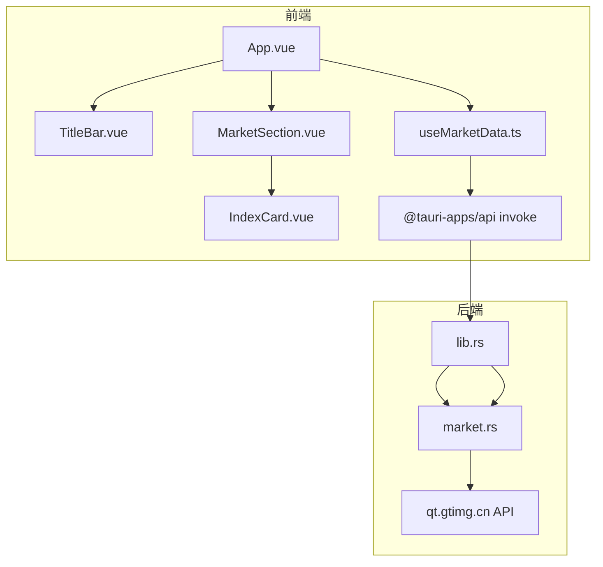
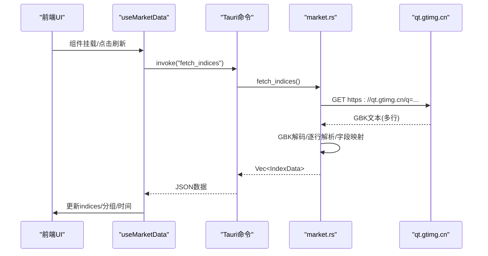
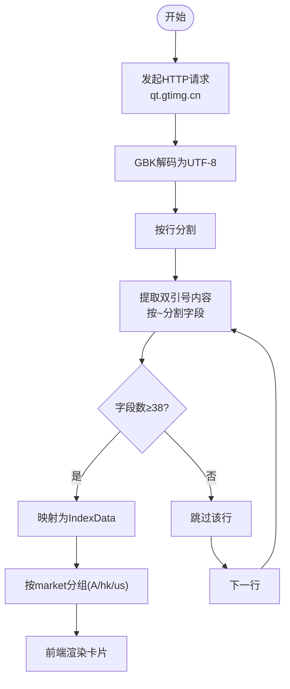
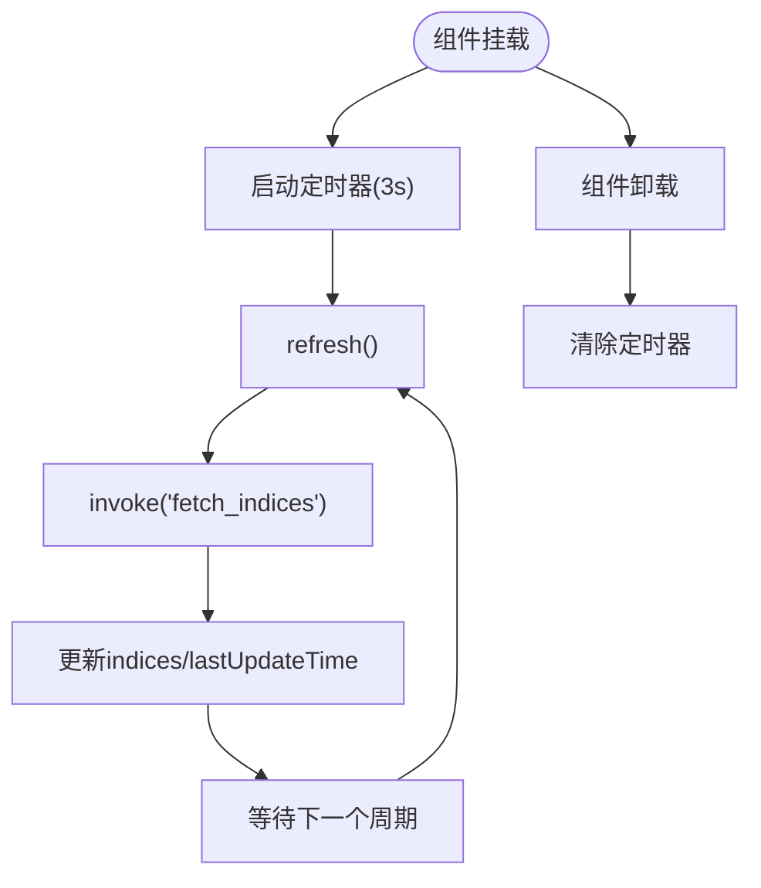
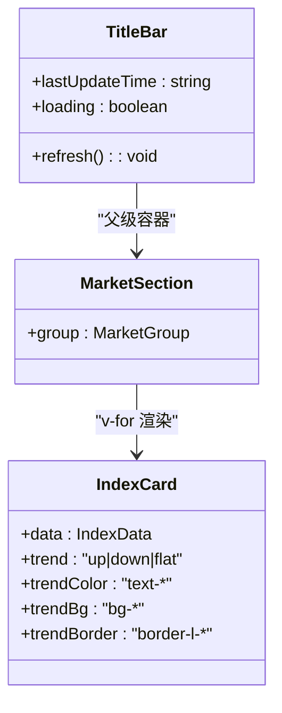
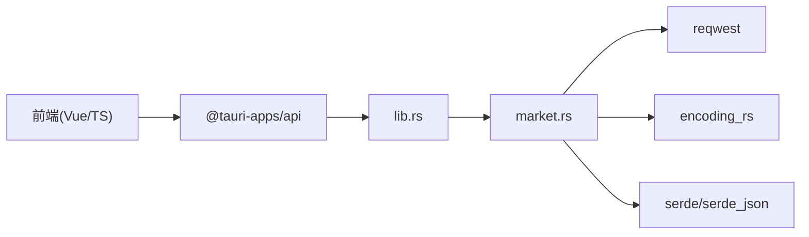

# 核心功能

<cite>
**本文引用的文件**
- [App.vue](file://src/App.vue)
- [useMarketData.ts](file://src/composables/useMarketData.ts)
- [market.ts](file://src/types/market.ts)
- [format.ts](file://src/utils/format.ts)
- [IndexCard.vue](file://src/components/IndexCard.vue)
- [MarketSection.vue](file://src/components/MarketSection.vue)
- [TitleBar.vue](file://src/components/TitleBar.vue)
- [lib.rs](file://src-tauri/src/lib.rs)
- [market.rs](file://src-tauri/src/market.rs)
- [tauri.conf.json](file://src-tauri/tauri.conf.json)
- [Cargo.toml](file://src-tauri/Cargo.toml)
- [ARCHITECTURE.md](file://ARCHITECTURE.md)
</cite>

## 目录
1. [简介](#简介)
2. [项目结构](#项目结构)
3. [核心组件](#核心组件)
4. [架构总览](#架构总览)
5. [详细组件分析](#详细组件分析)
6. [依赖关系分析](#依赖关系分析)
7. [性能与并发优化](#性能与并发优化)
8. [错误处理与重试机制](#错误处理与重试机制)
9. [故障排查指南](#故障排查指南)
10. [结论](#结论)

## 简介
本技术文档聚焦 hq-kanban-app 的核心功能：多市场指数数据的获取与展示、自动刷新机制、用户界面交互设计、数据格式化与显示逻辑，以及错误处理与稳定性保障。应用通过 Tauri（Rust 后端）调用腾讯行情接口，统一解析 A 股、港股、美股数据，并以卡片式看板形式在前端实时呈现，支持每 3 秒自动轮询刷新。

## 项目结构
- 前端采用 Vue 3 + TypeScript + Tailwind CSS，使用组合式函数封装数据轮询与分组逻辑，组件按“标题栏—市场分区—指数卡片”的层次组织。
- 后端使用 Rust/Tauri 暴露命令 fetch_indices，负责 HTTP 请求、GBK 解码、字段解析与类型映射。
- 配置项集中在 tauri.conf.json（窗口与安全策略）、Cargo.toml（Rust 依赖）。

图表来源
- [App.vue:1-36](file://src/App.vue#L1-L36)
- [useMarketData.ts:1-66](file://src/composables/useMarketData.ts#L1-L66)
- [lib.rs:1-21](file://src-tauri/src/lib.rs#L1-L21)
- [market.rs:1-100](file://src-tauri/src/market.rs#L1-L100)

章节来源
- [ARCHITECTURE.md:58-102](file://ARCHITECTURE.md#L58-L102)
- [tauri.conf.json:1-51](file://src-tauri/tauri.conf.json#L1-L51)

## 核心组件
- App.vue：根布局，集成标题栏与市场分区，挂载 useMarketData 提供的全局状态与刷新方法。
- useMarketData.ts：实现定时轮询、数据获取、市场分组、加载状态与最后更新时间管理。
- MarketSection.vue：按市场分组渲染标题与三列网格卡片。
- IndexCard.vue：单张指数卡片，展示价格、涨跌额/涨跌幅、成交量/成交额，并依据涨跌动态着色。
- TitleBar.vue：自定义标题栏，支持拖动、最小化、关闭，显示最后更新时间和加载指示器。
- format.ts：统一的数值格式化函数（价格、涨跌、涨跌幅、成交量、成交额）。
- market.ts：定义前后端共享的数据模型 IndexData 与 MarketGroup。
- lib.rs / market.rs：Tauri 命令注册与行情数据获取、编码转换、字段解析、市场类型判定。

章节来源
- [App.vue:1-36](file://src/App.vue#L1-L36)
- [useMarketData.ts:1-66](file://src/composables/useMarketData.ts#L1-L66)
- [MarketSection.vue:1-19](file://src/components/MarketSection.vue#L1-L19)
- [IndexCard.vue:1-71](file://src/components/IndexCard.vue#L1-L71)
- [TitleBar.vue:1-63](file://src/components/TitleBar.vue#L1-L63)
- [format.ts:1-33](file://src/utils/format.ts#L1-L33)
- [market.ts:1-22](file://src/types/market.ts#L1-L22)
- [lib.rs:1-21](file://src-tauri/src/lib.rs#L1-L21)
- [market.rs:1-100](file://src-tauri/src/market.rs#L1-L100)

## 架构总览
应用采用“前端（Vue）+ 后端（Rust/Tauri）”双层架构，通过 Tauri 的 invoke 机制进行 IPC 通信。前端每 3 秒发起一次 fetch_indices 命令；后端向 qt.gtimg.cn 发起 HTTP GET，返回 GBK 编码文本，经 encoding_rs 解码为 UTF-8 后逐行解析，映射为 IndexData 列表并序列化返回前端，由 Vue 响应式系统驱动视图更新。

图表来源
- [useMarketData.ts:25-41](file://src/composables/useMarketData.ts#L25-L41)
- [lib.rs:8-11](file://src-tauri/src/lib.rs#L8-L11)
- [market.rs:41-99](file://src-tauri/src/market.rs#L41-L99)

## 详细组件分析

### 多市场指数数据获取与展示机制
- 数据源差异与处理逻辑
  - A 股：代码前缀 sh/sz，对应上证指数、深证成指、创业板指、沪深 300、上证 50、中证 500。
  - 港股：代码前缀 r_hk，对应恒生指数、恒生科技指数。
  - 美股：代码前缀 r_us，对应道琼斯、纳斯达克、标普 500。
  - 后端根据代码前缀判定市场类型，并在前端按 market 字段分组渲染。
- 数据流
  - 前端通过 invoke 调用 fetch_indices。
  - 后端拼接 URL 请求 qt.gtimg.cn，读取字节流并使用 encoding_rs 将 GBK 解码为 UTF-8。
  - 按行提取双引号内内容，按 ~ 分割字段，校验字段数量后映射到 IndexData。
  - 返回 Vec<IndexData>，前端 computed 分组为 A 股、港股、美股三个 MarketGroup。

图表来源
- [market.rs:41-99](file://src-tauri/src/market.rs#L41-L99)
- [useMarketData.ts:13-23](file://src/composables/useMarketData.ts#L13-L23)

章节来源
- [market.rs:29-39](file://src-tauri/src/market.rs#L29-L39)
- [market.rs:41-99](file://src-tauri/src/market.rs#L41-L99)
- [useMarketData.ts:13-23](file://src/composables/useMarketData.ts#L13-L23)

### 自动刷新功能：定时器管理、并发控制与性能优化
- 定时器管理
  - 使用 setInterval 每 3 秒触发 refresh。
  - onMounted 启动轮询，onUnmounted 清理定时器，避免内存泄漏。
- 并发控制
  - 当前实现未对连续请求做防抖或节流，若网络慢可能导致请求堆积。建议增加“上一次请求未完成则等待或丢弃新请求”的并发控制。
- 性能优化
  - 使用 computed 对市场数据进行分组，减少重复计算。
  - 仅当 indices 变化时触发视图更新，利用 Vue 响应式特性降低重绘开销。
  - 建议在后续版本引入请求去重/合并、失败退避等策略。

图表来源
- [useMarketData.ts:38-56](file://src/composables/useMarketData.ts#L38-L56)

章节来源
- [useMarketData.ts:5-66](file://src/composables/useMarketData.ts#L5-L66)

### 用户界面交互设计：卡片式布局、响应式适配与体验优化
- 卡片式布局
  - 每个市场分区以三列网格展示指数卡片，卡片包含名称、当前价、涨跌额/涨跌幅、成交量/成交额。
  - 左侧彩色边框标识涨跌方向（红涨绿跌），背景色极淡区分。
- 响应式适配
  - 使用 Tailwind 栅格与 flex 布局，在不同窗口尺寸下保持良好可读性。
- 用户体验优化
  - 标题栏显示最后更新时间与加载脉动指示器。
  - 支持手动刷新按钮，便于即时获取最新数据。
  - 空状态提示在数据为空且非加载中时显示。

图表来源
- [IndexCard.vue:10-38](file://src/components/IndexCard.vue#L10-L38)
- [MarketSection.vue:8-16](file://src/components/MarketSection.vue#L8-L16)
- [TitleBar.vue:30-61](file://src/components/TitleBar.vue#L30-L61)

章节来源
- [IndexCard.vue:1-71](file://src/components/IndexCard.vue#L1-L71)
- [MarketSection.vue:1-19](file://src/components/MarketSection.vue#L1-L19)
- [TitleBar.vue:1-63](file://src/components/TitleBar.vue#L1-L63)

### 数据格式化与显示逻辑：价格计算、涨跌幅统计与成交量展示
- 价格与涨跌
  - 价格保留两位小数；涨跌额带正负号；涨跌幅带正负号与百分号。
- 成交量与成交额
  - 超过万单位转换为亿，否则显示万；统一使用中文单位后缀。
- 趋势颜色
  - 基于涨跌额判断趋势，分别设置文字颜色、背景色与左边框色，提升可读性。

章节来源
- [format.ts:1-33](file://src/utils/format.ts#L1-L33)
- [IndexCard.vue:10-38](file://src/components/IndexCard.vue#L10-L38)

## 依赖关系分析
- 前端依赖
  - Vue 3 与 Composition API：用于状态管理与组件通信。
  - @tauri-apps/api：调用 Tauri 命令与窗口控制。
  - Tailwind CSS：原子化样式，快速构建暗色主题与网格布局。
- 后端依赖
  - reqwest：异步 HTTP 客户端，请求行情接口。
  - encoding_rs：可靠地将 GBK 响应解码为 UTF-8。
  - serde/serde_json：数据结构序列化与反序列化。
  - tokio：异步运行时。

图表来源
- [package.json:12-24](file://package.json#L12-L24)
- [Cargo.toml:19-26](file://src-tauri/Cargo.toml#L19-L26)
- [lib.rs:1-21](file://src-tauri/src/lib.rs#L1-L21)
- [market.rs:1-100](file://src-tauri/src/market.rs#L1-L100)

章节来源
- [package.json:1-26](file://package.json#L1-L26)
- [Cargo.toml:1-27](file://src-tauri/Cargo.toml#L1-L27)

## 性能与并发优化
- 当前实现
  - 固定 3 秒轮询，简单稳定，适合低频交易场景。
  - 使用 computed 分组，减少重复计算。
- 潜在问题
  - 无并发控制：在网络延迟较高时可能出现多次请求叠加。
  - 无失败退避：连续失败会持续高频请求，增加服务器压力。
- 建议优化
  - 增加请求锁：确保同一时刻仅一个请求进行中。
  - 失败退避：指数退避重试，避免雪崩。
  - 增量更新：对比上次数据，仅更新变更项以减少渲染开销。
  - 可配置轮询间隔：根据网络状况或用户偏好调整。

[本节为通用性能建议，不直接分析具体文件]

## 错误处理与重试机制
- 前端错误处理
  - 捕获 invoke 异常并记录日志，保证轮询流程不被中断。
  - loading 状态在 finally 中恢复，确保 UI 反馈正确。
- 后端错误处理
  - 使用 Result 包装错误，通过 map_err 转换为字符串返回前端。
  - 字段解析使用安全转换 parse_f64，空值默认 0.0，防止崩溃。
- 建议增强
  - 前端增加重试次数与退避策略。
  - 后端增加超时与重试，提高鲁棒性。
  - 统一错误码与消息，便于定位问题。

章节来源
- [useMarketData.ts:25-36](file://src/composables/useMarketData.ts#L25-L36)
- [lib.rs:8-11](file://src-tauri/src/lib.rs#L8-L11)
- [market.rs:22-27](file://src-tauri/src/market.rs#L22-L27)

## 故障排查指南
- 无法获取数据
  - 检查网络连接与防火墙是否允许访问 qt.gtimg.cn。
  - 确认后端是否正确解码 GBK 并解析字段。
  - 查看浏览器控制台与 Tauri 日志中的错误信息。
- 数据格式异常
  - 确认响应字段数量 ≥ 38，否则会被跳过。
  - 核对字段索引映射是否与接口一致。
- 界面不更新
  - 检查 indices 是否被正确赋值，computed 分组是否生效。
  - 确认 loading 状态在 finally 中恢复。
- 窗口控制无效
  - 检查 tauri.conf.json 的 decorations 与权限配置。
  - 确认 TitleBar 的事件绑定与 stopPropagation 使用正确。

章节来源
- [market.rs:41-99](file://src-tauri/src/market.rs#L41-L99)
- [useMarketData.ts:25-56](file://src/composables/useMarketData.ts#L25-L56)
- [tauri.conf.json:12-26](file://src-tauri/tauri.conf.json#L12-L26)
- [TitleBar.vue:13-27](file://src/components/TitleBar.vue#L13-L27)

## 结论
hq-kanban-app 通过简洁清晰的架构实现了跨市场指数行情的实时看板展示。前端以 Vue 组合式函数封装轮询与分组逻辑，后端以 Rust 高效处理 GBK 解码与字段解析，配合卡片式布局与暗色主题，提供了良好的用户体验。未来可在并发控制、失败退避与增量更新方面进一步优化，以提升稳定性与性能。