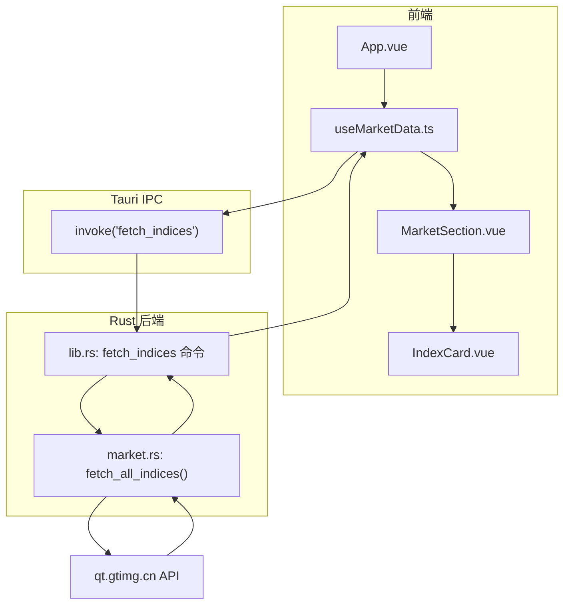
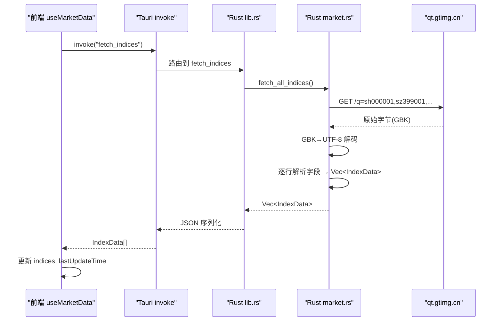
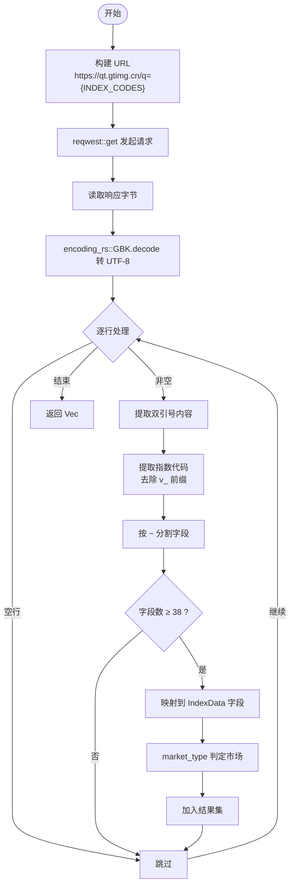
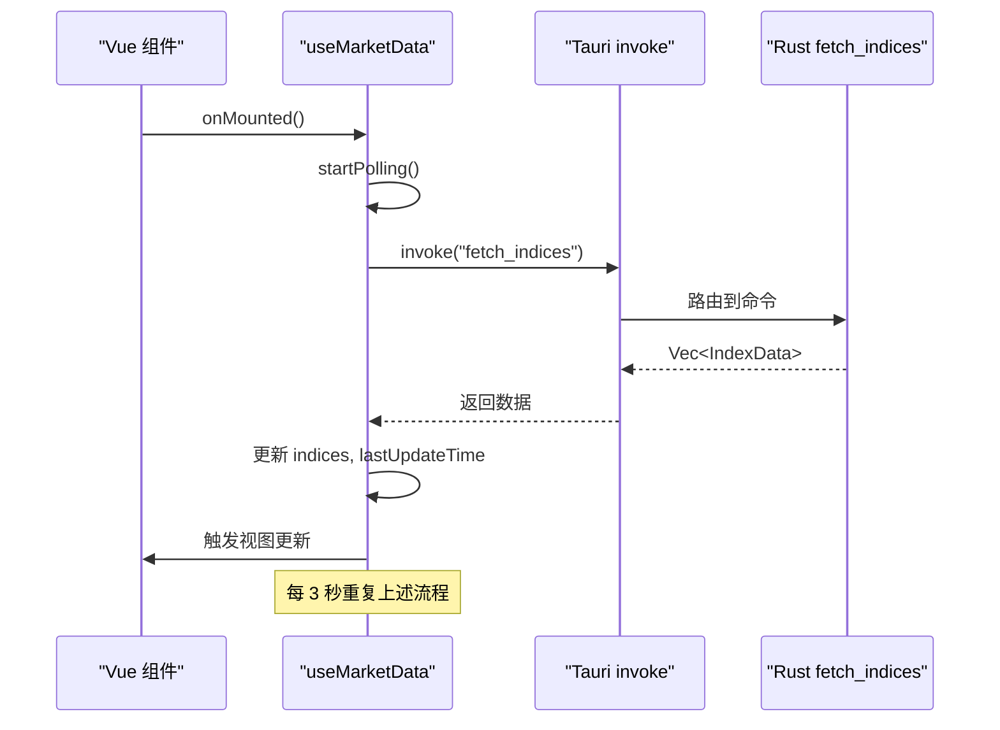
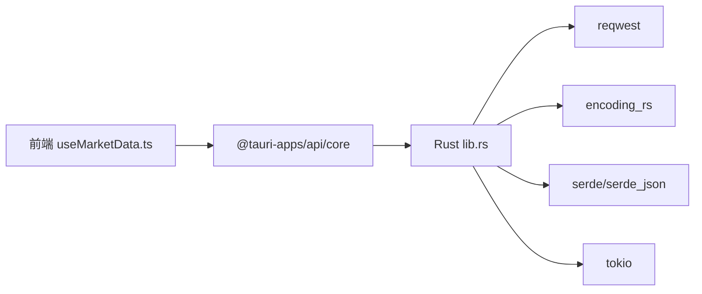

# 行情数据获取

<cite>
**本文引用的文件**
- [market.rs](file://src-tauri/src/market.rs)
- [lib.rs](file://src-tauri/src/lib.rs)
- [main.rs](file://src-tauri/src/main.rs)
- [Cargo.toml](file://src-tauri/Cargo.toml)
- [useMarketData.ts](file://src/composables/useMarketData.ts)
- [market.ts](file://src/types/market.ts)
- [IndexCard.vue](file://src/components/IndexCard.vue)
- [MarketSection.vue](file://src/components/MarketSection.vue)
- [ARCHITECTURE.md](file://ARCHITECTURE.md)
</cite>

## 目录
1. [简介](#简介)
2. [项目结构](#项目结构)
3. [核心组件](#核心组件)
4. [架构总览](#架构总览)
5. [详细组件分析](#详细组件分析)
6. [依赖关系分析](#依赖关系分析)
7. [性能与并发](#性能与并发)
8. [错误处理与重试](#错误处理与重试)
9. [故障排查指南](#故障排查指南)
10. [结论](#结论)
11. [附录：代码示例与使用模式](#附录代码示例与使用模式)

## 简介
本技术文档聚焦 hq-kanban-app 的“行情数据获取”能力，覆盖多市场指数（A 股、港股、美股）的数据源差异与处理逻辑；详细说明 Rust 后端的网络请求实现（HTTP 客户端配置、请求参数构建、响应解析）；文档化前端与后端的 IPC 通信机制（Tauri 命令调用与数据传输格式）；介绍自动轮询的实现原理（定时器管理、并发控制与性能优化策略）；并给出错误处理与稳定性保障建议。文末提供具体代码示例路径与使用模式，便于快速集成与扩展。

## 项目结构
本项目采用 Tauri 双层架构：前端 Vue 3 + TypeScript 通过 Tauri invoke 调用 Rust 后端命令，Rust 端负责 HTTP 请求、编码转换与数据解析，返回结构化数据供前端渲染。

图表来源
- [useMarketData.ts:25-36](file://src/composables/useMarketData.ts#L25-L36)
- [lib.rs:8-11](file://src-tauri/src/lib.rs#L8-L11)
- [market.rs:41-99](file://src-tauri/src/market.rs#L41-L99)

章节来源
- [ARCHITECTURE.md:106-155](file://ARCHITECTURE.md#L106-L155)
- [ARCHITECTURE.md:157-214](file://ARCHITECTURE.md#L157-L214)

## 核心组件
- Rust 后端
  - market.rs：定义 IndexData 数据模型，实现 fetch_all_indices() 完成 HTTP 请求、GBK 解码、字段解析与市场分类。
  - lib.rs：注册 Tauri 命令 fetch_indices，桥接前端与 market 模块。
  - main.rs：应用入口，启动 Tauri 运行时。
  - Cargo.toml：声明 reqwest、encoding_rs、tokio、serde 等依赖。
- 前端
  - useMarketData.ts：封装轮询、IPC 调用、数据分组与生命周期管理。
  - types/market.ts：定义 IndexData、MarketGroup 类型契约。
  - components：MarketSection.vue、IndexCard.vue 负责按市场分组展示与卡片渲染。

章节来源
- [market.rs:1-100](file://src-tauri/src/market.rs#L1-L100)
- [lib.rs:1-21](file://src-tauri/src/lib.rs#L1-L21)
- [main.rs:1-7](file://src-tauri/src/main.rs#L1-L7)
- [Cargo.toml:19-26](file://src-tauri/Cargo.toml#L19-L26)
- [useMarketData.ts:1-66](file://src/composables/useMarketData.ts#L1-L66)
- [market.ts:1-22](file://src/types/market.ts#L1-L22)
- [MarketSection.vue:1-19](file://src/components/MarketSection.vue#L1-L19)
- [IndexCard.vue:1-71](file://src/components/IndexCard.vue#L1-L71)

## 架构总览
整体流程：前端每 3 秒触发一次刷新，通过 Tauri invoke 调用 Rust 命令；Rust 使用 reqwest 发起 HTTPS GET 到 qt.gtimg.cn，读取字节流并以 encoding_rs 将 GBK 解码为 UTF-8；按行解析出各指数字段，映射为 IndexData 列表，经 serde 序列化后返回前端；Vue 响应式更新并按市场分组渲染。

图表来源
- [useMarketData.ts:25-36](file://src/composables/useMarketData.ts#L25-L36)
- [lib.rs:8-11](file://src-tauri/src/lib.rs#L8-L11)
- [market.rs:41-99](file://src-tauri/src/market.rs#L41-L99)

## 详细组件分析

### Rust 后端：HTTP 请求与数据解析
- 数据模型
  - IndexData：包含 code、name、current、prev_close、open、high、low、change、change_pct、volume、amount、market、update_time。
- 市场识别
  - market_type：根据代码前缀 sh/sz → a，r_hk → hk，r_us → us，未知 → unknown。
- 网络请求
  - 使用 reqwest::get 发起异步请求，URL 拼接 INDEX_CODES（A 股、港股、美股共 11 个指数）。
  - 读取 bytes 并通过 encoding_rs::GBK.decode 转换为 UTF-8 文本。
- 解析逻辑
  - 按行分割，提取双引号内内容；按 = 分割得到 v_ 前缀的代码，去除 v_ 得到 index_code。
  - 按 ~ 分割字段数组，校验长度 ≥ 38 防止越界。
  - 安全解析 f64：空字符串或非法值回退为 0.0。
  - 填充 IndexData 并推入结果集合。

图表来源
- [market.rs:22-39](file://src-tauri/src/market.rs#L22-L39)
- [market.rs:41-99](file://src-tauri/src/market.rs#L41-L99)

章节来源
- [market.rs:1-100](file://src-tauri/src/market.rs#L1-L100)

### 前端：IPC 调用与自动轮询
- 轮询策略
  - 使用 setInterval 每 3 秒调用 refresh()，在 onMounted 时立即执行一次并启动定时器，onUnmounted 清理定时器。
- IPC 调用
  - 通过 @tauri-apps/api/core 的 invoke 调用 Rust 命令 fetch_indices，接收 IndexData[]。
- 数据分组
  - computed 计算 marketGroups，按 market 字段分为 A 股、港股、美股三组。
- 状态管理
  - loading 表示当前是否正在刷新；lastUpdateTime 记录最近更新时间。

图表来源
- [useMarketData.ts:5-66](file://src/composables/useMarketData.ts#L5-L66)
- [lib.rs:8-11](file://src-tauri/src/lib.rs#L8-L11)

章节来源
- [useMarketData.ts:1-66](file://src/composables/useMarketData.ts#L1-L66)
- [market.ts:1-22](file://src/types/market.ts#L1-L22)

### 前端展示：市场分区与卡片
- MarketSection.vue：按 MarketGroup 渲染分区标题与网格布局。
- IndexCard.vue：根据 change 正负决定涨跌样式（红涨绿跌），展示价格、涨跌额/幅、成交量/成交额。

章节来源
- [MarketSection.vue:1-19](file://src/components/MarketSection.vue#L1-L19)
- [IndexCard.vue:1-71](file://src/components/IndexCard.vue#L1-L71)

## 依赖关系分析
- 前端依赖
  - Vue 3 Composition API、@tauri-apps/api/core 用于 invoke。
  - 类型定义集中在 market.ts，保证前后端数据结构一致。
- 后端依赖
  - reqwest 0.12（blocking）用于 HTTP 请求。
  - encoding_rs 0.8 用于 GBK 解码。
  - serde/serde_json 用于数据序列化。
  - tokio full 提供异步运行时支持。

图表来源
- [useMarketData.ts:1-3](file://src/composables/useMarketData.ts#L1-L3)
- [Cargo.toml:19-26](file://src-tauri/Cargo.toml#L19-L26)

章节来源
- [Cargo.toml:19-26](file://src-tauri/Cargo.toml#L19-L26)
- [useMarketData.ts:1-3](file://src/composables/useMarketData.ts#L1-L3)

## 性能与并发
- 轮询频率
  - 默认 3 秒间隔，平衡实时性与服务器压力。
- 并发控制
  - 当前实现未对并发请求做限制；若需增强，可在前端增加“上一次请求未完成则跳过新请求”的防抖/节流逻辑，或在后端使用连接池与超时配置。
- 资源释放
  - 组件卸载时清除定时器，避免内存泄漏。
- 网络层
  - reqwest blocking 模式下由 tokio 调度；可考虑启用连接复用与合理超时以提升吞吐。

[本节为通用性能讨论，不直接分析具体文件]

## 错误处理与重试
- 当前行为
  - 前端 catch 捕获异常并打印日志，loading 恢复，轮询继续。
  - Rust 端若请求失败或解析异常，会向上抛出错误，被 Tauri 命令包装为 String 返回给前端。
- 改进建议
  - 前端：增加重试次数与退避策略（如指数退避），并在连续失败时暂停轮询提示用户。
  - 后端：对网络错误进行区分（超时、DNS、SSL、HTTP 状态码），返回更丰富的错误信息；对解析失败进行容错（跳过坏行并记录日志）。
  - 监控：增加指标统计（成功/失败率、平均耗时）以便定位问题。

章节来源
- [useMarketData.ts:25-36](file://src/composables/useMarketData.ts#L25-L36)
- [lib.rs:8-11](file://src-tauri/src/lib.rs#L8-L11)
- [market.rs:41-99](file://src-tauri/src/market.rs#L41-L99)

## 故障排查指南
- 无法获取数据
  - 检查网络连接与防火墙；确认 qt.gtimg.cn 可达。
  - 查看浏览器控制台与 Tauri 日志，确认 invoke 是否成功。
- 显示乱码
  - 确认后端已正确进行 GBK→UTF-8 解码；检查 encoding_rs 版本与配置。
- 数据缺失或字段错位
  - 检查响应字段数量是否 ≥ 38；若接口变更，需同步调整字段索引映射。
- 轮询不停止
  - 确认组件卸载时清除了定时器；检查是否存在多个实例导致多个定时器并存。

章节来源
- [market.rs:41-99](file://src-tauri/src/market.rs#L41-L99)
- [useMarketData.ts:38-56](file://src/composables/useMarketData.ts#L38-L56)

## 结论
本项目通过 Tauri 将前端与 Rust 后端解耦，利用 Rust 可靠地处理 GBK 编码与跨域限制，实现了稳定的多市场指数数据获取。前端以简洁的轮询与响应式更新呈现数据，满足桌面看板场景的实时性需求。后续可在此基础上增强错误重试、并发控制与监控能力，进一步提升鲁棒性与可观测性。

[本节为总结性内容，不直接分析具体文件]

## 附录：代码示例与使用模式

- 前端调用示例
  - 在组件中引入 useMarketData，并在模板中使用 marketGroups 渲染分区与卡片。
  - 参考路径：
    - [useMarketData.ts:25-36](file://src/composables/useMarketData.ts#L25-L36)
    - [MarketSection.vue:8-17](file://src/components/MarketSection.vue#L8-L17)
    - [IndexCard.vue:41-69](file://src/components/IndexCard.vue#L41-L69)

- Rust 命令暴露与调用
  - 在 lib.rs 中注册 fetch_indices 命令，前端通过 invoke 调用。
  - 参考路径：
    - [lib.rs:8-11](file://src-tauri/src/lib.rs#L8-L11)

- 数据模型与类型契约
  - 前后端共享 IndexData 字段语义，确保序列化一致性。
  - 参考路径：
    - [market.rs:3-18](file://src-tauri/src/market.rs#L3-L18)
    - [market.ts:1-22](file://src/types/market.ts#L1-L22)

- 网络请求与解析
  - 使用 reqwest 发起请求，encoding_rs 解码 GBK，按行解析字段。
  - 参考路径：
    - [market.rs:41-99](file://src-tauri/src/market.rs#L41-L99)

- 依赖与运行时
  - 后端依赖声明与特性开关。
  - 参考路径：
    - [Cargo.toml:19-26](file://src-tauri/Cargo.toml#L19-L26)