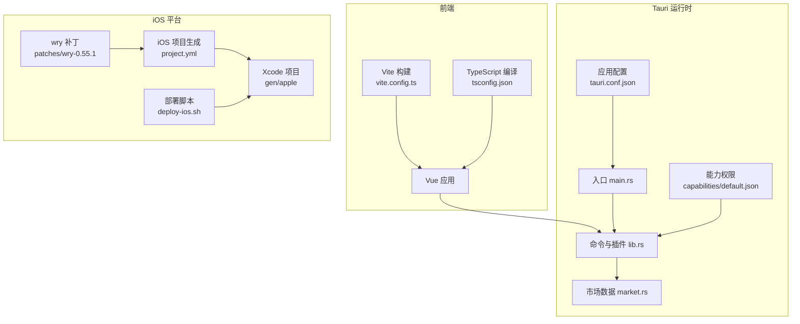
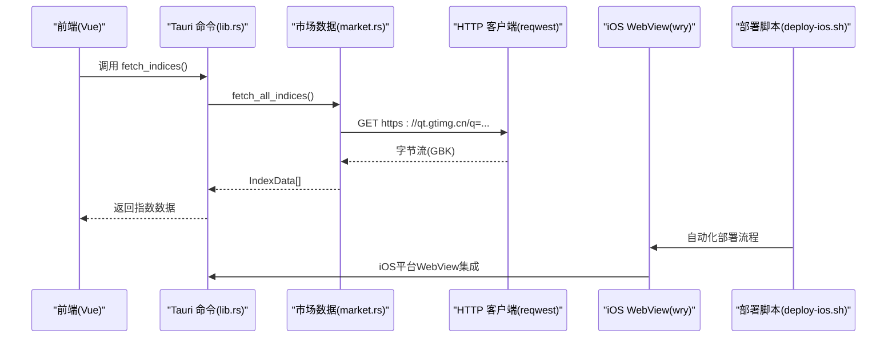
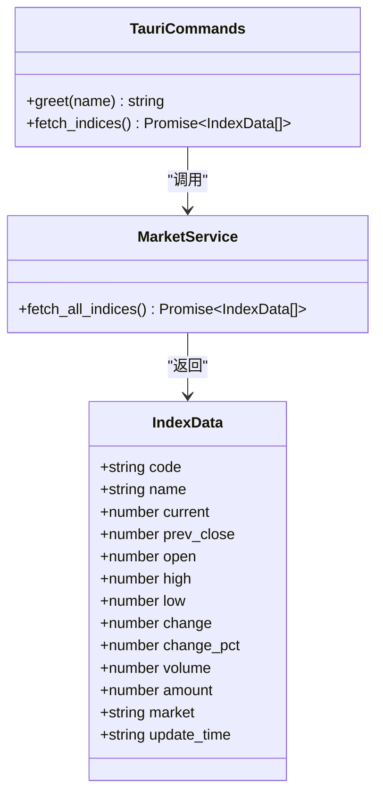
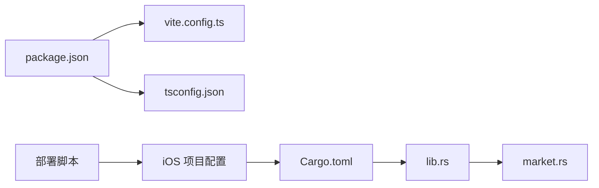

# 配置与部署

<cite>
**本文引用的文件**
- [tauri.conf.json](file://src-tauri/tauri.conf.json)
- [default.json](file://src-tauri/capabilities/default.json)
- [vite.config.ts](file://vite.config.ts)
- [tsconfig.json](file://tsconfig.json)
- [package.json](file://package.json)
- [Cargo.toml](file://src-tauri/Cargo.toml)
- [main.rs](file://src-tauri/src/main.rs)
- [lib.rs](file://src-tauri/src/lib.rs)
- [market.rs](file://src-tauri/src/market.rs)
- [market.ts](file://src/types/market.ts)
- [project.yml](file://src-tauri/gen/apple/project.yml)
- [Info.plist](file://src-tauri/gen/apple/hq-kanban-app_iOS/Info.plist)
- [ExportOptions.plist](file://src-tauri/gen/apple/ExportOptions.plist)
- [MOBILE.md](file://src-tauri/patches/wry-0.55.1/MOBILE.md)
- [iOS真机部署问题排查报告.md](file://docs/iOS真机部署问题排查报告.md)
- [构建调试命令手册.md](file://docs/构建调试命令手册.md)
- [deploy-ios.sh](file://scripts/deploy-ios.sh)
</cite>

## 更新摘要
**所做更改**
- 新增完整的iOS真机部署自动化脚本支持，提供一键部署流程
- 增强iOS平台部署章节，包含自动化脚本使用方法和最佳实践
- 更新跨平台打包流程，集成新的iOS部署工具链
- 完善故障排查指南，增加iOS真机部署常见问题解决方案
- 强化生产环境验证机制，确保正确的构建模式

## 目录
1. [简介](#简介)
2. [项目结构](#项目结构)
3. [核心组件](#核心组件)
4. [架构总览](#架构总览)
5. [详细组件分析](#详细组件分析)
6. [依赖关系分析](#依赖关系分析)
7. [性能考量](#性能考量)
8. [故障排查指南](#故障排查指南)
9. [结论](#结论)
10. [附录](#附录)

## 简介
本指南面向 hq-kanban-app 的配置与部署，覆盖 Tauri v2 应用配置（窗口属性、安全策略、打包选项）、Vite 构建与 TypeScript 编译选项、开发与生产环境差异、跨平台打包发布流程（Windows/macOS/Linux/iOS）、环境变量管理与敏感信息保护、版本发布与更新机制等。文档以仓库实际配置文件为依据，提供可操作的步骤与最佳实践。

**更新** 新增了完整的iOS真机部署自动化脚本支持，提供一键部署流程和完善的故障排查机制，使iOS设备部署更加便捷可靠。

## 项目结构
hq-kanban-app 采用 Tauri v2 + Vue 3 + Vite + TypeScript 的混合桌面与移动应用架构：
- 前端：Vue 3 + Vite + Tailwind CSS，TypeScript 类型定义位于 src/types。
- 后端：Tauri Rust 插件与命令，负责网络请求与数据解析。
- iOS支持：通过wry补丁和xcodegen生成的iOS项目，支持iPhone和iPad设备。
- 部署工具：提供自动化部署脚本，简化iOS真机部署流程。
- 配置：Tauri 配置在 src-tauri/tauri.conf.json；能力权限在 capabilities/default.json；Vite 配置在 vite.config.ts；TS 编译在 tsconfig.json；脚本与依赖在 package.json；Rust 包在 src-tauri/Cargo.toml。



**图表来源**
- [vite.config.ts:1-32](file://vite.config.ts#L1-L32)
- [tsconfig.json:1-24](file://tsconfig.json#L1-L24)
- [tauri.conf.json:1-55](file://src-tauri/tauri.conf.json#L1-L55)
- [default.json:1-14](file://src-tauri/capabilities/default.json#L1-L14)
- [main.rs:1-7](file://src-tauri/src/main.rs#L1-L7)
- [lib.rs:1-21](file://src-tauri/src/lib.rs#L1-L21)
- [market.rs:1-100](file://src-tauri/src/market.rs#L1-L100)
- [project.yml:1-105](file://src-tauri/gen/apple/project.yml#L1-L105)
- [deploy-ios.sh:1-70](file://scripts/deploy-ios.sh#L1-L70)
- [MOBILE.md:1-333](file://src-tauri/patches/wry-0.55.1/MOBILE.md#L1-L333)

**章节来源**
- [vite.config.ts:1-32](file://vite.config.ts#L1-L32)
- [tsconfig.json:1-24](file://tsconfig.json#L1-L24)
- [tauri.conf.json:1-55](file://src-tauri/tauri.conf.json#L1-L55)
- [default.json:1-14](file://src-tauri/capabilities/default.json#L1-L14)
- [package.json:1-27](file://package.json#L1-L27)
- [Cargo.toml:1-30](file://src-tauri/Cargo.toml#L1-L30)

## 核心组件
- Tauri v2 应用配置（窗口、安全、打包）
- Vite 构建与开发服务器
- TypeScript 编译与严格模式
- Rust 命令与网络层（市场数据）
- 能力与权限控制
- **新增** iOS平台支持与wry WebView补丁
- **新增** xcodegen项目生成系统
- **新增** iOS真机部署自动化脚本

**章节来源**
- [tauri.conf.json:6-53](file://src-tauri/tauri.conf.json#L6-L53)
- [default.json:1-14](file://src-tauri/capabilities/default.json#L1-L14)
- [vite.config.ts:8-31](file://vite.config.ts#L8-L31)
- [tsconfig.json:1-24](file://tsconfig.json#L1-L24)
- [lib.rs:3-20](file://src-tauri/src/lib.rs#L3-L20)
- [market.rs:41-99](file://src-tauri/src/market.rs#L41-L99)
- [project.yml:27-105](file://src-tauri/gen/apple/project.yml#L27-L105)
- [deploy-ios.sh:1-70](file://scripts/deploy-ios.sh#L1-L70)
- [Cargo.toml:28-30](file://src-tauri/Cargo.toml#L28-L30)

## 架构总览
下图展示了从前端到 Rust 后端的调用链路与数据流，以及iOS平台的集成方式和自动化部署流程：



**图表来源**
- [lib.rs:8-11](file://src-tauri/src/lib.rs#L8-L11)
- [market.rs:41-99](file://src-tauri/src/market.rs#L41-L99)
- [project.yml:85-105](file://src-tauri/gen/apple/project.yml#L85-L105)
- [deploy-ios.sh:33-69](file://scripts/deploy-ios.sh#L33-L69)

## 详细组件分析

### Tauri v2 应用配置（窗口、安全、打包）
- 窗口属性
  - 尺寸、标题、居中、可调整大小、装饰边框、置顶等由 tauri.conf.json 的 app.windows 数组定义。
  - 建议根据 UI 布局设置合适的宽高与 center，无边框需配合自定义标题栏或拖拽区域。
- 安全策略
  - CSP 设置为 null，表示不启用内容安全策略。若需要限制资源加载，可在 app.security.csp 中配置更严格的策略。
  - 通过 capabilities/default.json 精确授予窗口与插件权限，如 core:window 相关操作与 opener 插件。
- 打包选项
  - bundle.active 开启打包，targets 为 all 表示同时生成多平台产物。
  - icon 列表包含多分辨率图标与平台特定格式，确保各平台显示一致。
  - **新增** iOS 特定配置：developmentTeam 设置为 QZ5VGE4SZ9（HUAFU SECURITIES CO.,LTD），minimumSystemVersion 设置为 14.0。
- 构建前后命令
  - beforeDevCommand 与 beforeBuildCommand 分别用于启动前端开发与构建流程，devUrl 指向本地开发端口。

**更新** 增强了iOS平台的专门配置，包括开发团队ID和最低系统版本要求，为自动化部署提供基础配置。

**章节来源**
- [tauri.conf.json:6-53](file://src-tauri/tauri.conf.json#L6-L53)
- [default.json:1-14](file://src-tauri/capabilities/default.json#L1-L14)

### Vite 构建配置
- 插件与样式
  - 使用 @vitejs/plugin-vue 与 @tailwindcss/vite 集成 Vue 与 Tailwind。
- 开发服务器
  - 固定端口 1420，strictPort 保证端口可用；host 支持通过 TAURI_DEV_HOST 指定 HMR 主机；HMR 端口 1421。
  - 忽略 src-tauri 目录变更监听，避免不必要的重新构建。
- 构建输出
  - 构建产物输出至 dist，供 Tauri 打包时引用。

**章节来源**
- [vite.config.ts:1-32](file://vite.config.ts#L1-L32)

### TypeScript 编译选项
- 目标与模块
  - target ES2020，module ESNext，lib 包含 DOM 与迭代器，适配现代浏览器与 Node 环境。
- 严格模式
  - strict 开启，noUnusedLocals/noUnusedParameters/noFallthroughCasesInSwitch 提升代码质量。
- 模块解析
  - moduleResolution bundler，allowImportingTsExtensions 允许 .ts 导入，isolatedModules 与 moduleDetection force 提升增量编译性能。
- 输出
  - noEmit true，仅做类型检查，构建由 Vite 完成。

**章节来源**
- [tsconfig.json:1-24](file://tsconfig.json#L1-L24)

### Rust 命令与网络层
- 命令注册
  - greet 与 fetch_indices 通过 #[tauri::command] 暴露给前端。
- 插件
  - 初始化 tauri_plugin_opener，允许打开外部链接。
- 网络请求
  - market.rs 使用 reqwest 异步获取腾讯行情接口，encoding_rs 解码 GBK 文本，解析字段并构造 IndexData。
- 数据类型
  - 前端 types/market.ts 与 Rust 侧 IndexData 字段对应，便于类型安全交互。



**图表来源**
- [lib.rs:3-20](file://src-tauri/src/lib.rs#L3-L20)
- [market.rs:1-100](file://src-tauri/src/market.rs#L1-L100)
- [market.ts:1-22](file://src/types/market.ts#L1-L22)

**章节来源**
- [lib.rs:1-21](file://src-tauri/src/lib.rs#L1-L21)
- [market.rs:1-100](file://src-tauri/src/market.rs#L1-L100)
- [market.ts:1-22](file://src/types/market.ts#L1-L22)

### iOS 平台支持与移动部署
- **wry WebView 补丁**
  - 针对 iOS 26+ 系统的 NSBundle API 崩溃问题进行修复
  - 修改 platform_webview_version() 函数，使用 NSProcessInfo 替代崩溃的 API
  - 通过 Cargo.toml 的 patch.crates-io 机制覆盖官方 wry 版本
- **iOS 项目生成系统**
  - 使用 xcodegen 从 project.yml 自动生成 Xcode 项目
  - 配置 iOS 部署目标为 14.0，支持 iPhone 和 iPad
  - 预构建脚本自动编译 Rust 代码并生成静态库
- **代码签名与权限**
  - developmentTeam 设置为 QZ5VGE4SZ9（HUAFU SECURITIES CO.,LTD）
  - Bundle ID 为 com.huafu.hqkanbanapp，避免全局冲突
  - Info.plist 配置网络访问和设备能力要求
- **构建与部署**
  - 支持模拟器（aarch64-apple-ios-sim）和真机（aarch64-apple-ios）构建
  - Release 模式启用 custom-protocol feature 以使用打包的前端资源
  - 支持 IPA 导出和真机安装部署

**更新** 完善了iOS平台支持，增加了自动化部署脚本支持和完整的故障排查机制。

**章节来源**
- [Cargo.toml:28-30](file://src-tauri/Cargo.toml#L28-L30)
- [project.yml:1-105](file://src-tauri/gen/apple/project.yml#L1-L105)
- [Info.plist:1-49](file://src-tauri/gen/apple/hq-kanban-app_iOS/Info.plist#L1-L49)
- [MOBILE.md:263-333](file://src-tauri/patches/wry-0.55.1/MOBILE.md#L263-L333)
- [iOS真机部署问题排查报告.md:24-164](file://docs/iOS真机部署问题排查报告.md#L24-L164)

### iOS 真机部署自动化脚本
- **脚本功能**
  - 提供一键部署流程，包含前端构建、配置检查、Release构建、生产模式验证和真机安装启动
  - 支持默认设备和指定设备UDID两种部署方式
  - 内置多重验证机制，确保构建质量和部署正确性
- **部署流程**
  - 前端生产构建：执行 pnpm build 生成静态资源
  - 构建配置检查：验证 pbxproj 中是否包含 custom-protocol feature
  - Xcode Release 构建：使用 xcodebuild 进行真机构建
  - Production 模式验证：检查二进制文件中是否包含开发代理代码
  - 安装并启动：使用 xcrun devicectl 安装应用到真机并启动
- **错误处理**
  - 详细的错误提示和解决方案指导
  - 自动检测常见配置问题并提供修复建议
  - 生产模式验证失败时的清理和重建指导

**新增** 完整的iOS真机部署自动化脚本，大幅简化了部署流程并提高了可靠性。

**章节来源**
- [deploy-ios.sh:1-70](file://scripts/deploy-ios.sh#L1-L70)

### 开发与生产环境的差异化配置
- 开发环境
  - Vite 开发服务器端口 1420，HMR 端口 1421，通过 TAURI_DEV_HOST 可指定远程调试主机。
  - Tauri 构建前执行 pnpm dev，devUrl 指向本地服务。
  - **新增** iOS 开发模式连接 Mac 局域网 IP 而非 localhost。
- 生产环境
  - 构建前执行 pnpm build，将前端产物打包到 dist，Tauri 打包时直接引用静态资源。
  - Windows 发布模式隐藏控制台窗口（条件编译）。
  - **新增** iOS Release 模式启用 custom-protocol feature 以使用打包资源。
  - **新增** 自动化脚本提供生产模式验证机制。

**更新** 增强了iOS平台的开发环境配置，支持真机调试和生产部署，并提供了自动化验证机制。

**章节来源**
- [vite.config.ts:12-30](file://vite.config.ts#L12-L30)
- [tauri.conf.json:6-11](file://src-tauri/tauri.conf.json#L6-L11)
- [main.rs:1-7](file://src-tauri/src/main.rs#L1-L7)
- [project.yml:95-110](file://src-tauri/gen/apple/project.yml#L95-L110)
- [deploy-ios.sh:37-62](file://scripts/deploy-ios.sh#L37-L62)

### 环境变量管理与敏感信息保护
- 当前项目未包含 .env 文件，环境变量主要通过命令行或 CI 注入。
- 建议方案
  - 使用 .env.development 与 .env.production 区分环境与密钥，并在 Vite/Tauri 构建阶段读取。
  - 对敏感信息（如 API Key、Token）不要提交到仓库，使用 CI 的 Secret 管理。
  - 在 Rust 侧通过环境变量读取配置，避免硬编码。
  - 在前端避免暴露敏感信息，必要时通过 Tauri 命令代理请求。
- **新增** iOS 特定配置
  - Info.plist 中的 NSAppTransportSecurity 允许任意网络加载
  - 设备权限需要在首次运行时手动授权
  - 代码签名证书和团队ID通过配置文件管理
  - **新增** 部署脚本中配置了完整的环境变量路径设置

**更新** 增加了iOS平台的环境变量和权限管理说明，包括自动化脚本中的环境变量配置。

**章节来源**
- [deploy-ios.sh:27-27](file://scripts/deploy-ios.sh#L27-L27)
- [Info.plist:23-27](file://src-tauri/gen/apple/hq-kanban-app_iOS/Info.plist#L23-L27)

### 版本发布与更新机制
- 版本号管理
  - 前端版本在 package.json 的 version 字段；Tauri 应用在 tauri.conf.json 的 version 字段；Rust 包在 Cargo.toml 的 version 字段。
  - 建议统一版本管理工具（如 cargo-workspaces、changesets）保持同步。
- 自动更新
  - 可通过 Tauri Updater 插件实现二进制与资源的增量更新，需在 tauri.conf.json 中配置 updater 相关项，并提供签名与分发地址。
  - 建议在发布流水线中自动生成更新清单与签名文件。
- **新增** iOS 应用商店发布
  - 支持通过 App Store Connect 发布到 Apple App Store
  - 需要有效的开发者账号和正确的 Bundle ID 配置
  - 支持 TestFlight 进行内测分发
  - **新增** 自动化脚本支持生产模式的构建和验证

**更新** 增加了iOS应用商店发布的版本管理机制和自动化部署支持。

**章节来源**
- [package.json:1-27](file://package.json#L1-L27)
- [tauri.conf.json:1-55](file://src-tauri/tauri.conf.json#L1-L55)
- [Cargo.toml:1-30](file://src-tauri/Cargo.toml#L1-L30)
- [deploy-ios.sh:54-62](file://scripts/deploy-ios.sh#L54-L62)

## 依赖关系分析
- 前端依赖
  - Vue、@tauri-apps/api、Tailwind、Vite、TypeScript、vue-tsc。
- 后端依赖
  - Tauri v2 框架、opener 插件、serde/serde_json、reqwest、encoding_rs、tokio。
- **新增** iOS 平台依赖
  - wry WebView 库（已打补丁）
  - iOS 系统框架（UIKit、WebKit、Metal等）
  - xcodegen 项目生成工具
  - **新增** 部署脚本依赖（xcodebuild、xcrun devicectl等）



**图表来源**
- [package.json:13-25](file://package.json#L13-L25)
- [Cargo.toml:19-30](file://src-tauri/Cargo.toml#L19-L30)
- [lib.rs:1-21](file://src-tauri/src/lib.rs#L1-L21)
- [market.rs:1-100](file://src-tauri/src/market.rs#L1-L100)
- [project.yml:74-84](file://src-tauri/gen/apple/project.yml#L74-L84)
- [deploy-ios.sh:46-67](file://scripts/deploy-ios.sh#L46-L67)

**章节来源**
- [package.json:13-25](file://package.json#L13-L25)
- [Cargo.toml:19-30](file://src-tauri/Cargo.toml#L19-L30)

## 性能考量
- 构建优化
  - Vite 使用 esbuild 进行快速构建，关闭 clearScreen 避免干扰日志；严格端口避免冲突。
  - TypeScript 使用 isolatedModules 与 moduleDetection force 提升增量编译速度。
- 运行时优化
  - Rust 侧使用 tokio 异步处理网络请求，减少阻塞；使用 encoding_rs 高效解码 GBK。
  - 合理设置窗口大小与无边框，减少渲染开销。
- **新增** iOS 性能优化
  - 使用 arm64 架构原生编译，获得最佳性能
  - 禁用 Bitcode 以减少应用体积
  - 合理配置 Metal 图形加速支持
  - **新增** 自动化脚本确保生产模式构建，避免开发模式的性能开销

**更新** 增加了iOS平台的性能优化考虑和自动化部署的性能保障机制。

**章节来源**
- [project.yml:66-68](file://src-tauri/gen/apple/project.yml#L66-L68)
- [deploy-ios.sh:54-62](file://scripts/deploy-ios.sh#L54-L62)

## 故障排查指南
- 开发端口占用
  - 若 1420/1421 端口被占用，修改 vite.config.ts 中的 server.port 与 HMR port，并确保 strictPort 行为符合预期。
- 前端无法访问后端命令
  - 检查 capabilities/default.json 是否授予必要权限（core:window、opener:default 等）。
  - 确认 Tauri 命令已在 lib.rs 中正确注册并通过 invoke_handler 暴露。
- 网络请求失败
  - 检查 market.rs 中的 URL 与编码解码逻辑；确认网络可达与防火墙策略。
- Windows 控制台窗口
  - 发布模式下已隐藏控制台窗口；若仍出现，检查条件编译宏是否正确生效。
- **新增** iOS 平台问题
  - wry WebView 崩溃：检查是否使用了正确的补丁版本
  - 代码签名错误：确认 developmentTeam 与本机证书匹配
  - 静态库打包问题：验证 Externals 目录配置
  - 生产模式连接开发服务器：检查 custom-protocol feature 是否启用
  - **新增** 部署脚本问题：检查设备UDID配置和权限设置
  - **新增** 构建配置验证：使用脚本内置的检查机制验证构建配置

**更新** 增加了iOS平台特有的故障排查指南和自动化脚本的使用指导。

**章节来源**
- [vite.config.ts:15-29](file://vite.config.ts#L15-L29)
- [default.json:1-14](file://src-tauri/capabilities/default.json#L1-L14)
- [lib.rs:14-20](file://src-tauri/src/lib.rs#L14-L20)
- [market.rs:41-99](file://src-tauri/src/market.rs#L41-L99)
- [main.rs:1-7](file://src-tauri/src/main.rs#L1-L7)
- [iOS真机部署问题排查报告.md:24-164](file://docs/iOS真机部署问题排查报告.md#L24-L164)
- [deploy-ios.sh:37-62](file://scripts/deploy-ios.sh#L37-L62)

## 结论
hq-kanban-app 基于 Tauri v2 + Vue 3 + Vite + TypeScript 的现代桌面与移动应用架构，具备清晰的配置结构与强大的跨平台扩展性。通过合理的窗口与安全策略、严格的 TS 编译与 Vite 构建、以及 Rust 侧的高效网络处理，可实现桌面端和移动端的稳定运行。新增的iOS平台支持包括wry WebView补丁、xcodegen项目生成系统和完整的部署流程，使应用能够同时在桌面设备和移动设备上运行。**新增的iOS真机部署自动化脚本进一步简化了部署流程，提供了可靠的构建验证和错误处理机制**。建议在生产环境中引入环境变量管理、自动更新与统一的版本管理，以提升安全性与维护性。

**更新** 强调了新增的iOS平台支持能力和自动化部署优势，特别是deploy-ios.sh脚本提供的完整部署流程和故障排查机制。

## 附录

### 跨平台打包与发布流程
- 前置准备
  - 安装 Node.js、pnpm、Rust Toolchain、平台 SDK（Windows: MSVC；macOS: Xcode；Linux: 系统依赖）。
  - 安装 Tauri CLI：pnpm add -D @tauri-apps/cli。
- 构建与打包
  - 开发：pnpm tauri dev（自动执行 beforeDevCommand 与 devUrl）。
  - 构建：pnpm tauri build（自动执行 beforeBuildCommand，产物位于 src-tauri/target/release/bundle）。
  - 指定平台：通过 tauri.conf.json 的 bundle.targets 或命令行参数限定平台。
- 平台特定设置
  - Windows：确保 MSVC 工具链与 Visual Studio Build Tools 安装；图标包含 .ico。
  - macOS：需要 Apple 开发者证书与签名；图标包含 .icns。
  - Linux：安装系统依赖（webkitgtk 等），图标使用 PNG。
  - **新增** iOS：需要 Xcode、Apple 开发者账号、iOS SDK；配置 developmentTeam 和 Bundle ID；支持自动化部署脚本。
- 发布
  - 将生成的安装包上传至分发服务器；如需自动更新，配置 Tauri Updater 与签名。
  - **新增** iOS：支持通过 App Store Connect 发布到 Apple App Store 或使用 TestFlight 进行内测；可使用自动化脚本进行一键部署。

**更新** 增加了iOS平台的打包和发布流程，包括自动化部署脚本的使用方法。

**章节来源**
- [package.json:7-11](file://package.json#L7-L11)
- [tauri.conf.json:6-53](file://src-tauri/tauri.conf.json#L6-L53)
- [project.yml:1-105](file://src-tauri/gen/apple/project.yml#L1-L105)
- [deploy-ios.sh:1-70](file://scripts/deploy-ios.sh#L1-L70)

### 环境变量与敏感信息保护示例
- 推荐目录结构
  - .env.development：开发环境变量
  - .env.production：生产环境变量
  - .gitignore：忽略 .env.* 与敏感文件
- 使用方式
  - Vite：通过 import.meta.env 读取（需配置 defineConfig 暴露变量）。
  - Tauri/Rust：通过 std::env::var 读取环境变量。
  - **新增** iOS：通过 Info.plist 和 entitlements 配置文件管理权限。
  - **新增** 部署脚本：通过环境变量PATH设置确保工具链可用性。
- 安全建议
  - 不在前端暴露密钥；通过 Tauri 命令代理敏感请求。
  - 在 CI 中使用 Secret 管理密钥，避免入库。
  - **新增** iOS：代码签名证书和团队ID应通过安全的配置管理方式维护。

**更新** 增加了iOS平台的环境变量和权限配置说明，包括自动化脚本中的环境变量管理。

**章节来源**
- [deploy-ios.sh:27-27](file://scripts/deploy-ios.sh#L27-L27)
- [Info.plist:23-27](file://src-tauri/gen/apple/hq-kanban-app_iOS/Info.plist#L23-L27)

### 版本发布与更新配置要点
- 版本同步
  - 统一维护 package.json、tauri.conf.json、Cargo.toml 的版本号。
- 自动更新
  - 在 tauri.conf.json 中启用 updater，配置发行渠道、签名与校验。
  - 在发布流水线中生成更新清单与签名文件，并上传至分发服务器。
- **新增** iOS 应用商店发布
  - 配置正确的 Bundle ID 和开发团队信息
  - 使用 Xcode 或命令行工具进行应用签名和归档
  - 通过 App Store Connect 提交审核或 TestFlight 分发
  - **新增** 使用自动化脚本确保生产模式构建和验证

**更新** 增加了iOS应用商店发布的版本管理要点和自动化部署支持。

**章节来源**
- [package.json:1-27](file://package.json#L1-L27)
- [tauri.conf.json:1-55](file://src-tauri/tauri.conf.json#L1-L55)
- [Cargo.toml:1-30](file://src-tauri/Cargo.toml#L1-L30)
- [Info.plist:1-49](file://src-tauri/gen/apple/hq-kanban-app_iOS/Info.plist#L1-L49)
- [deploy-ios.sh:54-62](file://scripts/deploy-ios.sh#L54-L62)

### iOS 真机部署完整流程
- **环境准备**
  - 安装 Xcode 和 iOS SDK
  - 配置 Apple 开发者账号和证书
  - 设置 developmentTeam 为 QZ5VGE4SZ9
  - **新增** 安装必要的命令行工具（xcodebuild、xcrun devicectl等）
- **开发调试**
  - 使用 `pnpm tauri ios dev` 启动开发模式
  - 真机调试时需要授权本地网络权限
  - 首次运行需要在设备上信任开发者应用
- **Release 构建**
  - 确保启用 custom-protocol feature 以使用打包资源
  - 使用 `xcodebuild release` 进行生产构建
  - 验证构建产物不包含开发服务器连接代码
  - **新增** 使用自动化脚本进行一键部署
- **部署发布**
  - 支持通过 Xcode 直接部署到真机
  - 可使用 `xcrun devicectl` 进行命令行部署
  - 支持 IPA 导出用于 TestFlight 分发
  - **新增** 自动化脚本提供完整的部署流程和错误处理

**新增** 完整的iOS真机部署流程和最佳实践，包括自动化脚本的使用方法和故障排查指导。

**章节来源**
- [project.yml:85-105](file://src-tauri/gen/apple/project.yml#L85-L105)
- [iOS真机部署问题排查报告.md:145-164](file://docs/iOS真机部署问题排查报告.md#L145-L164)
- [构建调试命令手册.md:137-192](file://docs/构建调试命令手册.md#L137-L192)
- [deploy-ios.sh:1-70](file://scripts/deploy-ios.sh#L1-L70)

### iOS 真机部署自动化脚本使用方法
- **基本用法**
  ```bash
  # 使用默认设备部署
  ./scripts/deploy-ios.sh
  
  # 指定设备UDID部署
  ./scripts/deploy-ios.sh <设备UDID>
  ```
- **部署流程详解**
  - 步骤1：前端生产构建（pnpm build）
  - 步骤2：检查pbxproj是否包含custom-protocol feature
  - 步骤3：xcodebuild Release构建到真机
  - 步骤4：验证production模式编译生效
  - 步骤5：安装并启动应用到真机
- **错误处理**
  - 自动检测常见配置问题并提供解决方案
  - 生产模式验证失败时提供清理和重建指导
  - 详细的错误信息和修复建议

**新增** 完整的自动化脚本使用说明，包括基本用法、部署流程详解和错误处理方法。

**章节来源**
- [deploy-ios.sh:1-70](file://scripts/deploy-ios.sh#L1-L70)