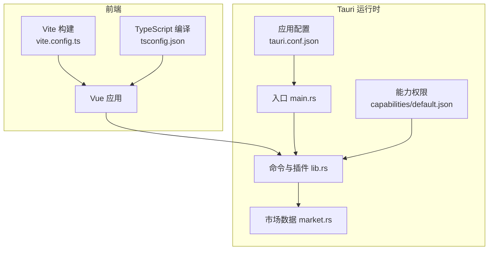
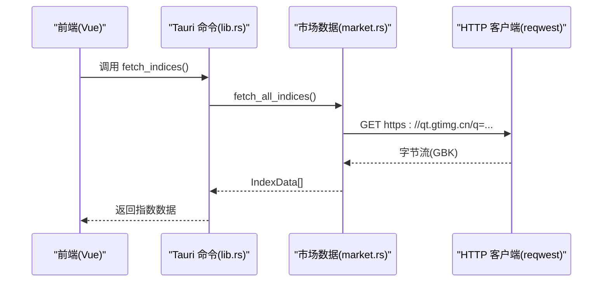
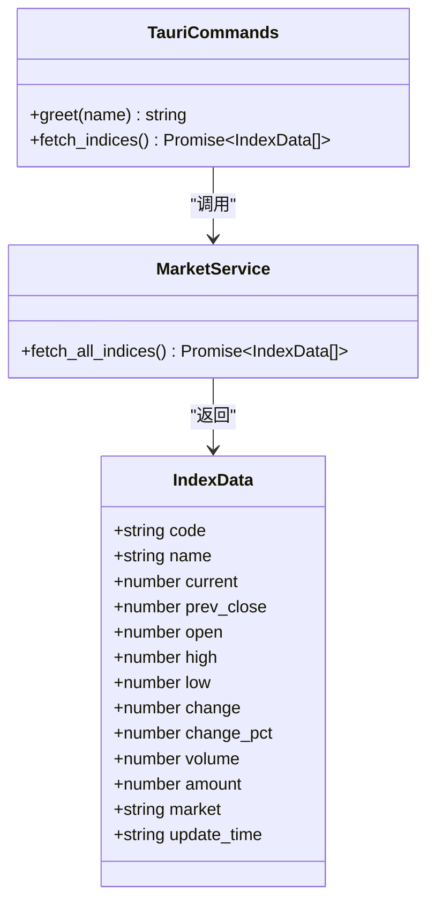
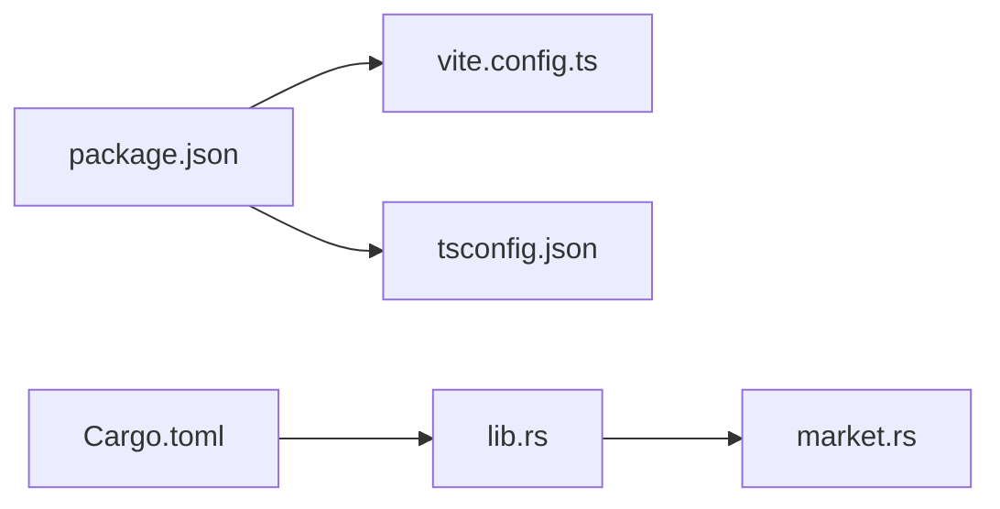

# 配置与部署

<cite>
**本文引用的文件**
- [tauri.conf.json](file://src-tauri/tauri.conf.json)
- [default.json](file://src-tauri/capabilities/default.json)
- [vite.config.ts](file://vite.config.ts)
- [tsconfig.json](file://tsconfig.json)
- [package.json](file://package.json)
- [Cargo.toml](file://src-tauri/Cargo.toml)
- [main.rs](file://src-tauri/src/main.rs)
- [lib.rs](file://src-tauri/src/lib.rs)
- [market.rs](file://src-tauri/src/market.rs)
- [market.ts](file://src/types/market.ts)
</cite>

## 目录
1. [简介](#简介)
2. [项目结构](#项目结构)
3. [核心组件](#核心组件)
4. [架构总览](#架构总览)
5. [详细组件分析](#详细组件分析)
6. [依赖关系分析](#依赖关系分析)
7. [性能考量](#性能考量)
8. [故障排查指南](#故障排查指南)
9. [结论](#结论)
10. [附录](#附录)

## 简介
本指南面向 hq-kanban-app 的配置与部署，覆盖 Tauri 应用配置（窗口属性、安全策略、打包选项）、Vite 构建与 TypeScript 编译选项、开发与生产环境差异、跨平台打包发布流程（Windows/macOS/Linux）、环境变量管理与敏感信息保护、版本发布与更新机制等。文档以仓库实际配置文件为依据，提供可操作的步骤与最佳实践。

## 项目结构
hq-kanban-app 采用 Tauri + Vue 3 + Vite + TypeScript 的混合桌面应用架构：
- 前端：Vue 3 + Vite + Tailwind CSS，TypeScript 类型定义位于 src/types。
- 后端：Tauri Rust 插件与命令，负责网络请求与数据解析。
- 配置：Tauri 配置在 src-tauri/tauri.conf.json；能力权限在 capabilities/default.json；Vite 配置在 vite.config.ts；TS 编译在 tsconfig.json；脚本与依赖在 package.json；Rust 包在 src-tauri/Cargo.toml。

**图表来源**
- [vite.config.ts:1-32](file://vite.config.ts#L1-L32)
- [tsconfig.json:1-24](file://tsconfig.json#L1-L24)
- [tauri.conf.json:1-51](file://src-tauri/tauri.conf.json#L1-L51)
- [default.json:1-14](file://src-tauri/capabilities/default.json#L1-L14)
- [main.rs:1-7](file://src-tauri/src/main.rs#L1-L7)
- [lib.rs:1-21](file://src-tauri/src/lib.rs#L1-L21)
- [market.rs:1-100](file://src-tauri/src/market.rs#L1-L100)

**章节来源**
- [vite.config.ts:1-32](file://vite.config.ts#L1-L32)
- [tsconfig.json:1-24](file://tsconfig.json#L1-L24)
- [tauri.conf.json:1-51](file://src-tauri/tauri.conf.json#L1-L51)
- [default.json:1-14](file://src-tauri/capabilities/default.json#L1-L14)
- [package.json:1-26](file://package.json#L1-L26)
- [Cargo.toml:1-27](file://src-tauri/Cargo.toml#L1-L27)

## 核心组件
- Tauri 应用配置（窗口、安全、打包）
- Vite 构建与开发服务器
- TypeScript 编译与严格模式
- Rust 命令与网络层（市场数据）
- 能力与权限控制

**章节来源**
- [tauri.conf.json:6-27](file://src-tauri/tauri.conf.json#L6-L27)
- [default.json:1-14](file://src-tauri/capabilities/default.json#L1-L14)
- [vite.config.ts:8-31](file://vite.config.ts#L8-L31)
- [tsconfig.json:1-24](file://tsconfig.json#L1-L24)
- [lib.rs:3-20](file://src-tauri/src/lib.rs#L3-L20)
- [market.rs:41-99](file://src-tauri/src/market.rs#L41-L99)

## 架构总览
下图展示了从前端到 Rust 后端的调用链路与数据流：

**图表来源**
- [lib.rs:8-11](file://src-tauri/src/lib.rs#L8-L11)
- [market.rs:41-99](file://src-tauri/src/market.rs#L41-L99)

## 详细组件分析

### Tauri 应用配置（窗口、安全、打包）
- 窗口属性
  - 尺寸、标题、居中、可调整大小、无边框、置顶等由 tauri.conf.json 的 app.windows 数组定义。
  - 建议根据 UI 布局设置合适的宽高与 center，无边框需配合自定义标题栏或拖拽区域。
- 安全策略
  - CSP 设置为 null，表示不启用内容安全策略。若需要限制资源加载，可在 app.security.csp 中配置更严格的策略。
  - 通过 capabilities/default.json 精确授予窗口与插件权限，如 core:window 相关操作与 opener 插件。
- 打包选项
  - bundle.active 开启打包，targets 为 all 表示同时生成多平台产物。
  - icon 列表包含多分辨率图标与平台特定格式，确保各平台显示一致。
- 构建前后命令
  - beforeDevCommand 与 beforeBuildCommand 分别用于启动前端开发与构建流程，devUrl 指向本地开发端口。

**章节来源**
- [tauri.conf.json:6-27](file://src-tauri/tauri.conf.json#L6-L27)
- [tauri.conf.json:28-49](file://src-tauri/tauri.conf.json#L28-L49)
- [default.json:1-14](file://src-tauri/capabilities/default.json#L1-L14)

### Vite 构建配置
- 插件与样式
  - 使用 @vitejs/plugin-vue 与 @tailwindcss/vite 集成 Vue 与 Tailwind。
- 开发服务器
  - 固定端口 1420，strictPort 保证端口可用；host 支持通过 TAURI_DEV_HOST 指定 HMR 主机；HMR 端口 1421。
  - 忽略 src-tauri 目录变更监听，避免不必要的重新构建。
- 构建输出
  - 构建产物输出至 dist，供 Tauri 打包时引用。

**章节来源**
- [vite.config.ts:1-32](file://vite.config.ts#L1-L32)

### TypeScript 编译选项
- 目标与模块
  - target ES2020，module ESNext，lib 包含 DOM 与迭代器，适配现代浏览器与 Node 环境。
- 严格模式
  - strict 开启，noUnusedLocals/noUnusedParameters/noFallthroughCasesInSwitch 提升代码质量。
- 模块解析
  - moduleResolution bundler，allowImportingTsExtensions 允许 .ts 导入，isolatedModules 与 moduleDetection force 提升增量编译性能。
- 输出
  - noEmit true，仅做类型检查，构建由 Vite 完成。

**章节来源**
- [tsconfig.json:1-24](file://tsconfig.json#L1-L24)

### Rust 命令与网络层
- 命令注册
  - greet 与 fetch_indices 通过 #[tauri::command] 暴露给前端。
- 插件
  - 初始化 tauri_plugin_opener，允许打开外部链接。
- 网络请求
  - market.rs 使用 reqwest 异步获取腾讯行情接口，encoding_rs 解码 GBK 文本，解析字段并构造 IndexData。
- 数据类型
  - 前端 types/market.ts 与 Rust 侧 IndexData 字段对应，便于类型安全交互。

**图表来源**
- [lib.rs:3-20](file://src-tauri/src/lib.rs#L3-L20)
- [market.rs:1-100](file://src-tauri/src/market.rs#L1-L100)
- [market.ts:1-22](file://src/types/market.ts#L1-L22)

**章节来源**
- [lib.rs:1-21](file://src-tauri/src/lib.rs#L1-L21)
- [market.rs:1-100](file://src-tauri/src/market.rs#L1-L100)
- [market.ts:1-22](file://src/types/market.ts#L1-L22)

### 开发与生产环境的差异化配置
- 开发环境
  - Vite 开发服务器端口 1420，HMR 端口 1421，通过 TAURI_DEV_HOST 可指定远程调试主机。
  - Tauri 构建前执行 pnpm dev，devUrl 指向本地服务。
- 生产环境
  - 构建前执行 pnpm build，将前端产物打包到 dist，Tauri 打包时直接引用静态资源。
  - Windows 发布模式隐藏控制台窗口（条件编译）。

**章节来源**
- [vite.config.ts:12-30](file://vite.config.ts#L12-L30)
- [tauri.conf.json:6-11](file://src-tauri/tauri.conf.json#L6-L11)
- [main.rs:1-7](file://src-tauri/src/main.rs#L1-L7)

### 环境变量管理与敏感信息保护
- 当前项目未包含 .env 文件，环境变量主要通过命令行或 CI 注入。
- 建议方案
  - 使用 .env.development 与 .env.production 区分环境与密钥，并在 Vite/Tauri 构建阶段读取。
  - 对敏感信息（如 API Key、Token）不要提交到仓库，使用 CI 的 Secret 管理。
  - 在 Rust 侧通过环境变量读取配置，避免硬编码。
  - 在前端避免暴露敏感信息，必要时通过 Tauri 命令代理请求。

[本节为通用指导，不直接分析具体文件]

### 版本发布与更新机制
- 版本号管理
  - 前端版本在 package.json 的 version 字段；Tauri 应用在 tauri.conf.json 的 version 字段；Rust 包在 Cargo.toml 的 version 字段。
  - 建议统一版本管理工具（如 cargo-workspaces、changesets）保持同步。
- 自动更新
  - 可通过 Tauri Updater 插件实现二进制与资源的增量更新，需在 tauri.conf.json 中配置 updater 相关项，并提供签名与分发地址。
  - 建议在发布流水线中自动生成更新清单与签名文件。

**章节来源**
- [package.json:1-26](file://package.json#L1-L26)
- [tauri.conf.json:1-51](file://src-tauri/tauri.conf.json#L1-L51)
- [Cargo.toml:1-27](file://src-tauri/Cargo.toml#L1-L27)

## 依赖关系分析
- 前端依赖
  - Vue、@tauri-apps/api、Tailwind、Vite、TypeScript、vue-tsc。
- 后端依赖
  - Tauri 框架、opener 插件、serde/serde_json、reqwest、encoding_rs、tokio。

**图表来源**
- [package.json:12-24](file://package.json#L12-L24)
- [Cargo.toml:19-27](file://src-tauri/Cargo.toml#L19-L27)
- [lib.rs:1-21](file://src-tauri/src/lib.rs#L1-L21)
- [market.rs:1-100](file://src-tauri/src/market.rs#L1-L100)

**章节来源**
- [package.json:12-24](file://package.json#L12-L24)
- [Cargo.toml:19-27](file://src-tauri/Cargo.toml#L19-L27)

## 性能考量
- 构建优化
  - Vite 使用 esbuild 进行快速构建，关闭 clearScreen 避免干扰日志；严格端口避免冲突。
  - TypeScript 使用 isolatedModules 与 moduleDetection force 提升增量编译速度。
- 运行时优化
  - Rust 侧使用 tokio 异步处理网络请求，减少阻塞；使用 encoding_rs 高效解码 GBK。
  - 合理设置窗口大小与无边框，减少渲染开销。

[本节为通用指导，不直接分析具体文件]

## 故障排查指南
- 开发端口占用
  - 若 1420/1421 端口被占用，修改 vite.config.ts 中的 server.port 与 HMR port，并确保 strictPort 行为符合预期。
- 前端无法访问后端命令
  - 检查 capabilities/default.json 是否授予必要权限（core:window、opener:default 等）。
  - 确认 Tauri 命令已在 lib.rs 中正确注册并通过 invoke_handler 暴露。
- 网络请求失败
  - 检查 market.rs 中的 URL 与编码解码逻辑；确认网络可达与防火墙策略。
- Windows 控制台窗口
  - 发布模式下已隐藏控制台窗口；若仍出现，检查条件编译宏是否正确生效。

**章节来源**
- [vite.config.ts:15-29](file://vite.config.ts#L15-L29)
- [default.json:1-14](file://src-tauri/capabilities/default.json#L1-L14)
- [lib.rs:14-20](file://src-tauri/src/lib.rs#L14-L20)
- [market.rs:41-99](file://src-tauri/src/market.rs#L41-L99)
- [main.rs:1-7](file://src-tauri/src/main.rs#L1-L7)

## 结论
hq-kanban-app 基于 Tauri + Vue 3 + Vite + TypeScript 的现代桌面应用架构，具备清晰的配置结构与可扩展性。通过合理的窗口与安全策略、严格的 TS 编译与 Vite 构建、以及 Rust 侧的高效网络处理，可实现跨平台的稳定运行。建议在生产环境中引入环境变量管理、自动更新与统一的版本管理，以提升安全性与维护性。

[本节为总结，不直接分析具体文件]

## 附录

### 跨平台打包与发布流程
- 前置准备
  - 安装 Node.js、pnpm、Rust Toolchain、平台 SDK（Windows: MSVC；macOS: Xcode；Linux: 系统依赖）。
  - 安装 Tauri CLI：pnpm add -D @tauri-apps/cli。
- 构建与打包
  - 开发：pnpm tauri dev（自动执行 beforeDevCommand 与 devUrl）。
  - 构建：pnpm tauri build（自动执行 beforeBuildCommand，产物位于 src-tauri/target/release/bundle）。
  - 指定平台：通过 tauri.conf.json 的 bundle.targets 或命令行参数限定平台。
- 平台特定设置
  - Windows：确保 MSVC 工具链与 Visual Studio Build Tools 安装；图标包含 .ico。
  - macOS：需要 Apple 开发者证书与签名；图标包含 .icns。
  - Linux：安装系统依赖（webkitgtk 等），图标使用 PNG。
- 发布
  - 将生成的安装包上传至分发服务器；如需自动更新，配置 Tauri Updater 与签名。

**章节来源**
- [package.json:6-11](file://package.json#L6-L11)
- [tauri.conf.json:6-11](file://src-tauri/tauri.conf.json#L6-L11)
- [tauri.conf.json:28-49](file://src-tauri/tauri.conf.json#L28-L49)

### 环境变量与敏感信息保护示例
- 推荐目录结构
  - .env.development：开发环境变量
  - .env.production：生产环境变量
  - .gitignore：忽略 .env.* 与敏感文件
- 使用方式
  - Vite：通过 import.meta.env 读取（需配置 defineConfig 暴露变量）。
  - Tauri/Rust：通过 std::env::var 读取环境变量。
- 安全建议
  - 不在前端暴露密钥；通过 Tauri 命令代理敏感请求。
  - 在 CI 中使用 Secret 管理密钥，避免入库。

[本节为通用指导，不直接分析具体文件]

### 版本发布与更新配置要点
- 版本同步
  - 统一维护 package.json、tauri.conf.json、Cargo.toml 的版本号。
- 自动更新
  - 在 tauri.conf.json 中启用 updater，配置发行渠道、签名与校验。
  - 在发布流水线中生成更新清单与签名文件，并上传至分发服务器。

**章节来源**
- [package.json:1-26](file://package.json#L1-L26)
- [tauri.conf.json:1-51](file://src-tauri/tauri.conf.json#L1-L51)
- [Cargo.toml:1-27](file://src-tauri/Cargo.toml#L1-L27)