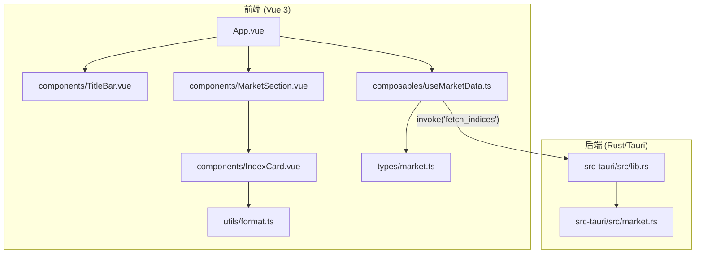
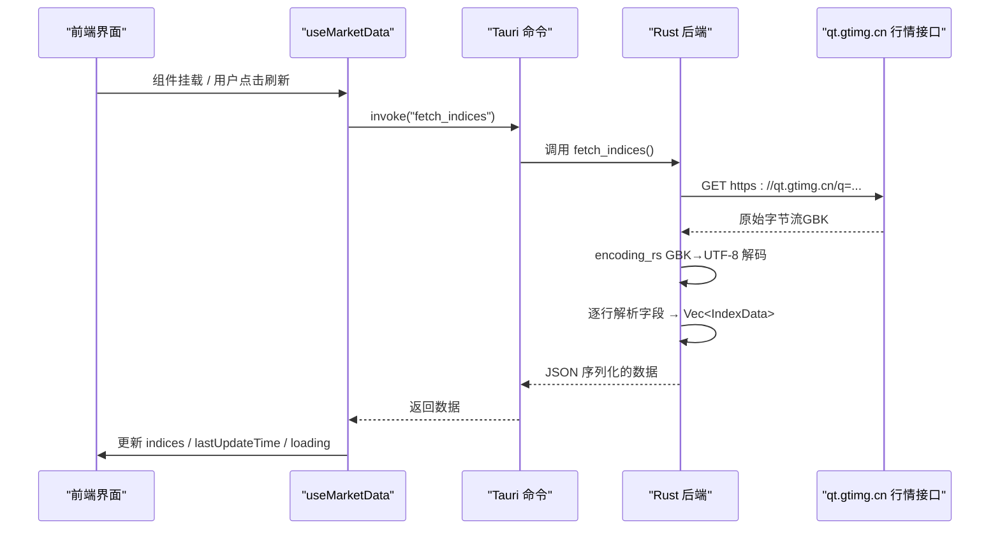
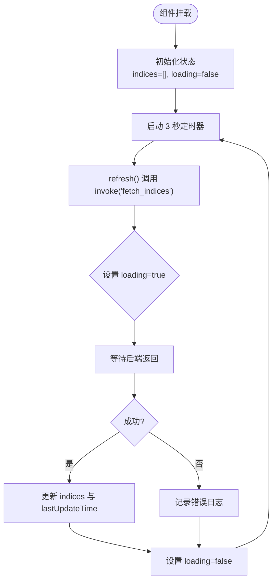
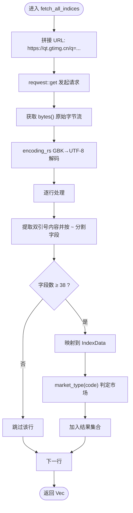
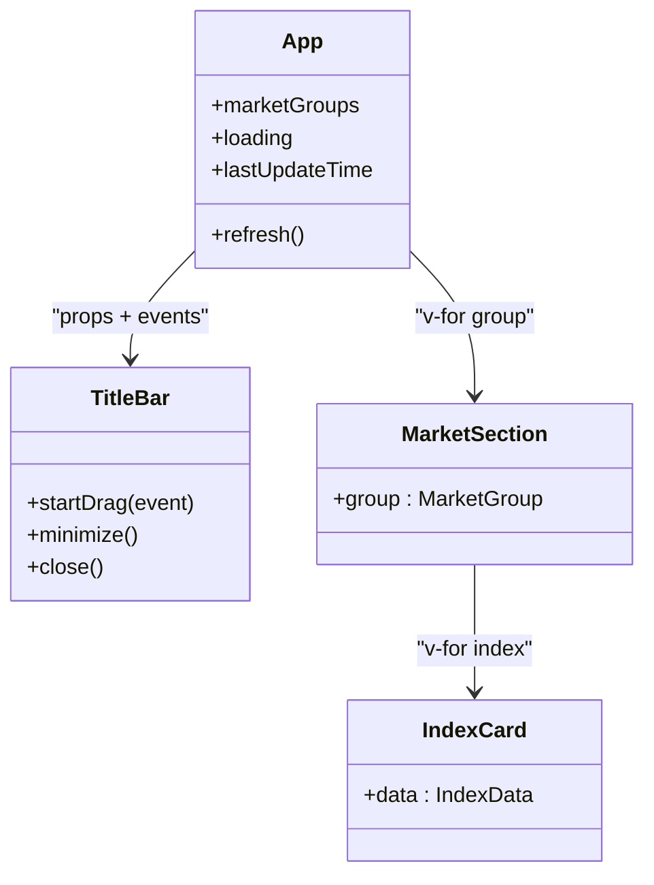
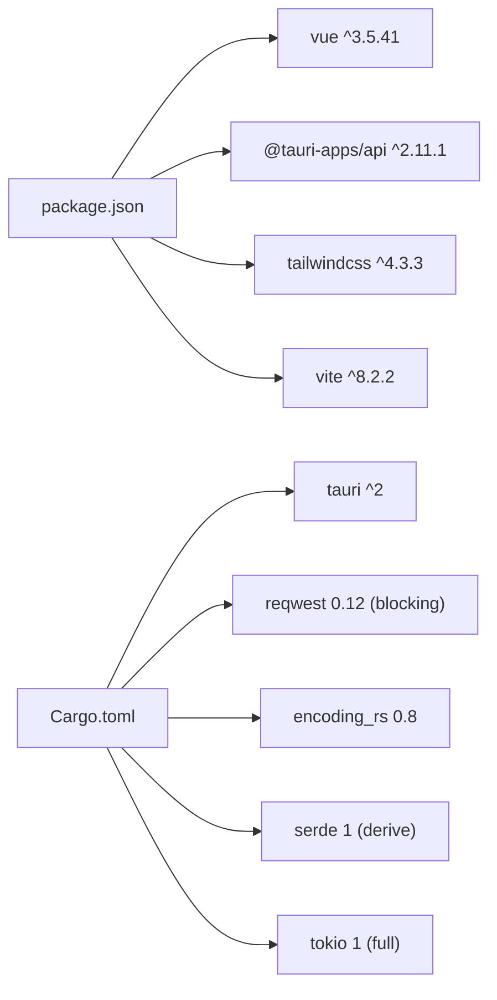

# 项目概述

<cite>
**本文引用的文件**
- [package.json](file://package.json)
- [ARCHITECTURE.md](file://ARCHITECTURE.md)
- [Cargo.toml](file://src-tauri/Cargo.toml)
- [tauri.conf.json](file://src-tauri/tauri.conf.json)
- [App.vue](file://src/App.vue)
- [lib.rs](file://src-tauri/src/lib.rs)
- [market.rs](file://src-tauri/src/market.rs)
- [useMarketData.ts](file://src/composables/useMarketData.ts)
- [MarketSection.vue](file://src/components/MarketSection.vue)
- [IndexCard.vue](file://src/components/IndexCard.vue)
- [TitleBar.vue](file://src/components/TitleBar.vue)
- [format.ts](file://src/utils/format.ts)
- [market.ts](file://src/types/market.ts)
- [vite.config.ts](file://vite.config.ts)
</cite>

## 目录
1. [简介](#简介)
2. [项目结构](#项目结构)
3. [核心组件](#核心组件)
4. [架构总览](#架构总览)
5. [详细组件分析](#详细组件分析)
6. [依赖关系分析](#依赖关系分析)
7. [性能考量](#性能考量)
8. [故障排查指南](#故障排查指南)
9. [结论](#结论)
10. [附录：快速开始与开发环境搭建](#附录快速开始与开发环境搭建)

## 简介
本项目“大盘行情看板”是一款基于 Tauri + Vue 3 构建的跨平台桌面应用，面向 A 股、港股、美股三大市场，提供实时指数行情监控。应用通过 Rust 后端定时请求外部行情接口，完成数据获取、编码转换与解析后，经 Tauri IPC 返回给前端；前端使用 Vue 3 Composition API 进行状态管理与视图渲染，并以暗色主题、红涨绿跌的看板风格展示。

设计目标包括：
- 轻量、跨平台、可常驻桌面的行情看板
- 支持 A 股（上证、深证、创业板、沪深300、上证50、中证500）、港股（恒生指数、恒生科技指数）、美股（道琼斯、纳斯达克、标普500）共 11 个主要指数
- 每 3 秒自动轮询刷新，兼顾实时性与服务器压力
- 自定义无边框窗口与可拖动标题栏，提升桌面体验

技术栈选择原因与优势：
- 前端 Vue 3 + Vite：Composition API 便于封装轮询逻辑，响应式系统自动更新视图，Vite 提供高效开发与构建体验
- 后端 Rust + Tauri：Rust 具备高性能与内存安全，Tauri 以极小体积打包原生桌面应用；Rust 对 GBK 解码、HTTP 请求等底层能力完善，规避浏览器 CORS 与编码限制
- Tailwind CSS：原子化样式方案，快速实现一致的主题与布局

**章节来源**
- [ARCHITECTURE.md:1-21](file://ARCHITECTURE.md#L1-L21)
- [ARCHITECTURE.md:23-55](file://ARCHITECTURE.md#L23-L55)
- [ARCHITECTURE.md:375-408](file://ARCHITECTURE.md#L375-L408)

## 项目结构
项目采用前后端分离的双层架构：
- 前端位于 src/，使用 Vue 3 + TypeScript + Vite + Tailwind CSS
- 后端位于 src-tauri/，使用 Rust 与 Tauri 框架，暴露命令供前端调用

**图表来源**
- [App.vue:1-36](file://src/App.vue#L1-L36)
- [useMarketData.ts:1-66](file://src/composables/useMarketData.ts#L1-L66)
- [lib.rs:1-21](file://src-tauri/src/lib.rs#L1-L21)
- [market.rs:1-100](file://src-tauri/src/market.rs#L1-L100)

**章节来源**
- [ARCHITECTURE.md:58-102](file://ARCHITECTURE.md#L58-L102)
- [tauri.conf.json:1-51](file://src-tauri/tauri.conf.json#L1-L51)
- [vite.config.ts:1-32](file://vite.config.ts#L1-L32)

## 核心组件
- 根组件 App.vue：组织标题栏与市场分区，管理加载状态与最后更新时间
- 标题栏 TitleBar.vue：实现窗口拖动、最小化、关闭以及手动刷新按钮
- 市场分区 MarketSection.vue：按市场分组渲染指数卡片网格
- 指数卡片 IndexCard.vue：展示价格、涨跌额/涨跌幅、成交量/成交额，并依据涨跌动态着色
- 组合式函数 useMarketData.ts：负责 3 秒轮询、数据分组、加载状态与错误处理
- 类型定义 market.ts：定义 IndexData 与 MarketGroup 接口
- 工具函数 format.ts：价格、涨跌额、涨跌幅、成交量、成交额的格式化
- 后端 lib.rs：注册 Tauri 命令，暴露 fetch_indices 供前端调用
- 后端 market.rs：请求外部行情 API、GBK 解码、字段解析、市场类型判定

**章节来源**
- [App.vue:1-36](file://src/App.vue#L1-L36)
- [TitleBar.vue:1-63](file://src/components/TitleBar.vue#L1-L63)
- [MarketSection.vue:1-19](file://src/components/MarketSection.vue#L1-L19)
- [IndexCard.vue:1-71](file://src/components/IndexCard.vue#L1-L71)
- [useMarketData.ts:1-66](file://src/composables/useMarketData.ts#L1-L66)
- [market.ts:1-22](file://src/types/market.ts#L1-L22)
- [format.ts:1-33](file://src/utils/format.ts#L1-L33)
- [lib.rs:1-21](file://src-tauri/src/lib.rs#L1-L21)
- [market.rs:1-100](file://src-tauri/src/market.rs#L1-L100)

## 架构总览
应用采用经典的前端（Vue 3）+ 后端（Rust/Tauri）双层架构，通过 Tauri 的 invoke 机制进行 IPC 通信。前端发起轮询请求，后端使用 reqwest 向 qt.gtimg.cn 发起 HTTP GET 请求，将 GBK 编码响应解码为 UTF-8，解析为结构化数据后序列化返回前端，由 Vue 响应式系统驱动视图更新。

**图表来源**
- [useMarketData.ts:25-36](file://src/composables/useMarketData.ts#L25-L36)
- [lib.rs:8-11](file://src-tauri/src/lib.rs#L8-L11)
- [market.rs:41-99](file://src-tauri/src/market.rs#L41-L99)

**章节来源**
- [ARCHITECTURE.md:106-155](file://ARCHITECTURE.md#L106-L155)
- [ARCHITECTURE.md:157-214](file://ARCHITECTURE.md#L157-L214)

## 详细组件分析

### 前端数据流与状态管理（useMarketData）
- 轮询策略：使用 setInterval 每 3 秒调用一次 refresh()，在 onMounted 时启动，onUnmounted 时清理定时器，避免内存泄漏
- 数据获取：通过 @tauri-apps/api/core 的 invoke 调用 Rust 命令 fetch_indices
- 数据分组：computed 根据 market 字段将指数分为 A 股、港股、美股三组
- 状态管理：loading 控制加载指示器，lastUpdateTime 记录最近一次更新时间
- 错误处理：捕获异常并打印日志，不中断轮询

**图表来源**
- [useMarketData.ts:5-11](file://src/composables/useMarketData.ts#L5-L11)
- [useMarketData.ts:13-23](file://src/composables/useMarketData.ts#L13-L23)
- [useMarketData.ts:25-36](file://src/composables/useMarketData.ts#L25-L36)
- [useMarketData.ts:38-56](file://src/composables/useMarketData.ts#L38-L56)

**章节来源**
- [useMarketData.ts:1-66](file://src/composables/useMarketData.ts#L1-L66)

### 后端数据获取与解析（market.rs）
- 数据模型：IndexData 包含指数代码、名称、价格、涨跌、成交量/额、市场类型、更新时间等字段
- 请求流程：拼接指数代码列表，发起 HTTPS GET 请求，获取原始字节流
- 编码转换：使用 encoding_rs 将 GBK 解码为 UTF-8 文本
- 解析逻辑：逐行提取双引号内内容，按 ~ 分割字段，校验字段数量 ≥ 38，映射到 IndexData
- 市场类型判定：根据代码前缀 sh/sz → a，r_hk → hk，r_us → us
- 安全解析：parse_f64 将空字符串或非法数字转为 0.0，防止崩溃

**图表来源**
- [market.rs:20-39](file://src-tauri/src/market.rs#L20-L39)
- [market.rs:41-99](file://src-tauri/src/market.rs#L41-L99)

**章节来源**
- [market.rs:1-100](file://src-tauri/src/market.rs#L1-L100)

### 组件层次与交互（App.vue, TitleBar.vue, MarketSection.vue, IndexCard.vue）
- App.vue：组合 TitleBar 与 MarketSection，传递 loading 与 lastUpdateTime，监听 refresh 事件
- TitleBar.vue：实现窗口拖动、最小化、关闭，显示最后更新时间与加载脉动指示器
- MarketSection.vue：按市场分组渲染三列网格，每个网格项为 IndexCard
- IndexCard.vue：计算涨跌趋势与颜色，展示价格、涨跌额/涨跌幅、成交量/成交额

**图表来源**
- [App.vue:1-36](file://src/App.vue#L1-L36)
- [TitleBar.vue:1-63](file://src/components/TitleBar.vue#L1-L63)
- [MarketSection.vue:1-19](file://src/components/MarketSection.vue#L1-L19)
- [IndexCard.vue:1-71](file://src/components/IndexCard.vue#L1-L71)

**章节来源**
- [App.vue:1-36](file://src/App.vue#L1-L36)
- [TitleBar.vue:1-63](file://src/components/TitleBar.vue#L1-L63)
- [MarketSection.vue:1-19](file://src/components/MarketSection.vue#L1-L19)
- [IndexCard.vue:1-71](file://src/components/IndexCard.vue#L1-L71)

### 数据格式化工具（format.ts）
- 价格保留两位小数
- 涨跌额带正负号
- 涨跌幅带正负号与百分号
- 成交量/成交额自动单位换算（万/亿）

**章节来源**
- [format.ts:1-33](file://src/utils/format.ts#L1-L33)

## 依赖关系分析
- 前端依赖：Vue 3、@tauri-apps/api、Tailwind CSS、Vite、TypeScript
- 后端依赖：Tauri、reqwest（blocking）、encoding_rs、serde、serde_json、tokio
- 配置：tauri.conf.json 定义窗口尺寸、标题、CSP、图标等；vite.config.ts 固定开发端口 1420，忽略 src-tauri 热更新

**图表来源**
- [package.json:1-26](file://package.json#L1-L26)
- [Cargo.toml:1-27](file://src-tauri/Cargo.toml#L1-L27)

**章节来源**
- [package.json:1-26](file://package.json#L1-L26)
- [Cargo.toml:1-27](file://src-tauri/Cargo.toml#L1-L27)
- [tauri.conf.json:1-51](file://src-tauri/tauri.conf.json#L1-L51)
- [vite.config.ts:1-32](file://vite.config.ts#L1-L32)

## 性能考量
- 轮询间隔 3 秒：平衡实时性与服务器压力，适合非高频交易场景
- 前端响应式更新：Vue 3 的 computed 与 ref 自动追踪依赖，减少不必要的重渲染
- 后端解析优化：逐行解析与字段校验，避免越界与无效数据；parse_f64 保证健壮性
- 网络请求：使用 reqwest blocking 模式简化同步处理；必要时可升级为异步并发以提升吞吐
- 资源清理：组件卸载时清除定时器，避免后台资源浪费

[本节为通用性能讨论，无需特定文件引用]

## 故障排查指南
- 无法获取数据：检查网络连接与 qt.gtimg.cn 可达性；查看控制台错误日志
- 编码问题：确保后端使用 encoding_rs 进行 GBK→UTF-8 解码
- 字段缺失：确认响应字段数量 ≥ 38，否则该行会被跳过
- 轮询不停止：检查 onUnmounted 是否调用 stopPolling，避免内存泄漏
- 窗口操作异常：确认 Tauri 权限配置允许 start-dragging、minimize、close

**章节来源**
- [useMarketData.ts:25-36](file://src/composables/useMarketData.ts#L25-L36)
- [market.rs:74-77](file://src-tauri/src/market.rs#L74-L77)
- [TitleBar.vue:13-27](file://src/components/TitleBar.vue#L13-L27)

## 结论
该项目以 Tauri + Vue 3 为核心，构建了轻量、跨平台的股票行情看板。通过 Rust 后端解决 GBK 解码与跨域限制，前端利用 Vue 3 的响应式系统与组合式函数实现简洁易维护的数据流。应用支持 A 股、港股、美股三大市场的实时行情监控，具备良好的用户体验与扩展性。

[本节为总结性内容，无需特定文件引用]

## 附录：快速开始与开发环境搭建
- 安装依赖：pnpm install
- 开发运行：pnpm tauri dev（同时启动 Vite 开发服务器与 Rust 后端）
- 生产构建：pnpm tauri build（产物位于 src-tauri/target/release/bundle/）
- 开发端口：Vite 固定 1420，HMR 端口 1421（开发模式下）
- 窗口配置：默认 900×680，居中显示，无边框，可调整大小

**章节来源**
- [ARCHITECTURE.md:333-373](file://ARCHITECTURE.md#L333-L373)
- [vite.config.ts:15-25](file://vite.config.ts#L15-L25)
- [tauri.conf.json:6-26](file://src-tauri/tauri.conf.json#L6-L26)